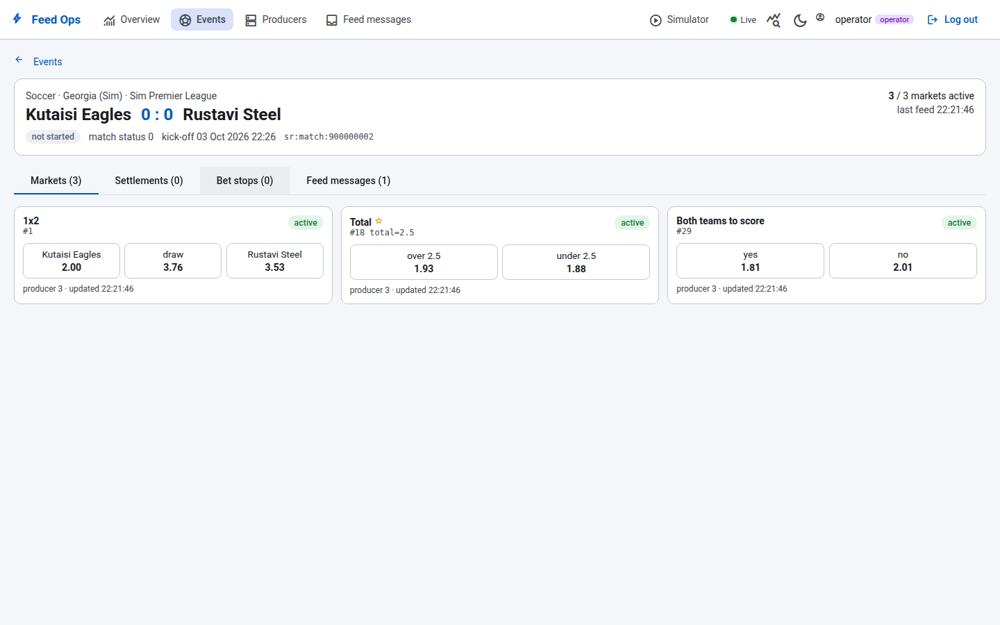

# Admin web (Angular)

Angular 22 workspace for our admin apps ([ADR-002](../../docs/adr/ADR-002-admin-frontend.md)):

| Project | What |
|---|---|
| `projects/feed-ops` | **Feed Ops admin** — feed health for our own team (read-only + dev-only simulator panel) |
| `projects/ui` (`@admin/ui`) | Shared building blocks for every admin (status tags, KPI cards, XML formatter) |

UI: Angular Material 3 (MIT). Auth: Keycloak (OIDC code + PKCE). Data: `Admin.Api` (`platform/src/Admin.Api`).

## Screens



| Route | Shows |
|---|---|
| `/` Overview | live/upcoming events, active/suspended markets, messages and failures in the last hour, producers |
| `/events` | search + status filter, live first, score, active/total markets |
| `/events/:id` | markets with rendered names and odds (offered status vs. feed status), settlement history (effective / superseded / rolled back), bet-stop log, the event's feed messages |
| `/producers` | producer state, reason, last processed feed time |
| `/messages` | every archived feed message, filters, raw XML side panel |
| `/simulator` | dev/demo only (when the API has a simulator): start scenarios, replay, take producers down (role `feedops-operator`) |

Everything refreshes by itself through Server-Sent Events (`/api/stream`).

## Run

Full stack (simulator, adapter, PostgreSQL, Keycloak, API, this app, Grafana):

```bash
cd ../../platform && ../uof-simulator/tools/gen-tls.sh && docker compose up -d --build
# http://localhost:8088  — dev users: operator/operator (can drive the simulator), viewer/viewer
```

Frontend development (Node ≥ 22.22.3 / 24):

```bash
npm ci
npx ng serve feed-ops        # http://localhost:4200
```

`public/config.json` decides where the API is and whether login is on. For `ng serve` against the compose stack set
`"apiBaseUrl": "http://localhost:8082"` and `"auth": {"enabled": true, "authority": "http://localhost:8180/realms/feedops", ...}`
(publish admin-api's port 8082, CORS already allows `http://localhost:4200`), or run Admin.Api locally with `Auth__Enabled=false`
and keep auth disabled here.

## Tests

```bash
npx ng test feed-ops --watch=false
npx ng test ui --watch=false
npx ng build feed-ops
```
