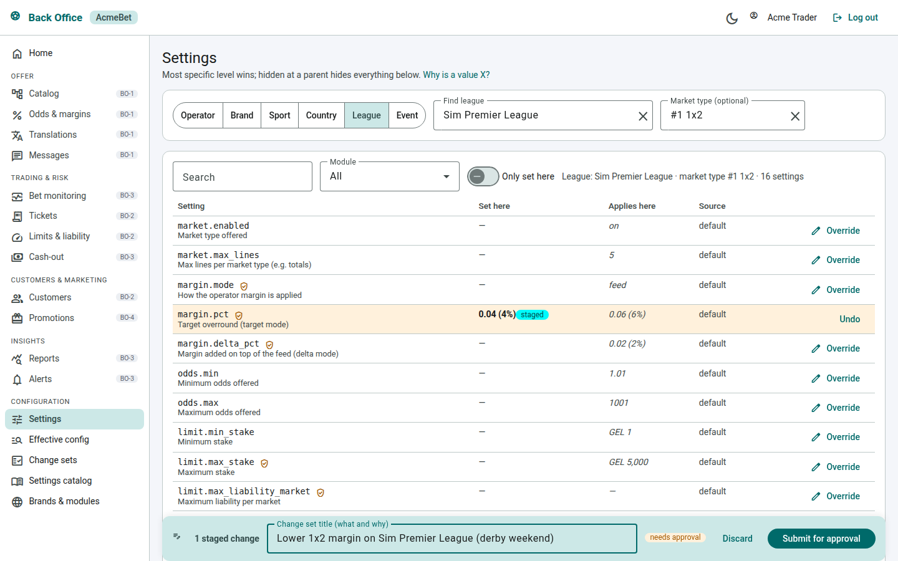
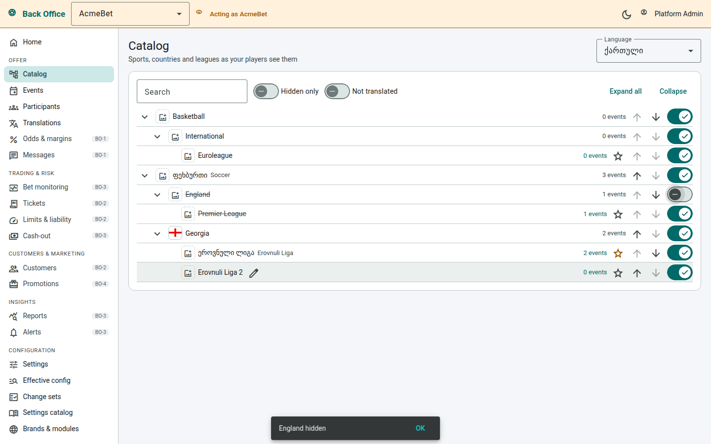

# Admin web (Angular)

Angular 22 workspace for our admin apps ([ADR-002](../../docs/adr/ADR-002-admin-frontend.md)):

| Project | What |
|---|---|
| `projects/feed-ops` | **Feed Ops admin** — feed health for our own team (read-only + dev-only simulator panel) |
| `projects/backoffice` | **Operator back office** (BO-0) — tenants, users & roles, audit log, configuration engine; API `Bo.Api` |
| `projects/ui` (`@admin/ui`) | Shared building blocks for every admin (status tags, KPI cards, XML formatter) |

UI: Angular Material 3 (MIT). Auth: Keycloak (OIDC code + PKCE). Data: `Admin.Api` (`platform/src/Admin.Api`).

## Screens


| Route | Shows |
|---|---|
| `/` Overview | live/upcoming events, active/suspended markets, messages and failures in the last hour, producers |
| `/events` | search + status filter, live first, score, active/total markets |
| `/events/:id` | markets with rendered names and odds (offered status vs. feed status), settlement history (effective / superseded / rolled back), bet-stop log, the event's feed messages |
| `/producers` | producer state, reason, last processed feed time |
| `/messages` | every archived feed message, filters, raw XML side panel |
| `/simulator` | dev/demo only (when the API has a simulator): start scenarios, replay, take producers down (role `feedops-operator`) |

Everything refreshes by itself through Server-Sent Events (`/api/stream`).

## Run

Full stack (simulator, adapter, PostgreSQL, Keycloak, API, this app, Grafana):

```bash
cd ../../platform && ../uof-simulator/tools/gen-tls.sh && docker compose up -d --build
# http://localhost:8088  — dev users: operator/operator (can drive the simulator), viewer/viewer
```

Frontend development (Node ≥ 22.22.3 / 24):

```bash
npm ci
npx ng serve feed-ops        # http://localhost:4200
```

`public/config.json` decides where the API is and whether login is on. For `ng serve` against the compose stack set
`"apiBaseUrl": "http://localhost:8082"` and `"auth": {"enabled": true, "authority": "http://localhost:8180/realms/feedops", ...}`
(publish admin-api's port 8082, CORS already allows `http://localhost:4200`), or run Admin.Api locally with `Auth__Enabled=false`
and keep auth disabled here.

## Operator back office (`projects/backoffice`)

Keycloak realm `bo` (one Organization per operator), API `platform/src/Bo.Api`, http://localhost:8089 in compose.




Dev users (password `<user>-devpass`): `platform`, `support` (our staff), `acme-admin`, `acme-head`, `acme-trader` (AcmeBet),
`betgeo-admin` (BetGeo).

| Route | Shows |
|---|---|
| `/` | operator home: brands, change sets waiting for approval, recent activity |
| `/cat` | **catalog tree**: sports → countries → leagues in the content language; rename inline, order, top leagues, icons/flags/logos, visibility (a change set; hidden at a parent hides everything below) |
| `/cat/events`, `/cat/participants` | events with featured / display start overrides (betting still follows the feed); team names, short names, logos |
| `/i18n` | **translations**: one column per operator language, platform/feed text as placeholder; market/outcome templates with `{placeholders}` (linted) and a live preview; CSV export / import with a dry run |
| `/cfg/scope` | **settings editor**: pick a level (platform → operator → brand → sport → country → league → event, optional market type), see what is set here and what applies (with its source); edits are staged and submitted as one change set |
| `/cfg/effective` | "why is a value X": effective values at a point of the offer, every candidate row and the winner |
| `/cfg/change-sets` | history with before/after; four-eyes approval of keys that need it |
| `/cfg/catalog` | every setting: type, default, levels, approval |
| `/sites` | brands (sites/domains: local vs foreign players) and enabled modules of the operator |
| `/adm/users`, `/adm/roles`, `/adm/audit` | invite users (Keycloak user + organization membership, TOTP at first login), grant roles, permission matrix, audit log |
| `/platform/operators` | platform staff: create operators (Keycloak organization + default brand), status |

Platform staff choose an operator in the header (sent as `X-Operator-Id`); the header turns amber and they act
read-only unless their role allows writing. Modules of later stages are in the menu with their stage (BO-1 …).

```bash
npx ng serve backoffice --port 4300   # against Bo.Api with Auth__Enabled=false (dev user = platform admin)
```

## Tests

```bash
npx ng test backoffice --watch=false
npx ng test feed-ops --watch=false
npx ng test ui --watch=false
npx ng build feed-ops
npx ng build backoffice
```
