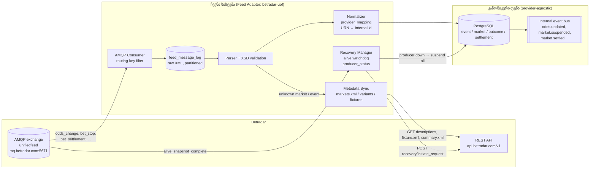
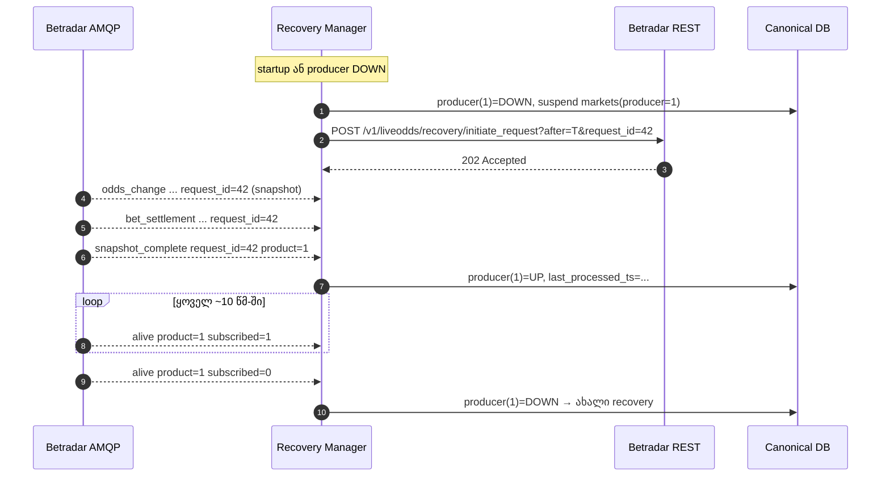
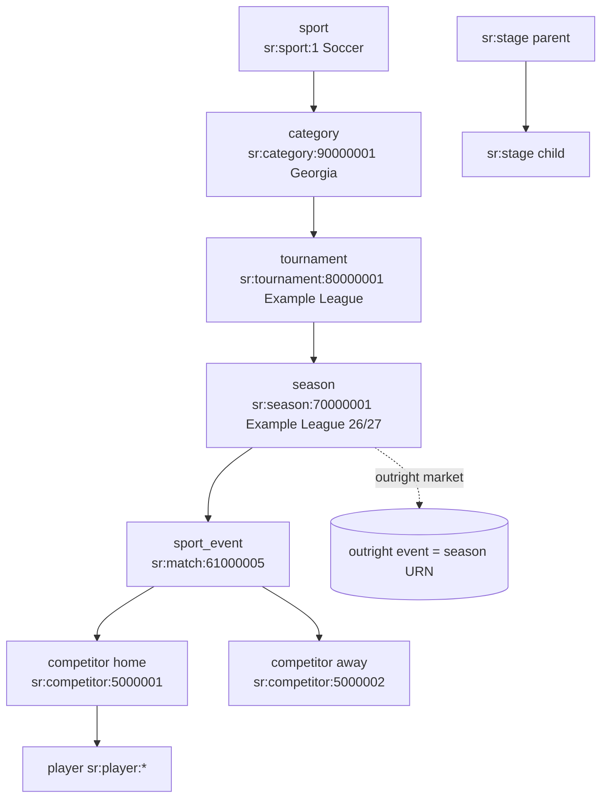
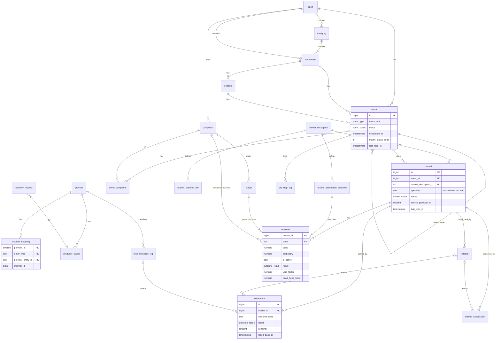
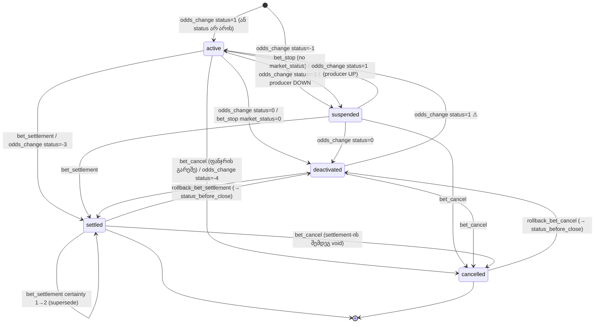
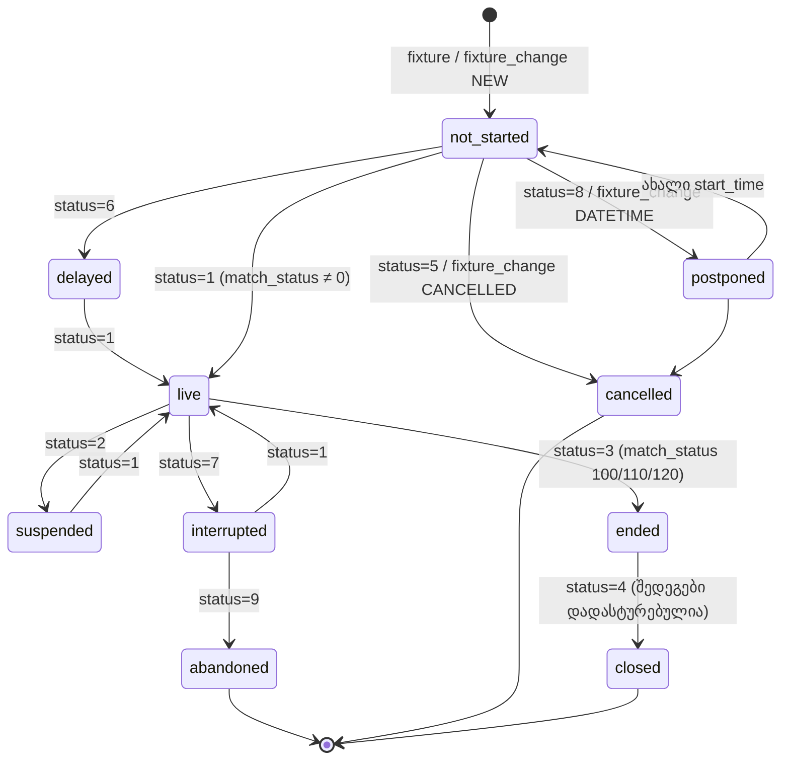
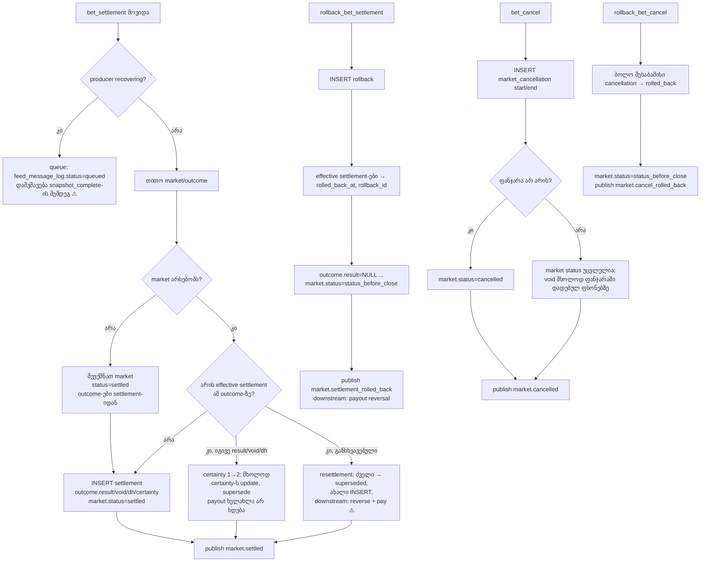

# 02 — Betradar UOF: მონაცემთა მოდელი და ჩვენი კანონიკური მოდელი

> **სტატუსი:** draft v1.1 · **თარიღი:** 2026-10-02 · **ფაზა:** Phase 1 (UOF ინტეგრაცია + უფასო ტესტირება)
>
> **წყაროების შესახებ:** ყველა XML ატრიბუტი, enum მნიშვნელობა და REST endpoint გადამოწმებულია Sportradar-ის **ოფიციალური SDK-ების** (Java / .NET) რეპოზიტორიებში არსებულ XSD სქემებსა და test resource-ებზე (იხ. §9). `docs.sportradar.com` და `iodocs.betradar.com` პირდაპირ ვერ წავიკითხეთ (egress proxy-მ დაბლოკა), ამიტომ ამ საიტებიდან მოყვანილი ფაქტები აღებულია search-snippet-ებიდან. სადაც მტკიცება მხოლოდ ერთ არაპირდაპირ წყაროს ეყრდნობა, ან ჩვენი ინტერპრეტაციაა, მონიშნულია **⚠ გადასამოწმებელი**.
>
> **ლიცენზია:** Sportradar-ის SDK-ები proprietary **SDK License Agreement**-ით ვრცელდება (კოპირება, redistribution და derivative works აკრძალულია). ამიტომ დოკუმენტში მათი ფაილები verbatim არ არის: ყველა XML ნიმუში ჩვენ დავწერეთ სქემის მიხედვით (დეტალები §3-ში). SDK-ის კოდი/XSD/test ფაილები ჩვენს repo-ში არ უნდა დავაკოპიროთ.

---

## სარჩევი

1. [UOF მიმოხილვა](#1-uof-მიმოხილვა)
2. [შეტყობინებების ტიპები (AMQP)](#2-შეტყობინებების-ტიპები-amqp)
3. [XML-ის ნიმუშები](#3-xml-ის-ნიმუშები)
4. [URN-ები და იერარქია](#4-urn-ები-და-იერარქია)
5. [Market description მოდელი](#5-market-description-მოდელი)
6. [ჩვენი კანონიკური მოდელი (ERD + PostgreSQL DDL)](#6-ჩვენი-კანონიკური-მოდელი)
7. [State machine-ები და settlement/rollback](#7-state-machine-ები)
8. [Mapping: UOF ველი → კანონიკური ველი](#8-mapping-uof--canonical)
9. [წყაროები](#9-წყაროები)

---

## 1. UOF მიმოხილვა

**Unified Odds Feed (UOF)** არის Betradar-ის (Sportradar) ერთიანი odds feed. მას ორი არხი აქვს:

| არხი | ტექნოლოგია | რისთვის |
|---|---|---|
| **Push** | AMQP 0-9-1 (RabbitMQ), TLS, port `5671`, topic exchange `unifiedfeed`, vhost `/unifiedfeed/{bookmaker_id}` | odds, bet stop, settlement, cancel, rollback, fixture change, alive, snapshot_complete. ყველა XML-ია |
| **Pull** | REST (HTTPS, XML), header `x-access-token: {token}` | metadata: fixtures, summaries, market descriptions, producers, whoami, **recovery** |

**AMQP-ის დეტალები (SDK-ის კოდიდან):**
- username = access token, password ცარიელია. Virtual host = `/unifiedfeed/{bookmaker_id}`, სადაც `bookmaker_id` მოდის `GET /v1/users/whoami.xml`-დან.
- რიგი: SDK აცხადებს **server-named** queue-ს (`channel.queueDeclare()`, ანუ exclusive + auto-delete) და აბამს exchange `unifiedfeed`-ზე routing key-ებით. აქედან გამომდინარე **ჩვენთან ყოველი disconnect = დაკარგული შეტყობინებები**, და ამ დანაკლისს ავსებს recovery (§1.4).
- AMQP header `timestamp_in_ms` შეიცავს გაგზავნის დროს. XML-ის `timestamp` ატრიბუტი კი შეტყობინების **გენერაციის** დროა (ms epoch).

### 1.1 გარემოები (Environments)

| გარემო | AMQP host | API host | შენიშვნა |
|---|---|---|---|
| Production | `mq.betradar.com` | `api.betradar.com` | კომერციული კონტრაქტი |
| Integration (staging) | `stgmq.betradar.com` | `stgapi.betradar.com` | token გაიცემა `stgufadmin.betradar.com`-ზე. **Trial token ორ კვირაში იწურება**, გაგრძელება sales-ის გავლით ხდება ⚠ გადასამოწმებელი (search snippet) |
| Replay | `replaymq.betradar.com` (`global.replaymq...`) | `stgapi.betradar.com` | წარსული მატჩების ხელახლა „დაკვრა“. მუშაობს integration token-ითაც. **Phase 1-ში უფასო ტესტირების მთავარი გზა სწორედ ესაა** |
| Global variants | `global.mq.betradar.com`, `global.stgmq.betradar.com` | `global.api...`, `global.stgapi...` | SDK-ში არის Environment enum-ის სახით |

Replay API (SDK `ReplayManager`-იდან): `PUT /v1/replay/events/{urn}` (დამატება), `POST /v1/replay/play`, `POST /v1/replay/stop`, `POST /v1/replay/reset`, `GET /v1/replay/status`, `/v1/replay/scenario`. ⚠ გადასამოწმებელი: ზუსტი HTTP method-ები და query პარამეტრები (speed, max_delay, node_id) iodocs-ზე უნდა დადასტურდეს.

### 1.2 Producers

Producer არის odds-ის „წყარო“. ერთსა და იმავე მატჩზე prematch-ში odds-ს გზავნის **Ctrl (3)**, live-ში კი **LiveOdds (1)**. გადართვას **handover** ეწოდება. ქვემოთ მოცემული სია აღებულია SDK-ის test `producers.xml`-იდან (staging). ცხრილის ბოლო სვეტში ოფიციალური დოკუმენტაციის (search snippet) მნიშვნელობებია.

| id | name | description | scope | `stateful_recovery_window_in_minutes` (staging test xml) | Max recovery (docs) |
|---|---|---|---|---|---|
| 1 | `LO` | Live Odds | live | 600 | **10 სთ** |
| 3 | `Ctrl` | Betradar Ctrl (prematch) | prematch | 4320 | 72 სთ |
| 4 | `BetPal` | BetPal | live | 4320 | 72 სთ |
| 5 | `PremiumCricket` | Premium Cricket | live\|prematch | 4320 | 72 სთ |
| 6 | `VF` | Virtual football | virtual | 180 | 3 სთ |
| 7 | `WNS` | Numbers Betting | prematch | 4320 | 72 სთ |
| 8 / 9 / 10 / 11 / 12 / 15 / 17 | `VBL`/`VTO`/`VDR`/`VHC`/`VTI`/`VBI`/`VCI` | virtual sports | virtual | 180 | 3 სთ |
| 14 | `C-Odds` | Competition Odds | live | 4320 | 72 სთ |
| 16 | `PB` | Performance betting | live\|prematch | 4320 | 72 სთ |

> **წესი:** recovery window **hardcode-ით არ უნდა ჩავწეროთ**. ყოველ startup-ზე ვკითხულობთ `GET /v1/descriptions/producers.xml`-ს და ვინახავთ `producer_status.recovery_window_minutes`-ში. SDK-ის default მნიშვნელობაა 4320. test XML-ებში მნიშვნელობები ერთმანეთს არ ემთხვევა (180/600/4320), რაც კიდევ ერთხელ ადასტურებს, რომ ეს ციფრი endpoint-იდან უნდა მოვიდეს.

### 1.3 Routing key

ფორმატი (SDK `RegexRoutingKeyParser` + test-ები):

```
{priority}.{pre}.{live}.{message_type}.{sport_id}.{urn_prefix:urn_type}.{event_id}.{node_id}
```

| სეგმენტი | მნიშვნელობები | მაგალითი |
|---|---|---|
| priority | `hi` / `lo` / `-` | `hi`: დროზე მგრძნობიარე (odds_change, bet_stop), `lo`: settlement და სხვ. |
| pre | `pre` / `virt` / `-` | prematch-ის (ან virtual-ის) ინტერესი |
| live | `live` / `virt` / `-` | live-ის ინტერესი |
| message_type | `odds_change`, `bet_stop`, `bet_settlement`, `bet_cancel`, `rollback_bet_settlement`, `rollback_bet_cancel`, `fixture_change`, `alive`, `snapshot_complete` | |
| sport_id | რიცხვი ან `-` | `1` (Soccer) |
| urn type | `sr:match`, `sr:stage`, `sr:season`, `vf:match`… ან `-` | |
| event_id | რიცხვი ან `-` | `61000001` |
| node_id | რიცხვი ან `-` (არასავალდებულო) | recovery-ის პასუხი მხოლოდ იმ node-ს მიდის, რომელმაც ის მოითხოვა |

მაგალითები (ფორმატი SDK-ის parser-ისა და test-ების მიხედვითაა გადამოწმებული, event ID-ები ილუსტრაციულია):

```
hi.-.live.odds_change.1.sr:match.61000001.-
hi.-.live.bet_stop.1.sr:match.61000001.-
lo.-.live.bet_settlement.1.sr:match.61000001.-
hi.-.live.rollback_bet_settlement.1.sr:match.61000001.-
hi.pre.live.fixture_change.1.sr:match.61000004.7      # 7 = node_id
hi.pre.-.odds_change.1.sr:match.61000004.-
-.-.-.snapshot_complete.-.-.-.{node_id}               # system
-.-.-.alive.#                                          # system (binding pattern)
```

SDK-ში გამოყენებული binding-ები: `*.*.*.*.*.*.*` (ყველა), `*.pre.*.*.*.*.*` (prematch), `*.*.live.*.*.*.*` (live), `hi.*...`, `lo.*...`, `*.virt.*...`, `#.sr:match.{id}` (კონკრეტული მატჩი), `-.-.-.alive.#` და `-.-.-.snapshot_complete.-.-.-.{node}`. როცა node_id გამოიყენება, SDK ორ key-ს აბამს: `{key}.{node}.#` და `{key}.-.#`.

### 1.4 Recovery: ძირითადი პრინციპები

| საკითხი | წესი | წყარო |
|---|---|---|
| Alive | ყოველი producer ~**10 წამში** აგზავნის `alive`-ს (`subscribed="1"`) | docs (snippet) |
| Producer down | თუ subscribed alive არ მოსულა `maxInactivity` (SDK default **20 წმ**, დიაპაზონი 10–180), ან AMQP კავშირი გაწყდა, ან დამუშავების რიგი ჩამორჩა → producer **DOWN**, ყველა მის market-ზე ვაკეთებთ suspend-ს | SDK `ConfigLimit`, `RecoveryManagerImpl` |
| `subscribed="0"` | Producer-ი downtime-ის შემდეგ დაბრუნდა და ჩვენ აღარ ვართ გამოწერილი → **აუცილებელია recovery** | docs + SDK |
| Full recovery | `POST {api_url}recovery/initiate_request?after={ms}&request_id={n}&node_id={n}`, სადაც `{api_url}` მაგ. `https://api.betradar.com/v1/liveodds/` | SDK `createInitiateRecoveryUrl()` |
| `after` | ბოლოს **წარმატებით დამუშავებული** შეტყობინების `timestamp`. თუ `after`-ი window-ზე ძველია, SDK ახდენს clamp-ს `now − (window − 10 წთ)`-მდე. პირველ გაშვებაზე `after` არ იგზავნება (მივიღებთ მთლიან მიმდინარე snapshot-ს) | SDK |
| Snapshot | feed აგზავნის `odds_change`/`bet_settlement`/... შეტყობინებებს **`request_id`-ით**, ბოლოს კი `snapshot_complete request_id=...`-ს. მხოლოდ ამის შემდეგ ხდება producer **UP** | XSD + SDK |
| Timeout | თუ `snapshot_complete` არ მოვიდა `maxRecoveryTime`-ში (SDK default **1200 წმ**, 600–3600), recovery თავიდან ეშვება. recovery request-ებს შორის მინიმალური ინტერვალია 30 წმ (20–180) | SDK `ConfigLimit` |
| Event recovery | `POST {api_url}odds/events/{urn}/initiate_request?request_id=..` (odds) და `POST {api_url}stateful_messages/events/{urn}/initiate_request` (settlement/cancel) | SDK |
| Rate limits | recovery endpoint-ებზე rate limit არსებობს, ზუსტი ციფრები ვერ ვნახეთ ⚠ გადასამოწმებელი | docs (snippet) |
| Recovery-ის დროს stateful შეტყობინებები | bet_settlement / rollback / bet_cancel დავაყენოთ რიგში და დავამუშაოთ `snapshot_complete`-ის შემდეგ ⚠ გადასამოწმებელი (snippet, „Recovery using API“ გვერდი) | docs (snippet) |

### 1.5 შეტყობინებების ნაკადი





---

## 2. შეტყობინებების ტიპები (AMQP)

ყველა event-ზე მიბმულ შეტყობინებას აქვს საერთო ატრიბუტები (XSD `messageAttributes`):
`product` (int, req), `event_id` (string URN, req), `timestamp` (long ms, req), `request_id` (long, optional: მხოლოდ recovery-ის პასუხებში).

| შეტყობინება | დანიშნულება | ძირითადი ველები | როდის მოდის | ჩვენი სისტემის ქმედება |
|---|---|---|---|---|
| **`odds_change`** | odds-ის/market status-ის განახლება. ასევე შეიძლება შეიცავდეს event-ის live სტატუსს (`sport_event_status`) | `odds_change_reason` (1 = RISKADJUSTMENT_UPDATE), `sport_event_status@status/match_status/home_score/away_score`, `clock`, `period_scores`, `statistics`; `odds@betstop_reason`, `odds@betting_status`; `market@id, specifiers, extended_specifiers, status, favourite, cashout_status`; `market_metadata@next_betstop,start_time,end_time,aams_id`; `outcome@id, odds, probabilities, active, team` (+ `win/lose/refund/half_win/half_lose_probabilities`) | live-ში წამში რამდენჯერმე, prematch-ში უფრო იშვიათად. recovery-ის დროს `request_id`-ით | 1) stale-check: თუ `timestamp` < `market.last_feed_ts`, გამოვტოვოთ. 2) market-ის upsert (natural key: event+market_type+normalized specifiers). 3) outcome odds/active-ის upsert. 4) `status`-ის გამოყენება (missing ⇒ active, SDK-ის მიხედვით). 5) `sport_event_status`-ით event-ის განახლება. 6) უცნობი market id ⇒ ტრიგერდება metadata sync |
| **`bet_stop`** | ერთი event-ის market-ების ჯგუფის სწრაფი შეჩერება | `groups` (req, მაგ. `all` ან `score\|1st_half`), `market_status` (optional: missing ⇒ **suspended**; ასევე შეიძლება იყოს `0` = deactivated) | live-ში საშიშ მომენტში (possible goal, VAR...) ან მატჩის დასრულებისას | ყველა market, რომლის `market_description.groups` კვეთს `groups`-ს (ან `all`), გადადის `suspended`-ში (ან `deactivated`-ში). ჩავწეროთ `bet_stop_log`-ში. **High priority**: დამუშავება არ უნდა ჩამორჩეს |
| **`bet_settlement`** | შედეგები outcome-ების დონეზე | `certainty` (req: 1 = LIVE_SCOUTED, 2 = CONFIRMED); `market@id,specifiers,void_reason,result`; `outcome@id, result` (0 lost / 1 won / −1 undecided_yet), `void_factor` (0.5 \| 1), `dead_heat_factor`, (`dead_heat_factor_place`, `each_way_factor`, `each_way_result` racing-ისთვის) | market-ის დასრულებისთანავე (live-ში შეიძლება მატჩის ბოლომდეც). შემდეგ შეიძლება ხელახლა მოვიდეს `certainty=2`-ით | idempotent ჩაწერა `settlement` ledger-ში. market → `settled`. ფსონების გადახდა ხდება downstream-ში. იხ. §7.3 |
| **`bet_cancel`** | market-ის void (ფსონები ბრუნდება) | `market@id,specifiers,void_reason`, `start_time`, `end_time` (დროის ფანჯარა, რომელშიც დადებული ფსონები უქმდება), `superceded_by` (outrights-ში ახალი season URN) | შეცდომის, გაუქმებული მატჩის, არასწორი odds-ის შემთხვევაში | `market_cancellation`-ში ჩაწერა. თუ ფანჯარა არ არის მოცემული, market → `cancelled`. ფანჯრის შემთხვევაში void ხდება მხოლოდ იმ ფსონებზე, რომლებიც ამ ინტერვალში დაიდო |
| **`rollback_bet_settlement`** | შეცდომით გაგზავნილი settlement-ის გაუქმება | `market@id,specifiers` | იშვიათად: settlement-ის შეცდომის შემდეგ | effective settlement-ები ვნიშნავთ როგორც rolled back. market ბრუნდება წინა status-ში. downstream-ში ხდება payout-ის reversal. ახალი settlement მოგვიანებით მოვა |
| **`rollback_bet_cancel`** | შეცდომით გაგზავნილი bet_cancel-ის გაუქმება | `market@id,specifiers`, `start_time`, `end_time` | იშვიათად | ბოლო შესაბამისი cancellation ვნიშნავთ rolled back-ად. market ბრუნდება წინა status-ში |
| **`fixture_change`** | fixture-ის ცვლილების სიგნალი (**data-ს არ შეიცავს**) | `change_type` (1 NEW, 2 DATETIME, 3 CANCELLED, 4 FORMAT, 5 COVERAGE, 6 PITCHER; ⚠ ახალ ვერსიებში შეიძლება სხვა მნიშვნელობებიც გაჩნდეს, parser-მა უცნობი უნდა დაითმინოს), `start_time` (req, ms), `next_live_time` | ახალი მატჩი, დროის გადატანა, გაუქმება, coverage-ის ცვლილება | cache-ის invalidate და `GET /v1/sports/{lang}/sport_events/{urn}/fixture_change_fixture.xml` (SDK ამ endpoint-ს cache bypass-ისთვის იყენებს). event-ის upsert |
| **`alive`** | producer-ის heartbeat | `product`, `timestamp`, `subscribed` (1/0) | ~10 წმ-ში ერთხელ თითო producer-ზე | watchdog-ის განახლება. `subscribed=0` ⇒ recovery |
| **`snapshot_complete`** | recovery-ის დასრულება | `request_id`, `product`, `timestamp` | `initiate_request`-ის შემდეგ, როცა snapshot-ის ყველა შეტყობინება გაიგზავნა | თუ `request_id` ემთხვევა მიმდინარეს ⇒ producer UP, queued stateful შეტყობინებების დამუშავება |
| `cashout` (probabilities) | cashout probabilities | odds_change-ის მსგავსი | მხოლოდ შესაბამისი პროდუქტის შემთხვევაში (Java XSD) | Phase 1-ში ignore |
| `product_down` | ⚠ ოფიციალურ XSD-ში **არ არის**. გვხვდება მხოლოდ Java SDK test resource-ში | | | ignore + log |

### 2.1 Enum-ები (XSD + `descriptions/*.xml`)

| ველი | მნიშვნელობები |
|---|---|
| `market@status` | `1` ACTIVE · `0` INACTIVE (deactivated) · `-1` SUSPENDED · `-2` HANDED_OVER · `-3` SETTLED · `-4` CANCELLED |
| `outcome@active` | `1` active · `0` inactive |
| `bet_settlement outcome@result` | `0` LOST · `1` WON · `-1` UNDECIDED_YET |
| `void_factor` | `0.5` REFUND_HALF · `1` REFUND_FULL |
| `certainty` | `1` LIVE_SCOUTED · `2` CONFIRMED |
| `sport_event_status@status` | `0` NOT_STARTED · `1` LIVE · `2` SUSPENDED · `3` ENDED · `4` CLOSED · `5` CANCELLED · `6` DELAYED · `7` INTERRUPTED · `8` POSTPONED · `9` ABANDONED |
| `sport_event_status@reporting` | `1` LIVE · `0` NOT_AVAILABLE · `-1` SUSPENDED_OR_TEMPORARY_LOST_CONTACT |
| `match_status` (კოდები, `/descriptions/{lang}/match_status.xml`) | `0` Not started · `6` 1st half · `7` 2nd half · `31` Halftime · `32` Awaiting extra time · `40` Overtime · `41`/`42` 1st/2nd extra · `50` Penalties · `80` Interrupted · `90` Abandoned · `100` Ended · `110` AET · `120` AP ... (სპორტზეა დამოკიდებული) |
| `cashout_status` | `1` AVAILABLE · `-1` UNAVAILABLE · `-2` CLOSED |
| `betstop_reason` (`/descriptions/betstop_reasons.xml`) | `0` UNKNOWN, `1` POSSIBLE_GOAL, `2` POSSIBLE_RED_CARD, `3` SCOUT_LOST, `8` POSSIBLE_PENALTY, `12` MATCH_ENDED, `22` GOAL_UNDER_REVIEW, `37` VIDEO_REVIEW, … (77+ მნიშვნელობა: ცხრილი ჩაიტვირთება endpoint-იდან) |
| `betting_status` (`/descriptions/betting_status.xml`) | `0` UNKNOWN, `1` GOAL, `2` DANGEROUS_FREE_KICK, `3` DANGEROUS_GOAL_POSITION, `4` POSSIBLE_BOUNDARY, `5` POSSIBLE_CHECKOUT, `6` INGAME_PENALTY |
| `void_reason` (`/descriptions/void_reasons.xml`) | `0` OTHER, `1` NO_GOALSCORER, `2` CORRECT_SCORE_MISSING, `3` RESULT_UNVERIFIABLE, `4` FORMAT_CHANGE, `5` CANCELLED_EVENT, `6` MISSING_GOALSCORER, `7` MATCH_ENDED_IN_WALKOVER, `8` DEAD_HEAT, `9` RETIRED_OR_DEFAULTED, `10` EVENT_ABANDONED, `11` EVENT_POSTPONED, `12` INCORRECT_ODDS, `13` INCORRECT_STATISTICS, `14` NO_RESULT_ASSIGNABLE, `15` CLIENT_SIDE_SETTLEMENT_NEEDED, `16` STARTING_PITCHER_CHANGED |

**Market status-ების სემანტიკა (docs, snippet):**
- **Active (1):** odds მოდის, ფსონები მიიღება.
- **Suspended (−1):** odds შეიძლება კვლავ მოდიოდეს, მაგრამ ფსონები დროებით **არ მიიღება**.
- **Deactivated (0):** odds აღარ მოდის, market ეკრანიდან უნდა გაქრეს. ⚠ გადასამოწმებელი: შეიძლება თუ არა მისი ხელახლა გააქტიურება. ჩვენი მოდელი ამას უშვებს.
- **Handed over (−2):** „რეალური“ status არ არის. ნიშნავს, რომ ამ producer-მა market სხვა producer-ს გადასცა (Ctrl → LO). ძირითადად recovery-ის ან handover-ის დროს ჩნდება.
- **Settled (−3):** bet_settlement უკვე გაიგზავნა, odds აღარ მოვა.
- **Cancelled (−4):** market გაუქმდა, odds აღარ მოვა.

### 2.2 Void factor / dead heat: გადახდის ფორმულები (docs, snippet)

| `result` | `void_factor` | შედეგი |
|---|---|---|
| 0 | — | ფსონი წაგებულია |
| 1 | — | მოგება: `stake × odds` |
| 0 | 1 | სრული refund: `stake` |
| 1 | 0.5 | ნახევარი refund, ნახევარი მოგება: `stake×0.5 + stake×0.5×odds` |
| 0 | 0.5 | ნახევარი refund, ნახევარი წაგება: `stake×0.5` |
| 1 + `dead_heat_factor=f` | — | `stake × odds × f` |

ზოგადი ფორმულა: `payout = stake × void_factor + stake × (1 − void_factor) × (result==1 ? odds × (dead_heat_factor ?? 1) : 0)`.

---

## 3. XML-ის ნიმუშები

> **ლიცენზიის შენიშვნა:** Sportradar-ის SDK რეპოზიტორიები (`UnifiedOddsSdkJava`, `UnifiedOddsSdkNetCore`) ვრცელდება **Sportradar SDK License Agreement**-ით (proprietary). მისი §3.3 კრძალავს SDK-ის ნაწილების კოპირებას, redistribution-ს და derivative works-ის შექმნას. ამიტომ ამ დოკუმენტში SDK-ის ფაილები (XSD, test XML, კოდი) **verbatim არ არის ჩასმული**. ქვემოთ მოცემული ყველა ნიმუში **ჩვენ თვითონ დავწერეთ** XSD-ში აღწერილი სტრუქტურის მიხედვით: event ID-ები, timestamp-ები, odds და სახელები გამოგონილია. ფაქტობრივია მხოლოდ ინტერფეისის იდენტიფიკატორები (ატრიბუტების სახელები, enum მნიშვნელობები, market/outcome ID-ები), რომლებიც ინტეგრაციისთვის აუცილებელია. ეს წესი ჩვენს repo-შიც მოქმედებს: SDK-ის ფაილები არ დავაკოპიროთ (test fixtures-იც კი). ჩვენი test fixtures უნდა ავაწყოთ საკუთარი, integration/replay გარემოში ჩაწერილი შეტყობინებებით. ⚠ გადასამოწმებელი: Betradar-ის ხელშეკრულებით რეალური feed შეტყობინებების შენახვა/გაზიარება შიდა testing-ისთვის დაშვებულია თუ არა, იურიდიულად უნდა დადასტურდეს.

ყველა event ID ქვემოთ (`sr:match:61000001` და ა.შ.) **ილუსტრაციულია**.

### 3.1 `odds_change` (live, soccer)

```xml
<?xml version="1.0" encoding="UTF-8" standalone="yes"?>
<odds_change product="1" event_id="sr:match:61000001" timestamp="1790000123456">
  <sport_event_status status="1" reporting="1" match_status="7" home_score="1" away_score="1">
    <clock match_time="63:10"/>
    <period_scores>
      <period_score match_status_code="6" number="1" home_score="1" away_score="0"/>
      <period_score match_status_code="7" number="2" home_score="0" away_score="1"/>
    </period_scores>
    <statistics>
      <yellow_cards home="2" away="1"/>
      <red_cards home="0" away="0"/>
      <corners home="5" away="2"/>
    </statistics>
  </sport_event_status>
  <odds>
    <!-- 1x2: outcome 1=home, 2=draw, 3=away -->
    <market id="1" status="1" favourite="1">
      <outcome id="1" odds="3.10" probabilities="0.3080" active="1"/>
      <outcome id="2" odds="2.05" probabilities="0.4650" active="1"/>
      <outcome id="3" odds="4.20" probabilities="0.2270" active="1"/>
    </market>
    <!-- Total: 12=over, 13=under; ერთი market-ის ორი ხაზი = ორი სხვადასხვა market -->
    <market id="18" specifiers="total=2.5" status="1" favourite="1">
      <outcome id="12" odds="1.72" probabilities="0.5560" active="1"/>
      <outcome id="13" odds="2.08" probabilities="0.4440" active="1"/>
    </market>
    <market id="18" specifiers="total=3.5" status="1">
      <outcome id="12" odds="3.90" probabilities="0.2380" active="1"/>
      <outcome id="13" odds="1.24" probabilities="0.7620" active="1"/>
    </market>
    <!-- ხაზი, რომელიც უკვე settled-ია (outcome-ების გარეშე) -->
    <market id="18" specifiers="total=1.5" status="-3"/>
    <!-- Handicap 2-way, quarter line -->
    <market id="16" specifiers="hcp=-0.25" status="1">
      <outcome id="1714" odds="1.98" active="1"/>
      <outcome id="1715" odds="1.86" active="1"/>
    </market>
    <!-- Variant market: exact goals, ვარიანტი "4+" -->
    <market id="21" specifiers="variant=sr:exact_goals:4+" status="1">
      <outcome id="sr:exact_goals:4+:88" active="0"/>
      <outcome id="sr:exact_goals:4+:89" active="0"/>
      <outcome id="sr:exact_goals:4+:90" odds="2.30" probabilities="0.4170" active="1"/>
      <outcome id="sr:exact_goals:4+:91" odds="2.75" probabilities="0.3480" active="1"/>
      <outcome id="sr:exact_goals:4+:92" odds="3.60" probabilities="0.2350" active="1"/>
    </market>
    <!-- ერთი market-ის suspend (odds შეიძლება კვლავ მოდიოდეს) -->
    <market id="29" status="-1">
      <outcome id="74" odds="1.45" active="1"/>
      <outcome id="76" odds="2.60" active="1"/>
    </market>
    <!-- metadata -->
    <market id="8" specifiers="goalnr=3" status="1">
      <market_metadata next_betstop="1790000400000"/>
      <outcome id="6" odds="2.40" active="1"/>
      <outcome id="7" odds="3.25" active="1"/>
      <outcome id="8" odds="2.95" active="1"/>
    </market>
  </odds>
</odds_change>
```

> ⚠ გადასამოწმებელი: `sr:exact_goals:4+:88..92` outcome ID-ები ილუსტრაციულია. რეალური ID-ები ყოველთვის უნდა წავიკითხოთ `variants.xml`-დან და ჩვენს კოდში არ უნდა იყოს hardcoded.

event-დონის bet stop odds_change-ით (`odds@betstop_reason`/`betting_status`). ⚠ გადასამოწმებელი: ზუსტი სემანტიკა, ანუ ყველა market იგულისხმება თუ მხოლოდ ჩამოთვლილები, XSD-ის საფუძველზე ვერ დადგინდა.

```xml
<odds_change product="1" event_id="sr:match:61000001" timestamp="1790000130001">
  <sport_event_status status="1" reporting="1" match_status="7" home_score="1" away_score="1"/>
  <odds betstop_reason="1" betting_status="1"/>
</odds_change>
```

### 3.2 `bet_stop`

```xml
<?xml version="1.0" encoding="UTF-8" standalone="yes"?>
<!-- ყველა market, market_status არ არის ⇒ suspended -->
<bet_stop product="1" event_id="sr:match:61000001" timestamp="1790000130000" groups="all"/>

<!-- მხოლოდ კონკრეტული ჯგუფები, deactivate-ით -->
<bet_stop product="1" event_id="sr:match:61000001" timestamp="1790000131000"
          groups="1st_half" market_status="0"/>
```

### 3.3 `bet_settlement`

```xml
<?xml version="1.0" encoding="UTF-8" standalone="yes"?>
<bet_settlement certainty="2" product="3" event_id="sr:match:61000002" timestamp="1790007200000">
  <outcomes>
    <market id="1">
      <outcome id="1" result="1"/>
      <outcome id="2" result="0"/>
      <outcome id="3" result="0"/>
    </market>
    <market id="18" specifiers="total=2.5">
      <outcome id="12" result="1"/>
      <outcome id="13" result="0"/>
    </market>
    <!-- Quarter-line handicap (hcp=-0.25), შედეგი 1:1 ⇒ home: half lose, away: half win -->
    <market id="16" specifiers="hcp=-0.25">
      <outcome id="1714" result="0" void_factor="0.5"/>
      <outcome id="1715" result="1" void_factor="0.5"/>
    </market>
    <!-- სრული void (refund) -->
    <market id="29" void_reason="3">
      <outcome id="74" result="0" void_factor="1"/>
      <outcome id="76" result="0" void_factor="1"/>
    </market>
    <!-- Outright dead heat: ორი მონაწილე იყოფს ადგილს -->
    <market id="534" specifiers="variant=pre:markettext:900001">
      <outcome id="pre:outcometext:7000001" result="1" dead_heat_factor="0.5"/>
      <outcome id="pre:outcometext:7000002" result="1" dead_heat_factor="0.5"/>
      <outcome id="pre:outcometext:7000003" result="0"/>
    </market>
  </outcomes>
</bet_settlement>
```

> ⚠ გადასამოწმებელი: outright-ის მაგალითში (`534`, `pre:markettext`) event ფაქტობრივად season/stage URN უნდა იყოს და არა match. აქ მხოლოდ outcome-ის ატრიბუტებს ვაჩვენებთ.

### 3.4 `bet_cancel` / rollbacks

```xml
<!-- ფსონები, რომლებიც დადებულია [start_time, end_time] ინტერვალში, void ხდება (მაგ. არასწორი odds) -->
<bet_cancel product="1" event_id="sr:match:61000001" timestamp="1790000200000"
            start_time="1790000100000" end_time="1790000160000">
  <market id="18" specifiers="total=2.5" void_reason="12"/>
</bet_cancel>

<!-- settlement შეცდომით გაიგზავნა: specifier-ების რიგი შემთხვევითია! -->
<rollback_bet_settlement product="1" event_id="sr:match:61000003" timestamp="1790000300000">
  <market id="202" specifiers="setnr=2"/>
  <market id="204" specifiers="total=9.5|setnr=1"/>
</rollback_bet_settlement>

<rollback_bet_cancel product="1" event_id="sr:match:61000001" timestamp="1790000400000"
                     start_time="1790000100000" end_time="1790000160000">
  <market id="18" specifiers="total=2.5"/>
</rollback_bet_cancel>
```

> **specifier-ების რიგი არ არის გარანტირებული** (SDK-ის test მონაცემებში გვხვდება როგორც `setnr=..|pointnr=..`, ისე `pointnr=..|setnr=..`). ამიტომ natural key-სთვის ისინი უნდა დავასორტიროთ (§5.2). ⚠ გადასამოწმებელი: market ID-ები 202/204 (tennis) ილუსტრაციულია.

### 3.5 `fixture_change`

```xml
<?xml version="1.0" encoding="UTF-8" standalone="yes"?>
<!-- change_type=2 (DATETIME): მატჩი გადატანილია -->
<fixture_change product="3" event_id="sr:match:61000004" timestamp="1790000500000"
                change_type="2" start_time="1790090000000"/>
```

### 3.6 `alive` / `snapshot_complete`

```xml
<alive product="1" timestamp="1790000010000" subscribed="1"/>
<alive product="1" timestamp="1790000020000" subscribed="0"/>  <!-- recovery საჭიროა -->

<snapshot_complete request_id="1001" product="1" timestamp="1790000090000"/>
```

### 3.7 REST: `fixture.xml` (სტრუქტურა, იერარქიის საჩვენებლად)

```xml
<!-- GET /v1/sports/en/sport_events/sr:match:61000005/fixture.xml  (სახელები და ID-ები ილუსტრაციულია) -->
<fixtures_fixture xmlns="http://schemas.sportradar.com/sportsapi/v1/unified" generated_at="2026-10-02T10:00:00+00:00">
  <fixture id="sr:match:61000005" scheduled="2026-10-10T16:00:00+00:00"
           start_time="2026-10-10T16:00:00+00:00" start_time_confirmed="true" liveodds="bookable">
    <tournament_round type="group" number="7"/>
    <season id="sr:season:70000001" name="Example League 26/27"/>
    <tournament id="sr:tournament:80000001" name="Example League">
      <sport id="sr:sport:1" name="Soccer"/>
      <category id="sr:category:90000001" name="Georgia"/>
    </tournament>
    <competitors>
      <competitor id="sr:competitor:5000001" name="FC Home Example" abbreviation="HOM" qualifier="home"/>
      <competitor id="sr:competitor:5000002" name="FC Away Example" abbreviation="AWY" qualifier="away"/>
    </competitors>
    <venue id="sr:venue:400001" name="Example Arena" city_name="Tbilisi" country_name="Georgia"/>
  </fixture>
</fixtures_fixture>
```

---

## 4. URN-ები და იერარქია

URN-ის ფორმატია `{prefix}:{type}:{id}`. `prefix` უმეტესად `sr` არის (Sportradar), virtual sports-ში კი `v[a-z]+` (მაგ. `vf:match:..`, `vbl:match:..`). დამატებითი prefix-ებია `pre:` (prematch-ის dynamic outcomes/markets, მაგ. `pre:outcometext:..`, `pre:playerprops:..`) და `wns:` (numbers). XSD pattern-ები: `matchUrn = (sr|v[a-z]+):match:[0-9]+`, `stageUrn = (sr|v[a-z]+):stage:[0-9]+`, `seasonUrn = (sr|v[a-z]+):season:[0-9]+`.

| URN type | მაგალითი | რა არის |
|---|---|---|
| `sr:sport` | `sr:sport:1` | სპორტი (1 Soccer, 2 Basketball, 3 Baseball, 4 Ice Hockey, 5 Tennis, 6 Handball, 12 Rugby, 16 American Football, 20 Table Tennis, 21 Cricket, 23 Volleyball, 29 Futsal, 109 CS, 111 Dota 2) |
| `sr:category` | `sr:category:{n}` (მაგ. ქვეყანა ან International) | ქვეყანა/რეგიონი სპორტის შიგნით. აქვს `country_code` |
| `sr:tournament` | `sr:tournament:{n}` | ტურნირი/ლიგა („unique tournament“) |
| `sr:simple_tournament`, `sr:race_tournament` | | ტურნირის სახეობები |
| `sr:season` | `sr:season:70000001` | ტურნირის კონკრეტული სეზონი. **outright-ების event_id ხშირად season URN-ია** |
| `sr:match` | `sr:match:61000005` | ორ მონაწილეს შორის მატჩი |
| `sr:stage` | `sr:stage:…` | racing/F1/golf-ის ეტაპი. აქვს იერარქია (parent stage) |
| `sr:competitor` | `sr:competitor:5000001` | გუნდი ან ინდივიდუალური მოთამაშე (tennis) |
| `sr:simple_team` / `sr:simpleteam` | | მარტივი/დროებითი გუნდი |
| `sr:player` | `sr:player:123456` | მოთამაშე (goalscorer და player props outcome-ები) |
| `sr:venue`, `sr:referee` | | |

**იერარქია:**



- `{$competitor1}` = `qualifier="home"`, `{$competitor2}` = `qualifier="away"`. ჩვენთან ეს ინახება `event_competitor.position`-ში (1/2).
- Routing key-ის `sport_id` ციფრია (`1`), ხოლო REST/XML-ში სრული URN (`sr:sport:1`).
- Event-ის ID-ები producer-ებს შორის საერთოა: Ctrl და LO ერთსა და იმავე `sr:match:X`-ს იყენებენ, ამიტომ handover ერთი event-ის ფარგლებში ხდება.

---

## 5. Market description მოდელი

წყარო: `GET /v1/descriptions/{lang}/markets.xml?include_mappings=true` (≈1080 market test-snapshot-ში), `GET /v1/descriptions/{lang}/variants.xml?include_mappings=true` (variant-ების outcome სიები), `GET /v1/descriptions/{lang}/markets/{market_id}/variants/{variant}?include_mappings=true` (single dynamic variant: player props, outcometext).

### 5.1 სტრუქტურა (XSD `UnifiedFeedDescriptions.xsd`)

```
market            @id(int) @name(template) @groups("all|score|regular_play") @description
                  @variant @includes_outcomes_of_type("sr:player"|"sr:competitor"|"pre:outcometext") @outcome_type("player"|"competitor")
 ├─ outcomes/outcome   @id(string) @name(template) @description
 ├─ specifiers/specifier @name @type(integer|decimal|string|variable_text|competitor|player) @description
 ├─ mappings/mapping   @product_id @product_ids("1|4") @sport_id @market_id("8:1730") @sov_template @valid_for
 │    └─ mapping_outcome @outcome_id @product_outcome_id @product_outcome_name
 └─ attributes/attribute @name(is_flex_score|is_spread_market|deprecated|is_golf_*) @description
```

### 5.2 Specifiers

- Feed-ში: `specifiers="hcp=-1.5"`, `specifiers="setnr=3|gamenr=4|pointnr=2"`, `specifiers="variant=sr:exact_goals:4+"`. ჩანაწერები `|`-ით არის გამოყოფილი, `key=value` ფორმატით.
- **Market-ის იდენტობა event-ში** = `(event_id, market_id, specifiers)`. `extended_specifiers` (მაგ. `extended_total=2.5`) იდენტობაში **არ შედის**: ეს მხოლოდ ინფორმაციაა.
- **ნორმალიზაცია (ჩვენი წესი):** key-ებს ვასორტირებთ ლექსიკოგრაფიულად და ვაერთებთ `|`-ით. value-ს ვინახავთ ზუსტად ისე, როგორც მოვიდა: decimal-ზე `2.5`-ს `2.50`-ად არ ვაქცევთ, რადგან UOF ერთსა და იმავე market-ს ყოველთვის ერთი სტრიქონით აგზავნის. ⚠ გადასამოწმებელი: რეალურ ნაკადზე უნდა შემოწმდეს, რომ ერთი და იგივე decimal სხვადასხვა ფორმატით არ მოდის. specifier-ების გარეშე market-ისთვის ვიყენებთ ცარიელ სტრიქონს `''` (NULL-ს არა, რომ UNIQUE იმუშაოს).
- Specifier-ის ტიპები: `integer` (goalnr, setnr), `decimal` (total, hcp), `string` (hcp `0:1` European handicap-ზე, score `0:2`), `variable_text` (variant), `competitor`, `player`.

### 5.3 Name template-ები

ოპერატორები (SDK `NameExpressionFactoryImpl`: `+, -, $, !, %`):

| Template | მნიშვნელობა | მაგალითი |
|---|---|---|
| `{total}` | specifier-ის მნიშვნელობა | `under {total}` → `under 2.5` |
| `{+hcp}` / `{-hcp}` | ნიშნით / შებრუნებული ნიშნით | hcp=-1.5 → `Home (-1.5)`, `Away (+1.5)` |
| `{!goalnr}` | ordinal | goalnr=2 → `2nd goal` |
| `{!(inningnr+1)}`, `{(X-1)}` | არითმეტიკა + ordinal | |
| `{$competitor1}`, `{$competitor2}` | მონაწილის სახელი | `{$competitor1} or draw` |
| `{$event}` | event-ის სახელი | |
| `{%player}`, `{%server}` | profile lookup (`/sports/{lang}/players/{id}/profile.xml`) specifier-ის URN-ით | `{%player} total passing yards` |

**Flex score** market-ები (`is_flex_score`) outcome-ის სახელს `score` specifier-ის მიხედვით ასწორებენ. **Spread** market-ები (`is_spread_market`) კლიენტის მხარეს სპეციალურ წესებს მოითხოვენ: Phase 1-ში არ ვთავაზობთ.

### 5.4 Outcome ID-ების ნიმუშები

| ნიმუში | მაგალითი | წყარო |
|---|---|---|
| რიცხვითი სტატიკური | `1/2/3` (1x2), `12/13` (over/under), `1714/1715` (handicap 2-way), `1711/1712/1713` (handicap 3-way), `74/76` (yes/no), `70/72` (odd/even), `9/10/11` (double chance) | `markets.xml` |
| variant outcome | `sr:exact_goals:4+:92`, `sr:correct_score:below:5-5:1475`, `sr:goalscorer:fieldplayers_nogoal_owngoal_other:1333` | `variants.xml` |
| player outcome | `sr:player:123456` (`includes_outcomes_of_type="sr:player"`) | ⚠ გადასამოწმებელი: test XML-ში ასეთი outcome არ გვინახავს, ფორმატი SDK-ის ლოგიკიდან გამოვიყვანეთ |
| competitor outcome | `sr:competitor:…` (`includes_outcomes_of_type="sr:competitor"`, outrights) | ⚠ გადასამოწმებელი (იგივე მიზეზით) |
| free text | `pre:outcometext:{id}` (`includes_outcomes_of_type="pre:outcometext"`) | Go SDK testdata |
| player props | `pre:playerprops:35432179:608000:22` | .NET test `variant_market_description_768_*.xml` |

### 5.5 მაგალითები

> ქვემოთ მოცემული XML-ები **ჩვენ მიერაა შედგენილი** `UnifiedFeedDescriptions.xsd`-ის სტრუქტურის მიხედვით და SDK-ის ფაილები verbatim არ არის კოპირებული (იხ. §3-ის ლიცენზიის შენიშვნა). market ID-ები, outcome ID-ები და name template-ები გადამოწმებულია SDK-ის test snapshot-ში არსებული `markets.xml`-ის მიხედვით, მაგრამ ეს snapshot შეიძლება მოძველებული იყოს. **production-ში ჭეშმარიტების ერთადერთი წყარო live endpoint `/v1/descriptions/{lang}/markets.xml`-ია.** `mappings` ბლოკები განზრახ გამოტოვებულია ან სქემატურია.

**1x2 (id 1)**: specifier არ აქვს.
```xml
<market id="1" name="1x2" groups="all|score|regular_play">
  <outcomes>
    <outcome id="1" name="{$competitor1}"/>
    <outcome id="2" name="draw"/>
    <outcome id="3" name="{$competitor2}"/>
  </outcomes>
  <!-- <mappings> ... legacy product ID-ები (Phase 1-ში არ გვჭირდება) </mappings> -->
</market>
```
Feed: `<market id="1">`, canonical key: `(event, 1, '')`.

**Total (id 18)**: `total=2.5`.
```xml
<market id="18" name="Total" groups="all|score|regular_play">
  <outcomes>
    <outcome id="13" name="under {total}"/>
    <outcome id="12" name="over {total}"/>
  </outcomes>
  <specifiers>
    <specifier name="total" type="decimal"/>
  </specifiers>
</market>
```
`specifiers="total=2.5"` → `Total`: `over 2.5` (12) / `under 2.5` (13). Canonical key: `(event, 18, 'total=2.5')`. ერთ event-ზე ერთდროულად შეიძლება ბევრი ხაზი იყოს (1.5, 2.5, 3.5...), და თითოეული ცალკე market-ია.

**Handicap (id 16)**: `hcp` decimal, 2-way. ეს არის UOF-ის asian-style handicap.
```xml
<market id="16" name="Handicap" groups="all|score|regular_play">
  <outcomes>
    <outcome id="1714" name="{$competitor1} ({+hcp})"/>
    <outcome id="1715" name="{$competitor2} ({-hcp})"/>
  </outcomes>
  <specifiers>
    <specifier name="hcp" type="decimal"/>
  </specifiers>
</market>
```
`hcp=-1.5` → `Home (-1.5)` / `Away (+1.5)`.

**Asian handicap.** `markets.xml` test snapshot-ში სახელად „Asian handicap“ ცალკე market **არ არსებობს**. UOF-ში asian handicap წარმოდგენილია **id 16**-ით (და მისი ვარიანტებით: 66 1st half, 187 game, 188 set, 223 incl. OT, 256 incl. extra innings), quarter line-ებით: `hcp=-0.25`, `hcp=0.75`. half-win/half-loss settlement მოდის `void_factor="0.5"`-ით (§3.3). ⚠ გადასამოწმებელი: production `markets.xml`-ზე უნდა დადასტურდეს, რომ quarter line-ები id 16-ში მოდის და ცალკე asian market id არ არსებობს.

**European handicap (id 14)**: 3-way, `hcp` **string** ფორმატით `X:Y`.
```xml
<market id="14" name="Handicap {hcp}" groups="all|score|regular_play">
  <outcomes>
    <outcome id="1711" name="{$competitor1} ({hcp})"/>
    <outcome id="1712" name="draw ({hcp})"/>
    <outcome id="1713" name="{$competitor2} ({hcp})"/>
  </outcomes>
  <specifiers>
    <specifier name="hcp" type="string"/>
  </specifiers>
</market>
```
`hcp=0:1` → `Handicap 0:1`.

**Correct score (id 45)**: სტატიკური outcome-ები. ID-ები ლუწი რიცხვებია, `274` (0:0)-დან `322` (4:4)-მდე, პლუს `324` = "other".
```xml
<market id="45" name="Correct score" groups="all|score|regular_play">
  <outcomes>
    <outcome id="274" name="0:0"/>
    <outcome id="276" name="1:0"/>
    <outcome id="286" name="1:1"/>
    <!-- ... (სულ 26 outcome) ... -->
    <outcome id="324" name="other"/>
  </outcomes>
</market>
```
სხვა ვარიანტებია **id 41** `Correct score [{score}]` (live/flex, `score` specifier-ით, მაგ. `score=1:0`) და **id 199** `Correct score` (variant, მაგ. `variant=sr:correct_score:below:5-5`).

**BTTS (id 29)**:
```xml
<market id="29" name="Both teams to score" groups="all|score|regular_play">
  <outcomes>
    <outcome id="74" name="yes"/>
    <outcome id="76" name="no"/>
  </outcomes>
</market>
```

**Variant market: Exact goals (id 21; 1st half: id 71)**
```xml
<market id="21" name="Exact goals" groups="all|score|regular_play">
  <!-- outcome სია აქ არ არის: მოდის variants.xml-დან -->
  <specifiers>
    <specifier name="variant" type="variable_text"/>
  </specifiers>
</market>
```
Variant-ის აღწერა (`GET /v1/descriptions/en/variants.xml`), ჩვენ მიერ შედგენილი ნიმუში:
```xml
<variant_descriptions response_code="OK">
  <variant id="sr:exact_goals:4+">
    <outcomes>
      <outcome id="sr:exact_goals:4+:{n0}" name="0"/>
      <outcome id="sr:exact_goals:4+:{n1}" name="1"/>
      <outcome id="sr:exact_goals:4+:{n2}" name="2"/>
      <outcome id="sr:exact_goals:4+:{n3}" name="3"/>
      <outcome id="sr:exact_goals:4+:{n4}" name="4+"/>
    </outcomes>
  </variant>
</variant_descriptions>
```
Outcome ID-ის pattern: `{variant}:{numeric_id}`. რიცხვითი ნაწილი endpoint-იდან უნდა წავიკითხოთ და არ უნდა გამოვიცნოთ.

**Player props (მაგ. id 768, "Player points (incl. overtime)")**: dynamic variant, single-variant endpoint.
```xml
<!-- GET /v1/descriptions/en/markets/768/variants/pre:playerprops:{event_ref}:{player_ref} -->
<market id="768" name="Player points (incl. overtime)" variant="pre:playerprops:{event_ref}:{player_ref}">
  <outcomes>
    <outcome id="pre:playerprops:{event_ref}:{player_ref}:10" name="{Player Name} 10+"/>
    <outcome id="pre:playerprops:{event_ref}:{player_ref}:15" name="{Player Name} 15+"/>
    <outcome id="pre:playerprops:{event_ref}:{player_ref}:20" name="{Player Name} 20+"/>
  </outcomes>
</market>
```
⚠ გადასამოწმებელი: `{event_ref}`/`{player_ref}` სეგმენტების ზუსტი მნიშვნელობა. ეს pattern SDK-ის test მონაცემების სტრუქტურიდან გამოვიყვანეთ.

**Goalscorer (id 40 Anytime goalscorer, 38 `{!goalnr} goalscorer`)**: `includes_outcomes_of_type="sr:player"`. სტატიკური outcome-ია მხოლოდ `1716 "no goal"`, დანარჩენი outcome-ები მოთამაშის URN-ებია. სახელი მოდის player profile-იდან (`/sports/{lang}/players/{id}/profile.xml`).

**Mappings-ის სქემა** (მხოლოდ სტრუქტურა):
```xml
<mapping product_id="1" product_ids="1|4" sport_id="sr:sport:1"
         market_id="{legacy_type}:{legacy_subtype}" sov_template="{total}" valid_for="total~*.5">
  <mapping_outcome outcome_id="12" product_outcome_id="{legacy_outcome}" product_outcome_name="o"/>
</mapping>
```

### 5.6 Variant/dynamic market-ის resolve-ის ალგორითმი (SDK `MarketDescriptionProviderImpl`)

1. `markets.xml` cache-ში მოვძებნოთ `market_id`. თუ არ არის, გავაკეთოთ refresh (rate-limit-ით) და შემდეგ log/alert.
2. თუ specifiers-ში `variant` **არ არის**, გამოვიყენოთ სტატიკური აღწერა.
3. თუ `variant` არის:
   - market `pre:outcometext` ტიპისაა ან player props-ია ⇒ `GET /descriptions/{lang}/markets/{id}/variants/{variant}` (SDK-ში single-variant cache-ის default TTL **3 სთ**-ია);
   - სხვა შემთხვევაში ⇒ `variants.xml`-დან `variant id`-ით მოძებნა;
   - თუ ვერ ვიპოვეთ ⇒ single-variant endpoint (fallback).

### 5.7 Mappings

`mappings` აკავშირებს UOF market/outcome ID-ს ძველ Betradar პროდუქტებთან (LiveOdds `market_id="8:1730"` = typeId:subTypeId, Ctrl `market_id="235"`). `valid_for` ზღუდავს specifier-ის მიხედვით (`total~*.5`, `variant=sr:exact_goals:4+`, `type=live`). **Phase 1-ში mappings არ გვჭირდება**: ვინახავთ მხოლოდ raw jsonb-ის სახით, მომავალი legacy ინტეგრაციებისთვის.

---

## 6. ჩვენი კანონიკური მოდელი

**პრინციპები:**
1. **Provider-agnostic.** შიდა ID-ები ჩვენია (`bigint identity`). ყოველი გარე ID ინახება `provider_mapping`-ში. მეორე provider-ის (მაგ. Oddin, BetGenius) დამატება სქემის ცვლილებას არ უნდა მოითხოვდეს.
2. **Market catalogue-ს ვთესავთ UOF-იდან.** `market_description.name_template` იყენებს UOF-ის template სინტაქსს (`{+hcp}`, `{$competitor1}`), რადგან ის საკმარისად ზოგადია. სხვა provider-ის market-ები ჩვენს catalogue-ზე map-დება `provider_mapping`-ით (`entity_type='market_type'`).
3. **Natural key** market-ისთვის: `(event_id, market_description_id, specifiers)`, სადაც `specifiers` ნორმალიზებული სტრიქონია.
4. **Append-only ledger-ები** settlement-ის, cancel-ის და rollback-ისთვის: audit და replay.
5. **Raw log** ყველა შემომავალი შეტყობინებისთვის (`feed_message_log`, partitioned). ნებისმიერი state აღდგენადია replay-ით.
6. Stale-update დაცვა: `last_feed_ts` market/event-ზე.

### 6.1 ERD



### 6.2 PostgreSQL DDL

> სამიზნე: PostgreSQL 15+. Schema: `sb` (sportsbook core). ყველა timestamp ინახება `timestamptz`-ში (UTC). UOF ms-epoch-ები გარდაიქმნება `to_timestamp(ms/1000.0)`-ით.

```sql
CREATE SCHEMA IF NOT EXISTS sb;
SET search_path = sb;

-- =====================================================================
-- ENUM-ები
-- =====================================================================
CREATE TYPE event_type          AS ENUM ('match', 'stage', 'outright', 'draw');
CREATE TYPE event_status        AS ENUM ('not_started', 'live', 'suspended', 'ended', 'closed',
                                         'cancelled', 'delayed', 'interrupted', 'postponed', 'abandoned');
CREATE TYPE competitor_qualifier AS ENUM ('home', 'away');
-- handed_over (-2) აქ განზრახ არ არის: ეს status არ არის, ეს ownership-ის ცვლილებაა (იხ. §7.1)
CREATE TYPE market_status       AS ENUM ('active', 'suspended', 'deactivated', 'settled', 'cancelled');
CREATE TYPE outcome_result      AS ENUM ('lost', 'won', 'undecided');
CREATE TYPE specifier_type      AS ENUM ('integer', 'decimal', 'string', 'variable_text', 'competitor', 'player');
CREATE TYPE outcome_kind        AS ENUM ('static', 'variant', 'player', 'competitor', 'free_text');
CREATE TYPE producer_state      AS ENUM ('up', 'down', 'recovering');
CREATE TYPE feed_msg_status     AS ENUM ('received', 'processed', 'queued', 'skipped_stale',
                                         'skipped_duplicate', 'failed');
CREATE TYPE rollback_kind       AS ENUM ('settlement', 'cancellation');

-- =====================================================================
-- Provider-ები და mapping
-- =====================================================================
CREATE TABLE provider (
  id          smallint PRIMARY KEY,
  code        text NOT NULL UNIQUE,          -- 'betradar_uof'
  name        text NOT NULL,
  created_at  timestamptz NOT NULL DEFAULT now()
);
INSERT INTO provider (id, code, name) VALUES (1, 'betradar_uof', 'Betradar Unified Odds Feed');

-- გარე ID → შიდა ID. ერთი ცხრილი ყველა entity-სთვის.
CREATE TABLE provider_mapping (
  provider_id         smallint NOT NULL REFERENCES provider(id),
  entity_type         text     NOT NULL CHECK (entity_type IN (
                        'sport','category','tournament','season','competitor','player',
                        'event','market_type','market_outcome','venue')),
  provider_entity_id  text     NOT NULL,     -- 'sr:match:61000001', 'sr:competitor:5000001', '18' (market), '18:12' (outcome)
  internal_id         bigint   NOT NULL,
  meta                jsonb,                 -- მაგ. {"reference_ids":{"BetradarCtrl":"11259634"}}
  created_at          timestamptz NOT NULL DEFAULT now(),
  PRIMARY KEY (provider_id, entity_type, provider_entity_id)
);
-- reverse lookup (internal → external), მაგ. recovery-სთვის, როცა URN გვჭირდება
CREATE INDEX provider_mapping_reverse_idx ON provider_mapping (entity_type, internal_id, provider_id);

-- =====================================================================
-- სპორტული იერარქია
-- =====================================================================
CREATE TABLE sport (
  id          integer GENERATED ALWAYS AS IDENTITY PRIMARY KEY,
  code        text NOT NULL UNIQUE,                 -- 'soccer'
  name_i18n   jsonb NOT NULL,                       -- {"en":"Soccer","ka":"ფეხბურთი"}
  sort_order  integer,
  is_enabled  boolean NOT NULL DEFAULT true,
  created_at  timestamptz NOT NULL DEFAULT now(),
  updated_at  timestamptz NOT NULL DEFAULT now()
);

CREATE TABLE category (
  id            integer GENERATED ALWAYS AS IDENTITY PRIMARY KEY,
  sport_id      integer NOT NULL REFERENCES sport(id),
  name_i18n     jsonb   NOT NULL,
  country_code  char(3),                            -- ISO-3 (UOF: country_code="SWE")
  created_at    timestamptz NOT NULL DEFAULT now(),
  updated_at    timestamptz NOT NULL DEFAULT now()
);
CREATE INDEX category_sport_idx ON category (sport_id);

CREATE TABLE tournament (
  id                 integer GENERATED ALWAYS AS IDENTITY PRIMARY KEY,
  sport_id           integer NOT NULL REFERENCES sport(id),
  category_id        integer NOT NULL REFERENCES category(id),
  name_i18n          jsonb   NOT NULL,
  current_season_id  integer,                       -- FK ქვემოთ (წრიული დამოკიდებულება)
  is_enabled         boolean NOT NULL DEFAULT true,
  created_at         timestamptz NOT NULL DEFAULT now(),
  updated_at         timestamptz NOT NULL DEFAULT now()
);
CREATE INDEX tournament_category_idx ON tournament (category_id);
CREATE INDEX tournament_sport_idx    ON tournament (sport_id);

CREATE TABLE season (
  id             integer GENERATED ALWAYS AS IDENTITY PRIMARY KEY,
  tournament_id  integer NOT NULL REFERENCES tournament(id),
  name           text NOT NULL,                     -- 'Example League 26/27'
  year           text,                              -- '2016' / '16/17'
  start_date     date,
  end_date       date,
  created_at     timestamptz NOT NULL DEFAULT now(),
  updated_at     timestamptz NOT NULL DEFAULT now()
);
CREATE INDEX season_tournament_idx ON season (tournament_id);
ALTER TABLE tournament ADD CONSTRAINT tournament_current_season_fk
  FOREIGN KEY (current_season_id) REFERENCES season(id);

CREATE TABLE competitor (
  id            bigint GENERATED ALWAYS AS IDENTITY PRIMARY KEY,
  sport_id      integer REFERENCES sport(id),
  name_i18n     jsonb NOT NULL,
  abbreviation  text,
  country_code  char(3),
  gender        text,
  is_virtual    boolean NOT NULL DEFAULT false,
  created_at    timestamptz NOT NULL DEFAULT now(),
  updated_at    timestamptz NOT NULL DEFAULT now()
);

CREATE TABLE player (                               -- goalscorer / player props outcome-ებისთვის
  id             bigint GENERATED ALWAYS AS IDENTITY PRIMARY KEY,
  competitor_id  bigint REFERENCES competitor(id),
  name_i18n      jsonb NOT NULL,
  created_at     timestamptz NOT NULL DEFAULT now(),
  updated_at     timestamptz NOT NULL DEFAULT now()
);

-- =====================================================================
-- Event
-- =====================================================================
CREATE TABLE event (
  id                    bigint GENERATED ALWAYS AS IDENTITY PRIMARY KEY,
  event_type            event_type   NOT NULL,
  sport_id              integer      NOT NULL REFERENCES sport(id),
  tournament_id         integer      REFERENCES tournament(id),
  season_id             integer      REFERENCES season(id),
  parent_event_id       bigint       REFERENCES event(id),      -- sr:stage იერარქია
  name_i18n             jsonb,                                  -- stage/outright; match-ის სახელი competitor-ებიდან გამოითვლება
  scheduled_at          timestamptz,
  start_time_confirmed  boolean,
  next_live_time        timestamptz,                            -- fixture_change@next_live_time
  live_odds_availability text,                                  -- fixture@liveodds: 'booked'|'bookable'|'not_available'
  status                event_status NOT NULL DEFAULT 'not_started',
  match_status_code     integer,                                -- UOF match_status (6 = 1st half ...)
  reporting_status      smallint,                               -- 1 / 0 / -1
  home_score            numeric(8,2),
  away_score            numeric(8,2),
  clock                 jsonb,                                  -- {"match_time":"27:33","stopped":false}
  period_scores         jsonb,                                  -- [{"number":1,"code":6,"home":0,"away":2}]
  statistics            jsonb,                                  -- cards, corners
  last_feed_ts          timestamptz,                            -- ბოლოს გამოყენებული sport_event_status-ის timestamp
  version               integer      NOT NULL DEFAULT 0,        -- optimistic locking / downstream ordering
  created_at            timestamptz  NOT NULL DEFAULT now(),
  updated_at            timestamptz  NOT NULL DEFAULT now()
);
-- lobby/coupon query: "სპორტი X, მომავალი 3 დღე"
CREATE INDEX event_sport_sched_idx      ON event (sport_id, scheduled_at)
  WHERE status IN ('not_started','live','delayed','interrupted','suspended');
CREATE INDEX event_tournament_sched_idx ON event (tournament_id, scheduled_at);
-- live lobby
CREATE INDEX event_live_idx             ON event (sport_id) WHERE status = 'live';
CREATE INDEX event_parent_idx           ON event (parent_event_id) WHERE parent_event_id IS NOT NULL;

CREATE TABLE event_competitor (
  event_id       bigint   NOT NULL REFERENCES event(id) ON DELETE CASCADE,
  position       smallint NOT NULL CHECK (position >= 1),  -- 1 = {$competitor1}, 2 = {$competitor2}
  competitor_id  bigint   NOT NULL REFERENCES competitor(id),
  qualifier      competitor_qualifier,                     -- home/away (NULL neutral/racing-ზე)
  PRIMARY KEY (event_id, position)
);
CREATE INDEX event_competitor_comp_idx ON event_competitor (competitor_id);

-- =====================================================================
-- Market catalogue
-- =====================================================================
CREATE TABLE market_description (
  id                  integer GENERATED ALWAYS AS IDENTITY PRIMARY KEY,
  code                text  NOT NULL UNIQUE,         -- 'total', '1x2', ან 'uof_18' seed-ის დროს
  name_template_i18n  jsonb NOT NULL,                -- {"en":"Total","ka":"ტოტალი"}
  groups              text[] NOT NULL DEFAULT '{}',  -- {'all','score','regular_play'} - bet_stop-ისთვის
  outcome_kind        outcome_kind NOT NULL DEFAULT 'static',
  is_variant          boolean NOT NULL DEFAULT false,-- აქვს 'variant' specifier
  attributes          jsonb NOT NULL DEFAULT '{}',   -- {"is_flex_score":true,"is_spread_market":false}
  is_deprecated       boolean NOT NULL DEFAULT false,
  is_enabled          boolean NOT NULL DEFAULT true, -- ჩვენი trading-ის გადაწყვეტილება
  provider_raw        jsonb,                         -- mappings და სხვ. (debug/legacy)
  source_hash         text,                          -- provider XML-ის hash ცვლილებების აღმოსაჩენად
  created_at          timestamptz NOT NULL DEFAULT now(),
  updated_at          timestamptz NOT NULL DEFAULT now()
);
-- bet_stop groups="score|1st_half" → WHERE groups && '{score,1st_half}'
CREATE INDEX market_description_groups_gin ON market_description USING gin (groups);

CREATE TABLE market_specifier_def (
  market_description_id  integer       NOT NULL REFERENCES market_description(id) ON DELETE CASCADE,
  name                   text          NOT NULL,          -- 'total', 'hcp', 'variant'
  type                   specifier_type NOT NULL,
  description            text,
  ordinal                smallint      NOT NULL DEFAULT 0,
  PRIMARY KEY (market_description_id, name)
);

CREATE TABLE market_description_outcome (
  id                     bigint GENERATED ALWAYS AS IDENTITY PRIMARY KEY,
  market_description_id  integer NOT NULL REFERENCES market_description(id) ON DELETE CASCADE,
  variant                text    NOT NULL DEFAULT '',     -- '' სტატიკურისთვის; 'sr:exact_goals:4+' variant-ისთვის
  code                   text    NOT NULL,                -- '12', 'sr:exact_goals:4+:92'
  name_template_i18n     jsonb   NOT NULL,                -- {"en":"over {total}"}
  ordinal                smallint NOT NULL DEFAULT 0,
  UNIQUE (market_description_id, variant, code)
);

-- =====================================================================
-- Market / Outcome (live state)
-- =====================================================================
CREATE TABLE market (
  id                     bigint GENERATED ALWAYS AS IDENTITY PRIMARY KEY,
  event_id               bigint  NOT NULL REFERENCES event(id) ON DELETE CASCADE,
  market_description_id  integer NOT NULL REFERENCES market_description(id),
  specifiers             text    NOT NULL DEFAULT '',     -- ნორმალიზებული: sorted 'k=v|k=v'
  specifiers_json        jsonb   NOT NULL DEFAULT '{}',   -- {"total":"2.5"} - name rendering-ისთვის
  extended_specifiers    jsonb,                           -- იდენტობაში არ შედის
  variant                text GENERATED ALWAYS AS (specifiers_json->>'variant') STORED,
  status                 market_status NOT NULL,
  status_before_close    market_status,                   -- settle/cancel-მდე არსებული status (rollback-ისთვის)
  source_producer_id     smallint,                        -- ვინ "ფლობს" market-ს ახლა (1=LO, 3=Ctrl)
  is_favourite           boolean NOT NULL DEFAULT false,  -- favourite="1" (მთავარი ხაზი)
  cashout_status         smallint,
  next_betstop_at        timestamptz,                     -- market_metadata@next_betstop
  void_reason            integer,
  last_feed_ts           timestamptz NOT NULL,            -- stale-check
  settled_at             timestamptz,
  cancelled_at           timestamptz,
  version                integer NOT NULL DEFAULT 0,
  created_at             timestamptz NOT NULL DEFAULT now(),
  updated_at             timestamptz NOT NULL DEFAULT now(),
  CONSTRAINT market_nk UNIQUE (event_id, market_description_id, specifiers)
);
-- market_nk ფარავს "ყველა market event-ზე" query-ს (leftmost prefix event_id).
-- front-end-ს მხოლოდ აქტიური market-ები სჭირდება:
CREATE INDEX market_event_open_idx ON market (event_id) WHERE status IN ('active','suspended');
-- producer down → "suspend ყველაფერი, რასაც producer X ფლობს"
CREATE INDEX market_producer_open_idx ON market (source_producer_id) WHERE status IN ('active','suspended');
CREATE INDEX market_desc_idx ON market (market_description_id);

CREATE TABLE outcome (
  market_id               bigint  NOT NULL REFERENCES market(id) ON DELETE CASCADE,
  code                    text    NOT NULL,       -- '12' | 'sr:exact_goals:4+:92' | 'player:{id}' | 'competitor:{id}' | 'text:{provider_id}'
  description_outcome_id  bigint  REFERENCES market_description_outcome(id),
  player_id               bigint  REFERENCES player(id),
  competitor_id           bigint  REFERENCES competitor(id),
  name_i18n               jsonb,                  -- dynamic outcome-ის სახელი (free text / player props)
  odds                    numeric(10,3),          -- NULL = odds არ არის (active=0 ხშირად odds-ის გარეშე მოდის)
  probability             numeric(14,12),
  is_active               boolean NOT NULL DEFAULT true,
  team                    smallint,               -- outcome@team (1/2)
  -- settlement-ის მიმდინარე (effective) მდგომარეობა; ისტორია settlement ცხრილშია
  result                  outcome_result,
  void_factor             numeric(3,2) CHECK (void_factor IN (0.5, 1.0)),
  dead_heat_factor        numeric(12,10),
  settlement_certainty    smallint CHECK (settlement_certainty IN (1, 2)),
  odds_updated_at         timestamptz,
  settled_at              timestamptz,
  PRIMARY KEY (market_id, code)
);
CREATE INDEX outcome_player_idx ON outcome (player_id) WHERE player_id IS NOT NULL;

-- (არასავალდებულო, Phase 1.5) odds-ის ისტორია analytics/monitoring-ისთვის, partitioned დღეების მიხედვით.
-- CREATE TABLE outcome_odds_history (market_id bigint, code text, odds numeric(10,3), probability numeric(14,12),
--   is_active boolean, feed_ts timestamptz NOT NULL, producer_id smallint) PARTITION BY RANGE (feed_ts);

-- =====================================================================
-- Bet stop / Settlement / Cancel / Rollback (append-only)
-- =====================================================================
CREATE TABLE bet_stop_log (
  id                bigint GENERATED ALWAYS AS IDENTITY PRIMARY KEY,
  event_id          bigint   NOT NULL REFERENCES event(id),
  producer_id       smallint NOT NULL,
  source            text     NOT NULL CHECK (source IN ('bet_stop','odds_change','producer_down')),
  groups            text[],                         -- {'all'} ან {'score','1st_half'}
  target_status     market_status NOT NULL,         -- suspended / deactivated
  betstop_reason    integer,
  betting_status    integer,
  affected_markets  integer,
  feed_ts           timestamptz NOT NULL,
  feed_message_id   bigint,                         -- → feed_message_log.id (FK არ ადევს: partitioned)
  created_at        timestamptz NOT NULL DEFAULT now()
);
CREATE INDEX bet_stop_log_event_idx ON bet_stop_log (event_id, feed_ts DESC);

CREATE TABLE rollback (
  id               bigint GENERATED ALWAYS AS IDENTITY PRIMARY KEY,
  kind             rollback_kind NOT NULL,
  event_id         bigint   NOT NULL REFERENCES event(id),
  market_id        bigint   NOT NULL REFERENCES market(id),
  producer_id      smallint NOT NULL,
  start_time       timestamptz,                     -- rollback_bet_cancel-ისთვის
  end_time         timestamptz,
  feed_ts          timestamptz NOT NULL,
  feed_message_id  bigint,
  created_at       timestamptz NOT NULL DEFAULT now()
);
CREATE INDEX rollback_market_idx ON rollback (market_id);

CREATE TABLE settlement (
  id                bigint GENERATED ALWAYS AS IDENTITY PRIMARY KEY,
  event_id          bigint   NOT NULL REFERENCES event(id),
  market_id         bigint   NOT NULL REFERENCES market(id),
  outcome_code      text     NOT NULL,
  result            outcome_result NOT NULL,
  void_factor       numeric(3,2) CHECK (void_factor IN (0.5, 1.0)),
  dead_heat_factor  numeric(12,10),
  certainty         smallint NOT NULL CHECK (certainty IN (1, 2)),
  void_reason       integer,
  producer_id       smallint NOT NULL,
  feed_ts           timestamptz NOT NULL,
  feed_message_id   bigint,
  superseded_by_id  bigint REFERENCES settlement(id),   -- certainty upgrade / resettlement
  rolled_back_at    timestamptz,
  rollback_id       bigint REFERENCES rollback(id),
  created_at        timestamptz NOT NULL DEFAULT now(),
  FOREIGN KEY (market_id, outcome_code) REFERENCES outcome(market_id, code)
);
-- ერთ outcome-ზე მხოლოდ ერთი "effective" settlement. ორმაგი გადახდის დაცვა DB დონეზე:
CREATE UNIQUE INDEX settlement_effective_uq ON settlement (market_id, outcome_code)
  WHERE rolled_back_at IS NULL AND superseded_by_id IS NULL;
CREATE INDEX settlement_event_idx ON settlement (event_id);
CREATE INDEX settlement_msg_idx   ON settlement (feed_message_id);

CREATE TABLE market_cancellation (
  id                    bigint GENERATED ALWAYS AS IDENTITY PRIMARY KEY,
  event_id              bigint   NOT NULL REFERENCES event(id),
  market_id             bigint   NOT NULL REFERENCES market(id),
  void_reason           integer,
  start_time            timestamptz,               -- NULL = დასაწყისიდან
  end_time              timestamptz,               -- NULL = დღემდე
  superceded_by_urn     text,                      -- bet_cancel@superceded_by (outright → ახალი season)
  producer_id           smallint NOT NULL,
  feed_ts               timestamptz NOT NULL,
  feed_message_id       bigint,
  rolled_back_at        timestamptz,
  rollback_id           bigint REFERENCES rollback(id),
  created_at            timestamptz NOT NULL DEFAULT now()
);
CREATE INDEX market_cancellation_market_idx ON market_cancellation (market_id) WHERE rolled_back_at IS NULL;
CREATE INDEX market_cancellation_event_idx  ON market_cancellation (event_id);

-- =====================================================================
-- Feed audit / replay
-- =====================================================================
CREATE TABLE feed_message_log (
  id               bigint GENERATED ALWAYS AS IDENTITY,
  received_at      timestamptz NOT NULL DEFAULT now(),
  provider_id      smallint NOT NULL,
  producer_id      smallint,
  message_type     text     NOT NULL,             -- 'odds_change', 'bet_settlement', ...
  routing_key      text,
  event_urn        text,                          -- 'sr:match:61000001' (raw, mapping-მდე)
  sport_ref        text,                          -- routing key-ის sport segment
  request_id       bigint,
  feed_ts          timestamptz,                   -- XML @timestamp (generation)
  sent_ts          timestamptz,                   -- AMQP header timestamp_in_ms
  payload          text COMPRESSION lz4 NOT NULL, -- raw XML
  payload_sha256   bytea    NOT NULL,
  status           feed_msg_status NOT NULL DEFAULT 'received',
  error            text,
  processed_at     timestamptz,
  PRIMARY KEY (id, received_at)
) PARTITION BY RANGE (received_at);
-- დღიური partition-ები (pg_partman); retention: hot 30 დღე, შემდეგ archive (S3/parquet)
CREATE INDEX feed_log_event_idx ON feed_message_log (event_urn, feed_ts);
CREATE INDEX feed_log_type_idx  ON feed_message_log (message_type, received_at);
CREATE INDEX feed_log_req_idx   ON feed_message_log (request_id) WHERE request_id IS NOT NULL;
CREATE INDEX feed_log_fail_idx  ON feed_message_log (received_at) WHERE status = 'failed';
-- dedup: AMQP at-least-once + recovery overlap. ერთ partition-ში (დღეში) ერთი hash:
CREATE UNIQUE INDEX feed_log_dedup_uq ON feed_message_log (payload_sha256, received_at);
-- ⚠ ზემოთ მოცემული unique index received_at-ის გამო ფაქტობრივად dedup-ს ვერ უზრუნველყოფს.
--   რეალური dedup ხდება app-ში (Redis SETNX sha256, TTL 1h) ან (payload_sha256, received_at::date)-ით,
--   თუ partition key date ტიპის სვეტზე გადავა. ეს გადაწყვეტილება implementation-ის ეტაპზე უნდა მივიღოთ.

-- =====================================================================
-- Producer status / Recovery
-- =====================================================================
CREATE TABLE producer_status (
  provider_id               smallint NOT NULL REFERENCES provider(id),
  producer_id               smallint NOT NULL,          -- 1 LO, 3 Ctrl ...
  name                      text NOT NULL,              -- 'LO'
  scope                     text[] NOT NULL DEFAULT '{}', -- {'live'} / {'prematch'}
  api_url                   text,                       -- 'https://api.betradar.com/v1/liveodds/'
  is_enabled                boolean NOT NULL DEFAULT true, -- გვაქვს თუ არა ეს პროდუქტი კონტრაქტში
  state                     producer_state NOT NULL DEFAULT 'down',
  down_reason               text,                       -- 'alive_timeout','connection_down','subscribed_0','processing_delay'
  last_alive_at             timestamptz,                -- alive@timestamp
  last_alive_received_at    timestamptz,                -- ლოკალური დრო
  last_alive_subscribed     boolean,
  last_processed_feed_ts    timestamptz,                -- recovery-ის 'after'
  recovery_window_minutes   integer NOT NULL DEFAULT 4320, -- producers.xml-დან
  current_request_id        bigint,
  recovery_started_at       timestamptz,
  updated_at                timestamptz NOT NULL DEFAULT now(),
  PRIMARY KEY (provider_id, producer_id)
);

CREATE TABLE recovery_request (
  id                 bigint GENERATED ALWAYS AS IDENTITY PRIMARY KEY,
  provider_id        smallint NOT NULL,
  producer_id        smallint NOT NULL,
  request_id         bigint   NOT NULL,                 -- ჩვენ მიერ გენერირებული, feed-ში ბრუნდება
  kind               text     NOT NULL CHECK (kind IN ('full','event_odds','event_stateful')),
  event_urn          text,
  after_ts           timestamptz,
  node_id            integer,
  http_status        integer,
  requested_at       timestamptz NOT NULL DEFAULT now(),
  completed_at       timestamptz,                       -- snapshot_complete
  outcome            text CHECK (outcome IN ('completed','timeout','failed','superseded')),
  FOREIGN KEY (provider_id, producer_id) REFERENCES producer_status(provider_id, producer_id),
  UNIQUE (provider_id, producer_id, request_id)
);
```

**ინდექსებისა და დიზაინის განმარტებები:**

| გადაწყვეტილება | რატომ |
|---|---|
| `market_nk UNIQUE (event_id, market_description_id, specifiers)` + `specifiers NOT NULL DEFAULT ''` | ეს არის UOF-ის market-ის ბუნებრივი იდენტობა. odds_change-ის upsert-ი იწერება `INSERT ... ON CONFLICT ON CONSTRAINT market_nk DO UPDATE`-ით. NULL-ის შემთხვევაში UNIQUE ვერ იმუშავებდა |
| specifier-ების დასორტვა | feed specifier-ების რიგს არ იძლევა გარანტიით (`pointnr=1\|setnr=2` vs `setnr=4\|pointnr=45`) |
| partial index `status IN ('active','suspended')` | live მატჩზე ასობით market-ია და მათი უმეტესობა ბოლოს settled ხდება. hot query-ები მხოლოდ ღია market-ებს ეხება |
| `market_producer_open_idx` | producer DOWN ⇒ ერთი `UPDATE ... WHERE source_producer_id=1 AND status='active'` ყველა მატჩზე, წამებში |
| GIN `market_description.groups` | `bet_stop groups="score\|1st_half"` → `groups && '{score,1st_half}'` |
| `outcome` PK `(market_id, code)` | outcome-ს feed-ში ID ცალკე არ აქვს: მისი იდენტობა market + outcome id-ია. surrogate key ზედმეტი write overhead იქნებოდა |
| `settlement_effective_uq` partial unique | DB დონეზე **ორმაგი settlement-ის დაცვა**: ერთ outcome-ზე მხოლოდ ერთი აქტიური შედეგი. certainty 1→2 ან resettle ⇒ ძველი `superseded_by_id`-ით |
| `feed_message_log` partitioned + lz4 | ყველაზე დიდი ცხრილია (live-ში წამში ასობით XML). partition drop ⇒ იაფი retention |
| `event_urn` raw ტექსტი log-ში | log უნდა ჩაიწეროს **mapping-მდე** (უცნობი event-იც კი), რომ replay შესაძლებელი იყოს |
| `last_feed_ts` market/event-ზე | AMQP-ში, recovery-ის overlap-ის ან retry-ის გამო, ძველი შეტყობინება ახლის შემდეგ შეიძლება მოვიდეს |
| `provider_mapping` ერთ ცხრილში | ერთი lookup pattern ყველა entity-სთვის. hot path-ში წინ უდგას Redis/in-memory cache |
| FK-ის არქონა `feed_message_id`-ზე | partitioned ცხრილზე FK-ს ძვირი/შეზღუდული მხარდაჭერა აქვს. საკმარისია logical reference |

**Scale-ის შენიშვნა:** `market`/`outcome` live-ში ძალიან ხშირად განახლდება. Phase 1-ისთვის (test/replay) ეს მოდელი საკმარისია. production-ში hot state (odds) იქნება Redis-ში, Postgres-ში კი ვაკეთებთ batched write-behind-ს (მაგ. 250ms-ში ერთხელ). ⚠ ეს არქიტექტურული გადაწყვეტილებაა და ცალკე დოკუმენტში უნდა განიხილებოდეს.

---

## 7. State machine-ები

### 7.1 Market status



**წესები:**
- **Handed over (−2).** ეს არ არის state transition. როცა Ctrl (3) აგზავნის `status=-2`-ს, ვამოწმებთ, გვაქვს თუ არა LO (1) ჩართული და UP. თუ კი, market-ს ვტოვებთ **suspended**-ში და ველოდებით LO-ს odds_change-ს, რომელიც `source_producer_id`-ს 1-ზე გადართავს. თუ LO არ გვაქვს, market-ს ვაკეთებთ **deactivated**. ⚠ გადასამოწმებელი: ოფიციალური „Handover Between Producers“ გვერდი ბოლომდე ვერ წავიკითხეთ.
- **Producer ownership.** odds_change, რომლის `product` ≠ `market.source_producer_id`, მიიღება მხოლოდ handover-ის დროს (ან როცა ძველი producer-ი DOWN-ია). ⚠ რეალურ ნაკადზე დასაზუსტებელია.
- **Rollback.** settle/cancel-ის დროს ვინახავთ `status_before_close`-ს. rollback-ის შემდეგ market ბრუნდება ამ status-ში. ტიპურად ეს არის `deactivated`/`suspended`, და მომდევნო odds_change (ან ახალი settlement) მას თავისით გაასწორებს.
- **Outcome-level:** `outcome.is_active=false` ნიშნავს, რომ ამ კონკრეტულ outcome-ზე ფსონი არ მიიღება, თუნდაც market `active` იყოს.
- **Bet acceptance-ის პირობა:** `producer.state='up' AND event.status IN ('not_started','live') AND market.status='active' AND outcome.is_active AND outcome.odds IS NOT NULL`.

### 7.2 Event status



- წყარო: `odds_change/sport_event_status@status` (int, 0–9) ან REST `summary.xml` (`status="not_started"` string). `match_status` (period) ინახება ცალკე, `match_status_code`-ში.
- `ended` ≠ `closed`: `closed`-ის შემდეგ შედეგები საბოლოოა. settlement შეიძლება `ended`-მდეც მოვიდეს (live market-ებზე).
- event-ის ხელახლა გახსნის (`closed → live`) შემთხვევა არ გვაქვს მოდელირებული. ⚠ რეალურად თუ მოხდება, ვლოგავთ და ვუშვებთ.

### 7.3 Settlement / rollback-ის დამუშავება



**Idempotency:** ერთი და იგივე XML (sha256) მეორედ არ მუშავდება. თითო outcome-ზე `settlement_effective_uq` ორმაგ ჩაწერას ბლოკავს. ყოველი გადაწყვეტილება ჩაიწერება იმავე DB ტრანზაქციაში, სადაც `feed_message_log.status='processed'` ახლდება.

**Settlement certainty:** `certainty=1` (live scouted) ⇒ ჩვენი პოლიტიკა (⚠ ბიზნესის გადასაწყვეტია): ან ვიხდით მაშინვე, ან ველოდებით `certainty=2`-ს. მოდელი ორივე ვარიანტს უზრუნველყოფს.

---

## 8. Mapping: UOF → canonical

| UOF წყარო | UOF ველი | კანონიკური ველი | ტრანსფორმაცია / შენიშვნა |
|---|---|---|---|
| ყველა | `@product` | `*.producer_id`, `market.source_producer_id` | int as-is |
| ყველა | `@event_id` | `event.id` | `provider_mapping(entity_type='event', 'sr:match:…')` |
| ყველა | `@timestamp` | `*.feed_ts`, `market.last_feed_ts` | ms → `timestamptz` |
| ყველა | `@request_id` | `feed_message_log.request_id`, `recovery_request.request_id` | |
| AMQP | routing key | `feed_message_log.routing_key`, `sport_ref` | |
| AMQP header | `timestamp_in_ms` | `feed_message_log.sent_ts` | latency monitoring |
| odds_change | `@odds_change_reason` | (log only) | 1 = risk adjustment |
| odds_change | `sport_event_status@status` | `event.status` | 0..9 → enum (§2.1) |
| odds_change | `sport_event_status@match_status` | `event.match_status_code` | |
| odds_change | `@reporting` | `event.reporting_status` | |
| odds_change | `@home_score`, `@away_score` | `event.home_score`, `away_score` | decimal |
| odds_change | `clock@*` | `event.clock` (jsonb) | |
| odds_change | `period_scores/period_score` | `event.period_scores` (jsonb) | |
| odds_change | `statistics/*` | `event.statistics` (jsonb) | |
| odds_change | `odds@betstop_reason`, `@betting_status` | `bet_stop_log.betstop_reason`, `betting_status` | ⚠ სემანტიკა |
| odds_change | `market@id` | `market.market_description_id` | `provider_mapping('market_type', '18')` |
| odds_change | `market@specifiers` | `market.specifiers` (sorted), `specifiers_json` | normalize |
| odds_change | `market@extended_specifiers` | `market.extended_specifiers` | |
| odds_change | `market@status` | `market.status` | 1→active, 0→deactivated, −1→suspended, −2→handover rule, −3→settled, −4→cancelled. missing → active |
| odds_change | `market@favourite` | `market.is_favourite` | `1` → true |
| odds_change | `market@cashout_status` | `market.cashout_status` | |
| odds_change | `market_metadata@next_betstop` | `market.next_betstop_at` | ms → ts |
| odds_change | `outcome@id` | `outcome.code` (+ `description_outcome_id` / `player_id` / `competitor_id`) | `sr:player:N` → `player:{internal}` |
| odds_change | `outcome@odds` | `outcome.odds` | decimal (EU) |
| odds_change | `outcome@probabilities` | `outcome.probability` | შეიძლება `NaN` იყოს (cashout XML-ში) → NULL |
| odds_change | `outcome@active` | `outcome.is_active` | |
| odds_change | `outcome@team` | `outcome.team` | |
| bet_stop | `@groups` | `bet_stop_log.groups` | `split('\|')` |
| bet_stop | `@market_status` | `bet_stop_log.target_status` → `market.status` | missing → suspended, 0 → deactivated |
| bet_settlement | `@certainty` | `settlement.certainty`, `outcome.settlement_certainty` | |
| bet_settlement | `market@void_reason` | `settlement.void_reason`, `market.void_reason` | |
| bet_settlement | `outcome@result` | `settlement.result`, `outcome.result` | 0→lost, 1→won, −1→undecided |
| bet_settlement | `outcome@void_factor` | `settlement.void_factor` | 0.5 / 1 |
| bet_settlement | `outcome@dead_heat_factor` | `settlement.dead_heat_factor` | |
| bet_cancel | `@start_time`, `@end_time` | `market_cancellation.start_time/end_time` | ms → ts, NULL = open |
| bet_cancel | `@superceded_by` | `market_cancellation.superceded_by_urn` | (UOF-ში ორთოგრაფია ზუსტად ასეა: `superceded`) |
| bet_cancel | `market@void_reason` | `market_cancellation.void_reason` | |
| rollback_* | `market@id,specifiers` | `rollback.market_id` | NK lookup |
| fixture_change | `@change_type` | (trigger) `event.*` REST-იდან | უცნობი მნიშვნელობა ⇒ log + refetch |
| fixture_change | `@start_time` | `event.scheduled_at` (წინასწარ) | საბოლოო მნიშვნელობა REST fixture-იდან |
| fixture_change | `@next_live_time` | `event.next_live_time` | |
| alive | `@timestamp`, `@subscribed` | `producer_status.last_alive_at`, `last_alive_subscribed` | |
| snapshot_complete | `@request_id` | `recovery_request.completed_at`, `producer_status.state='up'` | |
| REST fixture | `fixture@scheduled`, `@start_time_confirmed`, `@liveodds` | `event.scheduled_at`, `start_time_confirmed`, `live_odds_availability` | |
| REST fixture | `tournament/sport`, `tournament/category`, `tournament`, `season` | `sport`, `category`, `tournament`, `season` | upsert + mapping |
| REST fixture | `competitors/competitor@id,@qualifier` | `event_competitor.competitor_id`, `qualifier`, `position` (home=1, away=2) | |
| REST fixture | `reference_ids` | `provider_mapping.meta` | |
| markets.xml | `market@id,@name,@groups` | `market_description.code` (`uof_{id}`), `name_template_i18n[lang]`, `groups` | lang-ების merge |
| markets.xml | `@outcome_type` / `@includes_outcomes_of_type` | `market_description.outcome_kind` | `sr:player`→player, `sr:competitor`→competitor, `pre:outcometext`→free_text, variant specifier→variant |
| markets.xml | `specifiers/specifier@name,@type` | `market_specifier_def` | |
| markets.xml | `outcomes/outcome@id,@name` | `market_description_outcome(variant='')` | |
| variants.xml | `variant@id`, `outcome@id,@name` | `market_description_outcome(variant=@id)` | variant ერთზე მეტ market-ს ემსახურება ⇒ თითოეულზე ჩაიწერება ⚠ ან ცალკე `variant_outcome` ცხრილი (dedup) |
| markets.xml | `attributes/attribute` | `market_description.attributes` | `is_flex_score`, `is_spread_market`, `deprecated` |
| markets.xml | `mappings` | `market_description.provider_raw` | Phase 1-ში არ ვიყენებთ |
| producers.xml | `producer@id,name,api_url,active,scope,stateful_recovery_window_in_minutes` | `producer_status.*` | |
| whoami.xml | `@bookmaker_id`, `@virtual_host`, `@expire_at` | config (vhost), token expiry alert | |

---

## 9. წყაროები

### 9.1 ფაქტობრივად წაკითხული (clone + ფაილების ანალიზი)

> Sportradar SDK-ის რეპოზიტორიები გამოყენებულია **მხოლოდ reference-ად** (წაკითხვა/ანალიზი). ისინი Sportradar SDK License Agreement-ით ვრცელდება და ამ დოკუმენტში verbatim არ არის კოპირებული. `minus5/go-uof-sdk` MIT ლიცენზიისაა.

| წყარო | URL | რა ავიღეთ |
|---|---|---|
| Sportradar UnifiedOddsSdkJava | https://github.com/sportradar/UnifiedOddsSdkJava | — |
| ↳ messages XSD | https://github.com/sportradar/UnifiedOddsSdkJava/blob/master/sdk-core/src/main/resources/xsd/messages/UnifiedFeed.xsd | ყველა message-ის ატრიბუტი და enum |
| ↳ descriptions XSD | https://github.com/sportradar/UnifiedOddsSdkJava/blob/master/sdk-core/src/main/resources/xsd/UnifiedFeedDescriptions.xsd | market/variant/producer description სტრუქტურა |
| ↳ feed XML samples | https://github.com/sportradar/UnifiedOddsSdkJava/tree/master/sdk-core/src/test/resources/test/feed_xml | odds_change, bet_stop, bet_settlement, bet_cancel, rollback_*, fixture_change, alive, snapshot_completed |
| ↳ Routing key parser | https://github.com/sportradar/UnifiedOddsSdkJava/blob/master/sdk-core/src/main/java/com/sportradar/unifiedodds/sdk/internal/impl/RegexRoutingKeyParser.java | routing key ფორმატი |
| ↳ Routing key builder / MessageInterest | `.../internal/impl/OddsFeedRoutingKeyBuilder.java`, `.../sdk/MessageInterest.java` | binding pattern-ები |
| ↳ RecoveryManagerImpl | `.../internal/impl/recovery/RecoveryManagerImpl.java` | recovery URL-ები, POST, window clamp, producer down reasons |
| ↳ ConfigLimit | `.../internal/cfg/ConfigLimit.java` (path search-ით) | inactivity 20s, max recovery 1200s, min interval 30s |
| ↳ CachingModule / DataProvidersModule | `.../internal/di/CachingModule.java`, `DataProvidersModule.java` | REST endpoint-ების template-ები |
| ↳ MarketDescriptionProviderImpl, NameExpressionFactoryImpl | `.../internal/caching/markets/...`, `.../internal/impl/markets/...` | variant resolve, template ოპერატორები |
| ↳ BetStopImpl, MarketStatus | `.../internal/impl/oddsentities/BetStopImpl.java`, `.../oddsentities/MarketStatus.java` | default status-ები |
| ↳ ChannelMessageConsumerImpl, RabbitMqChannelImpl | `.../internal/impl/...` | `timestamp_in_ms` header, server-named queue |
| ↳ Environment hosts | SDK config (`mq/stgmq/replaymq/global.*`) | გარემოების host-ები, port 5671 |
| Sportradar UnifiedOddsSdkNetCore | https://github.com/sportradar/UnifiedOddsSdkNetCore | — |
| ↳ XSD | https://github.com/sportradar/UnifiedOddsSdkNetCore/tree/master/ext/unifiedsdk/xsd | XSD-ების შედარება (Java-ში დამატებით არის `cashout`, `tries`, `batting_team`) |
| ↳ REST test XMLs | https://github.com/sportradar/UnifiedOddsSdkNetCore/tree/master/src/Sportradar.OddsFeed.SDK.Tests.Common/REST%20XMLs | `invariant_market_descriptions_en.xml` (market 1,10,14,16,18,21,29,38,40,41,45,71,199,768…), `variant_market_descriptions_en.xml`, `producers.xml`, `whoami.xml`, `betstop_reasons.xml`, `betting_status.xml`, `void_reasons.xml`, `match_status_descriptions_en.xml`, `fixtures_en.xml`, `match_summary.xml`, `sports_en.xml`, `sport_categories_en.xml` |
| ↳ BSA URN XSD | https://github.com/sportradar/UnifiedOddsSdkNetCore/blob/master/ext/bsa/v1/includes/unified/urn.xsd | URN pattern-ები |
| minus5/go-uof-sdk (third-party) | https://github.com/minus5/go-uof-sdk | producer-ების სია + recoveryWindow (`enum.go`), testdata (`bet_settlement.xml`: void_factor და dead_heat მაგალითები) |

### 9.2 ოფიციალური დოკუმენტაცია: მხოლოდ search-snippet-ების დონეზე

`docs.sportradar.com`, `docs.betradar.com` და `iodocs.betradar.com` egress proxy-მ დაბლოკა (HTTP 403). ქვემოთ ჩამოთვლილი გვერდებიდან ინფორმაცია მივიღეთ მხოლოდ საძიებო სისტემის ამონარიდებით. **ინჟინრებმა ეს გვერდები პირდაპირ უნდა გადაამოწმონ.**

- Messages: https://docs.sportradar.com/uof/data-and-features/messages
- Markets and Outcomes: https://docs.sportradar.com/uof/data-and-features/markets-and-outcomes
- AMQP Topic Filtering: https://docs.sportradar.com/uof/data-and-features/messages/amqp-topic-filtering
- Bet Settlement: https://docs.sportradar.com/uof/data-and-features/messages/event/bet-settlement
- Bet Cancel: https://docs.sportradar.com/uof/data-and-features/messages/event/bet-cancel
- Fixture Change: https://docs.sportradar.com/uof/data-and-features/messages/event/fixture-change
- Handover Between Producers: https://docs.sportradar.com/uof/uof-guides/how-to-guides/handover-between-producers
- Recovery using API: https://docs.sportradar.com/uof/error-handling/recovery-using-api
- Odds Recovery / Full odds recovery endpoint: https://docs.sportradar.com/uof/api-and-structure/api/odds-recovery
- Environments: https://docs.sportradar.com/uof/introduction/environments
- UOF FAQ: https://docs.sportradar.com/uof/support-and-history/faq/uof-faq
- Developer Integration PDF: https://iodocs.betradar.com/unifiedsdk/Betradar_Unified-Odds_Developer_Integration.pdf
- UOF Start Guide PDF: https://iodocs.betradar.com/unifiedsdk/UOF_Start_Guide.pdf

### 9.3 ⚠ გადასამოწმებელი საკითხების კრებსითი სია

1. `odds@betstop_reason`/`betting_status`-ის ზუსტი სემანტიკა (event-wide bet stop odds_change-ში).
2. `handed_over (-2)`-ის ზუსტი დამუშავება და producer ownership-ის წესები handover-ის დროს.
3. შეიძლება თუ არა `deactivated` market-ის ხელახლა გააქტიურება.
4. Asian handicap = market 16 (quarter line-ები). ცალკე asian market id არ არსებობს.
5. Player/competitor outcome-ის ID ფორმატი odds_change-ში (`sr:player:N`).
6. Recovery rate limit-ები და ზუსტი წესი recovery-ის დროს მოსული stateful შეტყობინებების რიგში ჩაყენების შესახებ.
7. Trial token-ის ხანგრძლივობა (2 კვირა) და Replay API-ის ზუსტი method-ები/პარამეტრები.
8. `fixture_change@change_type`-ის სრული სია (XSD-ში 1–6-ია, ახალ ვერსიებში შეიძლება მეტი იყოს).
9. Decimal specifier-ების ფორმატის სტაბილურობა (`2.5` vs `2.50`).
10. production `producers.xml`-ის რეალური `stateful_recovery_window_in_minutes` (docs: LO 10 სთ, სხვები 72 სთ, virtual 3 სთ).
