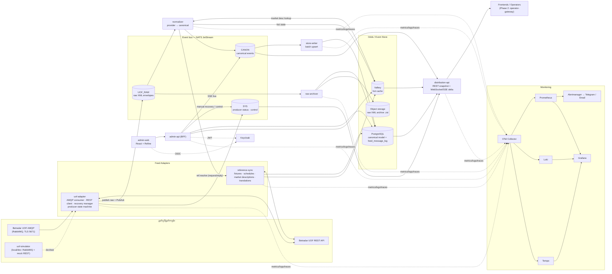
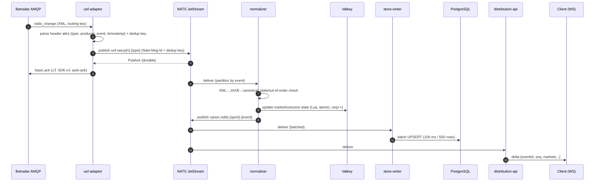
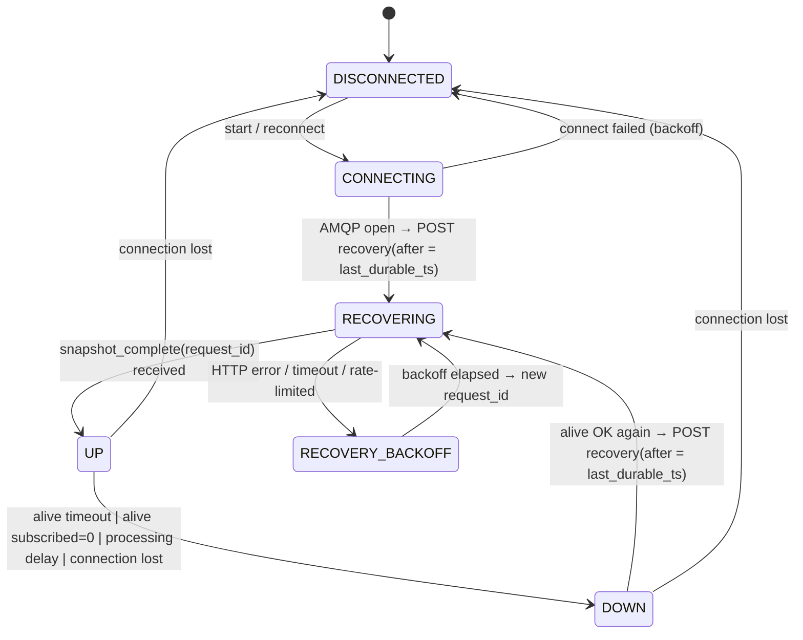
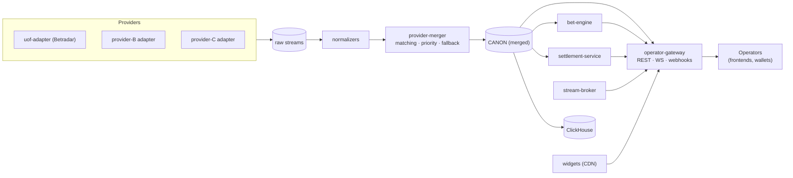

# 04 — პლატფორმის ტექნიკური არქიტექტურა (Phase 1 → Phase 2)

> **სტატუსი:** draft v0.1 · **თარიღი:** 2026-10-02
> **სფერო:** Phase 1 — feed integration (Betradar UOF) + admin backoffice + monitoring; Phase 2-ის მიმართულება — sportsbook/bet engine, streams, multi-provider, B2B API ოპერატორებისთვის, widgets.
> **დაკავშირებული დოკუმენტები:** UOF feed simulator-ის დიზაინი (Python, RabbitMQ, mock REST) და canonical data model (PostgreSQL: `sport` / `category` / `tournament` / `event` / `market` / `outcome` / `provider_mapping` / `feed_message_log`) — იხ. `docs/` საქაღალდის შესაბამისი ფაილები.
>
> ⚠️ **აღნიშვნა „[გადასამოწმებელი]“** ნიშნავს, რომ ფაქტი (ფასი, ლიმიტი, კონტრაქტის პირობა, იურიდიული მოთხოვნა) საჭიროებს დადასტურებას Sportradar-ის ოფიციალურ დოკუმენტაციაში, კონტრაქტში ან იურისტთან. **„[იურიდიული]“** ნიშნავს, რომ აუცილებელია იურისტის დასკვნა.

---

## 0. მოკლედ — ძირითადი გადაწყვეტილებები

| საკითხი | გადაწყვეტილება | რატომ (ერთი წინადადებით) |
|---|---|---|
| Production სერვისების ენა | **.NET 10 (LTS) + ASP.NET Core** — იხ. [ADR-001](adr/ADR-001-dotnet-stack.md) | გუნდი .NET-ზეა; ოფიციალური .NET SDK (`Sportradar.OddsFeed.SDKCore`) recovery/alive/caching-ს იძლევა. (თავდაპირველი რეკომენდაცია — Java — შეიცვალა.) |
| Event bus | **NATS JetStream** | ერთი პატარა binary, persistence + replay + ჩაშენებული dedup, subject-based routing; Kafka-ზე გადასვლის მკაფიო კრიტერიუმები Phase 2-ში. |
| მთავარი DB | **PostgreSQL 18** | canonical model, ტრანზაქციები, partitioning — უფასო და საკმარისი Phase 1-2-ისთვის. |
| Hot cache | **Valkey 8** (Redis-თავსებადი, BSD ლიცენზია) | მიმდინარე odds/market state < 1 ms წაკითხვით; ლიცენზიის რისკის გარეშე. |
| Admin UI | ~~React + Refine + Ant Design~~ → **Angular 22 + Angular Material** ([ADR-002](adr/ADR-002-admin-frontend.md)) | გუნდი Angular-ზეა; Material და CDK — MIT (PrimeNG 22 კომერციული PrimeUI ლიცენზიითაა, იხ. ADR-002). |
| AuthN/AuthZ | **Keycloak** (OIDC, MFA, RBAC) | უფასო, სტანდარტული, Phase 2-ში ოპერატორების client-credentials-იც იქვე. |
| Monitoring | **OpenTelemetry → Prometheus + Loki + Tempo → Grafana, Alertmanager → Telegram/Email** | სრულად self-hosted და უფასო. |
| ინფრასტრუქტურა | **local docker-compose → Hetzner Cloud (EU) + Docker Compose; Phase 2-ში k3s** | ყველაზე იაფი სანდო EU ღრუბელი; Betradar-ის ინფრასტრუქტურა ევროპაშია. |
| CI/CD | **GitHub Actions + GHCR (ან self-hosted registry)** | უფასო ლიმიტები საკმარისია სტარტაპისთვის. |
| Secrets | **SOPS + age** (repo-ში დაშიფრული) → Phase 2: **OpenBao/Vault** | ნულოვანი ხარჯი, git-ზე დაფუძნებული, აუდიტირებადი. |

> **განახლება 2026-10-02 (პირველი რეალიზაცია, [`../platform/`](../platform/README.md)):** .NET SDK თითოეულ event შეტყობინებაზე raw XML-ს იძლევა (`IEventMessage.RawMessage`), ამიტომ raw-first მეორე AMQP consumer-ის გარეშე მუშაობს. Phase 1-ის პირველ ვერსიაში NATS ჯერ არ არის — adapter in-process queue-თ პირდაპირ PostgreSQL-ში წერს; NATS `UOF_RAW` შემდეგი ნაბიჯია.

**ძირითადი პრინციპი — „raw-first“:** ყოველი UOF შეტყობინება ჯერ **უცვლელად** იწერება durable stream-ში (`UOF_RAW`), და მხოლოდ ამის შემდეგ ხდება მისი დამუშავება. ეს გვაძლევს replay-ს, debugging-ს, აუდიტს და B2B კლიენტებთან დავების გადაჭრის საშუალებას.

---

## 1. მაღალი დონის არქიტექტურა

### 1.1 კომპონენტების დიაგრამა



### 1.2 შეტყობინების გზა (happy path)



### 1.3 Event bus-ის არჩევანი

| კრიტერიუმი | Kafka (KRaft) / Redpanda | **NATS JetStream** | RabbitMQ (+Streams) |
|---|---|---|---|
| ოპერაციული სირთულე | საშუალო/მაღალი; Kafka — JVM, მეხსიერება ≥ 2–4 GB; Redpanda — უფრო მარტივი, მაგრამ BSL ლიცენზია | **ძალიან დაბალი**: ერთი Go binary, ~50–200 MB RAM | დაბალი-საშუალო |
| Persistence / replay | საუკეთესო (offset-ები, დიდი retention) | კარგი (stream retention by time/size, consumer-ები ნებისმიერი პოზიციიდან) | კლასიკური queue — replay არა; Streams — დიახ, მაგრამ ნაკლებად მომწიფებული ეკოსისტემა |
| რიგითობა per-event | partition key-ით | subject-ით + deterministic subject partitioning (`partition(n, …)`) | single active consumer / consistent-hash exchange |
| ჩაშენებული dedup | idempotent producer (მხოლოდ producer session-ში) | **დიახ** — `Nats-Msg-Id` + duplicate window | არა |
| Fan-out WebSocket-ზე | საჭიროებს დამატებით სერვისს | subject wildcards (`canon.odds.1.>`), native WebSocket gateway | საშუალო |
| ეკოსისტემა (CDC, connectors, analytics) | **საუკეთესო** (Kafka Connect, Debezium, ClickHouse) | საშუალო (ClickHouse-ს აქვს NATS engine) | საშუალო |
| ლიცენზია | Apache 2.0 (Kafka) / BSL (Redpanda Community) | Apache 2.0 | MPL 2.0 |

**რეკომენდაცია: NATS JetStream Phase 1-ისთვის.** მიზეზები:
1. **ხარჯი და სიმარტივე** — ერთ პატარა VM-ზე ეტევა ყველა დანარჩენ სერვისთან ერთად; 3-node cluster-ზე გადასვლა კონფიგურაციის ცვლილებაა.
2. **ჩაშენებული dedup** (`Nats-Msg-Id`) პირდაპირ წყვეტს UOF-ის recovery-ს დროს დუბლირებული შეტყობინებების პრობლემის ნაწილს.
3. **subject hierarchy** (`canon.odds.<sport>.<event>`) ბუნებრივად ერგება ოპერატორებისთვის სპორტის/ივენთის მიხედვით გაფილტრულ subscription-ებს.
4. **Request/reply** — normalizer → reference-sync („უცნობი მარკეტი, მომიტანე აღწერა“) დამატებითი HTTP-ს გარეშე.
5. **KV store** — producer state, leader lease (Phase 2 HA).

**რატომ არა RabbitMQ შიდა bus-ად**, თუმცა UOF თვითონ RabbitMQ-ზეა: UOF queue-ები exclusive/auto-delete არის და Betradar-ის მხარესაა — ჩვენს შიდა bus-ს არ უნდა ჰქონდეს იგივე შეზღუდვები; გვჭირდება replay და დიდი retention, რაც კლასიკურ RabbitMQ-ში არ არის. (RabbitMQ მაინც გამოიყენება simulator-ში — UOF-ის იმიტაციისთვის.)

**Kafka/Redpanda-ზე გადასვლის კრიტერიუმები (Phase 2+):** sustained > 50k msg/s; retention > 7 დღე მრავალი consumer group-ით; CDC (Debezium) / Kafka Connect / ClickHouse Kafka engine-ის საჭიროება; გუნდში Kafka-ს გამოცდილება. გადასვლის გასაიოლებლად ყველა სერვისი იყენებს შიდა `libs/bus-client` აბსტრაქციას (publish/subscribe/ack API), რომ broker-ის შეცვლა ერთ ბიბლიოთეკაში მოხდეს.

### 1.4 NATS stream-ები და subject-ები

| Stream | Subjects | Retention | Storage | მომხმარებლები |
|---|---|---|---|---|
| `UOF_RAW` | `uof.raw.p{0..15}.{msg_type}` | 72 სთ (UOF recovery window-ის ტოლი) | file, 1 replica (Phase 2: 3) | normalizer, raw-archiver |
| `CANON` | `canon.event.{sport}.{event}`, `canon.odds.{sport}.{event}`, `canon.betstop.{sport}.{event}`, `canon.settlement.{sport}.{event}` | 24 სთ | file | store-writer, distribution-api, admin-api; Phase 2: settlement, bet-engine |
| `SYS` | `sys.producer.{provider}.{producer_id}`, `sys.control.>` | 7 დღე | file | distribution-api, admin-api, alerting |

`p{0..15}` — partition = `hash(event_urn) mod 16`. ერთი partition-ის შიგნით რიგითობა დაცულია; normalizer-ის instance-ები partition-ებს ინაწილებენ (ერთი partition → ერთი აქტიური consumer).

---

## 2. სერვისების კატალოგი

### 2.1 ლოგიკური სერვისები

| სერვისი | პასუხისმგებლობა | ტექნოლოგია | მასშტაბირება | Phase |
|---|---|---|---|---|
| `uof-adapter` | AMQP კავშირი Betradar-თან, alive tracking, producer state machine, recovery (producer/event level), raw envelope → `UOF_RAW`, producer status → `SYS` | Java + UOF Java SDK + NATS client | **singleton** (ერთი AMQP სესია per token); Phase 2: active/standby leader lease-ით | 1 |
| `reference-sync` | REST: fixtures, schedules, market/variant descriptions, producers, translations; cache warm-up Valkey-ში; request/reply უცნობ მარკეტებზე | Java + REST client (Resilience4j: retry, rate-limit, circuit breaker) | 1–2 instance; REST rate limit-ზე შეზღუდული | 1 |
| `normalizer` | raw XML → canonical model (provider→canonical mapping), stale/out-of-order guard, Valkey hot state, `CANON` publish, per-event `seq` | Java (JAXB XSD-დან), Valkey Lua scripts | horizontal: N instance ≤ 16 partition | 1 |
| `store-writer` | `CANON` → PostgreSQL batch upsert (current state + odds history) | Java + JDBC batch / `COPY` | 1–2 instance; DB-ზე შეზღუდული | 1 |
| `raw-archiver` | `UOF_RAW` → `feed_message_log` (hot, PG) + hourly `.ndjson.zst` object storage-ში | Java | 1 instance | 1 |
| `distribution-api` | REST snapshot (events, markets, odds) + WebSocket/SSE delta push; producer-down → mass suspend სიგნალი | Java (Spring WebFlux / Netty) | stateless, horizontal (ყოველი instance თავად იწერს NATS-ს) | 1 (შიდა/demo), 2 (ოპერატორები) |
| `admin-api` | Admin BFF: event browser, message inspector, mapping CRUD, manual recovery, audit log; RBAC | Java + Spring Boot + Spring Security (OIDC) | stateless, 1–2 instance | 1 |
| `admin-web` | Backoffice UI | React + Refine + Ant Design + Vite (TypeScript) | static files (Caddy) | 1 |
| `keycloak` | SSO, MFA, roles; Phase 2 — operator clients | Keycloak | 1 instance (PG backend) | 1 |
| `uof-simulator` | UOF-ის იმიტაცია (AMQP + mock REST) — ტესტები, load test, chaos | Python, RabbitMQ (ცალკე დოკუმენტი) | — | 1 (test only) |
| Monitoring stack | metrics/logs/traces/alerts | OTel Collector, Prometheus, Loki, Tempo, Grafana, Alertmanager, exporters | ცალკე VM | 1 |
| `operator-gateway` | ოპერატორებისთვის B2B API (auth, entitlements, rate limit, webhooks) | Java (ან Go, თუ WS fan-out გახდება bottleneck) | horizontal | 2 |
| `bet-engine` | ფსონის მიღება/ვალიდაცია, live delay, liability, ticket ledger | Java | horizontal, PG + Valkey | 2 |
| `settlement-service` | bet_settlement / rollback / bet_cancel → ticket-ების ანგარიშსწორება | Java | partitioned by event | 2 |
| `provider-merger` | multi-provider: event matching, priority/fallback | Java | partitioned by canonical event | 2 |
| `stream-broker` | stream-ების ხელმისაწვდომობა, signed URL-ები, geo/bettor წესები | Java | stateless | 2 |
| `widgets` | Web Components (scoreboard, odds widget, bet builder) | TypeScript + Lit, CDN | static | 2 |
| `analytics` | odds history, message analytics | ClickHouse | — | 2 |

### 2.2 Phase 1-ის deployment დაჯგუფება (სტარტაპული პრაგმატიზმი)

ლოგიკური სერვისები ცალკე Gradle module-ებია, მაგრამ Phase 1-ში ზოგი ერთ პროცესში ეშვება, რომ RAM და ოპერაციული ხარჯი დავზოგოთ:

| Deployable (container) | შიგნით | შენიშვნა |
|---|---|---|
| `uof-adapter` | uof-adapter | **ყოველთვის ცალკე** — სხვა სერვისის crash არ უნდა იწვევდეს AMQP disconnect-ს და recovery-ს |
| `feed-processor` | normalizer + store-writer + raw-archiver + reference-sync | ცალკე NATS consumer-ები ერთ JVM-ში; ცალკე thread pool-ები |
| `platform-api` | distribution-api + admin-api | ერთი Spring Boot app, ორი route prefix (`/api/dist`, `/api/admin`) |
| `admin-web` | static build | Caddy ემსახურება |

როცა რომელიმე module-ს დამოუკიდებელი მასშტაბირება დასჭირდება, ცალკე container-ად გამოიყოფა კოდის ცვლილების გარეშე (მხოლოდ Spring profile/entrypoint).

---

## 3. UOF adapter — შიდა მოწყობა

### 3.1 სტრატეგია: SDK vs საკუთარი consumer

**არჩევანი Phase 1-ში: ოფიციალური UOF Java SDK — სესიისა და recovery-ის მართვისთვის; ჩვენი normalizer — raw XML-ზე.**

- SDK უკვე ახორციელებს: AMQP კავშირს/reconnect-ს, alive-ის კონტროლს, producer up/down-ს, recovery-ს (`after` timestamp-ით), market description cache-ს, rate-limited REST-ს. ეს ყველაზე რისკიანი ნაწილია და Sportradar-ის მიერ battle-tested-ია.
- SDK-ის raw message listener-ით (raw feed hook; ზუსტი API სახელი — [გადასამოწმებელი] მიმდინარე SDK ვერსიაში, 4.x) ყოველ შეტყობინებას უცვლელად ვაგზავნით `UOF_RAW`-ში. Normalizer XML-ს თავად პარსავს JAXB კლასებით, რომლებიც UOF XSD-ებიდანაა დაგენერირებული — ასე normalizer SDK-ის შიდა ობიექტებზე არ არის დამოკიდებული და ნებისმიერი შეტყობინების replay შესაძლებელია.
- SDK მხარს უჭერს **custom environment**-ს (messaging host / vhost / API host / SSL off) → იგივე adapter მუშაობს **simulator-ზე** local/dev გარემოში. Simulator-მა უნდა აწარმოოს SDK-ის მიერ startup-ზე გამოძახებული endpoint-ები (მაგ. `whoami.xml`, `descriptions/producers.xml`, `descriptions/{lang}/markets.xml`, recovery endpoints) — **კოორდინაცია simulator-ის გუნდთან**.
- **Escape hatch:** თუ SDK აღმოჩნდება შემზღუდველი (raw hook, მეხსიერება, multi-provider ერთგვაროვნება), ქვემოთ (3.2–3.7) აღწერილი ქცევა არის **სპეციფიკაცია**, რომლითაც საკუთარი consumer დაიწერება (RabbitMQ Java client + REST client). ორივე ვარიანტში გარე კონტრაქტი (`UOF_RAW`, `SYS`, metrics) იდენტურია.

### 3.2 კავშირის მართვა (connection handling)

| პარამეტრი | მნიშვნელობა / ქცევა |
|---|---|
| Host | production: `mq.betradar.com:5671` (TLS); integration: `stgmq.betradar.com` [გადასამოწმებელი] |
| Auth | username = access token, password ცარიელი; vhost = `/unifiedfeed/{bookmaker_id}` (bookmaker_id მიიღება `users/whoami.xml`-დან) |
| Exchange | `unifiedfeed` (topic) |
| Queue | server-named, **exclusive, auto-delete** → კავშირის გაწყვეტისას შეტყობინებები იკარგება ⇒ ერთადერთი დაცვა არის **recovery** |
| Routing key | `{priority}.{prematch}.{live}.{message_type}.{sport_id}.{urn_type}.{event_id}.{node_id}`, მაგ.: `hi.-.live.odds_change.1.sr:match.12345.-` |
| Bindings | Phase 1: ყველა შეტყობინება (`#`); system: `-.-.-.#` (alive, snapshot_complete). node-specific: `*.*.*.*.*.*.*.{node_id}` + `*.*.*.*.*.*.*.-` |
| Heartbeat | AMQP heartbeat 30 s; TCP keepalive |
| Prefetch | 500–2000 (გაზომვით); ack მხოლოდ JetStream PubAck-ის შემდეგ (საკუთარი consumer-ის შემთხვევაში) |
| Reconnect | exponential backoff 1 s → 2 → 4 … max 30 s, jitter ±20%; reconnect-ის შემდეგ ყველა producer → `RECOVERING` |
| `node_id` | ყოველ deployment-ს (prod/staging/dev) თავისი `node_id` — რომ recovery პასუხი (`snapshot_complete`) სწორ instance-ს მიუვიდეს და გარემოები ერთმანეთს არ ერეოდეს, თუ ერთ token-ს იყენებენ |
| Token | per-environment (integration ≠ production); არასდროს ლოგებში (AMQP URI-ის ლოგირება = token-ის გაჟონვა → log redaction) |

**HA:** Phase 1 — ერთი instance, `restart: always`, სწრაფი startup (< 10 s) + recovery. Phase 2 — active/standby: ორივე instance ეშვება, მაგრამ AMQP-ს მხოლოდ lease-ის მფლობელი ხსნის (NATS KV lease TTL 10 s, ან PG advisory lock). Active/active (ორი სესია + downstream dedup) ტექნიკურად შესაძლებელია JetStream dedup-ის წყალობით, მაგრამ ერთ token-ზე პარალელური კავშირების დაშვება — [გადასამოწმებელი] Sportradar-თან.

### 3.3 Producer-ის state machine

UOF-ში თითოეულ **producer**-ს (Phase 1: `1 = LO` Live Odds, `3 = Ctrl` prematch; სხვები — Virtual Sports და ა.შ. — პაკეტის მიხედვით) აქვს დამოუკიდებელი მდგომარეობა და recovery.



| მდგომარეობა | მნიშვნელობა ქვემოთ მყოფი სისტემისთვის |
|---|---|
| `UP` | odds სანდოა; distribution აქვეყნებს ჩვეულებრივ |
| `DOWN` | **ამ producer-ის ყველა მარკეტი ითვლება suspended-ად** → `SYS`-ში `producer_down{reason}`; distribution/operators აჩერებენ ფსონის მიღებას |
| `RECOVERING` | შეტყობინებები მოდის (recovery snapshot + live), მაგრამ state არასრულია → კვლავ suspended, სანამ `snapshot_complete` არ მოვა |
| `RECOVERY_BACKOFF` / `DISCONNECTED` | suspended + critical alert, თუ > 60 s |

`DOWN` reason-ები (SDK-ის ანალოგიით): `ALIVE_INTERVAL_VIOLATION`, `PROCESSING_QUEUE_DELAY_VIOLATION`, `CONNECTION_DOWN`, `SUBSCRIBED_FALSE` (alive `subscribed="0"`), `OTHER`.

მდგომარეობა persist-დება PG ცხრილში `producer_state(provider, producer_id, state, reason, last_alive_ts, last_durable_msg_ts, last_recovery_request_id, last_recovery_started_at, last_recovery_completed_at, updated_at)` და ქვეყნდება `sys.producer.uof.{id}`-ზე ყოველ ცვლილებაზე.

### 3.4 Alive tracking

- Betradar თითოეული producer-ისთვის აგზავნის `alive` შეტყობინებას დაახლოებით **ყოველ 10 წამში** (`<alive product="1" timestamp="…" subscribed="1"/>`).
- **`max_inactivity` = 20 s** (SDK default-ის ანალოგი; კონფიგურირებადი): თუ ბოლო alive-დან გავიდა > 20 s → `DOWN(ALIVE_INTERVAL_VIOLATION)`.
- `subscribed="0"` → `DOWN(SUBSCRIBED_FALSE)` და დაუყოვნებლივ recovery.
- **Processing delay:** თუ `now − message.timestamp` > 20 s (live producer-ზე) მუდმივად 3+ შეტყობინებაზე → `DOWN(PROCESSING_QUEUE_DELAY_VIOLATION)` — ნიშნავს, რომ ჩვენ ვჩამორჩებით და odds მოძველებულია.
- `last_durable_msg_ts` **განახლდება მხოლოდ** იმ alive-ის timestamp-ით, რომელიც მოვიდა `UP` მდგომარეობაში, `subscribed=1`-ით და **JetStream-ში durable ჩაწერის შემდეგ** — ეს არის recovery-ის `after` პარამეტრი. (არა „მიღებული“, არამედ „უსაფრთხოდ შენახული“.)
- Clock skew: ჰოსტებზე chrony/NTP; `node_timex_offset_seconds` alert > 100 ms (timestamp-ზე დაფუძნებული ყველა გაზომვა Sportradar-ის საათს ეყრდნობა).

### 3.5 Recovery

| ტიპი | როდის | REST (UOF API v1) |
|---|---|---|
| **Producer recovery (after)** | startup, reconnect, `DOWN → alive OK` | `POST /v1/{product}/recovery/initiate_request?after={ts_ms}&request_id={id}&node_id={n}` |
| **Full recovery** | `last_durable_msg_ts` არ არსებობს ან უფრო ძველია, ვიდრე producer-ის max window (Live Odds-ისთვის ~72 სთ / SDK-ის მიხედვით 3 დღე) | იგივე `after`-ის გარეშე — ⚠️ **დაკარგული `bet_settlement`-ები არ აღდგება** → Phase 2-ში settlement reconciliation REST-ით |
| **Event odds recovery** | normalizer-მა აღმოაჩინა არათანმიმდევრულობა ერთ ივენთზე; admin-ის ღილაკი | `POST /v1/{product}/odds/events/{event_urn}/initiate_request?request_id=…&node_id=…` |
| **Event stateful messages** | event-ის settlement/cancel-ების ხელახლა მიღება (Phase 2) | `POST /v1/{product}/stateful_messages/events/{event_urn}/initiate_request?…` |

წესები:
1. `request_id` — მონოტონური (PG sequence), ინახება `recovery_log`-ში (`request_id, producer, type, after_ts, started_at, completed_at, status, http_status, msg_count`).
2. recovery-ის დროს მოსულ `odds_change`-ებს აქვთ `request_id` ატრიბუტი — normalizer ამით განასხვავებს snapshot-ს live განახლებისგან (მეტრიკისთვის; state-ის ლოგიკა იგივეა — timestamp guard).
3. `snapshot_complete(request_id)` → `UP`. სხვა `request_id`-ის snapshot_complete იგნორირდება (ძველი/სხვა node-ის).
4. Timeout: warning 10 წთ-ზე, `RECOVERY_BACKOFF` 30 წთ-ზე (SDK default max recovery time-ის ფარგლებში; [გადასამოწმებელი]).
5. **Rate limits:** Betradar ზღუდავს recovery request-ების რაოდენობას producer-ზე დროის ერთეულში [გადასამოწმებელი — ზუსტი ციფრები UOF docs-ში]. ამიტომ: exponential backoff (30 s → 1 წთ → 2 → 5 → 10), ერთი აქტიური recovery per producer, admin-იდან ხელით recovery — მხოლოდ `ops_admin` როლით და audit log-ით.
6. Recovery loop detection: > 3 recovery 15 წთ-ში → critical alert (ჩვეულებრივ ნიშნავს, რომ ჩვენი processing ნელია ან ქსელი არასტაბილურია).

### 3.6 Idempotency, dedup და per-event რიგითობა

**Dedup key** (UOF შეტყობინებებს უნიკალური ID არ აქვს):

```
dedup_key = "{provider}:{producer}:{message_type}:{event_urn|-}:{timestamp_ms}:{sha256(raw_body)[0:16]}"
```

- `timestamp + type + event` ბუნებრივი გასაღებია; body hash იცავს ერთსა და იმავე მილიწამში სხვადასხვა შეტყობინების შეცდომით გაერთიანებისგან. Recovery-ში ხელახლა გამოგზავნილ odds-ს სხვა `request_id` აქვს → სხვა hash → ის არ იკარგება (სწორია: ის snapshot-ის ნაწილია).
- **ფენა 1 — JetStream:** `Nats-Msg-Id = dedup_key`, duplicate window = 2 წთ (ადაპტერის რესტარტზე / retry-ზე დუბლიკატი bus-ში არ შედის).
- **ფენა 2 — normalizer (state guard):** Valkey-ში per `(event, producer)` ინახება `last_ts`. `odds_change`, რომლის `timestamp < last_ts` → **stale, იგნორირდება** (მეტრიკა `uof_stale_dropped_total`), გარდა recovery snapshot-ისა, რომელიც state-ს ავსებს მხოლოდ იმ მარკეტებზე, სადაც უფრო ახალი არაფერია.
- **ფენა 3 — DB:** ყველა ჩაწერა idempotent UPSERT-ია ბუნებრივ გასაღებებზე: market — `(event_id, provider_market_id, specifiers)`; outcome — `(market_id, provider_outcome_id)`; `feed_message_log` — `UNIQUE(dedup_key, received_date)`. Settlement (Phase 2) — `(event, market, specifiers, outcome, certainty)` + rollback-ების მხარდაჭერა.

**რიგითობა per event:**
- AMQP queue თავად FIFO-ა. ადაპტერი აქვეყნებს `uof.raw.p{hash(event_urn) mod 16}.{type}`-ზე → ერთი ივენთის ყველა შეტყობინება ერთ partition-შია.
- normalizer: ერთი partition = ერთი აქტიური consumer (`MaxAckPending` partition-ზე შეზღუდული, in-process ერთი „lane“ per partition). ასე ერთი ივენთი არასოდეს მუშავდება პარალელურად, ხოლო სხვადასხვა ივენთი — პარალელურად.
- System შეტყობინებები (`alive`, `snapshot_complete`) ადაპტერში მუშავდება და `SYS`-ში ქვეყნდება; `bet_stop` და `odds_change` ერთი ივენთისთვის ერთსა და იმავე lane-შია → `bet_stop`-ის შემდეგ მოსული ძველი odds ვერ „გააცოცხლებს“ მარკეტს (timestamp guard).
- normalizer ანიჭებს per-event **`seq`** (Valkey `INCR seq:{event}`) ყოველ canonical delta-ს → კლიენტს შეუძლია gap-ის აღმოჩენა და REST snapshot-ით resync.

### 3.7 დამუშავების latency budget

| ეტაპი | p99 ბიუჯეტი | შენიშვნა |
|---|---|---|
| Sportradar generation (`timestamp`) → ადაპტერის მიღება | 50–300 ms | ჩვენს კონტროლს გარეთ; **გავზომოთ** (EU DC რეკომენდებულია) |
| ადაპტერი: header parse + dedup key + JetStream PubAck | ≤ 10 ms | XML-ის სრული parse **არა** — მხოლოდ root ატრიბუტები (StAX) |
| JetStream → normalizer delivery | ≤ 5 ms | |
| normalizer: XML→JAXB→canonical + market lookup (local cache) | ≤ 15 ms | დიდი odds_change (100+ მარკეტი) — უარეს შემთხვევაში |
| Valkey update (Lua, pipeline) | ≤ 5 ms | |
| `CANON` publish | ≤ 5 ms | |
| distribution → WS client | ≤ 50 ms | ქსელის გარეშე |
| **შიდა ჯამი: მიღება → client push** | **≤ 100 ms** | SLO |
| **feed `timestamp` → Valkey (hot)** | **≤ 500 ms** | SLO, alert თუ p99 > 1 s 5 წთ |
| store-writer (PG write-behind, batch 100 ms / 500 row) | ≤ 500 ms დამატებით | async; **feed `timestamp` → PG ≤ 1.5 s** |

Hot path-ზე **არასდროს** სინქრონული REST გამოძახება: უცნობი მარკეტი/ივენთი → odds ინახება „description pending“ სტატუსით, ხოლო აღწერა async მოდის (3.8).

### 3.8 Market description cache და refresh უცნობ მარკეტზე

- **Startup:** reference-sync ტვირთავს `GET /v1/descriptions/{lang}/markets.xml?include_mappings=true` (Phase 1 ენები: `en` + სხვა საჭირო ენა; ქართული (`ka`) Betradar-ის მიერ თარგმნილია თუ არა — [გადასამოწმებელი]; თუ არა — თარგმანები admin-იდან, `translation` ცხრილით), ასევე `descriptions/{lang}/variants.xml`, `descriptions/{lang}/match_status.xml`, `void_reasons.xml`, `betstop_reasons.xml`, `producers.xml`.
- **შენახვა:** PG (`market_description`, `outcome_description`, `specifier`, versioned) + Valkey (`md:{lang}:{market_id}:{variant|-}`) + normalizer-ის in-process Caffeine cache (TTL 1 სთ).
- **Periodic refresh:** ყოველ 6 სთ-ში სრული reload; diff → `market_description_change` audit და Grafana annotation.
- **უცნობი მარკეტი odds_change-ში:**
  1. normalizer ინახავს odds-ს (`market.description_status = 'pending'`), metric `uof_unknown_market_total++`, log `market_id`/`variant` (label-ად არა — cardinality).
  2. NATS request `ref.market.resolve {lang, market_id, variant}` → reference-sync: variant market-ისთვის (`variant=sr:…` specifier) `GET /v1/descriptions/{lang}/markets/{id}/variants/{variant}`; სხვა შემთხვევაში debounced სრული reload (**მაქს. 1-ჯერ წუთში**).
  3. მიღების შემდეგ `canon.market_description.updated` → normalizer/admin ანახლებენ სახელებს; ჯერ კიდევ უცნობი 10 წთ-ის შემდეგ → warning alert + admin-ის „Unknown markets“ სია.
- **Name templates:** `{+hcp}`, `{$competitor1}`, `{!periodnr}` და ა.შ. — ფორმირდება lazily (admin-ში/distribution-ში), canonical-ში ინახება raw specifiers.
- Fixture cache: უცნობი event → async `GET /v1/sports/{lang}/sport_events/{urn}/fixture.xml`; `fixture_change` → refetch; ყოველდღიური schedule sync (`schedules/{date}/schedule.xml`, live schedule).

### 3.9 Raw message archival

| ფენა | რა | Retention (Phase 1) | ფორმატი |
|---|---|---|---|
| `UOF_RAW` (JetStream) | ყველა შეტყობინება | 72 სთ | envelope: `{dedup_key, provider, producer, type, event_urn, sport_id, routing_key, msg_ts, received_ts, request_id, body}` |
| `feed_message_log` (PG) | metadata + zstd-compressed body | 7 დღე (დღიური partition-ები, `DROP PARTITION`) | ინდექსები: `(event_urn, msg_ts)`, `(type, msg_ts)`, `(producer, msg_ts)`, `request_id` |
| Object storage | ყველა შეტყობინება | 13 თვე default; settlement-ის შემცველი — ≥ 5 წელი [იურიდიული] | `raw/uof/{env}/{yyyy}/{mm}/{dd}/{hh}/{producer}-p{n}.ndjson.zst` + manifest (count, sha256) |

მოცულობის შეფასება: სრული live + prematch პაკეტი შეიძლება იყოს მილიონობით შეტყობინება დღეში (odds_change 2–50 KB) → დღეში ათეულობით GB არაკომპრესირებული; zstd ~8–12× → რამდენიმე GB/დღე. **ზუსტი ციფრები — გავზომოთ integration გარემოში პირველ კვირაში** და retention-ი შესაბამისად დავაზუსტოთ. Phase 2: ClickHouse (raw + odds history) სწრაფი ძებნისთვის.

---

## 4. Admin backoffice — Phase 1

### 4.1 ფუნქციები

| მოდული | ფუნქციონალი | როლი (მინ.) |
|---|---|---|
| **Dashboard** | producer-ების სტატუსი (UP/DOWN/RECOVERING), msg/s, latency p99, აქტიური live ივენთები, უცნობი მარკეტები, ბოლო alert-ები (Grafana embed ან API) | `viewer` |
| **Event browser** | ფილტრები: sport / category / tournament / თარიღი / status (not_started, live, ended, closed…) / producer; ძებნა სახელით და URN-ით; event detail: fixture, competitors, score/match status (`sport_event_status`), producer, mapping-ები | `viewer` |
| **Market / odds viewer** | ივენთის ყველა მარკეტი და outcome, status (active / suspended / deactivated / settled / cancelled / handed_over), odds **live განახლებით (SSE)**, ბოლო N ცვლილების ისტორია, bet_stop-ების ისტორია | `viewer` |
| **Producer status** | state machine-ის მდგომარეობა, `last_alive`, `last_durable_msg_ts`, recovery-ის ისტორია (`recovery_log`), ღილაკები: „Trigger recovery (after ts)“, „Event odds recovery“ — დადასტურებით და მიზეზის ველით | `ops_admin` |
| **Message inspector** | ძებნა: event URN, message type, producer, დროის შუალედი, `request_id`, routing key; raw XML viewer (pretty print, syntax highlight), **diff** ორ თანმიმდევრულ odds_change-ს შორის; 7 დღეზე ძველი — object storage-დან async ჩატვირთვა; „Replay to dev“ (Phase 1.5) | `viewer` (raw) / `ops_admin` (replay) |
| **Mapping management** | `provider_mapping`: sport/category/tournament/competitor/market/outcome; **unmapped queue** (ახალი entity-ები, რომლებსაც mapping არ აქვს); ხელით mapping/merge; თარგმანები (ქართული სახელები) | `mapper` |
| **Market descriptions** | მარკეტების კატალოგი, specifiers, outcomes, variants; უცნობი მარკეტების სია; ცვლილებების ისტორია | `viewer` |
| **Users & audit** | მომხმარებლები Keycloak-შია; admin-ში — audit log viewer (ვინ/რა/როდის/რა შეიცვალა) | `superadmin` |
| **Later (Phase 1.5–2)** | ხელით suspend (event/market), margin override (sport/tournament/market დონეზე), odds ladder, ოპერატორების მართვა/entitlements, limits | `trader` / `ops_admin` |

### 4.2 Stack — არჩევანი: **React + Refine + Ant Design (Vite, TypeScript)**

| ვარიანტი | + | − | ვერდიქტი |
|---|---|---|---|
| **Refine** | MIT; headless + Ant Design/MUI ინტეგრაცია; ჩაშენებული data provider (REST/OpenAPI), **access control provider**, **audit log provider**, **live provider** (real-time) — ზუსტად ჩვენი საჭიროებები; TanStack Query | შედარებით ახალგაზრდა ეკოსისტემა | ✅ **არჩეული** |
| React-Admin | მომწიფებული, ბევრი მაგალითი | ზოგი ძლიერი ფუნქცია (audit, RBAC, realtime) Enterprise (ფასიან) პაკეტშია | ❌ |
| Next.js (custom) | სრული თავისუფლება, SSR | CRUD/RBAC-ის თავიდან წერა; SSR/SEO admin-ს არ სჭირდება; Node runtime production-ში | ❌ |

დამატებითი ბიბლიოთეკები: Monaco Editor ან `react-syntax-highlighter` (XML viewer), `diff` (odds_change diff), Apache ECharts/Recharts (მცირე გრაფიკები; რთული დაშბორდები — Grafana).

**Backend for admin:** `admin-api` (Spring Boot): REST + OpenAPI (`springdoc`) → TypeScript client-ის ავტოგენერაცია (`openapi-typescript`); SSE endpoint live odds-ისთვის (`/api/admin/events/{id}/stream`), რომელიც `canon.odds.*.{event}`-ს უსმენს. **Auth:** Keycloak OIDC (Authorization Code + PKCE) → JWT → Spring Security role mapping. **MFA სავალდებულოა** ყველა admin მომხმარებლისთვის.

---

## 5. Monitoring

### 5.1 Stack (ყველა უფასო, self-hosted)

| კომპონენტი | როლი |
|---|---|
| **OpenTelemetry** (Java agent + SDK) | metrics, traces, logs სერვისებიდან; trace context გადაეცემა NATS header-ებით (adapter → normalizer → distribution) |
| **OTel Collector** | მიღება/batching/routing; log redaction (token-ები) |
| **Prometheus** | metrics (15 s scrape, 30 დღე retention). ალტერნატივა RAM-ის დასაზოგად: VictoriaMetrics single-node |
| **Loki** | ლოგები (JSON structured), 14–30 დღე |
| **Tempo** | traces (sampling: 1–5% + 100% შეცდომებზე და slow-ზე) |
| **Grafana** | დაშბორდები, Explore, annotations (deploy-ები, recovery-ები) |
| **Alertmanager** | routing → Telegram bot / Email; severity-ის მიხედვით; inhibition (AMQP down → producer down alerts ჩახშობა) |
| Exporters | `node_exporter`, `cAdvisor`, `postgres_exporter`, `redis_exporter` (Valkey), `prometheus-nats-exporter`, `blackbox_exporter` (HTTP/TLS cert expiry) |
| გარე „dead man’s switch“ | Alertmanager `Watchdog` → **healthchecks.io** (free tier) — თუ monitoring თავად მოკვდა; + გარე uptime check (UptimeRobot / Better Stack free tier) |
| Error tracking (არჩევითი) | GlitchTip (self-hosted, Sentry-თავსებადი) |

### 5.2 მეტრიკები

| მეტრიკა | ტიპი | Labels | აღწერა |
|---|---|---|---|
| `uof_messages_received_total` | counter | `producer`, `message_type`, `sport` | მიღებული შეტყობინებები (msg rate per type) |
| `uof_amqp_connection_up` | gauge 0/1 | — | AMQP კავშირი |
| `uof_producer_up` | gauge 0/1 | `producer` | producer up/down |
| `uof_producer_state` | gauge (enum one-hot) | `producer`, `state` | state machine მდგომარეობა |
| `uof_producer_down_total` | counter | `producer`, `reason` | down გადასვლები |
| `uof_alive_age_seconds` | gauge | `producer` | ბოლო alive-დან გასული დრო (alive gap) |
| `uof_alive_subscribed` | gauge 0/1 | `producer` | ბოლო alive-ის `subscribed` |
| `uof_recovery_requests_total` | counter | `producer`, `type` (full/after/event), `result` | recovery count |
| `uof_recovery_duration_seconds` | histogram | `producer`, `type` | request → snapshot_complete |
| `uof_recovery_in_progress` | gauge | `producer` | |
| `uof_feed_to_cache_latency_seconds` | histogram | `producer`, `message_type` | **end-to-end**: feed `timestamp` → Valkey |
| `uof_feed_to_db_latency_seconds` | histogram | `table` | feed `timestamp` → PG commit |
| `uof_receive_latency_seconds` | histogram | `producer` | feed `timestamp` → adapter receive (ქსელი + Betradar) |
| `pipeline_stage_duration_seconds` | histogram | `stage` (parse, normalize, cache, publish) | შიდა ეტაპები |
| `bus_consumer_pending_messages` | gauge | `stream`, `consumer` | **consumer lag** (NATS `num_pending`) |
| `bus_consumer_ack_pending` | gauge | `stream`, `consumer` | |
| `uof_unknown_market_total` | counter | `producer` | უცნობი მარკეტები (market_id — ლოგში) |
| `uof_unknown_event_total` | counter | `producer` | |
| `uof_xml_parse_errors_total` | counter | `message_type` | XML parse/validation შეცდომები |
| `uof_stale_dropped_total` / `uof_duplicates_dropped_total` | counter | `producer`, `message_type` | dedup/stale guard |
| `db_write_duration_seconds` | histogram | `table`, `op` | DB write latency |
| `db_batch_size` | histogram | `table` | |
| `uof_rest_requests_total` / `uof_rest_duration_seconds` | counter / histogram | `endpoint`, `status` | Betradar REST |
| `dist_ws_connections` | gauge | `client_type` | WebSocket კავშირები |
| `dist_push_latency_seconds` | histogram | — | CANON → client write |
| `archive_last_upload_timestamp_seconds` | gauge | — | object storage archival |
| `node_timex_offset_seconds` | gauge | `instance` | clock skew (node_exporter) |

### 5.3 Alerting წესები

| Alert | პირობა (PromQL-ის მსგავსი) | for | Severity |
|---|---|---|---|
| `UofAmqpDown` | `uof_amqp_connection_up == 0` | 30s | **critical** |
| `UofProducerDown` | `uof_producer_up{producer=~"1\|3"} == 0` | 30s | **critical** |
| `UofAliveGapWarning` | `uof_alive_age_seconds > 20` | 0s | warning |
| `UofAliveGapCritical` | `uof_alive_age_seconds > 60` | 0s | **critical** |
| `UofNotSubscribed` | `uof_alive_subscribed == 0` | 1m | **critical** |
| `UofNoMessages` | `sum by (producer)(rate(uof_messages_received_total{message_type!="alive"}[5m])) == 0 and uof_producer_up == 1` | 5m | warning (live producer-ზე ღამით შეიძლება ნორმა იყოს — time-based mute) |
| `UofRecoveryLoop` | `increase(uof_recovery_requests_total[15m]) > 3` | 0s | **critical** |
| `UofRecoverySlow` | `uof_recovery_in_progress == 1` | 10m | warning (30m → critical) |
| `UofFeedLatencyHigh` | `histogram_quantile(0.99, sum by (le)(rate(uof_feed_to_cache_latency_seconds_bucket[5m]))) > 1` | 5m | warning |
| `UofFeedLatencyCritical` | იგივე `> 3` | 3m | **critical** |
| `BusConsumerLag` | `bus_consumer_pending_messages > 1000` | 2m | warning (`> 10000` → critical) |
| `UofUnknownMarkets` | `increase(uof_unknown_market_total[10m]) > 0` | 10m | info/warning |
| `UofXmlParseErrors` | `increase(uof_xml_parse_errors_total[5m]) > 0` | 0s | warning |
| `UofXmlParseErrorRatio` | `rate(errors[5m]) / rate(received[5m]) > 0.01` | 5m | **critical** |
| `DbWriteSlow` | `histogram_quantile(0.99, …db_write_duration_seconds…) > 0.1` | 5m | warning (`> 0.5` → critical) |
| `PgConnectionsHigh` | `pg_stat_activity_count / pg_settings_max_connections > 0.8` | 5m | warning |
| `DiskAlmostFull` | `node_filesystem_avail_bytes / node_filesystem_size_bytes < 0.2` | 10m | warning (`< 0.1` → critical) |
| `ArchiveStale` | `time() - archive_last_upload_timestamp_seconds > 7200` | 0s | warning |
| `BackupFailed` | ბოლო წარმატებული backup > 26 სთ | 0s | **critical** |
| `ClockSkew` | `abs(node_timex_offset_seconds) > 0.1` | 5m | warning |
| `TlsCertExpiry` | `probe_ssl_earliest_cert_expiry - time() < 14*86400` | 1h | warning |
| `Watchdog` | `vector(1)` → healthchecks.io | — | dead man’s switch |

Routing: `critical` → Telegram on-call ჯგუფი + Email, განმეორება 15 წთ-ში; `warning` → Telegram ops არხი, განმეორება 2 სთ; `info` → მხოლოდ Grafana. ყველა alert-ს აქვს `runbook_url` (`docs/runbooks/*.md`).

### 5.4 Grafana დაშბორდები (ნიმუში)

**Dashboard „UOF Feed Health“** (provisioned JSON, `observability/grafana/dashboards/`):

| Row | Panel | ტიპი | Query (მოკლედ) |
|---|---|---|---|
| 1 — სტატუსი | AMQP connection | Stat (green/red) | `uof_amqp_connection_up` |
| | Producer LO / Ctrl state | State timeline | `uof_producer_state` |
| | Alive age per producer | Stat + thresholds 10/20/60 s | `uof_alive_age_seconds` |
| | Active recoveries | Stat | `sum(uof_recovery_in_progress)` |
| 2 — Throughput | Messages/s by type | Time series (stacked) | `sum by (message_type)(rate(uof_messages_received_total[1m]))` |
| | Messages/s by sport (top 10) | Bar gauge | `topk(10, sum by (sport)(rate(…[5m])))` |
| 3 — Latency | Feed → cache p50/p95/p99 | Time series | `histogram_quantile(…uof_feed_to_cache_latency_seconds…)` |
| | Pipeline stage breakdown | Heatmap / stacked | `pipeline_stage_duration_seconds` |
| | Receive latency (network) | Time series | `uof_receive_latency_seconds` |
| 4 — Backpressure | Consumer lag per consumer | Time series | `bus_consumer_pending_messages` |
| | DB write latency p99 + batch size | Time series | `db_write_duration_seconds`, `db_batch_size` |
| 5 — ხარისხი | Parse errors, unknown markets/events, stale/duplicate drops | Time series | შესაბამისი counters |
| | Recovery history | Table + annotations | `uof_recovery_requests_total`, Loki |
| 6 — Logs | ERROR/WARN ლოგები (uof-adapter, feed-processor) | Logs panel (Loki) | `{service=~"uof-adapter\|feed-processor"} \|= "ERROR"` |

სხვა დაშბორდები: „Infrastructure“ (node/cAdvisor), „PostgreSQL“, „NATS JetStream“, „Distribution API“ (WS connections, push latency, HTTP RED მეტრიკები), „SLO“ (feed→cache p99 < 500 ms; producer availability ≥ 99.5%).

---

## 6. ტექნოლოგიური stack — გადაწყვეტილებები

### 6.1 Production სერვისების ენა

| კრიტერიუმი | **Java (21/25 LTS)** | .NET (8/10 LTS) | Go | Python |
|---|---|---|---|---|
| ოფიციალური UOF SDK | ✅ `UnifiedOddsSdkJava` (4.x, აქტიური) | ✅ `UnifiedOddsSdkNetCore` | ❌ — recovery/alive/descriptions ხელით (≈ 4–8 კვირა + რისკი) | ❌ |
| UOF XSD → typed models | JAXB/xjc — სტანდარტული | `xsd.exe`/XmlSerializer | `xgen` და მსგავსი — სუსტი | `xsdata` — კარგი |
| შესრულება / latency | ძალიან კარგი (virtual threads, ZGC) | ძალიან კარგი | ძალიან კარგი, ნაკლები RAM | სუსტი hot path-ზე (GIL), პარსინგი ნელი |
| მეხსიერება | 300–700 MB/სერვისი | 150–400 MB | 30–100 MB | 100–300 MB |
| ეკოსისტემა (NATS/Kafka/PG/OTel/Resilience) | **საუკეთესო** | ძალიან კარგი | კარგი | კარგი |
| დაქირავება საქართველოში | კარგი (ბანკები, fintech, outsourcing) | კარგი (ბანკების დიდი ნაწილი .NET) | მზარდი, ნაკლები | კარგი, მაგრამ backend-iGaming გამოცდილება ნაკლები |
| Phase 2 (bet engine, settlement) | ✅ | ✅ | ✅ | ⚠️ |

> **განახლება 2026-10-02:** გუნდი .NET-ზეა → მიღებულია **.NET 10 + ოფიციალური .NET SDK** ([ADR-001](adr/ADR-001-dotnet-stack.md)). ქვემოთ მოცემული Java-ს არგუმენტაცია ისტორიისთვის რჩება; არქიტექტურა უცვლელია.

**თავდაპირველი რეკომენდაცია: Java (LTS) + Spring Boot ყველა core სერვისისთვის.**
- მთავარი არგუმენტი — ოფიციალური SDK ამცირებს ყველაზე რისკიან ნაწილს (session/recovery) და Sportradar-ის support-თან კომუნიკაცია SDK-ზე უფრო მარტივია.
- ერთი ენა backend-ზე = ნაკლები cognitive load პატარა გუნდისთვის; საერთო ბიბლიოთეკები (`canonical-model`, `bus-client`, `observability`).
- **თუ დამფუძნებელი გუნდი .NET-ზეა** — აირჩიეთ .NET (LTS) + ოფიციალური .NET SDK; არქიტექტურა უცვლელია. **ნუ შეურევთ ორივეს.**
- Go — მხოლოდ შესაძლოა Phase 2-ში WebSocket fan-out gateway-სთვის, თუ გაზომვით დადასტურდება საჭიროება.
- Python — simulator, QA/load ტესტები, data scripts.
- Java ვერსია: 25 LTS, თუ SDK და Spring Boot-ის მიმდინარე ვერსიები ოფიციალურად უჭერენ მხარს; წინააღმდეგ შემთხვევაში 21 LTS [გადასამოწმებელი SDK-ის compatibility matrix-ში].

### 6.2 სრული stack

| ფენა | არჩევანი | დასაბუთება / ალტერნატივა |
|---|---|---|
| Backend framework | Spring Boot (მიმდინარე stable), Spring WebFlux distribution-ისთვის | ყველაზე დიდი ეკოსისტემა; alt: Quarkus (ნაკლები RAM) |
| Build | Gradle (Kotlin DSL), multi-project | |
| XML | StAX (header parse adapter-ში) + JAXB (XSD-დან) | |
| DB | **PostgreSQL 18** | partitioning (`feed_message_log`), JSONB, `pg_partman`, `pg_stat_statements`; alt: TimescaleDB odds history-სთვის Phase 2-ში |
| Migrations | Flyway | SQL-first, canonical model-ის გუნდთან საერთო |
| Hot cache | **Valkey 8** | Redis-თავსებადი, BSD; Lua atomic updates |
| Event bus | **NATS JetStream** (§1.3) | |
| Object storage | Hetzner Object Storage (S3 API) ან Cloudflare R2 / Backblaze B2 | ყველა S3-თავსებადი → vendor lock-in არ არის |
| Auth | Keycloak | alt: Zitadel / Authentik |
| Frontend | React + Refine + Ant Design + Vite + TypeScript; pnpm | |
| Reverse proxy / TLS | **Caddy** (ავტომატური Let’s Encrypt) | alt: Traefik |
| Observability | OTel, Prometheus, Loki, Tempo, Grafana, Alertmanager | |
| Testing | JUnit 5, **Testcontainers** (PG, Valkey, NATS, RabbitMQ + simulator), ArchUnit; k6 / Python simulator — load | |
| API contracts | OpenAPI 3.1 (REST), AsyncAPI 3 (WS/NATS), JSON Schema canonical events-ისთვის | |
| Containers | Docker, Compose; Phase 2: k3s + Helm | |
| IaC | Terraform (`hcloud` provider) + Ansible (VM bootstrap) | |

---

## 7. ინფრასტრუქტურა სტარტაპის ბიუჯეტზე

### 7.1 გარემოები

| გარემო | სად | Feed წყარო | Deploy | მიზანი |
|---|---|---|---|---|
| **local** | დეველოპერის ლეპტოპი, `docker compose` | **uof-simulator** | `make up` | დეველოპმენტი, ინტეგრაციული ტესტები |
| **dev** | 1 Hetzner VM (shared) | simulator + (არჩევით) Betradar **integration** env | ავტომატურად `main`-ზე | ინტეგრაცია, demo |
| **staging** | ცალკე compose project (Phase 1-ში შეიძლება იგივე VM, ცალკე network/volumes) | Betradar **integration** env (ცალკე `node_id`) | git tag `v*-rc*` | release candidate, load ტესტი simulator-ით |
| **prod** (Phase 1-ის ბოლოს / pilot) | ცალკე VM-ები (app, db, monitoring), private network | Betradar **production** token | ხელით approve (GitHub Environments) | პირველი ოპერატორი/pilot |

ლოკაცია: Hetzner **Falkenstein/Nuremberg (DE)** ან **Helsinki (FI)** — დაბალი latency Betradar-ის EU ინფრასტრუქტურამდე. (თუ ქართველი ოპერატორი/რეგულატორი მოითხოვს მონაცემების საქართველოში შენახვას — [იურიდიული]; მაშინ ადგილობრივი DC, მაგ. ქართული ღრუბლოვანი პროვაიდერები, გაცილებით ძვირი.)

### 7.2 Hosting-ის შედარება

| ვარიანტი | 8 vCPU / 16 GB VM (დაახლ.) | Managed PG | Egress | ვერდიქტი |
|---|---|---|---|---|
| **Hetzner Cloud** | CX43 ≈ €16/თვე | არა (self-managed) | 20 TB შედის (EU) | ✅ **რეკომენდებული** — ფასი/შესრულება |
| DigitalOcean | ~ $96/თვე (16 GB droplet) | დიახ (~$60+) | 4–6 TB შედის | ⚠️ 4–6× ძვირი; მოსახერხებელი managed სერვისები |
| AWS | m7g.xlarge ~ $120+/თვე + RDS + NAT Gateway + egress $0.09/GB | დიახ | ძვირი | ❌ Phase 1-ისთვის. Free tier (2025-ის ივლისიდან credit-ებზე დაფუძნებული, ~6 თვე) [გადასამოწმებელი] — დროებითი და 24/7 feed-ს ვერ გასწევს |

⚠️ **Hetzner-მა 2026 წელს ფასები ორჯერ გაზარდა** (1 აპრილი და 15 ივნისი; CX/CAX ~1.3–1.4×, CPX/CCX 2.4–2.75×). ქვემოთ — ივნისის შემდეგი ფასები DE/FI-ში, **დღგ-ის გარეშე** [გადასამოწმებელი hetzner.com-ზე შეკვეთის წინ]. **CPX/CCX ახლა არახელსაყრელია — გამოიყენეთ CX (x86) ან CAX (ARM).** Java/NATS/PG/Valkey ყველა მუშაობს ARM64-ზე.

### 7.3 სავარაუდო თვიური ხარჯი

**ვარიანტი A — „Bootstrap“ (Phase 1-ის დასაწყისი, მხოლოდ dev/integration):**

| ერთეული | სპეც. | €/თვე |
|---|---|---|
| 1× CX43 (ყველაფერი: app + PG + NATS + Valkey + monitoring + staging) | 8 vCPU / 16 GB / 160 GB | ~16.0 |
| Backups (+20%) | | ~3.2 |
| Object storage (raw archive) | Hetzner Object Storage base / R2 | ~5–6 |
| Domain + Cloudflare DNS (free) | | ~1 |
| GitHub Free, Grafana OSS, Keycloak, Telegram | | 0 |
| **ჯამი** | | **≈ €25–27** |

**ვარიანტი B — „Pilot production“ (Phase 1-ის ბოლო):**

| ერთეული | სპეც. | €/თვე |
|---|---|---|
| prod-app: CX43 | adapter, feed-processor, platform-api, NATS, Valkey, Keycloak, Caddy | ~16.0 |
| prod-db: CX43 + Volume ~100 GB | PostgreSQL 18 (+ WAL-G/pgBackRest → object storage) | ~16.0 + ~5 |
| monitoring: CX33 | 4 vCPU / 8 GB — Prometheus, Loki, Tempo, Grafana, Alertmanager | ~8.5 |
| dev + staging: CX43 | ორი compose project | ~16.0 |
| Hetzner backups (prod VMs, +20%) | | ~6.4 |
| Object storage (raw archive + DB backups, ≤ 1 TB) | | ~6–10 |
| Floating/Primary IPv4 (თუ საჭიროა) | | ~1–2 |
| Domain, DNS, healthchecks.io/UptimeRobot free | | ~1 |
| **ჯამი** | | **≈ €75–85** |

**ვარიანტი C — Phase 2 (ოპერატორები, bet engine, HA):** 3-node NATS cluster, PG primary + replica (Patroni ან ხელით streaming replication), 2+ app node, ClickHouse — დაახლ. **€250–600/თვე** (Hetzner dedicated AX-სერია შეიძლება უფრო მომგებიანი იყოს [გადასამოწმებელი ფასები]).

> **მთავარი ხარჯი ინფრასტრუქტურა არ არის** — ეს არის Sportradar-ის ლიცენზია (UOF პაკეტი, Live Channel, widgets), რომელიც კომერციული მოლაპარაკების საგანია და ამ დოკუმენტის ფარგლებს სცდება.

### 7.4 CI/CD (GitHub Actions)

```
PR:        lint (spotless, eslint) → unit tests → integration tests (Testcontainers + simulator)
           → build images → Trivy scan → gitleaks → OpenAPI/AsyncAPI diff check
main:      ↑ + push images → GHCR (tag = git sha) → deploy dev (SSH + docker compose pull/up)
tag rc:    deploy staging → smoke tests (simulator scenario: connect → recovery → odds → producer down)
tag v*:    manual approval (GitHub Environment "prod") → deploy prod → post-deploy checks → Grafana annotation
nightly:   load test (simulator, N msg/s), DB restore test (კვირაში ერთხელ), dependency updates (Renovate/Dependabot)
```

- GitHub Free: private repo-ებზე Actions-ის უფასო წუთები და Packages-ის storage შეზღუდულია [გადასამოწმებელი მიმდინარე ლიმიტები]; თუ ამოიწურა — self-hosted runner dev VM-ზე ან self-hosted registry (`registry:2`/Zot) Hetzner-ზე.
- Deploy: Phase 1 — `docker compose` + SSH (მარტივი, საკმარისი); Phase 2 — k3s + Helm + Argo CD (GitOps).
- Docker image-ები: multi-arch (`amd64` + `arm64`), distroless/JRE-slim base, non-root.

### 7.5 Secrets management

| ეტაპი | გადაწყვეტა |
|---|---|
| Phase 1 | **SOPS + age**: `deploy/secrets/{env}.enc.yaml` git-ში დაშიფრულად; age private key — GitHub Environment secret-ად (per env) და ოპერატორების password manager-ში; deploy-ზე იშიფრება → `.env` (0600) VM-ზე |
| CI | GitHub Actions secrets / Environments (prod — required reviewers) |
| Phase 2 | **OpenBao** (Vault-ის open-source fork) ან HashiCorp Vault: dynamic DB credentials, rotation |
| წესები | Betradar token-ები **per environment**; არასდროს ლოგებში, error message-ებში, frontend-ში; rotation პროცედურა runbook-ში; `gitleaks` pre-commit + CI |

---

## 8. უსაფრთხოება და compliance (B2B iGaming) — საბაზისო

> ⚠️ ეს ნაწილი **ტექნიკური საწყისია და არა იურიდიული რჩევა**. ყველა რეგულაციური პუნქტი — [იურიდიული].

### 8.1 Access control

- **SSO + MFA** (Keycloak) ყველა შიდა მომხმარებლისთვის; როლები: `viewer`, `mapper`, `trader` (Phase 1.5+), `ops_admin`, `superadmin`; least privilege; ოთხი თვალის პრინციპი კრიტიკულ ქმედებებზე Phase 2-ში (margin, manual settlement).
- Admin და Grafana — **არა საჯარო ინტერნეტში**: Cloudflare Zero Trust Access (free tier — მცირე გუნდისთვის) ან WireGuard/Tailscale (Headscale self-hosted).
- სერვერები: SSH მხოლოდ key-ით, root login off, Hetzner Cloud Firewall, private network PG/NATS/Valkey-სთვის (საჯარო პორტები მხოლოდ 443), unattended security upgrades, fail2ban.
- TLS ყველგან გარეთ; შიდა: Phase 1 — private network, Phase 2 — mTLS NATS-სა და PG-ზე.
- Supply chain: Renovate/Dependabot, Trivy (images), Semgrep CE (SAST), gitleaks, SBOM (Syft) release-ზე.

### 8.2 Audit logs

- ცხრილი `audit_log(id, ts, actor_id, actor_ip, actor_roles, action, entity_type, entity_id, before jsonb, after jsonb, reason, request_id, trace_id)` — **append-only** (`REVOKE UPDATE, DELETE`, trigger-ით დაცვა), არჩევით hash chain (`prev_hash`) tamper-evidence-ისთვის.
- ლოგირდება: login/logout (Keycloak events), mapping ცვლილებები, manual recovery, suspend/margin override (Phase 1.5+), user/role ცვლილებები, raw message export.
- ასლი ყოველდღიურად object storage-ში **Object Lock (WORM)**-ით, თუ პროვაიდერი უჭერს მხარს.

### 8.3 მონაცემების retention (საწყისი პოლიტიკა)

| მონაცემი | Retention | შენიშვნა |
|---|---|---|
| Raw feed (JetStream) | 72 სთ | ტექნიკური |
| Raw feed (PG hot) | 7 დღე | |
| Raw feed (object storage) | 13 თვე; settlement/cancel შეტყობინებები ≥ 5 წელი | [იურიდიული] + **Sportradar-ის კონტრაქტი** — შეიძლება ზღუდავდეს მათი მონაცემების შენახვის ვადას/კონტრაქტის შემდეგ წაშლას |
| Canonical current state | ვადის გარეშე | |
| Odds history | 90 დღე (Phase 1), Phase 2 — ClickHouse | |
| Application logs (Loki) | 14–30 დღე | PII არ უნდა შეიცავდეს |
| Metrics | 30 დღე (downsampled — 1 წელი, Phase 2) | |
| Audit log | ≥ 5 წელი | [იურიდიული] |
| DB backups | 7 daily + 4 weekly + 6 monthly; PITR 7 დღე | კვირაში ერთხელ restore test |

Phase 1-ში **მოთამაშეების პერსონალური მონაცემები არ მუშავდება**. Phase 2-ში (bet engine) — საქართველოს „პერსონალურ მონაცემთა დაცვის შესახებ“ კანონი (ახალი რედაქცია) და, EU ოპერატორებისთვის, GDPR [იურიდიული].

### 8.4 ლიცენზირება, სერტიფიცირება, სტანდარტები

| თემა | შენიშვნა |
|---|---|
| **Sportradar-ის მონაცემების რედისტრიბუცია** | **კრიტიკული:** UOF/Live Channel/widgets-ის მონაცემების მესამე მხარისთვის (ოპერატორებისთვის) გადაცემა B2B მოდელით ჩვეულებრივ საჭიროებს სპეციალურ (reseller/distribution) ლიცენზიას. სტანდარტული bookmaker ლიცენზია ამას შეიძლება არ ფარავდეს → **Phase 2-ის API-ების დაწყებამდე წერილობითი დადასტურება Sportradar-ისგან** [იურიდიული] |
| საქართველოს რეგულაცია | აზარტული თამაშების ორგანიზების ნებართვები (ფინანსთა სამინისტრო / შემოსავლების სამსახური); B2B მომწოდებლისთვის ცალკე ნებართვის/რეგისტრაციის საჭიროება [იურიდიული] |
| სხვა იურისდიქციები (როცა ოპერატორი იქ მუშაობს) | MGA (Malta) — B2B „critical gaming supply“ ლიცენზია; UKGC — gambling software ლიცენზია; ზოგ ქვეყანაში — vendor registration [იურიდიული] |
| **GLI** | GLI-33 (Event Wagering Systems) და GLI-19 (Interactive Gaming Systems) — რელევანტურია **Phase 2-ის sportsbook/bet engine-ისთვის**; feed integration/admin ჩვეულებრივ ცალკე სერტიფიცირებას არ საჭიროებს, მაგრამ ოპერატორის იურისდიქციაზეა დამოკიდებული. სხვა test labs: BMM, iTech Labs, eCOGRA [იურიდიული] |
| **ISO/IEC 27001:2022** | Phase 2–3, როცა ოპერატორები მოითხოვენ. **ახლავე იაფად:** policy-ები (access control, change management, incident response, backup), asset inventory, risk register — Annex A-ს სტრუქტურით, რომ შემდეგ აუდიტი იაფი იყოს |
| Change management | ყველა prod ცვლილება — PR + review + CI + tagged release (ეს ასევე GLI/ISO-ს მოთხოვნაა) |
| Incident response | runbook-ები, on-call, post-mortem შაბლონი; ოპერატორების შეტყობინება SLA-ის მიხედვით (Phase 2) |

---

## 9. Phase 2+ — ხედვა



### 9.1 Bet engine და settlement consumers

- **bet-engine:** ოპერატორის API-დან ticket → idempotency key (`operator_id + operator_ticket_id`) → ვალიდაცია Valkey-ის მიმდინარე odds-ზე (market active, producer UP, odds-change policy: accept none/higher/any) → **live bet delay** (sport/tournament-ის მიხედვით, მაგ. 3–8 s, ამ ხნის განმავლობაში `bet_stop` → reject) → liability/limits → ledger (PG, double-entry) → wallet debit (ოპერატორის seamless wallet API). ალტერნატივა/დამატება: Sportradar **MTS** (Managed Trading Services) ticket-ების ვალიდაციისა და რისკისთვის [კომერციული].
- **settlement-service:** `bet_settlement` (`certainty` 1 = live scouted / 2 = confirmed — სად ვაკეთებთ settlement-ს, ბიზნეს გადაწყვეტილებაა), `void_factor`, `dead_heat_factor`, `rollback_bet_settlement`, `bet_cancel` (`start_time`/`end_time` შუალედით), `rollback_bet_cancel` → ticket-ების გადაანგარიშება, idempotent და reversible; ოპერატორებს — webhook/wallet credit. რეკონსილიაცია: დღიური job, რომელიც REST-ით (event summary / settlement state) ამოწმებს დახურულ ივენთებს — განსაკუთრებით full recovery-ის შემდეგ.
- `feed_message_log` + raw archive = settlement დავების მტკიცებულება.

### 9.2 Multi-provider merging

- **Event matching:** `provider_mapping` (canonical model-ის ცხრილი) + ავტომატური matching (start time ± 15 წთ, competitor სახელების fuzzy similarity, tournament mapping) → confidence score → დაბალი confidence → admin-ის „matching queue“ ხელით დადასტურებისთვის.
- **Priority / fallback:** წესები `(sport, tournament?, market_type?) → [provider ranked list]`. Fallback ტრიგერები: primary producer `DOWN`, market stale > X s, მარკეტი primary-ს არ აქვს. **Hysteresis** (მაგ. 30 s სტაბილური UP primary-ზე დასაბრუნებლად), რომ წყარო არ „ციმციმებდეს“.
- **წესი:** ერთი მარკეტის outcome-ები არასდროს ერევა ორი provider-იდან; ყოველ მარკეტს აქვს `source_provider` და **settlement source of truth**.
- Market mapping: provider-ის market/outcome → canonical market type (canonical model-ის `market` + mapping ცხრილები).

### 9.3 Streams

- **stream-broker** არ მასპინძლობს ვიდეოს — ის გასცემს **მოკლევადიან signed playback URL/token-ს** provider-ის CDN/hosted player-ისთვის (Betradar Live Channel / Audiovisual — hosted player, event-ების შერჩევა ოპერატორის მიერ).
- ტიპური პირობები (ყველა [გადასამოწმებელი კონტრაქტში]): მხოლოდ რეგისტრირებული/დაფინანსებული მომხმარებლისთვის (ზოგჯერ — ბოლო 24 სთ-ში ფსონის მქონე), **geo-blocking** უფლებების მიხედვით, per-event ლიცენზირება, concurrent viewer limits, re-streaming აკრძალულია.
- ამიტომ stream-broker-ს სჭირდება ოპერატორისგან end-user context (user id hash, country, eligibility flag) და per-event rights ცხრილი. სხვა stream provider-ები Phase 3-ში (IMG Arena, Genius Sports და სხვ.).

### 9.4 ოპერატორებისთვის API-ები

- **operator-gateway:** OAuth2 client credentials (Keycloak) ან API key + HMAC; არჩევით mTLS.
- **Entitlements:** რომელი sport/tournament/market/producer ეკუთვნის ოპერატორს (ლიცენზიისა და კონტრაქტის მიხედვით).
- **Contracts:** REST snapshot (`/v1/events`, `/v1/events/{id}/markets`) + **WebSocket delta** (per-event `seq`, gap → resync) + webhooks (settlement, fixture changes); OpenAPI + AsyncAPI; ვერსიონირება `/v1`; per-operator **margin/odds ladder** transformation; rate limiting (Valkey token bucket).
- **Sandbox:** simulator-ზე დაფუძნებული გარემო ოპერატორების ინტეგრაციისთვის — დიდი კონკურენტული უპირატესობა.
- SDK-ები ოპერატორებისთვის (TS, Java) — Phase 3.

### 9.5 Widgets

- **ჩვენი widgets:** Web Components (Lit + TypeScript), ერთი `<script>`-ით ჩასმა, CDN (Cloudflare Pages — free), მონაცემები operator-gateway-დან (public read-only token, CORS whitelist): scoreboard, odds widget, live event list.
- **Sportradar widgets** (Live Match Tracker და სხვ.) — ცალკე ლიცენზია; იღებენ Sportradar match ID-ს (`sr:match:…` URN-იდან) → ჩვენი canonical event → `provider_mapping` → SR id. Bet builder: Sportradar **Custom Bet** (UOF CustomBet API; widget-ს სჭირდება ჩვენი UOF proxy) ან საკუთარი, მოგვიანებით [კომერციული/გადასამოწმებელი].

### 9.6 მასშტაბირების გეგმა

| ტრიგერი | ქმედება |
|---|---|
| > 3–4 VM / ხშირი deploy-ები | k3s + Helm + Argo CD |
| bus throughput/retention/CDC | NATS → Kafka/Redpanda (`bus-client`-ის მიღმა) |
| PG write saturation | odds history → ClickHouse; PG — მხოლოდ current state + ledger |
| HA მოთხოვნები (ოპერატორების SLA) | NATS 3-node, PG Patroni, adapter active/standby, 2 AZ (Hetzner: FSN + NBG) |

---

## 10. რეპოზიტორიის სტრუქტურა (monorepo)

```
betradar-integration/                 # (მომავალში შეიძლება ეწოდოს platform/)
├── README.md
├── Makefile                          # make up / test / lint / sim
├── settings.gradle.kts               # Java multi-project
├── build.gradle.kts
├── gradle/libs.versions.toml         # version catalog
├── pnpm-workspace.yaml               # frontend workspace
├── docs/
│   ├── 01-…, 02-…, 03-…              # simulator, canonical data model და სხვ.
│   ├── 04-platform-architecture.md   # ეს დოკუმენტი
│   ├── adr/                          # Architecture Decision Records (0001-event-bus-nats.md …)
│   └── runbooks/                     # producer-down.md, recovery-loop.md, db-restore.md …
├── schemas/
│   ├── uof-xsd/                      # Sportradar UOF XSD-ები (JAXB generation-ისთვის)
│   ├── openapi/                      # distribution-api.yaml, admin-api.yaml
│   ├── asyncapi/                     # canonical-events.yaml (NATS/WS)
│   └── events/                       # JSON Schema canonical event-ებისთვის
├── libs/                             # Java shared libraries
│   ├── canonical-model/              # canonical DTO-ები, enum-ები
│   ├── uof-model/                    # XSD-დან გენერირებული JAXB კლასები
│   ├── bus-client/                   # NATS abstraction (publish/subscribe/ack, partitioning, dedup)
│   ├── cache-client/                 # Valkey + Lua scripts
│   ├── observability/                # OTel, metrics naming, log redaction
│   └── test-support/                 # Testcontainers fixtures, simulator client
├── services/
│   ├── uof-adapter/
│   ├── reference-sync/
│   ├── normalizer/
│   ├── store-writer/
│   ├── raw-archiver/
│   ├── feed-processor/               # Phase 1 deployable: აერთიანებს ზემოთ ოთხს
│   ├── distribution-api/
│   ├── admin-api/
│   ├── platform-api/                 # Phase 1 deployable: distribution + admin
│   └── phase2/                       # (ცარიელი placeholder-ები, როცა დაიწყება)
│       ├── operator-gateway/
│       ├── bet-engine/
│       ├── settlement-service/
│       ├── provider-merger/
│       └── stream-broker/
├── apps/
│   ├── admin-web/                    # React + Refine + Ant Design (Vite)
│   └── widgets/                      # Phase 2: Lit Web Components
├── tools/
│   ├── uof-simulator/                # Python (ცალკე დოკუმენტი) — pyproject.toml, uv
│   ├── load-tests/                   # k6 / simulator scenarios
│   └── scripts/                      # raw archive replay, data fixes
├── db/
│   ├── migrations/                   # Flyway: V001__canonical_model.sql …
│   └── seed/                         # dev seed data
├── observability/
│   ├── otel-collector/config.yaml
│   ├── prometheus/{prometheus.yml, rules/*.yml}
│   ├── alertmanager/alertmanager.yml
│   ├── loki/ · tempo/
│   └── grafana/{provisioning/, dashboards/uof-feed-health.json …}
├── deploy/
│   ├── compose/
│   │   ├── docker-compose.yml        # infra: postgres, valkey, nats, keycloak, caddy
│   │   ├── docker-compose.apps.yml   # services
│   │   ├── docker-compose.sim.yml    # simulator + RabbitMQ
│   │   └── docker-compose.obs.yml    # monitoring stack
│   ├── caddy/Caddyfile
│   ├── keycloak/realm-export.json
│   ├── secrets/{dev,staging,prod}.enc.yaml   # SOPS + age
│   ├── terraform/hcloud/             # VM-ები, network, firewall, volumes
│   ├── ansible/                      # bootstrap, hardening, docker
│   └── k8s/                          # Phase 2: Helm charts
├── .github/
│   ├── workflows/{ci.yml, deploy-dev.yml, deploy-staging.yml, deploy-prod.yml, nightly.yml}
│   ├── CODEOWNERS
│   └── dependabot.yml / renovate.json
├── .sops.yaml
├── .editorconfig
└── .gitleaks.toml
```

---

## დანართი A — ღია საკითხები / გადასამოწმებელი

1. Sportradar: B2B რედისტრიბუციის ლიცენზია; ერთ token-ზე პარალელური AMQP სესიების დაშვება; recovery rate limit-ები; ქართული ენის მხარდაჭერა descriptions-ში; integration env-ის წვდომა კონტრაქტამდე; raw data-ს შენახვის ვადები.
2. UOF Java SDK: raw message listener-ის ზუსტი API მიმდინარე ვერსიაში; Java 25 compatibility; custom environment-ით simulator-თან მუშაობისთვის საჭირო endpoint-ების სრული სია (→ simulator-ის გუნდი).
3. იურიდიული: საქართველოს B2B მომწოდებლის ნებართვა; data residency; retention ვადები; GLI-ის საჭიროება ოპერატორების იურისდიქციებში.
4. Hetzner/GitHub-ის მიმდინარე ფასები და ლიმიტები (2026 წელს შეიცვალა).
5. მოცულობის გაზომვა (msg/day, bytes/day) integration env-ში → retention-ისა და VM-ების ზომის დაზუსტება.

## დანართი B — წყაროები

- Sportradar UOF Java SDK — <https://github.com/sportradar/UnifiedOddsSdkJava>, API docs <https://sportradar.github.io/UnifiedOddsSdkJava/>, CHANGELOG (custom environment) <https://github.com/sportradar/UnifiedOddsSdkJava/blob/master/CHANGELOG.md>
- UOF SDK docs — <https://docs.sportradar.com/uof/sdk/intro>
- UOF Start Guide — <https://iodocs.betradar.com/unifiedsdk/UOF_Start_Guide.pdf>
- Sportradar Widgets (LMT, Custom Bet, UOF Proxy) — <https://widgets.sir.sportradar.com/docs/Widgets.match.LMTPlus.html>, <https://widgets.sir.sportradar.com/docs/Widgets.CustomBet.UOFProxy.html>
- Betradar Audiovisual / Live Channel — <https://betradar.com/live-streaming/>
- Hetzner 2026 ფასების ცვლილება — <https://northflank.com/blog/hetzner-cloud-server-price-increases>, <https://www.bitdoze.com/hetzner-cloud-cost-optimized-plans/>, <https://byteiota.com/hetzner-june-2026-price-shock/>
