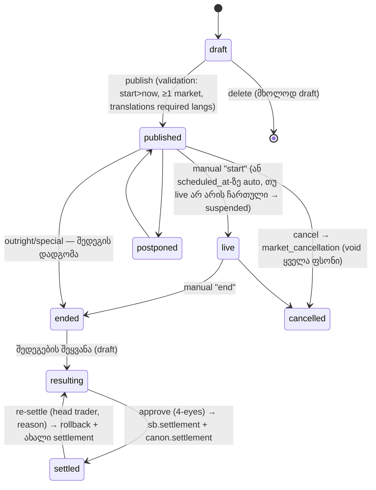
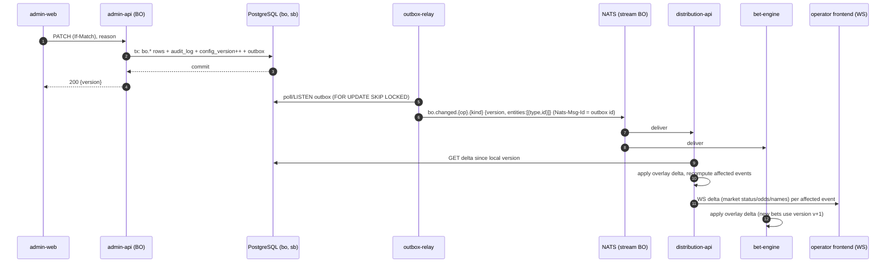

# 06 — Back office: კატალოგი, თარგმნები, odds, კონფიგურაცია, CMS (CAT · I18N · ODDS · CFG · CMS)

> ⚠ შეთანხმებული გადაწყვეტილებები 05–08 დოკუმენტებს შორის: [docs/09 §2](09-backoffice-plan.md#2-სავალდებულო-გადაწყვეტილებები-0508-ის-შეთანხმება). კონფლიქტის შემთხვევაში docs/09 სავალდებულოა.

> **სტატუსი:** draft v0.1 · **თარიღი:** 2026-10-04
> **სფერო:** ოპერატორის back office-ის (BO) მოდულები **CAT** (კატალოგი, ივენთები, მონაწილეები, media), **I18N** (თარგმნები), **ODDS** (margin, ხელით odds, suspend, ხელით მარკეტები), **CFG** (იერარქიული პარამეტრების ძრავა — ყველა მოდულისთვის), **CMS** (შეცდომის/უარყოფის შეტყობინებები, კონტენტ-ბლოკები) და BO ცვლილებების გავრცელება distribution ფენამდე.
> **დამოკიდებულებები:** canonical model — [02 §6](02-uof-data-model.md#6-ჩვენი-კანონიკური-მოდელი) და `platform/db/migrations/V001..V004`; არქიტექტურა — [04](04-platform-architecture.md). სხვა მოდულები (LIM, BET, CASH, CUS, ADM, PROMO, INT, REP) — სხვა დოკუმენტებში; აქ მათზე მხოლოდ setting key-ებით და hook-ებით ვმიუთითებთ.
> **⚠** = გადასაწყვეტი/გადასამოწმებელი; კოორდინაცია სხვა მოდულების ავტორებთან.

---

## 0. მოკლედ — ძირითადი გადაწყვეტილებები

| საკითხი | გადაწყვეტილება | რატომ |
|---|---|---|
| `sb` vs `bo` | `sb` = feed-ის ჭეშმარიტება, BO მას **არ ცვლის**; ოპერატორის ცვლილებები = `bo.*_override` + `bo.setting` + `bo.translation`. ხელით შექმნილი ობიექტები (ივენთი, მარკეტი) = **`sb`-ის ჩვეულებრივი row-ები provider `manual`-ით** (`sb.provider.id = 0`) + მფლობელობა `bo.manual_entity`-ში | distribution/bet/settlement ერთ მოდელს კითხულობს, ორი ცალკე „სამყარო“ არ გვაქვს |
| პოლიტიკა vs ატრიბუტი | **მემკვიდრეობითი პოლიტიკა** (ხილვადობა, live/prematch, margin, market enabled, cash-out, limits) → **CFG** (`bo.setting`); **არამემკვიდრეობითი ატრიბუტი** (სახელი, ლოგო, sort, featured, display time) → override ცხრილები / `bo.translation` / media | ერთი resolution ძრავა ყველა „იერარქიულ“ წესზე; override ცხრილები მარტივი რჩება |
| ხილვადობის წესი | `offer.visible` — **AND მთელ გზაზე** (წინაპარზე დამალული შთამომავალს ყოველთვის მალავს) | უსაფრთხო და პროგნოზირებადი; „ყველაფერი დამალე გარდა X-ისა“ — custom group-ით |
| Margin ალგორითმი | feed-ის overround-ის მოხსნა **power method**-ით → სამიზნე margin-ის დადება **power method**-ით → boost → min/max clamp → **ladder-ზე ქვემოთ დამრგვალება** | power ინარჩუნებს favourite-longshot bias-ს; ladder ქვემოთ — არასდროს ვაძლევთ გამოთვლილზე მაღალ ფასს |
| ფასის ერთი წყარო | ყველა გარდაქმნა ერთ ბიბლიოთეკაშია **`libs/offer-core`** (pure function: feed state + overlay → offer); იყენებს distribution-api და bet-engine | ნაჩვენები ფასი = მიღებული ფასი, ბიტ-ბიტ |
| გავრცელება | **read-time merge** (feed hot state Valkey-ში + ოპერატორის compiled **overlay** in-memory), **არა** materialized per-operator offer; overlay ვერსიონირებული, ინვალიდაცია NATS-ით | odds-ის განახლების სიხშირე × ოპერატორების რაოდენობა materialization-ს ძვირს ხდის; overlay პატარაა |
| CFG scope | `platform → operator → sport → category → tournament → event → market` ხე + არჩევითი **`market_type` qualifier** ნებისმიერ დონეზე (`(tournament, 1x2)`); customer ცალკე ღერძი | „1x2-ის margin ამ ლიგაში“ ხაზოვან იერარქიაში ვერ ეტევა |
| CFG ცვლილებები | ყოველი ჩაწერა = **change set** (draft → [approve] → scheduled/applied), ისტორია და rollback change set-ის დონეზე | trading-ის ცვლილებები ჯგუფურად და აუდიტირებადად |
| Media | S3-თავსებადი object storage (Hetzner Object Storage; dev — MinIO), presigned upload, worker-ი ქმნის WebP/PNG ვარიანტებს, CDN | იაფი, სტანდარტული |
| თარგმნები | ვთარგმნით **template-ებს** (`Total {total}`, `{$competitor1} ({+hcp})`), არა rendered სახელებს; fallback: operator → platform → provider → fallback ენა | ერთი თარგმანი ყველა ხაზს ფარავს |

---

## 1. საერთო პრინციპები

### 1.1 Manual entity-ები `sb`-ში

```sql
INSERT INTO sb.provider (id, code, name) VALUES (0, 'manual', 'Manual (back office)');
```

- ხელით ივენთი/მარკეტი/outcome/competitor იქმნება `sb`-ში ჩვეულებრივად; `sb.provider_mapping`-ში იწერება `(provider_id=0, entity_type, provider_entity_id='bo:<uuid>', internal_id)` — ასე ნებისმიერი row-სთვის ცნობილია წყარო.
- **ვინ ფლობს:** `bo.manual_entity(entity_type, entity_id, operator_id NULL=platform, state)`. ოპერატორის მიერ შექმნილი manual ივენთი სხვა ოპერატორს **არ უჩანს** (distribution ფილტრავს), platform-ის (ჩვენი) manual ივენთი — ყველას, ვისაც entitlement აქვს.
- feed-ის writer-ები (`store-writer`) manual row-ებს ვერ შეეხება: manual მარკეტი ყოველთვის იყენებს `manual:*` კოდიან `market_description`-ს (იხ. §4.6), ამიტომ natural key `(event_id, market_description_id, specifiers)` feed-ის მარკეტს ვერ დაემთხვევა.
- `sb`-ში ჩაწერა ხდება **მხოლოდ** `catalog-service`-ის domain ფუნქციებით (BO API → service → `sb`), არა BO UI-დან SQL-ით; ყოველი ქმედება `bo.audit_log`-ში (ADM).

### 1.2 Scope-ის იდენტიფიკაცია (გამოიყენება CFG-ში, override-ებში, audit-ში)

| `scope_type` | `scope_id` | შენიშვნა |
|---|---|---|
| `platform` | `0` | მხოლოდ ჩვენი სტაფი; `operator_id IS NULL` |
| `operator` | `0` | `operator_id` = ოპერატორი |
| `sport` / `category` / `tournament` | `sb.sport.id` / `sb.category.id` / `sb.tournament.id` | |
| `event` | `sb.event.id` | |
| `market` | `sb.market.id` | |
| `outcome` | `sb.market.id` + `scope_sub = outcome.code` | იშვიათი (მხოლოდ ODDS) |
| qualifier `market_type_id` | `sb.market_description.id` | ნებისმიერ ზემოთ ჩამოთვლილ დონეს ემატება |
| custom group | — | **scope არ არის**: group = ნაჩვენები ხე, პოლიტიკა არ ერთვის (⚠ P2-ში შეიძლება) |

### 1.3 Multi-tenancy და უსაფრთხოება
- ყველა `bo` ცხრილს აქვს `operator_id` (NULL = platform). API ყოველთვის ფილტრავს JWT-ის `operator_id` claim-ით; platform user-ს შეუძლია `X-Operator-Id` header-ით „ოპერატორად შესვლა“ (audit-ში ორივე id). PostgreSQL RLS — დამატებითი დაცვა (⚠ ADM-თან შეთანხმება).
- ყოველი write: `bo.audit_log` (before/after jsonb, reason) + `bo.outbox` row **იმავე ტრანზაქციაში** (§7).
- Optimistic locking: ყველა რედაქტირებად ცხრილს აქვს `version int`; PUT-ს სჭირდება `If-Match`.

### 1.4 როლები (permission-ები; Keycloak-ის role mapping — ADM)

| Role | მოდულები |
|---|---|
| `platform_admin` | ყველაფერი, platform scope, participant merge, setting_def |
| `platform_content` | platform-დონის კატალოგი, თარგმნები, media, manual ივენთები ყველასთვის |
| `op_admin` | ოპერატორის ყველა ქვემოთ ჩამოთვლილი + CFG approve |
| `op_content` | CAT (ოპერატორის override-ები, custom groups, manual ივენთები), CMS |
| `op_translator` | I18N (მხოლოდ თარგმნა, import/export) |
| `op_trader` | ODDS (override, suspend, manual მარკეტები), CFG `margin.*`/`market.*` draft |
| `op_head_trader` | ODDS + CFG approve, manual settlement-ის მეორე ხელმოწერა |
| `op_viewer` | read-only ყველგან |

---

## 2. CAT — კატალოგი, ივენთები, მონაწილეები, media

### 2.1 დანიშნულება
ოპერატორს აძლევს საშუალებას, feed-ის კატალოგი (sport → category/ქვეყანა → tournament/ლიგა → event) **თავის ბრენდზე მოარგოს**: რიგი, დამალვა, სახელის შეცვლა, ხატულები/დროშები/ლოგოები, top ლიგები, საკუთარი ჯგუფები („ქართული ფეხბურთი“, „Champions League specials“), featured ივენთები; ასევე შექმნას **manual ივენთები** (outright-ები, specials, ადგილობრივი ივენთები, რომლებსაც feed არ ფარავს) და დაამუშაოს მათი სასიცოცხლო ციკლი.

### 2.2 ეკრანები (Angular)

| Route | ეკრანი | ძირითადი ველები / ქმედებები |
|---|---|---|
| `/cat/tree` | **Catalog tree** | მარცხნივ ხე (sport → category → tournament; `mat-tree` + CDK drag&drop). თითო კვანძზე: ოპერატორის სახელი (ka/en/…), ორიგინალი (feed), ხატულა, `visible` toggle (= `offer.visible` setting), `live`/`prematch` toggle, ღია ივენთების რაოდენობა, `top` ნიშანი. Drag&drop = sort. „მხოლოდ დამალულები / ცარიელები / თარგმანის გარეშე“ ფილტრები. Bulk: მონიშნულების დამალვა/გამოჩენა |
| `/cat/node/:type/:id` | კვანძის დეტალი | tabs: General (სახელები ენებზე, short name, slug), Media (icon/flag/logo upload, preview ვარიანტებით), Settings (CFG-ის ეფექტური მნიშვნელობები ამ scope-ზე + „override აქ“), Audit |
| `/cat/top` | **Top leagues / featured** | ორი სია drag&drop რიგით: top tournaments (თითო sport-ზე და „ყველა sport“) და featured events (valid_from/to), live preview |
| `/cat/groups` | **Custom groups** | ჯგუფების ხე (kind: `category` / `collection`), წევრები (tournament ან event), mode `add`/`move`, valid_from/to, ხილვადობა, media |
| `/cat/events` | **Event list / search** | ფილტრები: sport, category, tournament, group, თარიღის შუალედი, status, provider (feed/manual), live/prematch, „დამალული“, „override-ით“, ტექსტი (competitor/event სახელი ნებისმიერ ენაზე, URN, ჩვენი id). სვეტები: start (ოპერატორის timezone-ში), სახელი, status, მარკეტების რაოდ., override ნიშნები, ფსონების რაოდ. (BET). Bulk: hide, feature, move to group, suspend (ODDS) |
| `/cat/events/:id` | **Event detail** | tabs: General (სახელი/ენები, display start time, featured, visible, live/prematch), Markets (ODDS §4 — სია, status, override-ები), Competitors, Settings (CFG trace), Bets (BET link), Audit, Feed (ფიდის raw ინფო — Feed Ops-ზე link) |
| `/cat/manual-events/new`, `/:id` | **Manual event wizard** | type (`match` / `outright` / `special`), sport, tournament ან custom group, competitors (არსებული/ახალი), start time, markets (template-დან ან custom — §4.6), publish |
| `/cat/manual-events/:id/result` | **Result entry** | ანგარიში/შედეგი, თითო მარკეტზე outcome-ის შედეგი (won/lost/void/half), dead heat, „submit for approval“ → მეორე ხელმოწერა → settlement hand-off |
| `/cat/participants` | **Participants** | competitors/players ძებნა, სახელი ენებზე, short name / abbreviation, ლოგო, ქვეყანა, provider mapping-ები, „დუბლიკატის კანდიდატები“ |
| `/cat/participants/merge` | **Merge** | survivor + victim(s) გვერდიგვერდ, დიფი, გავლენა (ივენთების/outcome-ების რაოდ.), confirm (platform_admin) |
| `/cat/media` | Media library | upload, ძებნა, გამოყენების ადგილები, ჩანაცვლება |

### 2.3 მონაცემთა მოდელი (სრული DDL — §8)

- `bo.catalog_override` — sport/category/tournament-ის sort, top, slug (სახელი — `bo.translation`-ში, `field='name'`); `bo.event_override` — display start, featured (ვადით), note.
- `bo.custom_group` + `bo.custom_group_member(member_type tournament|event, mode)`: `add` — ჩანს ორივეგან; `move` — ორიგინალ ადგილას იმალება მხოლოდ ნავიგაციაში (`offer.visible` არ იცვლება).
- `bo.manual_entity` — manual ობიექტის მფლობელი და `state` (sb-ის enum-ში `draft` არ არის: draft ივენთი sb-ში არსებობს, მაგრამ distribution აჩვენებს მხოლოდ `state='published'`-ს); `bo.event_link` — manual ↔ feed მიბმა (§2.5.4).
- `bo.media_asset` + `bo.media_link(role icon|flag|logo|banner|background)`; participants: სახელები/short name/abbreviation → `bo.translation`, ლოგო → `bo.media_link`, merge → `sb.competitor.merged_into_id` (V005 ⚠ — `sb`-ის ერთადერთი სქემის ცვლილება) + `bo.participant_merge_log`.

### 2.4 API

```
GET    /api/bo/cat/tree?sport=&lang=&include=hidden,counts        ხე ოპერატორის ხედვით
PATCH  /api/bo/cat/nodes/{type}/{id}                              {sortOrder,isTop,slug,...}  (If-Match)
PUT    /api/bo/cat/nodes/{type}/{id}/order                        {childrenIds:[...]} drag&drop
POST   /api/bo/cat/nodes/bulk                                     {targets:[{type,id}], set:{"offer.visible":false}}  → CFG change set
GET/POST/PATCH/DELETE /api/bo/cat/groups[/{id}]
PUT    /api/bo/cat/groups/{id}/members                            [{memberType,memberId,mode,sortOrder}]
GET    /api/bo/cat/top?sport=  · PUT /api/bo/cat/top               top leagues / featured events
GET    /api/bo/cat/events?q=&sport=&from=&to=&status=&provider=&overridden=&page=
GET    /api/bo/cat/events/{id}                                    feed + override + effective (merged) ხედი
PATCH  /api/bo/cat/events/{id}/override                           {displayStartAt,isFeatured,...}
POST   /api/bo/cat/manual-events                                  draft
PATCH  /api/bo/cat/manual-events/{id}  · POST .../{id}/publish · POST .../{id}/cancel {reason}
POST   /api/bo/cat/manual-events/{id}/status                      {status:'live'|'ended'|'postponed', ...}
POST   /api/bo/cat/manual-events/{id}/results                     draft შედეგები
POST   /api/bo/cat/manual-events/{id}/results/submit · .../approve  → settlement hand-off
POST   /api/bo/cat/manual-events/{id}/link                        {feedEventUrn | feedEventId, mode}
GET    /api/bo/cat/participants?q=&sport=  · PATCH /api/bo/cat/participants/{kind}/{id}
GET    /api/bo/cat/participants/duplicates?sport=
POST   /api/bo/cat/participants/merge                             {kind, survivorId, victimIds[], dryRun}
POST   /api/bo/media/uploads                                      → {mediaId, presignedPutUrl}
POST   /api/bo/media/{id}/complete                                → ვარიანტების generation
PUT    /api/bo/media/links                                        {entityType,entityId,role,mediaId}
```

### 2.5 ბიზნეს წესები / edge case-ები

**2.5.1 ხე და ხილვადობა**
- ხეში ჩანს ყველა `sb` კვანძი, რომელზეც ოპერატორს entitlement აქვს (ADM/INT). ახალი feed კვანძი default-ად **ხილულია** (`offer.visible` default `true`); ოპერატორს შეუძლია `catalog.new_nodes_visible=false` — მაშინ ახალი tournament-ები პირველად დამალული ჩნდება და „ახალი კვანძების“ რიგში ხვდება.
- ცარიელი კვანძი (0 ღია ივენთი) frontend-ზე ავტომატურად არ ჩანს — ეს distribution-ის წესია, არა `visible`.
- sort: `sort_order` NULL → fallback: top ჯერ, შემდეგ ოპერატორის ენაზე ანბანით. Category-სთვის default — ოპერატორის „home country“ (`display.home_country`) პირველი.
- feed-ში tournament-ის category შეიცვალა → override-ები tournament-ის id-ზეა, ამიტომ მიყვება.

**2.5.2 Custom groups**
- ჯგუფი შეიძლება იყოს sport-ის ქვეშ (`sport_id`) ან sport-ს გარეთ („Specials“ ჯგუფი მრავალი sport-იდან).
- `kind='category'` — ხეში category-ის დონეზე ჩანს (შიგნით tournament-ები/ივენთები); `kind='collection'` — მარკეტინგული კოლექცია (home page-ის ბლოკი), ხეში არ ჩანს.
- „ივენთის გადატანა custom კატეგორიაში“ = `custom_group_member(member_type='event', mode='move')`. ივენთის `tournament_id` sb-ში არ იცვლება; settlement/რეპორტები ორიგინალ tournament-ზე რჩება, REP-ს შეუძლია group-ითაც დააჯგუფოს.
- `valid_to` გასული → ჯგუფი ავტომატურად იმალება (scheduler job, outbox event).

**2.5.3 Event override**
- `display_start_at` — **მხოლოდ ჩვენება** (მაგ. „TBA“ დროის გასწორება). bet acceptance-ის cut-off ყოველთვის `sb.event.scheduled_at`/status-ზეა (BET). UI გამოაჩენს გაფრთხილებას, თუ |display − feed| > 1 სთ.
- `live`/`prematch` availability = CFG `offer.live_enabled` / `offer.prematch_enabled` event scope-ზე (არა override ცხრილში).
- `is_featured` ვადით (`featured_from/to`); ივენთის დასრულებისას featured ავტომატურად ქრება.
- feed-ის `fixture_change`-ზე override-ები რჩება; თუ feed-მა ივენთი `cancelled` გახადა — featured/display ქრება.

**2.5.4 Manual ივენთები**
- ტიპები: `match` (2 competitor), `outright` (`sb.event.event_type='outright'`, outcome-ები = competitor-ები ან free text), `special` (`event_type='match'` ან `outright` + `bo.manual_entity.meta.kind='special'`, მაგ. „არჩევნები“, „ევროვიზია“ — ⚠ იურიდიული: ქართული კანონი არა-სპორტულ ფსონებს ზღუდავს, CFG `manual.non_sport_allowed=false` default).
- სასიცოცხლო ციკლი:



- `sb.event.status` ასახავს: published→`not_started`, live→`live`, ended/resulting→`ended`, settled→`closed`, cancelled→`cancelled`, postponed→`postponed`.
- **Auto-suspend:** `scheduled_at`-ზე ყველა prematch მარკეტი ავტომატურად `suspended` (scheduler), თუ ტრეიდერმა live არ ჩართო — manual ივენთზე live odds-ს არავინ აწვდის.
- **Result entry & settlement hand-off:** BO შედეგს წერს `sb.settlement`-ში (`producer_id=0`, `certainty=2`, `feed_message_id=NULL`) და `sb.outcome.result`-ში, `catalog-service` publish-ს აკეთებს `canon.settlement.{sport}.{event}`-ზე — **იგივე subject**, რასაც feed იყენებს. ფსონების ანგარიშსწორება BET/settlement-service-ის საქმეა; BO მხოლოდ შედეგის წყაროა. Re-settle = `sb.rollback(kind='settlement')` + ახალი settlement (იგივე მექანიზმი, რაც feed-ის rollback-ს აქვს, 02 §7.3).
- **4-eyes:** settlement-ის approve სხვა მომხმარებელმა უნდა გააკეთოს (არა submitter-მა), როცა მარკეტზე ღია ფსონების liability ≥ `settlement.manual_four_eyes_threshold` (default 0 — ყოველთვის).
- **Manual → feed მიბმა** (`/link`): 
  - თუ feed ივენთი **ჯერ არ არის** `sb`-ში → `mode='attach'`: `sb.provider_mapping`-ს ემატება feed URN → manual ივენთის id. შემდეგ feed პირდაპირ ამ ივენთს აახლებს; manual მარკეტები (`manual:*` description) რჩება, feed-ის მარკეტები ემატება. `bo.manual_entity.state='linked'`, settlement შემდეგ feed-ით.
  - თუ feed ივენთი **უკვე არსებობს** → `mode='replace'`: manual ივენთი იმალება ახალი მიღებისთვის (მისი ღია ფსონები ხელით სეტლდება), feed ივენთზე გადადის override-ები (featured, groups), `bo.event_link` ინახავს redirect-ს (frontend-ის ძველი URL → ახალი).
  - ⚠ `attach` მოითხოვს, რომ adapter-მა mapping lookup provider_mapping-ით გააკეთოს ახალი row-ის შექმნამდე (ასეა 02 §8-ის მიხედვით — გადასამოწმებელი კოდში).

**2.5.5 Participants**
- სახელის prioritet: ოპერატორის თარგმანი → platform → `sb.competitor.name_i18n`. Short name (mobile-ისთვის, ≤ 12 სიმბოლო, validation) და abbreviation (3–4 სიმბოლო).
- **დუბლიკატები:** job ეძებს კანდიდატებს (იგივე sport + ქვეყანა, normalized სახელის trigram similarity ≥ 0.8, ან ერთ ივენთში ორ provider-ში ერთსა და იმავე პოზიციაზე) → `/duplicates` სია.
- **Merge** (platform_admin, პლატფორმული ოპერაცია): ერთ ტრანზაქციაში `sb.merge_competitor(survivor, victim)`: `provider_mapping`, `event_competitor`, `outcome.competitor_id`, `player.competitor_id` გადაიწერება survivor-ზე; victim რჩება `merged_into_id`-ით (tombstone; არასდროს იშლება — ძველი ფსონები/რეპორტები). `bo.translation`/`bo.media_link` victim-ისა გადადის, თუ survivor-ს იგივე ველი არ აქვს. Dry run აჩვენებს გავლენას. Un-merge — მხოლოდ `participant_merge_log`-ის მიხედვით (P2).
- ოპერატორს merge არ შეუძლია (გავლენა ყველა ოპერატორზეა) — შეუძლია „duplicate report“ გამოგზავნოს.

**2.5.6 Media**
- Upload: BO → `POST /media/uploads` (mime, size) → presigned PUT (object storage, bucket `media-original`, key `op/{operator_id|platform}/{uuid}`) → `complete` → worker (NetVips/libvips): SVG — sanitize (script/foreignObject/event attributes ამოღება) და ინახება როგორც არის + PNG rasterize; raster → WebP + PNG, ზომები `32, 64, 128, 256` (icon/flag) / `256, 512` (logo) / `1200×400, 750×300` (banner); `sha256` dedup.
- საჯარო URL: `https://cdn.<domain>/m/{sha256}_{variant}.webp` (immutable, `Cache-Control: max-age=31536000`); ლოგოს შეცვლა = ახალი sha → ახალი URL, cache purge არ სჭირდება.
- Default-ები: დროშები country_code-ით (open-source `flag-icons`, MIT — platform media set), sport icon-ები — ჩვენი ნაკრები. ოპერატორი override-ს აკეთებს `bo.media_link`-ით. Fallback: operator → platform → none.
- ლიმიტები: ≤ 2 MB, PNG/JPEG/WebP/SVG; ⚠ გუნდების ლოგოებზე საავტორო უფლება — ოპერატორის პასუხისმგებლობა (ToS).

### 2.6 როლები
`op_content` — ყველაფერი გარდა merge-ისა; `op_trader` — event list, manual event markets/results; `op_head_trader` — result approve; `platform_content` — platform scope; `platform_admin` — merge.

### 2.7 პრიორიტეტები
- **P0:** catalog tree (visible/sort/rename/top), event list/search + override (visible, featured, live/prematch), media upload (icon/flag/logo, ვარიანტები), manual events (`outright`, `match`) + result entry + 4-eyes + settlement hand-off, participants translation/logo/short name.
- **P1:** custom groups (`add`/`move`), manual→feed link, duplicates detection + merge, featured scheduling, banners media.
- **P2:** specials (non-sport, იურიდიულის შემდეგ), un-merge, auto-result templated მარკეტებისთვის ანგარიშიდან (1x2/total/handicap — rule engine), group-level policy scope.

---

## 3. I18N — თარგმნები

### 3.1 დანიშნულება
ყველა ტექსტი, რასაც მოთამაშე ხედავს — sport/category/tournament/event/competitor/player სახელები, **market/outcome template-ები**, custom group-ები, CMS შეტყობინებები — ოპერატორის ენებზე, ცენტრალიზებული ხელით შეყვანით, bulk import/export-ით და „გამოტოვებული თარგმანების“ რიგით.

### 3.2 ეკრანები

| Route | ეკრანი | ძირითადი |
|---|---|---|
| `/i18n/editor` | **Translation grid** | ფილტრი: entity type, sport/tournament, ენა(ები), status (`missing`/`machine`/`needs_review`/`approved`), ტექსტი. სვეტები: entity, field, source (provider en + provider ka თუ არის), platform, **operator** (inline edit), status. Keyboard-first (Enter → შემდეგი), bulk approve |
| `/i18n/queue` | **Missing-translation queue** | პრიორიტეტით: ხილული offer-ში მომდევნო 7 დღეში, ფსონების რაოდ., live. „Assign to me“, progress per ენა |
| `/i18n/templates` | **Market templates** | `market_description` + outcomes: source template, თარგმანი, **live preview** სხვადასხვა specifier-ით (`total=2.5`, `hcp=-1.5`, competitor-ები ნიმუშ ივენთიდან), placeholder lint |
| `/i18n/import` | Import/Export | export: ფილტრი → CSV / XLIFF 2.0; import: upload → diff preview (new/changed/conflict) → apply (change set) |
| `/i18n/languages` | ენები | ოპერატორის ჩართული ენები, required langs, fallback chain (CFG keys `i18n.*`) |

### 3.3 მონაცემთა მოდელი
- `bo.translation` (§8): `entity_id` text-ია — რიცხვითი id სტრიქონად, outcome template-ისთვის `'{md_id}:{variant}:{code}'`, CMS-ისთვის message code; `entity_type ∈ sport, category, tournament, event, competitor, player, market_description, market_outcome, custom_group, message, content_block, setting_label`.
- `bo.translation_gap` — missing queue (job ავსებს); `bo.language(code, name, is_rtl, ordinal_rule)` — platform ცხრილი (`ka, en, ru, tr, uk, az, hy, de …`).
- provider-ის თარგმნები რჩება `sb.*.name_i18n`-ში (reference-sync ავსებს), BO მათ არ აკოპირებს.

### 3.4 Fallback chain
მოთხოვნილი ენა `L`, ოპერატორი `O`:
1. `bo.translation(O, …, L)` (status ≠ `needs_review`, თუ `i18n.hide_unreviewed=true`)
2. `bo.translation(NULL, …, L)` — platform
3. `sb.<entity>.name_i18n->>L` — provider
4. იგივე 1–3 ოპერატორის `i18n.fallback_langs`-ის თითო ენაზე (default `['en']`)
5. `name_i18n->>'en'` → ნებისმიერი პირველი → `code`/URN.

Resolve ხდება `offer-core`-ში overlay-ის გამოყენებით (§7); overlay ინახავს მხოლოდ ოპერატორის + platform თარგმნებს, provider-ისა — hot state-ში.

### 3.5 Template-ების თარგმნა
- ვთარგმნით `market_description.name_template` და `market_description_outcome.name_template` (UOF სინტაქსი, 02 §5.3): `{X}` — specifier, `{+X}`/`{-X}` — ნიშნიანი, `{!X}` — რიგითი (ordinal), `{$competitor1}`, `{$event}`, `{%player}` …
- **Lint შენახვისას:** თარგმანის placeholder-ების სიმრავლე უნდა ემთხვეოდეს source-ისას (ზედმეტი/გამოტოვებული → error; რიგი თავისუფალია). ფიგურული ფრჩხილების ბალანსი.
- **Ordinal ენაზე დამოკიდებულია:** `{!periodnr}` — en `2nd`, ka `მე-2`, ru `2-й`; `bo.language.ordinal_rule` + renderer-ის per-language ფუნქცია (ka: 1 → `პირველი`/`1-ლი`, n → `მე-n`).
- ქართული ბრუნვები: template-ში `{$competitor1}`-ის ფორმა არ იცვლება — მთარგმნელმა წინადადება ისე უნდა ააწყოს, რომ სახელი სახელობით ბრუნვაში დარჩეს (style guide, ⚠ ტერმინოლოგიის glossary — P1).
- variant/dynamic outcome-ები (`sr:exact_goals:4+`, player outcomes) — outcome template-ები თითო variant-ზე; player/competitor სახელები participants-იდან.
- Manual market-ის custom სახელი = `bo.translation(entity_type='market_description', entity_id=<manual md id>)`.

### 3.6 Import / export
- **CSV** (UTF-8, header): `entity_type,entity_id,field,lang,source_lang,source_text,text,status`. Import ამოწმებს entity-ის არსებობას, placeholder lint-ს, და ქმნის change set-ს (diff preview).
- **XLIFF 2.0** — თარგმნის სააგენტოებისთვის/CAT tool-ებისთვის: `<unit id="market_outcome|18:|12|name">`, placeholder-ები `<ph>`-ად (რომ მთარგმნელმა არ დაარღვიოს).
- Conflict: თუ export-ის შემდეგ row შეიცვალა (`version` ფაილშია) → conflict, UI-ში არჩევა.

### 3.7 Missing-translation queue
ყოველ 10 წთ-ში job: ოპერატორის offer-ში ხილული entity-ები მომდევნო 7 დღეში (`offer.visible` resolved) × `i18n.required_langs` → სადაც 1–3 ნაბიჯით ვერ იპოვა → `translation_gap` upsert; priority = `live ? 100 : 0` + featured 50 + log(ფსონები) + დღეები დაწყებამდე (უკუ). Template-ები: მარკეტ ტიპები, რომლებიც ოპერატორის ღია მარკეტებშია.
P2: machine translation suggestion (status `machine`, მოითხოვს review-ს); ⚠ პროვაიდერი/ხარჯი.

### 3.8 API
```
GET  /api/bo/i18n/translations?entityType=&entityId=&lang=&status=&q=&page=
PUT  /api/bo/i18n/translations          [{entityType,entityId,field,lang,text,status,version}]  (bulk upsert, ≤ 500)
DELETE /api/bo/i18n/translations/{id}
GET  /api/bo/i18n/gaps?lang=&entityType=&page=
POST /api/bo/i18n/export                {filter, format:'csv'|'xliff'} → async job → download URL
POST /api/bo/i18n/import                multipart → {jobId, diff}  ·  POST /api/bo/i18n/import/{jobId}/apply
GET  /api/bo/i18n/templates/{mdId}/preview?lang=&specifiers=total=2.5&eventId=
```

### 3.9 როლები და პრიორიტეტები
`op_translator`, `op_content` (write), `platform_content` (platform translations).
- **P0:** `bo.translation` + fallback, grid editor, template translation + lint + preview, CSV import/export, ka/en/ru.
- **P1:** missing queue, XLIFF, glossary, statuses/review workflow.
- **P2:** machine suggestions, in-context („frontend-ზე დააჭირე და თარგმნე“) რედაქტირება.

---

## 4. ODDS — margin, ხელით ფასები, suspend, მარკეტები

### 4.1 დანიშნულება
feed-ის (ოპერატორის Sportradar კონტრაქტის) ფასებზე ოპერატორის **margin პოლიტიკის** გამოყენება, ladder/min/max, ხელით ფასის override ვადით, მარკეტის/ივენთის suspend/price lock, მარკეტ ტიპების ჩართვა/გამორთვა, ხელით მარკეტების დამატება და outcome-ების/მარკეტების რიგი.

### 4.2 ფასის pipeline (`libs/offer-core`, deterministic)

```
for each market M of event E, operator O, overlay version V:
  0. status   = most_restrictive(feed status, producer, BO event/market override, CFG market.enabled/offer.*)
  1. inputs   = outcomes with is_active & odds>1 (feed)   | manual market → manual prices (skip 2–3)
  2. fair p_i = (feed probabilities if margin.use_feed_probabilities & complete)
                else remove overround from q_i = 1/o_i   (method = margin.remove_method, default power)
  3. priced   = apply target margin (margin.mode / margin.pct / margin.method)
  4. override = per-outcome manual override (absolute or %shift) replaces/adjusts priced
  5. boost    = PROMO price boost hook (shows original + boosted)
  6. clamp    = odds.min ≤ o ≤ odds.max  (outcome < odds.min → hide outcome, not market)
  7. ladder   = round DOWN to odds.ladder step
  8. sanity   = Σ1/o ≥ 1 + margin.floor_pct for complete markets, else suspend market (alert NOTIF)
output: odds per outcome + "price_source" (feed|margin|override|boost) + overlay version V
```

**Margin mode-ები** (`margin.mode`):
| mode | რას აკეთებს | როდის |
|---|---|---|
| `feed` (default) | feed-ის ფასი უცვლელად (მხოლოდ clamp+ladder) | პილოტი, ოპერატორს Sportradar-ის ფასები აწყობს |
| `target` | სრული მარკეტი: overround → `margin.pct` (მაგ. 0.065 = 6.5%) | 2/3-way და დახურული მარკეტები (1x2, total, handicap, BTTS, correct score) |
| `delta` | თითო outcome: `o' = 1 + (o − 1)·(1 − margin.delta_pct)` | ღია/არასრული მარკეტები (outrights, goalscorer, player props), ან როცა outcome-ების ნაწილი inactive-ია |

`target` mode-ში თუ მარკეტი **არასრულია** (outcome inactive/odds-ის გარეშე, ან `outcome_kind ∈ player, competitor, free_text`) → ავტომატურად `delta` (`margin.delta_pct`). ეს წესი აუცილებელია: Σ1/o არასრულ მარკეტზე უაზროა.

**რეკომენდებული ალგორითმი — power method (ორივე მიმართულებით):**
- მოხსნა: იპოვე `k` ისე, რომ `Σ q_i^k = 1` (`q_i = 1/o_i`; ბისექცია/Newton, `k ∈ (0, 5)`, 30 იტერაცია ≈ 1e-9); `p_i = q_i^k`.
- დადება: იპოვე `k'` (< 1) ისე, რომ `Σ p_i^{k'} = 1 + M`; `o'_i = 1 / p_i^{k'}`.
- რატომ power: მეტ margin-ს დებს longshot-ებზე (როგორც ბაზარი), proportional-ისგან განსხვავებით favourite-ს „არ აფუჭებს“; Shin უფრო ზუსტია, მაგრამ ორ-outcome-იან მარკეტებზე თითქმის იგივეა და უფრო რთულია — `shin` P2-ად, `proportional` — ალტერნატივა (`margin.method`).

**მაგალითი** (1x2, feed `2.10 / 3.40 / 3.60`, Σq = 1.0481 → feed margin 4.81%, target 7%):
| | feed | fair p (power, k=1.046) | target 7% (k'=0.937) | ladder ↓ |
|---|---|---|---|---|
| 1 | 2.10 | 0.4602 | 2.069 | **2.06** |
| X | 3.40 | 0.2780 | 3.317 | **3.30** |
| 2 | 3.60 | 0.2618 | 3.508 | **3.50** |
(proportional-ით იქნებოდა 2.057 / 3.330 / 3.526 — favourite-ზე მეტი ჩამოჭრა.)

**Ladder** (`bo.odds_ladder`, default `std`): 1.01–2.00 ბიჯი 0.01; 2–3 → 0.02; 3–4 → 0.05; 4–6 → 0.1; 6–10 → 0.2; 10–20 → 0.5; 20–50 → 1; 50–100 → 5; 100–1000 → 10. **ყოველთვის ქვემოთ** (floor), გამოთვლილზე მაღალი ფასი არასდროს. ladder-ის შედეგად margin ოდნავ იზრდება — მისაღებია.
**Min/max:** `odds.min` default 1.01 (outcome იმალება, თუ ქვემოთაა), `odds.max` default 1001 (clamp ქვემოთ; ⚠ ზოგი ოპერატორი ურჩევნია hide). `odds.max` ასევე ერთეულია LIM-ის max payout-ისთვის.

**Precision:** შიდა გამოთვლა `double`, საბოლოო `numeric(10,3)`; ტესტები golden-file-ებით (feed fixtures → expected offer), რადგან bet-engine და distribution ერთსა და იმავე შედეგს უნდა იძლეოდნენ.

### 4.3 ხელით odds override
- `bo.odds_override(operator_id, market_id, outcome_code, kind 'absolute'|'shift_pct', value, clear_on 'expiry'|'feed_change'|'manual', expires_at, reason, created_by …)`.
- `absolute` — საბოლოო ფასი (pipeline-ის ნაბიჯი 4; შემდეგ clamp + ladder); `shift_pct` — priced ფასის ±% (მაგ. −5% favourite-ზე liability-ის გამო).
- **ვადა სავალდებულოა:** `expires_at ≤ now + odds.override_max_ttl_min` (default 120 წთ live-ზე, 24 სთ prematch-ზე); `clear_on='feed_change'` — იშლება, როცა feed-ის ფასი ამ outcome-ზე შეიცვლება > `odds.override_feed_tolerance_pct` (default 10%) — დაცვა „დავიწყებული“ override-ისგან.
- **Feed-ის suspend ყოველთვის იმარჯვებს:** override ფასს ცვლის, status-ს — არა. bet_stop / producer down → მარკეტი suspended override-ის მიუხედავად.
- Settled/cancelled მარკეტზე override ავტომატურად იშლება.
- live-ზე override-ს აფრთხილებს UI: delay და feed ფასიდან გადახრა (%).

### 4.4 Suspend / price lock (event და market)
- `bo.trading_override(operator_id NULL=platform, scope_type 'event'|'market', scope_id, action 'suspend'|'price_lock'|'close', expires_at, reason …)`.
  - `suspend` — ფსონი არ მიიღება, მარკეტი ჩანს suspended-ად (frontend-ზე „დაბლოკილი“); მოხსნა ხელით ან `expires_at`.
  - `close` — მარკეტი/ივენთი მთლიანად იმალება offer-იდან ამ ოპერატორისთვის (ფსონები settle-დება ჩვეულებრივად).
  - `price_lock` — **მხოლოდ prematch**: ნაჩვენები ფასი აღარ იცვლება feed-ის მიხედვით (ბოლო ფასი ფიქსირდება), max `odds.price_lock_max_min` (default 30). feed suspend/deactivate მაინც მოქმედებს. ⚠ რისკიანია — default გამორთულია (`odds.price_lock_enabled=false`).
- `operator_id IS NULL` = platform-ის suspend ყველა ოპერატორზე (ჩვენი incident response, მაგ. მცდარი feed).
- **status precedence** (most restrictive): `hidden > settled/cancelled > deactivated > suspended > active`; წყაროები: feed `status` (V003), producer, `trading_override`, CFG (`market.enabled=false` ან `offer.visible=false` → hidden; `offer.live_enabled=false` live-ზე → hidden).
- ღილაკი „Suspend all live for sport X“ = bulk `trading_override` (ან CFG `offer.live_enabled=false` sport-ზე — მუდმივი ვარიანტი).

### 4.5 მარკეტ ტიპების ჩართვა/გამორთვა
- CFG `market.enabled` (bool, `all_path`) ნებისმიერ scope-ზე, market_type qualifier-ით: `(operator, md=1x2)=true`, `(sport=tennis, md=*)…`. მაგ.: „player props გამორთე ქართულ ლიგაზე“ = `(tournament=…, market_type=…)`.
- `sb.market_description.is_enabled` — platform-ის გლობალური (ჩვენი trading გადაწყვეტილება) — `market.enabled` platform scope-ის ექვივალენტად ვიკითხავთ (⚠ შემდეგ migration-ში გადავიტანოთ CFG-ში და სვეტი ამოვიღოთ).
- ეკრანი `/odds/market-types`: market description-ების სია (ჯგუფებით), checkbox matrix sport × market type, „რამდენი ღია მარკეტია“, margin სვეტი.
- `market.max_lines` (int) — handicap/total ხაზების მაქსიმუმი ერთ ტიპზე (favourite ხაზი + ახლოს მყოფები, `sb.market.is_favourite`-ის მიხედვით).

### 4.6 ხელით მარკეტები
- ორი წყარო:
  1. **template-დან**: არსებული `sb.market_description` (მაგ. `1x2`, `total`) → **კოპირდება** `manual:<orig_code>` description-ად (ერთხელ, ხელახლა გამოიყენება), template-ები და outcome-ები + თარგმნები მემკვიდრეობით. Natural key collision feed-თან გამორიცხულია.
  2. **სრულიად custom**: ახალი `manual:custom:<uuid>` description, `outcome_kind='free_text'` ან `competitor`, სახელები თარგმნებში.
- მარკეტი → `sb.market` (`source_producer_id=0`, `feed_status=status`), outcome-ები → `sb.outcome` ხელით ფასით; `bo.manual_entity(entity_type='market')` ფლობს.
- ფასი ხელით (ODDS pipeline: ნაბიჯი 2–3 გამოტოვებულია, მაგრამ clamp/ladder/sanity მოქმედებს). ტრეიდერი ხედავს Σ1/o-ს (margin %) ცოცხლად.
- feed ივენთზე manual მარკეტი შესაძლებელია (specials, მაგ. „გაიტანს თუ არა X პენალტს“); feed-ის `bet_stop` (groups `all`) მასაც ეხება — `offer-core` manual მარკეტს `groups` description-იდან იღებს (custom → `{'all'}`).
- Settlement: იგივე result entry, რაც manual ივენთზე (§2.5.4), 4-eyes.
- ივენთის დაწყებისას manual prematch მარკეტები auto-suspend (თუ `manual.market_live=true` არ არის).

### 4.7 რიგი (display)
- `bo.display_order(operator_id, scope_type, scope_id, item_type 'market_type'|'outcome', item_id, sort_order)` — მარკეტ ტიპების რიგი sport-ზე/tournament-ზე, outcome-ების რიგი market type-ზე (default `market_description_outcome.ordinal`).
- `bo.market_group(operator_id, sport_id, code, sort_order)` + `bo.market_group_member(group_id, market_description_id, sort_order)` — ტაბები event page-ზე („მთავარი“, „გოლები“, „ტაიმები“, „კუთხურები“); default — platform-ის ჯგუფები. „მთავარი მარკეტი“ list view-სთვის: CFG `display.main_market_type` sport-ზე.

### 4.8 ეკრანები

| Route | ეკრანი | ძირითადი |
|---|---|---|
| `/odds/margins` | **Margin rules** | ხის ხედი (CFG `margin.*` ყველა scope-ზე), ეფექტური margin ნიმუში ივენთზე, simulator: „feed ფასები → ჩვენი ფასები“ ცხრილი ნიმუშ მარკეტზე |
| `/odds/events/:id` | **Trading view** | event-ის მარკეტები: feed odds vs offer odds (ფერით სხვაობა), status (feed/effective), override ნიშნები; quick actions: suspend event/market, override outcome (dialog: absolute/shift, TTL, reason), price lock, add manual market; live auto-refresh (SSE) |
| `/odds/overrides` | Active overrides | ყველა აქტიური odds/trading override, ვადა, ავტორი, „clear“; ⚠ ვადაგასული < 5 წთ ფერით |
| `/odds/market-types` | Market types | enable matrix, ჯგუფები, რიგი, `max_lines` |
| `/odds/ladders` | Ladders | ladder-ების რედაქტირება (platform), ოპერატორის არჩევა CFG-ით |

### 4.9 API
```
GET  /api/bo/odds/events/{id}/markets?lang=&include=feed,offer,overrides
POST /api/bo/odds/overrides               {marketId,outcomeCode,kind,value,clearOn,expiresAt,reason}
DELETE /api/bo/odds/overrides/{id}
GET  /api/bo/odds/overrides?active=true&eventId=
POST /api/bo/odds/trading                 {scopeType,scopeId,action,expiresAt,reason}  · DELETE /api/bo/odds/trading/{id}
POST /api/bo/odds/events/{id}/manual-markets      {fromMarketDescriptionId | custom:{names,outcomes}, specifiers, outcomes:[{code,odds}]}
PATCH /api/bo/odds/manual-markets/{id}            {outcomes:[{code,odds,isActive}], status}
POST /api/bo/odds/simulate                {marketId | outcomes:[{code,odds}], settings:{"margin.pct":0.07,...}} → priced
GET/PUT /api/bo/odds/display-order?scopeType=&scopeId=&itemType=
GET/PUT /api/bo/odds/market-groups?sportId=
GET/PUT /api/bo/odds/ladders[/{code}]     (platform)
```

### 4.10 როლები / პრიორიტეტები
`op_trader` — overrides, suspend, manual markets; `op_head_trader` — margin rules approve, price lock; `platform_admin` — platform suspend, ladders.
- **P0:** pipeline (`feed`/`target`/`delta`, power method), ladder + min/max, event/market suspend + close, outcome override (absolute, TTL), `market.enabled` matrix, manual markets (template-დან), trading view, simulator.
- **P1:** `shift_pct`, `clear_on=feed_change`, custom manual markets, market groups/order, outcome order, price boost hook (PROMO-სთან ერთად), `max_lines`.
- **P2:** price lock, Shin method, liability-driven auto-shading (LIM-თან), per-customer-group margin (CUS risk group, ⚠ იურიდიული — ფასის დისკრიმინაცია).

---

## 5. CFG — იერარქიული პარამეტრების ძრავა

### 5.1 დანიშნულება
ერთი ზოგადი მექანიზმი ყველა მოდულისთვის: **„რა მნიშვნელობა აქვს key K-ს ამ კონტექსტში (ოპერატორი, ივენთი, მარკეტი, [მოთამაშე])“**, ტიპიზირებული catalog-ით, validation-ით, ვერსიონირებით, დაგეგმვით, cache-ით და „რატომ არის X“ trace-ით.

### 5.2 მოდელი
- `bo.setting_def(key, module, value_type, json_schema, allowed_scopes[], allows_market_type, default_value, combine, customer_combine, is_operator_editable, requires_approval, description_key)`.
  - `value_type ∈ bool, int, decimal, string, enum, money (per currency: {"GEL":500,"EUR":200}), json, duration`.
  - `combine` (ხეზე): `override` (most specific wins — default) | `all_path` (AND ყველა დასმული მნიშვნელობისა გზაზე; ვრცელდება bool-ზე) | `min_path` / `max_path` (ყველაზე მკაცრი გზაზე — მაგ. `limit.max_stake` ზოგ ოპერატორს სურს „ლიგაზე მეტი ვერ იქნება, ვიდრე sport-ზე“; default მაინც `override`).
  - `customer_combine` (customer ღერძი): `none` | `min` | `max` | `override` | `multiply` (მაგ. `limit.stake_factor`).
- `bo.setting(id, operator_id NULL=platform, scope_type, scope_id, scope_sub, market_type_id NULL, key, value jsonb, change_set_id, version, created_by, created_at)` — unique `(coalesce(operator_id,0), scope_type, scope_id, scope_sub, coalesce(market_type_id,0), key)`.
- `bo.customer_setting(operator_id, subject_type 'customer'|'risk_group', subject_id, key, value, …)` — customer ღერძი (CUS/LIM ფლობს UI-ს, CFG — resolution-ს).
- `bo.setting_change_set(id, operator_id, title, status, apply_at, created_by, approved_by, applied_at, rolled_back_by_id)`, `bo.setting_change(change_set_id, op 'upsert'|'delete', target …, old_value, new_value)`.
- `bo.config_version(operator_id, version bigint)` — monotonic, ყოველი applied change set +1.

### 5.3 Resolution ალგორითმი
კონტექსტი: `operator O`, ხის გზა `path = [platform, operator, sport S, category C, tournament T, event E, market M]` (რაც ცნობილია), `market_type MT` (თუ M ცნობილია), `outcome code` (არჩევითი), `customer` (არჩევითი).

```
candidates(K) = rows where key=K and operator_id ∈ {NULL, O}
                and (scope_type, scope_id) ∈ path
                and (market_type_id IS NULL or market_type_id = MT)
specificity(row) = depth(scope_type) * 2 + (market_type_id IS NOT NULL ? 1 : 0)
     depth: platform 0, operator 1, sport 2, category 3, tournament 4, event 5, market 6, outcome 7
     (platform row with operator_id NULL vs operator row: depth differs, so no tie)

switch def.combine:
  override : value = row with max specificity, else def.default
  all_path : value = AND(all candidate values)  (no rows → default)
  min_path : value = min(all candidate values ∪ {default if def says "default participates"})
  max_path : analogously
if customer given and def.customer_combine != none:
  cv = customer row (customer) ?? customer row (risk_group of customer)
  value = combine(value, cv)             // min/max/override/multiply
return value + trace (all candidates ordered, winner marked, default)
```

- **ცნობილი გადახრა ბრიფიდან (⚠ შეთანხმება):** `market_type` არის qualifier და არა ცალკე დონე event-სა და market-ს შორის. შედეგად `(operator, 1x2)` margin ჩაიჭრება event-დონის margin-ით, ხოლო `(event, 1x2)` — ორივეს სჯობს. ეს ემთხვევა ტრეიდერის ინტუიციას („ამ ივენთზე margin 3%“ ყველა მარკეტზე).
- თითო row-ის ვალიდაცია: `scope_type ∈ allowed_scopes`, `market_type_id` მხოლოდ თუ `allows_market_type`, `value` — JSON Schema (`json_schema` + ტიპი; მაგ. `margin.pct` 0 ≤ x ≤ 0.30, money — მხოლოდ ოპერატორის ჩართული ვალუტები). Cross-key წესები (`odds.min < odds.max`, `limit.min_stake ≤ limit.max_stake`) — `bo.setting_rule` (P1) — validation-ი სრულდება **ეფექტურ** მნიშვნელობებზე change set-ის apply-მდე, ნიმუშ კონტექსტებზე.
- `is_operator_editable=false` key-ებს (მაგ. `rg.min_age`, `platform.*`) ოპერატორი ვერ ცვლის — მხოლოდ ხედავს.

### 5.4 Caching და ინვალიდაცია
- **Snapshot per operator:** service-ი (distribution-api, bet-engine, cashout, BO API) start-ზე ტვირთავს ოპერატორის + platform-ის ყველა `bo.setting` row-ს (ტიპურად 10³–10⁵) in-memory index-ში `key → (scope_type, scope_id, mt) → value`. Resolution = path-ის ≤ 16 lookup, ~µs, ქსელის გარეშე.
- **Valkey** — ინახავს compiled snapshot-ს `cfg:{op}:{version}` (MessagePack, gzip) და `cfg:{op}:current = version`, რომ ახალი instance-ები PG-ს არ ტვირთავდნენ; TTL 7 დღე ძველ ვერსიებზე.
- **ინვალიდაცია:** change set apply → (ტრანზაქცია: `bo.setting` + `config_version++` + `bo.outbox`) → outbox relay → NATS `bo.changed.{op}.cfg` `{version, changedKeys, scopes}` (JetStream stream `BO`, retention 24 სთ). Consumer-ი: თუ `version == local+1` — delta-ს იღებს `GET /internal/cfg/{op}/delta?from=local`, თუ ნახტომია — სრულ snapshot-ს. Periodic safety: ყოველ 60 წმ-ში `cfg:{op}:current`-ის შემოწმება (გამოტოვებული მესიჯის შემთხვევისთვის).
- **Consistency:** ყოველ ფსონს ინახება `config_version`, რომლითაც ფასი/ლიმიტი გამოითვალა (BET). ერთი request-ის შიგნით ერთი ვერსია გამოიყენება.
- BO-ს „effective“ ეკრანი PG-დან ითვლის (იგივე ალგორითმი, `libs/cfg-core`) — cache-ის stale-ობას ვერ დამალავს; „cache version per service“ ჩანს Feed Ops/Grafana-ში (`cfg_snapshot_version` metric).

### 5.5 ვერსიონირება, დაგეგმვა, approval
- ყველა ცვლილება (UI-ის ერთი ველიც) = change set. UI-ის „Save“ ქმნის და მაშინვე ასრულებს change set-ს, თუ key-ს `requires_approval=false`.
- `status`: `draft → pending_approval → approved → scheduled → applied` ან `rejected` / `cancelled`; `applied → rolled_back` (rollback = ახალი change set, რომელიც `old_value`-ებს აბრუნებს; conflict თუ შემდეგ იგივე row შეიცვალა).
- `requires_approval=true` (`margin.*`, `limit.*`, `cashout.enabled` ოპერატორ scope-ზე …) → approve სხვა user-მა (`op_head_trader`/`op_admin`).
- `apply_at` (scheduling): scheduler (1 წთ granularity, leader lock) ასრულებს; მაგ. „შაბათს 18:00-დან margin 5% ჩემპიონთა ლიგაზე“ + მეორე change set „კვირას 23:59 — უკან“. დროებითი row-ები (`valid_to`) **არ** გვაქვს — ორი change set უფრო გამჭვირვალეა.
- ისტორია: `bo.setting_change` (append-only) — „ვინ, როდის, რა იყო, რა გახდა“ key/scope-ზე.

### 5.6 ეკრანები

| Route | ეკრანი | ძირითადი |
|---|---|---|
| `/cfg/catalog` | Settings catalog | ყველა `setting_def` მოდულებად, ტიპი, default, allowed scopes, აღწერა ka/en |
| `/cfg/scope/:type/:id` | Scope editor | ამ scope-ზე დასმული key-ები + ეფექტური (inherited, ნაცრისფრად, „საიდან“ link), „override here“/„reset to inherited“ |
| `/cfg/effective` | **Effective config viewer („why is X“)** | input: ოპერატორი, event/market (search), არჩევითი customer; output: key-ების ცხრილი — ეფექტური მნიშვნელობა, **winning row** (scope path breadcrumb, ავტორი, change set, თარიღი), shadowed row-ები (გადახაზული), default, customer-ის კომბინაცია. „Diff with another event“ |
| `/cfg/bulk` | **Bulk edit** | 1) აირჩიე key(s) და მნიშვნელობა; 2) target-ები: ხიდან მონიშვნა ან ფილტრი (sport=X, ყველა tournament category=GEO-ში, ყველა ივენთი tournament-ში მომდევნო 7 დღეში); 3) preview: რამდენი row ემატება/იცვლება, ეფექტური ცვლილება ნიმუშებზე; 4) change set (draft/apply/schedule) |
| `/cfg/change-sets` | Change sets | სია/სტატუსი, diff, approve/reject, schedule, rollback |

### 5.7 API
```
GET    /api/bo/cfg/defs?module=
GET    /api/bo/cfg/settings?scopeType=&scopeId=&marketTypeId=&key=
POST   /api/bo/cfg/change-sets                 {title, applyAt?, changes:[{op,scopeType,scopeId,scopeSub?,marketTypeId?,key,value?}]}
POST   /api/bo/cfg/change-sets/{id}/submit | approve | reject | cancel | rollback
GET    /api/bo/cfg/change-sets?status=&from=
GET    /api/bo/cfg/effective?eventId=&marketId=&outcome=&customerId=&keys=margin.pct,cashout.enabled&trace=true
POST   /api/bo/cfg/bulk/preview                {key,value,targets:{filter|list}} → {rows, sampleEffects}
POST   /api/bo/cfg/validate                    change set validation მშრალად
GET    /internal/cfg/{op}/snapshot · /internal/cfg/{op}/delta?from=   (service-to-service, mTLS)
```

### 5.8 Settings catalog (ძირითადი key-ები ყველა მოდულიდან)
`S` = scopes: P platform, O operator, s sport, c category, t tournament, e event, m market, +MT = market_type qualifier.

| Key | ტიპი | combine / cust | scopes | default | მოდული / შენიშვნა |
|---|---|---|---|---|---|
| `offer.visible` | bool | all_path | P O s c t e m | true | CAT — დამალვა |
| `offer.prematch_enabled` / `offer.live_enabled` | bool | all_path | P O s c t e | true | CAT |
| `catalog.new_nodes_visible` | bool | override | O s | true | CAT |
| `display.home_country` | string(ISO3) | override | O | `GEO` | CAT sort |
| `display.main_market_type` | int(md id) | override | O s t | per sport | ODDS/CAT |
| `display.top_leagues_limit` / `display.featured_limit` | int | override | O s | 10 / 8 | CAT |
| `market.enabled` | bool | all_path | P O s c t e m +MT | true | ODDS |
| `market.max_lines` | int | override | O s t e +MT | 5 | ODDS |
| `margin.mode` | enum feed/target/delta | override | O s c t e m +MT | feed | ODDS |
| `margin.pct` | decimal 0–0.30 | override | O s c t e m +MT | 0.06 | ODDS (overround) |
| `margin.delta_pct` | decimal 0–0.20 | override | O s c t e m +MT | 0.02 | ODDS |
| `margin.method` / `margin.remove_method` | enum power/proportional/shin | override | O s +MT | power | ODDS |
| `margin.use_feed_probabilities` | bool | override | O s | false ⚠ | ODDS (UOF probabilities ყოველთვის არ მოდის) |
| `margin.floor_pct` | decimal | override | P O | 0.0 | ODDS sanity |
| `odds.min` / `odds.max` | decimal | override | P O s t e +MT | 1.01 / 1001 | ODDS |
| `odds.ladder` | string | override | O s | std | ODDS |
| `odds.override_max_ttl_min` | int | override | O s | 120 live / 1440 prematch (json) | ODDS |
| `odds.override_feed_tolerance_pct` | decimal | override | O | 0.10 | ODDS |
| `odds.price_lock_enabled` / `odds.price_lock_max_min` | bool / int | override | O | false / 30 | ODDS |
| `limit.min_stake` / `limit.max_stake` | money | override / min | P O s c t e m +MT | GEL 1 / GEL 5000 | LIM |
| `limit.max_payout` | money | override / min | P O s t | GEL 100000 | LIM |
| `limit.max_liability_market` / `limit.max_liability_event` | money | override | O s c t e m +MT | — | LIM |
| `limit.stake_factor` | decimal | override / multiply | O s t | 1.0 | LIM (customer/risk group) |
| `betdelay.live_sec` | int | override / max | O s c t e +MT | 5 | BET |
| `betdelay.prematch_sec` | int | override / max | O s | 0 | BET |
| `bet.odds_change_policy` | enum none/higher/any | override / override | O | higher | BET (მოთამაშეს შეუძლია შეცვალოს) |
| `bet.combo.max_selections` | int | override | O s | 20 | BET |
| `bet.combo.allow_same_event` | bool | override | O s t | false | BET |
| `bet.system.enabled` | bool | override | O | true | BET |
| `settlement.on_certainty` | enum 1/2 | override | P O s | 2 | BET (⚠ სად ვაკეთებთ settlement-ს) |
| `settlement.manual_four_eyes_threshold` | money | override | O | GEL 0 | CAT/BET |
| `cashout.enabled` | bool | all_path / and | P O s c t e m +MT | false | CASH |
| `cashout.margin_pct` | decimal | override | O s t +MT | 0.05 | CASH |
| `cashout.partial_enabled` / `cashout.auto_enabled` | bool | override | O s | false | CASH |
| `cashout.min_value` | money | override | O | GEL 1 | CASH |
| `promo.price_boost.enabled` / `promo.freebet.enabled` | bool | all_path | O s t | true | PROMO |
| `rg.min_age` | int | override | P O | 25 | CUS (საქართველო; `is_operator_editable=false`) |
| `i18n.default_lang` / `i18n.required_langs` / `i18n.fallback_langs` | string / string[] | override | O | ka / [ka,en] / [en] | I18N |
| `i18n.hide_unreviewed` | bool | override | O | false | I18N |
| `manual.non_sport_allowed` / `manual.market_live` | bool | override | P O | false | CAT/ODDS |
| `feed.producer_down_policy` | enum suspend/hide | override | P O s | suspend | distribution |
| `cms.show_technical_codes` | bool | override | O | false | CMS |

### 5.9 როლები / პრიორიტეტები
ყველა BO user კითხულობს თავისი ოპერატორის CFG-ს; წერა — key-ის მოდულის permission-ით (მაგ. `margin.*` → `op_trader` draft, `op_head_trader` approve); `setting_def` — მხოლოდ `platform_admin` (migration-ებით, seed).
- **P0:** `setting_def`/`setting` + resolution (override, all_path, customer min/max), in-memory snapshot + NATS invalidation, scope editor, effective viewer + trace, change set (immediate apply) + history, approval `requires_approval` key-ებზე, validation (JSON Schema).
- **P1:** scheduling (`apply_at`), rollback, bulk edit ფილტრებით, cross-key rules, Valkey snapshot.
- **P2:** min_path/max_path, group scope, „what-if“ simulation ფსონების ისტორიაზე.

---

## 6. CMS — შეტყობინებები და კონტენტი

### 6.1 დანიშნულება
ფსონის უარყოფის/შეცდომის **კოდები** (BET, LIM, CASH, INT-ის მიერ განსაზღვრული) → **მოთამაშისთვის გასაგები, თარგმნილი ტექსტი** ოპერატორის ტონით. დამატებით (არჩევითი) — მარტივი კონტენტ ბლოკები/ბანერები sportsbook-ის UI-სთვის, თუ ოპერატორს საკუთარი CMS არ აქვს.

### 6.2 მოდელი
- `bo.message_def(code, module, category 'bet_reject'|'cashout'|'validation'|'system'|'info', severity, params text[], default_en, is_customer_visible, description)` — **platform** ცხრილი; კოდები სტაბილურია (მაგ. `BET_ODDS_CHANGED`, `BET_MARKET_SUSPENDED`, `LIM_MAX_STAKE_EXCEEDED`, `INT_INSUFFICIENT_FUNDS`, `CUS_SELF_EXCLUDED`, `CASH_NOT_AVAILABLE`). კოდების სიას ფლობს შესაბამისი მოდული; CMS აკეთებს მხოლოდ ტექსტს.
- ტექსტი → `bo.translation(entity_type='message', entity_id=code, field='text'|'title', lang)`, operator override → platform default → `default_en`. Params: `{maxStake}`, `{currency}`, `{newOdds}` — ICU MessageFormat ქვესიმრავლე (`{maxStake, number}`, plural) — იგივე lint, რაც template-ებზე.
- `bo.message_override(operator_id, code, is_hidden_code, map_to_code)` — ოპერატორს შეუძლია რამდენიმე ტექნიკური კოდი ერთ ზოგად ტექსტზე „მიაბას“ (მაგ. ყველა `LIM_*` → „ფსონი ვერ მიიღება, სცადეთ ნაკლები თანხა“ — risk-ის დეტალები არ გაჟონოს).
- `bo.content_block(id, operator_id, placement, lang, kind 'html'|'banner', body_sanitized, media_id, link_url, target_rule jsonb, valid_from, valid_to, sort_order, status)` — P2.

### 6.3 Frontend-ის მიერ მიღება
1. **Bet/cash-out API პასუხი უკვე თარგმნილ ტექსტს აბრუნებს** (მოთამაშის ენით, Accept-Language ან session lang):
   ```json
   {"status":"rejected","code":"LIM_MAX_STAKE_EXCEEDED","params":{"maxStake":"150.00","currency":"GEL"},
    "message":"მაქსიმალური ფსონი ამ არჩევანზე არის 150.00 GEL","selectionRef":"m123:12"}
   ```
   `code` + `params` ყოველთვის — ოპერატორის frontend-მა შეიძლება საკუთარი ტექსტი გამოიყენოს.
2. **Bundle** offline/client-side rendering-ისთვის: `GET /api/sb/v1/messages?lang=ka` → `{version, messages:{code:{title,text}}}`, `ETag` = `config_version`-ის ანალოგი (`cms:{op}:{lang}:{ver}` Valkey-ში), `Cache-Control: max-age=300`.
3. Content blocks: `GET /api/sb/v1/content?placement=home_top&lang=ka`.

### 6.4 ეკრანები / API
- `/cms/messages`: კოდების სია (კატეგორია, მოდული), ტექსტი ოპერატორის ენებზე (inline), preview params-ით, „map to code“, missing ნიშნები. `/cms/content` (P2): ბლოკები, placement, ვადა, preview.
```
GET  /api/bo/cms/messages?category=&lang=&missing=true
PUT  /api/bo/cms/messages/{code}            {texts:{ka:{title,text},en:{...}}, mapToCode?, version}
GET  /api/bo/cms/messages/{code}/preview?lang=&params=
GET/POST/PATCH/DELETE /api/bo/cms/content[/{id}]          (P2)
```

### 6.5 წესები / პრიორიტეტები
- customer-visible ტექსტში აკრძალულია შიდა დეტალები (liability, risk group) — validation ფრაზების blacklist-ით ⚠; `cms.show_technical_codes=true` — dev/test-ისთვის.
- ახალი კოდი deploy-ისას ჩნდება `message_def`-ში migration-ით; თუ ოპერატორს თარგმანი არ აქვს — platform ka/en (ჩვენ ვწერთ ყოველთვის ka+en).
- Content HTML — sanitize (allowlist), რეკლამის წესები ⚠ (ქართული კანონი: რეკლამის შეზღუდვები — content block-ებს შეიძლება დასჭირდეს `target_rule` მხოლოდ ავტორიზებულ 25+ მოთამაშეებზე).
- როლები: `op_content`, `op_translator` (ტექსტები); `platform_content` (defaults, `message_def`).
- **P0:** message_def + თარგმნილი ტექსტები + API პასუხში `message`, BO ეკრანი. **P1:** bundle endpoint, map_to_code. **P2:** content blocks/banners.

---

## 7. BO ცვლილებების გავრცელება distribution ფენამდე

### 7.1 ვარიანტები

| | A. Read-time merge (overlay) — **რეკომენდებული** | B. Materialized per-operator offer |
|---|---|---|
| როგორ | feed hot state (Valkey, ერთი ყველასთვის) + ოპერატორის compiled overlay (in-memory) → `offer-core` ითვლის ოპერატორის ხედს request/push-ის დროს | ყოველი feed/BO ცვლილება → ყოველ ოპერატორზე ითვლება და იწერება `offer:{op}:{event}` |
| write load | feed update × 1 | feed update × N ოპერატორი (odds_change-ები ათასობით/წმ) |
| BO ცვლილების latency | overlay delta (< 1 წმ) | რეკომპიუტი ყველა შეხებულ ივენთზე (margin-ის ცვლილება sport-ზე = ათასობით ივენთი) |
| ფასის თანხვედრა bet-engine-თან | იგივე ფუნქცია + იგივე overlay ვერსია → დეტერმინისტული | ორი წყარო (materialized vs bet-time), drift-ის რისკი |
| read cost | CPU per request (µs per market) — cache-ით მცირდება | იაფი read |

**გადაწყვეტილება: A**, ორი დამატებით:
- distribution-api ინახავს **rendered cache**-ს list endpoint-ებისთვის (`/events?sport=&lang=`) გასაღებით `(op, lang, query, feed_seq, overlay_version)` 1–2 წმ — ეს cache-ია, არა source of truth.
- გადახედვის კრიტერიუმი: > 30 აქტიური ოპერატორი ან p99 list latency > 150 ms → per-operator **event list index** (არა odds) materialize Valkey-ში (B-ს ნაწილობრივი ვარიანტი).

### 7.2 Overlay
ოპერატორის overlay = ერთი ვერსიონირებული სტრუქტურა (in-memory, Valkey-ში `overlay:{op}:{ver}`):
- CFG snapshot (§5.4), hidden/visible ინდექსი (resolved `offer.*` ხეზე), `catalog_override`, `custom_group` ხე, `event_override`, `trading_override`, `odds_override` (აქტიური), `display_order`, `market_group`, `media_link` URL-ები, ოპერატორის+platform თარგმნები ჩართულ ენებზე, `manual_entity` ხილვადობა, ladders.
- ზომა: ათასობით–ასიათასობით row → ათეულობით MB-მდე; დიდ ნაწილს (თარგმნები) lazily ვტვირთავთ ენის მიხედვით.

### 7.3 ნაკადი



- `kind ∈ cfg, catalog, event, trading, odds, i18n, media, cms`; `entities` საშუალებას აძლევს distribution-ს, მხოლოდ შეხებული ივენთები გადაითვალოს და დაპუშოს. ფართო ცვლილება (მაგ. margin sport-ზე) → `entities:[{type:'sport',id}]` → ღია ივენთების გადათვლა batch-ებად (rate-limited push, ⚠ thundering herd — ჯერ suspend/status ცვლილებები, შემდეგ ფასები).
- **SLO:** BO save → frontend p95 < 1 წმ (suspend-ისთვის p99 < 2 წმ). Metric `bo_propagation_seconds` (outbox created_at → DI applied).
- **ვადები** (`expires_at` override-ებზე, `apply_at` change set-ებზე, featured `valid_to`): scheduler-ი ქმნის ჩვეულებრივ outbox event-ს — consumer-ებს საკუთარი ტაიმერები არ სჭირდებათ (ერთი წყარო). ⚠ გამონაკლისი: `odds_override.expires_at` — `offer-core` ასევე ამოწმებს `now > expires_at` (თუ scheduler დაგვიანდა, ვადაგასული override არ გამოიყენება).
- **feed-ის ცვლილება** (`canon.odds.*`) იმავე overlay-ით გადის — BO ცვლილება და feed ცვლილება ერთ pipeline-ში ერთიანდება, distribution-ის `seq` per event ორივეზე იზრდება.

---

## 8. Consolidated DDL — schema `bo` (ამ დოკუმენტის ცხრილები)

> დამოკიდებულებები სხვა მოდულებზე: `bo.operator(id)`, `bo.audit_log`, admin user id (`text`, Keycloak `sub`) — ADM ⚠ ტიპები შესათანხმებელია; `bo.outbox` — საერთო ინფრასტრუქტურა, აქ ჩამოწერილია, თუ ADM სხვა ფორმას არ შემოგვთავაზებს.

```sql
CREATE SCHEMA IF NOT EXISTS bo;
SET search_path = bo;

CREATE TYPE scope_type AS ENUM ('platform','operator','sport','category','tournament','event','market','outcome');

-- ===== shared infra =====
CREATE TABLE outbox (
  id           bigint GENERATED ALWAYS AS IDENTITY PRIMARY KEY,
  operator_id  integer,                       -- NULL = platform (ყველა ოპერატორისთვის)
  kind         text NOT NULL,                 -- cfg|catalog|event|trading|odds|i18n|media|cms
  version      bigint,
  payload      jsonb NOT NULL,                -- {entities:[{type,id}], ...}
  created_at   timestamptz NOT NULL DEFAULT now(),
  published_at timestamptz
);
CREATE INDEX outbox_unpublished_idx ON outbox (id) WHERE published_at IS NULL;

CREATE TABLE config_version (
  operator_id  integer PRIMARY KEY,           -- 0 = platform
  version      bigint NOT NULL DEFAULT 0,
  updated_at   timestamptz NOT NULL DEFAULT now()
);

-- ===== CAT =====
CREATE TABLE manual_entity (
  entity_type  text   NOT NULL CHECK (entity_type IN ('event','market','market_description','competitor','player')),
  entity_id    bigint NOT NULL,               -- sb.<entity>.id
  operator_id  integer,                       -- NULL = platform (ყველასთვის)
  state        text   NOT NULL DEFAULT 'draft'
               CHECK (state IN ('draft','published','resulting','settled','cancelled','linked')),
  meta         jsonb  NOT NULL DEFAULT '{}',  -- {"kind":"special"}
  created_by text NOT NULL, created_at timestamptz NOT NULL DEFAULT now(),
  updated_at timestamptz NOT NULL DEFAULT now(), version integer NOT NULL DEFAULT 0,
  PRIMARY KEY (entity_type, entity_id)
);
CREATE INDEX manual_entity_op_idx ON manual_entity (operator_id, entity_type, state);

CREATE TABLE catalog_override (
  operator_id  integer NOT NULL,
  entity_type  text    NOT NULL CHECK (entity_type IN ('sport','category','tournament')),
  entity_id integer NOT NULL, sort_order integer, is_top boolean NOT NULL DEFAULT false,
  top_order integer, slug text,
  updated_by text NOT NULL, updated_at timestamptz NOT NULL DEFAULT now(), version integer NOT NULL DEFAULT 0,
  PRIMARY KEY (operator_id, entity_type, entity_id)
);
CREATE UNIQUE INDEX catalog_override_slug_uq ON catalog_override (operator_id, entity_type, slug) WHERE slug IS NOT NULL;

CREATE TABLE custom_group (
  id           bigint GENERATED ALWAYS AS IDENTITY PRIMARY KEY,
  operator_id  integer,                       -- NULL = platform template
  parent_id    bigint REFERENCES custom_group(id),
  sport_id     integer,                       -- NULL = cross-sport
  code text NOT NULL, kind text NOT NULL CHECK (kind IN ('category','collection')), sort_order integer,
  is_visible boolean NOT NULL DEFAULT true, valid_from timestamptz, valid_to timestamptz,
  updated_by text NOT NULL, updated_at timestamptz NOT NULL DEFAULT now(), version integer NOT NULL DEFAULT 0,
  UNIQUE (operator_id, code)
);

CREATE TABLE custom_group_member (
  group_id     bigint NOT NULL REFERENCES custom_group(id) ON DELETE CASCADE,
  member_type text NOT NULL CHECK (member_type IN ('tournament','event')), member_id bigint NOT NULL,
  mode text NOT NULL DEFAULT 'add' CHECK (mode IN ('add','move')), sort_order integer,
  added_by text NOT NULL, added_at timestamptz NOT NULL DEFAULT now(),
  PRIMARY KEY (group_id, member_type, member_id)
);
CREATE INDEX custom_group_member_rev_idx ON custom_group_member (member_type, member_id);

CREATE TABLE event_override (
  operator_id       integer NOT NULL,
  event_id          bigint  NOT NULL,         -- sb.event.id
  display_start_at timestamptz, is_featured boolean NOT NULL DEFAULT false, featured_order integer,
  featured_from timestamptz, featured_to timestamptz,
  note              text,                     -- შიდა შენიშვნა
  updated_by text NOT NULL, updated_at timestamptz NOT NULL DEFAULT now(), version integer NOT NULL DEFAULT 0,
  PRIMARY KEY (operator_id, event_id)
);
CREATE INDEX event_override_featured_idx ON event_override (operator_id) WHERE is_featured;

CREATE TABLE event_link (
  manual_event_id  bigint PRIMARY KEY,        -- sb.event.id (provider manual)
  feed_event_id    bigint NOT NULL,           -- sb.event.id (attach-ზე = manual_event_id)
  feed_event_urn text NOT NULL, mode text NOT NULL CHECK (mode IN ('attach','replace')),
  linked_by        text   NOT NULL,
  linked_at        timestamptz NOT NULL DEFAULT now()
);

CREATE TABLE participant_merge_log (
  id            bigint GENERATED ALWAYS AS IDENTITY PRIMARY KEY,
  kind text NOT NULL CHECK (kind IN ('competitor','player')), survivor_id bigint NOT NULL,
  victim_id     bigint NOT NULL,
  moved         jsonb  NOT NULL,              -- {"provider_mapping":[...],"event_competitor":12,"outcome":340}
  merged_by     text   NOT NULL,
  merged_at     timestamptz NOT NULL DEFAULT now()
);

CREATE TABLE media_asset (
  id            uuid PRIMARY KEY DEFAULT uuidv7(),
  operator_id   integer,                      -- NULL = platform
  sha256 bytea NOT NULL, mime text NOT NULL,
  original_key  text   NOT NULL,              -- object storage key
  width integer, height integer,
  variants      jsonb  NOT NULL DEFAULT '{}', -- {"64.webp":"m/ab12_64.webp", ...}
  status        text   NOT NULL DEFAULT 'uploading' CHECK (status IN ('uploading','processing','ready','failed')),
  uploaded_by   text   NOT NULL,
  created_at    timestamptz NOT NULL DEFAULT now()
);
CREATE INDEX media_asset_sha_idx ON media_asset (sha256);

CREATE TABLE media_link (
  operator_id   integer,                      -- NULL = platform default
  entity_type   text NOT NULL CHECK (entity_type IN ('sport','category','tournament','competitor','player',
  'event','custom_group','content_block')), entity_id bigint NOT NULL,
  role          text NOT NULL CHECK (role IN ('icon','flag','logo','banner','background')),
  media_id      uuid NOT NULL REFERENCES media_asset(id),
  updated_by text NOT NULL, updated_at timestamptz NOT NULL DEFAULT now()
);
CREATE UNIQUE INDEX media_link_uq ON media_link (coalesce(operator_id, 0), entity_type, entity_id, role);

-- ===== I18N =====
CREATE TABLE language (
  code          text PRIMARY KEY,             -- 'ka','en','ru','tr'
  name text NOT NULL, is_rtl boolean NOT NULL DEFAULT false,
  ordinal_rule  text NOT NULL DEFAULT 'en'    -- renderer-ის ordinal ფუნქცია
);

CREATE TABLE translation (
  id            bigint GENERATED ALWAYS AS IDENTITY PRIMARY KEY,
  operator_id   integer,                      -- NULL = platform
  entity_type   text NOT NULL,                -- sport|category|tournament|event|competitor|player|market_description|market_outcome|custom_group|message|content_block|setting_label
  entity_id     text NOT NULL,                -- '123' | '18::12' (md:variant:code) | 'BET_ODDS_CHANGED'
  field         text NOT NULL DEFAULT 'name', -- name|short_name|abbreviation|template|title|text|description
  lang text NOT NULL REFERENCES language(code), text text NOT NULL,
  status        text NOT NULL DEFAULT 'approved' CHECK (status IN ('approved','needs_review','machine')),
  source        text NOT NULL DEFAULT 'manual' CHECK (source IN ('manual','import','machine','merge')),
  version       integer NOT NULL DEFAULT 0,
  updated_by text NOT NULL, updated_at timestamptz NOT NULL DEFAULT now()
);
CREATE UNIQUE INDEX translation_uq ON translation (coalesce(operator_id, 0), entity_type, entity_id, field, lang);
CREATE INDEX translation_search_idx ON translation USING gin (text public.gin_trgm_ops);  -- pg_trgm (public)

CREATE TABLE translation_gap (
  operator_id integer NOT NULL, entity_type text NOT NULL, entity_id text NOT NULL, field text NOT NULL,
  lang text NOT NULL, priority integer NOT NULL DEFAULT 0,
  first_seen_at timestamptz NOT NULL DEFAULT now(), resolved_at timestamptz, assigned_to text,
  PRIMARY KEY (operator_id, entity_type, entity_id, field, lang)
);
CREATE INDEX translation_gap_open_idx ON translation_gap (operator_id, lang, priority DESC) WHERE resolved_at IS NULL;

-- ===== ODDS =====
CREATE TABLE odds_ladder (
  code          text PRIMARY KEY,             -- 'std'
  steps         jsonb NOT NULL,               -- [{"from":1.01,"to":2.0,"step":0.01}, ...]
  updated_by text NOT NULL, updated_at timestamptz NOT NULL DEFAULT now()
);

CREATE TABLE odds_override (
  id bigint GENERATED ALWAYS AS IDENTITY PRIMARY KEY, operator_id integer NOT NULL,
  market_id     bigint  NOT NULL,             -- sb.market.id
  outcome_code text NOT NULL, kind text NOT NULL CHECK (kind IN ('absolute','shift_pct')),
  value         numeric(10,4) NOT NULL,       -- odds (absolute) ან -0.05 (shift)
  clear_on      text    NOT NULL DEFAULT 'expiry' CHECK (clear_on IN ('expiry','feed_change','manual')),
  feed_odds_at_set numeric(10,3),             -- feed_change-ის შესადარებლად
  expires_at timestamptz NOT NULL, reason text NOT NULL,
  created_by text NOT NULL, created_at timestamptz NOT NULL DEFAULT now(),
  cleared_at timestamptz, cleared_by text,                         -- user ან 'system:expiry'|'system:feed_change'|'system:settled'
  clear_reason  text
);
CREATE UNIQUE INDEX odds_override_active_uq ON odds_override (operator_id, market_id, outcome_code) WHERE cleared_at IS NULL;
CREATE INDEX odds_override_expiry_idx ON odds_override (expires_at) WHERE cleared_at IS NULL;

CREATE TABLE trading_override (
  id            bigint GENERATED ALWAYS AS IDENTITY PRIMARY KEY,
  operator_id   integer,                      -- NULL = platform (ყველა ოპერატორზე)
  scope_type text NOT NULL CHECK (scope_type IN ('event','market')), scope_id bigint NOT NULL,
  action        text    NOT NULL CHECK (action IN ('suspend','close','price_lock')),
  locked_prices jsonb,                        -- price_lock: {"12":2.10,"13":3.40}
  expires_at    timestamptz,                  -- NULL = ხელით მოხსნამდე (suspend/close)
  reason text NOT NULL, created_by text NOT NULL, created_at timestamptz NOT NULL DEFAULT now(),
  cleared_at timestamptz, cleared_by text
);
CREATE UNIQUE INDEX trading_override_active_uq ON trading_override (coalesce(operator_id, 0), scope_type, scope_id, action)
  WHERE cleared_at IS NULL;

CREATE TABLE display_order (
  operator_id   integer NOT NULL DEFAULT 0,   -- 0 = platform default (PK-ში NULL არ შეიძლება)
  scope_type    scope_type NOT NULL,          -- sport|tournament|... (რომლის ფარგლებში)
  scope_id bigint NOT NULL, item_type text NOT NULL CHECK (item_type IN ('market_type','outcome')),
  item_id       text NOT NULL,                -- md id | 'md_id:code'
  sort_order    integer NOT NULL,
  PRIMARY KEY (operator_id, scope_type, scope_id, item_type, item_id)
);

CREATE TABLE market_group (
  id            bigint GENERATED ALWAYS AS IDENTITY PRIMARY KEY,
  operator_id   integer,                      -- NULL = platform default
  sport_id      integer NOT NULL,
  code          text NOT NULL,                -- 'main','goals','halves','corners'
  sort_order    integer NOT NULL,
  UNIQUE (operator_id, sport_id, code)
);
CREATE TABLE market_group_member (
  group_id               bigint  NOT NULL REFERENCES market_group(id) ON DELETE CASCADE,
  market_description_id integer NOT NULL, sort_order integer NOT NULL,
  PRIMARY KEY (group_id, market_description_id)
);

-- ===== CFG =====
CREATE TABLE setting_def (
  key                  text PRIMARY KEY,      -- 'margin.pct'
  module               text NOT NULL,         -- CAT|ODDS|LIM|BET|CASH|...
  value_type           text NOT NULL CHECK (value_type IN ('bool','int','decimal','string','enum','money','json','duration','string_array')),
  json_schema jsonb, allowed_scopes scope_type[] NOT NULL,
  allows_market_type boolean NOT NULL DEFAULT false, default_value jsonb,
  combine              text NOT NULL DEFAULT 'override' CHECK (combine IN ('override','all_path','min_path','max_path')),
  customer_combine     text NOT NULL DEFAULT 'none' CHECK (customer_combine IN ('none','min','max','override','multiply')),
  is_operator_editable boolean NOT NULL DEFAULT true, requires_approval boolean NOT NULL DEFAULT false,
  description          jsonb NOT NULL         -- {"ka":"...","en":"..."}
);

CREATE TABLE setting_change_set (
  id               bigint GENERATED ALWAYS AS IDENTITY PRIMARY KEY,
  operator_id      integer,                   -- NULL = platform
  title            text NOT NULL,
  status           text NOT NULL DEFAULT 'draft' CHECK (status IN ('draft','pending_approval','approved','scheduled',
  'applied','rejected','cancelled','rolled_back','failed')), apply_at timestamptz,
  created_by text NOT NULL, created_at timestamptz NOT NULL DEFAULT now(),
  approved_by text, approved_at timestamptz, applied_at timestamptz, applied_version bigint,
  rollback_of_id bigint REFERENCES setting_change_set(id), error text,
  CHECK (approved_by IS NULL OR approved_by <> created_by)   -- 4-eyes
);
CREATE INDEX setting_change_set_sched_idx ON setting_change_set (apply_at) WHERE status = 'scheduled';

CREATE TABLE setting (
  id              bigint GENERATED ALWAYS AS IDENTITY PRIMARY KEY,
  operator_id     integer,                    -- NULL = platform
  scope_type      scope_type NOT NULL,
  scope_id        bigint NOT NULL DEFAULT 0,  -- 0 platform/operator-ზე
  scope_sub       text   NOT NULL DEFAULT '', -- outcome code
  market_type_id  integer,                    -- qualifier (sb.market_description.id)
  key text NOT NULL REFERENCES setting_def(key), value jsonb NOT NULL,
  change_set_id bigint NOT NULL REFERENCES setting_change_set(id), version integer NOT NULL DEFAULT 0,
  updated_by text NOT NULL, updated_at timestamptz NOT NULL DEFAULT now(),
  CHECK ((scope_type = 'platform') = (operator_id IS NULL))
);
CREATE UNIQUE INDEX setting_uq ON setting (coalesce(operator_id, 0), scope_type, scope_id, scope_sub,
                                           coalesce(market_type_id, 0), key);
CREATE INDEX setting_key_idx ON setting (operator_id, key);

CREATE TABLE setting_change (                 -- append-only history
  id              bigint GENERATED ALWAYS AS IDENTITY PRIMARY KEY,
  change_set_id   bigint NOT NULL REFERENCES setting_change_set(id),
  op text NOT NULL CHECK (op IN ('upsert','delete')), operator_id integer,
  scope_type scope_type NOT NULL, scope_id bigint NOT NULL DEFAULT 0, scope_sub text NOT NULL DEFAULT '',
  market_type_id integer, key text NOT NULL,
  old_value       jsonb,                      -- apply-ის დროს ივსება
  new_value       jsonb
);
CREATE INDEX setting_change_target_idx ON setting_change (operator_id, key, scope_type, scope_id);

CREATE TABLE customer_setting (               -- customer ღერძი (UI: CUS/LIM)
  operator_id   integer NOT NULL,
  subject_type  text    NOT NULL CHECK (subject_type IN ('customer','risk_group')),
  subject_id    bigint  NOT NULL,             -- bo.customer.id | risk group id
  key text NOT NULL REFERENCES setting_def(key), value jsonb NOT NULL, updated_by text NOT NULL,
  updated_at    timestamptz NOT NULL DEFAULT now(),
  PRIMARY KEY (operator_id, subject_type, subject_id, key)
);

-- ===== CMS =====
CREATE TABLE message_def (
  code                 text PRIMARY KEY,      -- 'LIM_MAX_STAKE_EXCEEDED'
  module               text NOT NULL,
  category             text NOT NULL CHECK (category IN ('bet_reject','cashout','validation','system','info')),
  severity             text NOT NULL DEFAULT 'error' CHECK (severity IN ('info','warning','error')),
  params text[] NOT NULL DEFAULT '{}', default_en text NOT NULL,
  is_customer_visible  boolean NOT NULL DEFAULT true,
  description          text
);

CREATE TABLE message_override (
  operator_id integer NOT NULL, code text NOT NULL REFERENCES message_def(code),
  map_to_code text REFERENCES message_def(code), is_hidden_code boolean NOT NULL DEFAULT false,
  updated_by text NOT NULL, updated_at timestamptz NOT NULL DEFAULT now(),
  PRIMARY KEY (operator_id, code)
);

-- content_block (P2): id, operator_id, placement, lang, kind html|banner, body (sanitized), media_id,
--   link_url, target_rule jsonb, valid_from/to, sort_order, status draft|published|archived
```

**`sb`-ის ცვლილებები (V005, ⚠ catalog-service-ის მფლობელობით):**
```sql
INSERT INTO sb.provider (id, code, name) VALUES (0, 'manual', 'Manual (back office)');
ALTER TABLE sb.competitor ADD COLUMN merged_into_id bigint REFERENCES sb.competitor(id);
ALTER TABLE sb.player     ADD COLUMN merged_into_id bigint REFERENCES sb.player(id);
-- manual market description-ების კოდები: 'manual:<orig_code>' / 'manual:custom:<uuid>' (CHECK არ გვჭირდება)
```
⚠ კონვენცია: სადაც `operator_id` PK-შია (`display_order`, `config_version`) — `0` = platform; სხვაგან `NULL` = platform + unique index `coalesce(operator_id,0)`-ით. ერთი კონვენცია ავირჩიოთ ADM-თან ერთად ყველა `bo` ცხრილისთვის.

---

## 9. პრიორიტეტების შეჯამება

| მოდული | P0 (პირველი ოპერატორის პილოტი) | P1 | P2 |
|---|---|---|---|
| CAT | tree (visible/sort/rename/top), event list/search + override, media + variants, manual events (match/outright) + result entry + 4-eyes + settlement hand-off, participants (თარგმანი/ლოგო/short name) | custom groups, manual→feed link, duplicates + merge, featured scheduling | specials (non-sport), un-merge, auto-result |
| I18N | `bo.translation` + fallback, grid, template translation + lint + preview, CSV, ka/en/ru | missing queue, XLIFF, glossary, review statuses | machine suggestions, in-context edit |
| ODDS | pipeline feed/target/delta (power), ladder, min/max, suspend/close, outcome override + TTL, market.enabled matrix, manual markets (template), trading view, simulator | shift_pct, clear_on feed_change, custom markets, groups/order, boost hook, max_lines | price lock, Shin, liability shading, per-group margin |
| CFG | def/setting, resolution (override/all_path/customer), snapshot + NATS invalidation, scope editor, effective trace, change set + history + approval, validation | scheduling, rollback, bulk edit, cross-key rules, Valkey snapshot | min/max_path, group scope, what-if |
| CMS | message_def + თარგმნილი ტექსტი API პასუხში, BO ეკრანი | bundle endpoint, map_to_code | content blocks/banners |
| გავრცელება | outbox → NATS → overlay delta, read-time merge `offer-core`, ფსონზე `config_version` | rendered list cache, propagation metrics/SLO alert | partial materialization (კრიტერიუმით) |

---

## 10. ⚠ ღია საკითხები

1. `market_type` როგორც qualifier (არა ცალკე დონე) — დასადასტურებელია ყველა მოდულის ავტორთან (LIM/CASH იმავე resolution-ს იყენებს).
2. `bo.operator.id`-ის, user id-ის და `operator_id NULL vs 0` კონვენცია — ADM.
3. UOF `outcome@probabilities` ხელმისაწვდომობა ოპერატორის Sportradar პაკეტში — `margin.use_feed_probabilities` მასზეა დამოკიდებული; ასევე, ⚠ ოპერატორის Sportradar კონტრაქტი ხომ არ ზღუდავს ფასების შეცვლას/ხელახლა გავრცელებას.
4. `manual→feed attach` — adapter-ის mapping lookup-ის რიგი (02 §8) კოდში გადასამოწმებელი.
5. ქართული კანონი: non-sport specials, per-customer margin, რეკლამა content block-ებში — იურისტი.
6. `sb.market_description.is_enabled` → CFG-ში გადატანა (ერთი წყარო).
7. Settlement-ის `certainty` წესი (`settlement.on_certainty`) და manual settlement-ის producer id `0` — BET-თან.
8. Overlay-ის ზომა დიდ ოპერატორზე (თარგმნები × ენები) — load test-ით გადასამოწმებელი; საჭიროების შემთხვევაში თარგმნები ცალკე lazy cache-ში.
