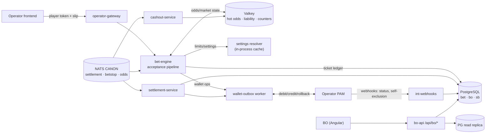
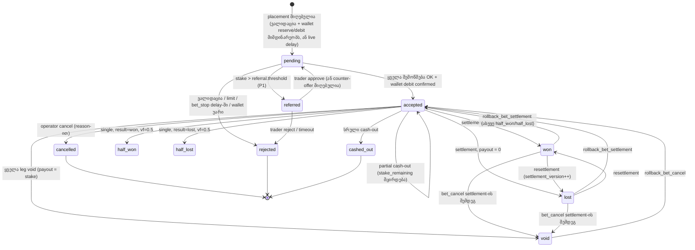
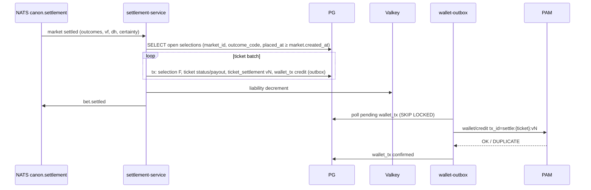

# 07 — Back office: ფსონები, ლიმიტები და რისკი, cash-out, მომხმარებლები, PAM ინტეგრაცია

> **სტატუსი:** design draft v0.1 · **თარიღი:** 2026-10-04
> **მოდულები:** BET (bet acceptance & ticket search) · LIM (limits & risk) · CASH (cash-out) · CUS (customers) · INT (PAM & integrations) + მინიმალური bet engine-ის დიზაინი, რომელზეც ეს მოდულები დგას.
> **დაკავშირებული:** [02 — UOF data model](02-uof-data-model.md) (§2.2 void/dead heat, §6.2 `sb` DDL, §7 state machine-ები) · [04 — არქიტექტურა](04-platform-architecture.md) (§9.1 bet-engine/settlement-service) · CFG/CAT (`bo.setting`, `bo.setting_def`), CMS (შეცდომის ტექსტები), ADM (RBAC, `bo.audit_log`), REP (აგრეგატები), PROMO (freebet), NOTIF (alert-ები) — სხვა დოკუმენტებში.
> **⚠** = გადასაწყვეტი/გადასამოწმებელი.

---

## სარჩევი

0. [მოკლედ — ძირითადი გადაწყვეტილებები](#0-მოკლედ--ძირითადი-გადაწყვეტილებები)
1. [სერვისები და მონაცემთა ნაკადი](#1-სერვისები-და-მონაცემთა-ნაკადი)
2. [BET — bet model და engine](#2-bet--bet-model-და-engine)
3. [BET — ticket search და ticket detail](#3-bet--ticket-search-და-ticket-detail)
4. [LIM — ლიმიტები და რისკი](#4-lim--ლიმიტები-და-რისკი)
5. [CASH — cash-out](#5-cash--cash-out)
6. [CUS — მომხმარებლები](#6-cus--მომხმარებლები)
7. [INT — PAM ინტეგრაციის კონტრაქტი](#7-int--pam-ინტეგრაციის-კონტრაქტი)
8. [კონსოლიდირებული DDL (`bet` + `bo`)](#8-კონსოლიდირებული-ddl-bet--bo)
9. [გამოყენებული CFG setting key-ები](#9-გამოყენებული-cfg-setting-key-ები)
10. [Reason code-ები (CMS-თან საერთო)](#10-reason-code-ები-cms-თან-საერთო)
11. [როლები და permission-ები](#11-როლები-და-permission-ები)
12. [P0 / P1 / P2](#12-p0--p1--p2)
13. [ღია საკითხები](#13-ღია-საკითხები)

---

## 0. მოკლედ — ძირითადი გადაწყვეტილებები

| საკითხი | გადაწყვეტილება | რატომ |
|---|---|---|
| Ticket-ის ერთეული | **1 ticket = 1 ფსონი** (single / accumulator / system) თავისი stake-ით. რამდენიმე single ერთ slip-ში = რამდენიმე ticket საერთო `placement_id`-ით | settlement, cash-out, void და ძებნა ყოველთვის ერთ ერთეულზეა; slip მხოლოდ UI-ის ცნებაა |
| ID | `uuidv7()` (PG18 ჩაშენებული) + მოკლე `public_code` (Crockford base32, 10 სიმბოლო) support-ისთვის | uuidv7-იდან დრო ამოიღება (`uuid_extract_timestamp`) ⇒ partition pruning id-ით ძებნისასაც |
| Payout ფორმულა | თითო selection-ს აქვს **factor** `F = vf + (1−vf)·(won ? odds·dh : 0)`; single = `stake·F`, accumulator = `stake·ΠF`, system = Σ ხაზებზე | 02 §2.2-ის ზოგადი ფორმულის განზოგადება; void/half/dead heat ერთი ფორმულით |
| `resettled` | **არ არის status** — ეს არის `ticket.settlement_version > 1` + ისტორია `bet.ticket_settlement`-ში | status აღწერს შედეგს (won/lost/...), resettlement კი მოვლენაა; ორივე ერთად სტატუსში ინფორმაციას კარგავს |
| Wallet მოდელი | **Seamless wallet**: ფული PAM-შია, ჩვენ ვგზავნით `debit/credit/rollback`-ს idempotency key-ით. `reserve/commit/cancel` — optional capability (live delay-სთვის რეკომენდებული) | ოპერატორებს უკვე აქვთ PAM; ბალანსის დუბლირება რეკონსილიაციის კოშმარია |
| Wallet-ის საიმედოობა | **Outbox** (`bet.wallet_tx`) + retry + `unknown` სტატუსის status-query + დღიური reconciliation | ქსელის timeout-ზე „ფული ჩამოიჭრა თუ არა?“ ერთადერთი სწორი პასუხი idempotent retry-ა |
| ლიმიტების კონფიგურაცია | ყველა scope-ლიმიტი = CFG key (`limit.*`) `bo.setting`-ში; customer ღერძი = `stake_factor` (risk group × customer) + absolute override-ები `bo.customer_limit_override`; საბოლოო = **min()** | ერთი კონფიგურაციის მექანიზმი; customer-ი ლიმიტს ვერასდროს „აამაღლებს“ override-ით — მხოლოდ factor-ით (risk group VIP = 2.0) |
| Liability | Valkey hash-ები per operator/event/market + **ერთი Lua script** check-and-reserve; PG = source of truth, rebuild/reconcile job | ატომურობა race-ის გარეშე, < 1 ms; Valkey-ის დაკარგვა აღდგენადია |
| Accumulator-ის liability | P0: **სრული potential win ეწერება თითო leg-ის outcome-ზე** (conservative) | მარტივი, უსაფრთხო; correlated exposure — P2 |
| Settlement certainty | CFG `settlement.min_certainty` (default **1**) + `settlement.confirm_payout_threshold` (ამაზე დიდ payout-ს ველოდებით `certainty=2`-ს) ⚠ | live-ში სწრაფი გადახდა, დიდ თანხაზე — უსაფრთხოება |
| Negative resettlement | delta < 0 ⇒ PAM `debit` `reason=resettlement`, `allow_negative=true` | მოგების უკან დაბრუნება ბალანსის არქონის მიუხედავად უნდა ჩაიწეროს; ვალის აღება ოპერატორის პოლიტიკაა |
| Cash-out ფასი | fair value დარჩენილი leg-ების **de-margined probability**-დან × `(1 − cashout.margin_pct)`, offer TTL + accept tolerance | გამჭვირვალე, ერთი პარამეტრით სამართავი |
| Ticket storage | `bet.ticket`/`bet.ticket_selection` — **თვიური range partition** `placed_at`-ზე; BO ძებნა — **read replica** | ძირითადი write path არ იტვირთება BO query-ებით |

---

## 1. სერვისები და მონაცემთა ნაკადი



- `bet-engine`, `settlement-service`, `cashout-service`, `wallet-outbox` — Phase 2-ის ლოგიკური სერვისები (04 §2.1, §9.1). Pilot-ზე შეიძლება ერთ deployable-ში (`betting-core`) ეშვებოდეს, `uof-adapter`-ისგან ცალკე.
- BO ქმედებები (void, resettle, cancel, cash-out toggle) **bo-api-დან არ ეხება wallet-ს პირდაპირ** — bo-api იძახებს bet-engine/settlement-service-ის შიდა command API-ს (`/internal/bet/...`), რომ ერთი კოდის გზა იყოს.
- ყველა BO write → `bo.audit_log` (ADM) + ticket-ზე ქმედებები დამატებით `bet.ticket_event`-ში.

---

## 2. BET — bet model და engine

### 2.1 ცნებები

| ცნება | აღწერა |
|---|---|
| **placement** | ერთი მოთხოვნა frontend-იდან (`placement_id`, idempotency key = `operator_id + operator_request_id`) |
| **ticket** | ერთი ფსონი: `bet_type` ∈ `single`, `accumulator`, `system`; `stake_total`, ვალუტა, odds-change policy, status |
| **selection** | ticket-ის leg: `event_id`, `market_id`, `outcome_code`, `odds_requested`, `odds_accepted`, შედეგი/factor |
| **system** | `system_k` / n (მაგ. 2/3 = 3 ხაზი, 3/4 = 4 ხაზი); `stake_per_line = stake_total / C(n,k)`; ხაზები **არ ინახება** — გამოითვლება. Banker-ები — P1 |
| **line** | system-ის ერთი კომბინაცია (მხოლოდ გამოთვლით) |

**წესები:** ერთ accumulator-ში ერთი event-ის ორი selection აკრძალულია default-ად (CFG `bet.same_event_combinable=false`); market type-ის დონეზე `bet.combinable=false` (მაგ. outrights-ის გარკვეული ბაზრები) ⇒ მხოლოდ single. Bet builder (same-game multi) — P2, ცალკე pricing-ს ითხოვს.

### 2.2 Ticket status state machine



- `accepted` = „open“: ticket ცოცხალია, ელოდება შედეგს. ნაწილობრივ დასრულებული accumulator (ზოგი leg უკვე lost) — ticket-ი **მაშინვე** `lost` ხდება (early settlement of losers); ზოგი leg won/void — ticket რჩება `accepted`.
- `cashed_out` და `cancelled` — **ტერმინალურია** feed-ისთვის: შემდგომი settlement/rollback მხოლოდ `ticket_event`-ში ილოგება, ფული არ მოძრაობს (cash-out კონტრაქტია). გამონაკლისი: `bet_cancel` (void) cash-out-ის შემდეგ — **არ ვაბრუნებთ** cash-out-ს (CFG `cashout.void_after_cashout_policy = keep`) ⚠ ზოგი რეგულატორი სხვა წესს ითხოვს.
- `settlement_version` იზრდება ყოველ settle/rollback/resettle-ზე; UI-ში „resettled“ badge = `settlement_version > 1`.

**Selection status:** `open → won | lost | void | half_won | half_lost` (+ `dead_heat_factor` ცალკე ველში), rollback-ზე → `open`. Selection-ის `F` ინახება (`settle_factor numeric(14,6)`), რომ ticket-ის payout ყოველთვის გადაამოწმებადი იყოს.

### 2.3 Acceptance pipeline (მკაცრი რიგით)

იაფი შემოწმებები ჯერ, ძვირი (Valkey script, PAM) — ბოლოს. ყოველი უარი აბრუნებს **reason code**-ს (§10), რომლის ტექსტიც CMS-შია (lang-ის მიხედვით).

| # | ნაბიჯი | წყარო | უარის reason code |
|---|---|---|---|
| 0 | Idempotency: `(operator_id, operator_request_id)` უკვე არსებობს ⇒ ვაბრუნებთ არსებულ შედეგს | PG unique | — |
| 1 | Player session/token ვალიდურია, player status `active`, არ არის self-excluded | session cache ← PAM `validate` (§7) | `PLAYER_SESSION_INVALID`, `PLAYER_BLOCKED`, `PLAYER_SELF_EXCLUDED` |
| 2 | Slip-ის სტრუქტურა: selection-ების რაოდენობა ≤ `limit.max_selections`, system k/n ვალიდური, combinability, ერთი event-ის კონფლიქტი | CFG | `SLIP_INVALID`, `MAX_SELECTIONS_EXCEEDED`, `SELECTIONS_NOT_COMBINABLE` |
| 3 | Customer restrictions: `block_betting`, `block_live`, `block_market_type`, `block_sport`, `single_only` | `bo.customer_restriction` (cache) | `CUSTOMER_BETTING_BLOCKED`, `CUSTOMER_LIVE_BLOCKED`, `CUSTOMER_MARKET_BLOCKED` |
| 4 | თითო selection: producer UP, event `not_started`/`live`, market `active` (feed + `bo.market_override` → effective), outcome active + odds ≠ NULL, event/market BO-ში არ არის დამალული/შეჩერებული | Valkey hot state (02 §7.1 პირობა + BO override-ები) | `EVENT_NOT_OPEN`, `MARKET_SUSPENDED`, `OUTCOME_INACTIVE`, `PRODUCER_DOWN` |
| 5 | Odds tolerance: მიმდინარე odds vs `odds_requested` ticket-ის policy-ით (§2.4) | Valkey | `ODDS_CHANGED` (+ ახალი odds response-ში) |
| 6 | Stake: `limit.min_stake` ≤ stake ≤ effective `limit.max_stake`; total odds ≤ `limit.max_total_odds`; თითო leg ≤ `limit.max_odds`; potential payout ≤ `limit.max_payout`, win ≤ `limit.max_win` | resolved limits (§4) | `STAKE_TOO_LOW`, `STAKE_TOO_HIGH` (+ `max_allowed_stake`), `ODDS_TOO_HIGH`, `PAYOUT_TOO_HIGH` |
| 7 | Referral (P1): stake/payout > `referral.threshold_*` ⇒ `referred`, რიგში trader-თან | CFG | (არა უარი) `BET_REFERRED` |
| 8 | Wallet reserve (თუ PAM-ს აქვს capability) — **live delay-მდე**, რომ delay-ის დროს ორმაგი დახარჯვა არ მოხდეს | PAM | `INSUFFICIENT_FUNDS`, `WALLET_UNAVAILABLE` |
| 9 | Live bet delay: `max(betdelay.live_seconds)` ყველა live leg-ზე (scope resolve + customer `bet_delay_override`); ამ ხნის მერე **ხელახლა** ნაბიჯები 4–5. delay-ის დროს bet_stop ⇒ reject | CFG, NATS `canon.betstop` | `BET_STOP_DURING_DELAY`, `ODDS_CHANGED` |
| 10 | Liability + cumulative counters: Lua script atomic check-and-increment (§4.4) | Valkey | `LIABILITY_EXCEEDED` (+ `max_allowed_stake`), `CUSTOMER_EVENT_LIMIT_EXCEEDED` |
| 11 | Wallet commit/debit (`debit` ან `commit` reserve-ის) | PAM via outbox, sync wait ≤ `wallet.sync_timeout_ms` | `INSUFFICIENT_FUNDS`, `WALLET_UNAVAILABLE` |
| 12 | Ticket → `accepted` (PG tx), publish `bet.accepted` | PG, NATS | — |

**კომპენსაცია:** ნაბიჯი 11-ის ან 12-ის ჩავარდნისას — liability counters-ის decrement (იგივე Lua, უარყოფითი delta) + PAM `rollback`/`cancel` outbox-ით. ticket ყოველთვის იწერება PG-ში (`rejected`-იც, reason-ით) — „რატომ არ მიიღო ჩემი ფსონი?“ support-ის კითხვა ასე პასუხდება.

**Max allowed stake:** ნაბიჯი 6/10-ზე უარისას ვაბრუნებთ `max_allowed_stake`-ს, frontend სთავაზობს „დადე X“ — industry standard და კონვერსიას ზრდის.

**Pre-match delay:** `betdelay.prematch_seconds` (default 0); ნაბიჯი 9-ის იგივე ლოგიკა.

### 2.4 Odds-change acceptance policy

Ticket-ზე ინახება `odds_policy` (frontend აგზავნის player-ის არჩევანს; default = CFG `bet.odds_policy_default`):

| policy | ქცევა |
|---|---|
| `none` | ნებისმიერი ცვლილება ⇒ `ODDS_CHANGED` (tolerance `bet.odds_tolerance_pct`-ის ფარგლებში — accept) |
| `higher` (**default**) | ახალი odds ≥ requested ⇒ accept ახალი odds-ით; დაბალი ⇒ reject |
| `any` | ნებისმიერი ⇒ accept მიმდინარე odds-ით, მაგრამ არა უფრო დაბლა ვიდრე `requested × (1 − bet.odds_any_max_drop_pct)` |

- `odds_accepted` ყოველთვის = ის odds, რომლითაც ფსონი რეალურად მიიღო engine-მა (ნაბიჯი 9-ის შემდეგ). payout/liability მხოლოდ მასზე ითვლება.
- ⚠ BO margin transformation (ODDS მოდული): `odds_requested`/`odds_accepted` = **ოპერატორის** (margin-იანი) odds, არა feed-ის raw. raw feed odds დამატებით ინახება `odds_feed`-ში ანალიტიკისთვის.

### 2.5 Settlement feed-იდან

`settlement-service` მოიხმარს `canon.settlement.*` (settlement, rollback, bet_cancel, rollback_bet_cancel; 02 §7.3).

**selection-ების პოვნა:** `ticket_selection (market_id, outcome_code)` index + partition pruning `placed_at >= market.created_at` (market-ის შექმნამდე ფსონი ვერ დაიდებოდა). bet_cancel ფანჯრით — დამატებით `placed_at BETWEEN start_time AND end_time`.

**ალგორითმი (თითო market-ის settlement-ზე, ერთ PG ტრანზაქციაში per ticket batch):**

1. თითო ღია selection-ზე: `result`, `void_factor`, `dead_heat_factor` ⇒ `F = vf + (1−vf)·(won ? odds_accepted·dh : 0)`; selection status.
2. ticket-ის შეფასება: ყველა leg resolved? (ან single) ⇒ payout:
   - single: `payout = stake · F`
   - accumulator: `payout = stake · Π F_i` (ერთი `F=0` ⇒ ticket `lost` მაშინვე, დანარჩენი leg-ების მოლოდინის გარეშე)
   - system k/n: `payout = Σ_{lines} stake_per_line · Π_{i∈line} F_i`; ticket სრულდება, როცა ყველა leg resolved-ია (ან ყველა ხაზი უკვე დადგენილია)
3. `payout` მრგვალდება `numeric(18,2)`-ზე **ქვემოთ** (floor) ⚠ ოპერატორის წესი შეიძლება განსხვავდებოდეს; max payout cap (`limit.max_payout`) ვრცელდება settlement-ზეც (ოპერატორის T&C).
4. `bet.ticket_settlement` INSERT (version N, payout, source=`feed`, `sb.settlement.id`-ების სია); ticket.status/payout update; `bet.wallet_tx` (`credit`, key=`settle:{ticket_id}:v{N}`) — **იმავე ტრანზაქციაში** (outbox).
5. publish `bet.settled` → operator-gateway webhook + REP.

**certainty:** `certainty < settlement.min_certainty` ⇒ selection იწერება `pending_confirmation` flag-ით, ფული არ მოძრაობს. თუ payout > `settlement.confirm_payout_threshold` ⇒ ველოდებით `certainty=2`-ს. certainty 1→2 იგივე შედეგით — no-op (02 §7.3 G).

**Rollback (`rollback_bet_settlement`):** ticket-ები ამ market-ზე ⇒ selection → `open`; ticket → `accepted`; `ticket_settlement` version N+1 (`payout=0`, `kind=rollback`); wallet: `debit` წინა payout-ის ოდენობით (`reason=settlement_rollback`, `allow_negative=true`), key=`settle:{ticket_id}:v{N+1}`. ⚠ ალტერნატივა — PAM `rollback` წინა credit tx-ზე; რეკომენდაცია: **ახალი debit**, რადგან ორიგინალი credit შეიძლება ძალიან ძველი იყოს და PAM-ები ძველ tx-ზე rollback-ს ხშირად არ უშვებენ.

**Resettlement (ახალი settlement განსხვავებული შედეგით):** `delta = new_payout − old_payout`; `delta>0` ⇒ credit, `delta<0` ⇒ debit (`allow_negative=true`), `delta=0` ⇒ მხოლოდ ისტორია. ერთი wallet tx per resettlement (არა „reverse + pay“ ორი ოპერაცია) — player-ის ისტორიაში ნაკლები ხმაური.

**bet_cancel:** შესაბამისი selection-ები ⇒ `void` (F=1) ⇒ ჩვეულებრივი ticket re-evaluation (single → void, payout=stake; accumulator → leg ამოვარდება). უკვე settled ticket-ზე ⇒ resettlement (delta). `rollback_bet_cancel` ⇒ selection → `open` (ან ძველი settlement-ის აღდგენა, თუ `sb.outcome.result` არსებობს) + delta.

**Auto-settlement off:** CFG `settlement.auto_enabled=false` (scope: sport/tournament/event) ⇒ settlement-service აკეთებს **preview**-ს და ათავსებს „settlement approval queue“-ში (trader ადასტურებს) — P1, მაგრამ DDL P0-ში მზადაა.

### 2.6 ხელით settlement / resettlement / cancel (trader)

| ქმედება | სფერო | შედეგი | permission |
|---|---|---|---|
| **Manual market settle** | market (ხელით შექმნილი `provider='manual'` market-ები, ან feed-მა რომ არ დაასეტლა) | BO `sb`-ში არ წერს: იწერება `bo.manual_settlement(market_id, outcome_code, result, vf, dh, reason)` და settlement-service მას feed-ის ტოლფასად ამუშავებს | `bet.settle.manual` |
| **Manual resettle market** | market | იგივე, ახალი ვერსია; ვრცელდება ყველა ticket-ზე | `bet.settle.manual` + 4-eyes თუ ticket-ების Σdelta > `bet.manual_settle_4eyes_amount` |
| **Ticket void** | ერთი ticket | payout=stake (refund), status `void`, reason სავალდებულო | `bet.ticket.void` |
| **Ticket cancel** | accepted ticket, დაუსეტლავი | stake refund, status `cancelled`; განსხვავება void-თან: cancel = ოპერატორის გადაწყვეტილება (palpable error, fraud), void = შედეგი | `bet.ticket.cancel` |
| **Ticket resettle** | settled ticket | trader ირჩევს selection-ის შედეგს/factor-ს; delta wallet-ში | `bet.ticket.resettle` |
| **Selection void** | accumulator-ის ერთი leg | leg F=1, ticket re-evaluate | `bet.ticket.resettle` |

- ხელით ქმედების მერე feed-ის settlement ამ market-ზე **არ გადაწერს** მას, თუ `bo.manual_settlement.lock_feed=true` (default true) — სხვაგვარად feed და trader „ეჩხუბებიან“. Feed-ის განსხვავებული შედეგი ⇒ NOTIF alert `settlement.feed_conflict`.
- Reason: dropdown `bo.reason_code` (cancel/void reason-ების კატალოგი, CMS-თან საერთო) + free text. ყველა → `bet.ticket_event` + `bo.audit_log`.
- Bulk: market-ის ყველა ticket-ის cancel (palpable error) — ერთი job, progress UI-ში, idempotent.

### 2.7 Referral / trader approval queue (P1)

- Trigger: stake > `referral.threshold_stake` ან potential win > `referral.threshold_win`, ან customer flag `refer_all_bets`.
- Ticket → `referred`, reserve გაკეთებულია (თუ PAM უჭერს მხარს), player ხედავს „ფსონი განხილვაზეა“ (TTL `referral.timeout_seconds`, default 30 s live / 120 s prematch).
- Trader ეკრანი: რიგი (real-time, SSE), ticket, customer KPI-ები, მიმდინარე liability; ქმედებები: **Accept**, **Reject**, **Counter-offer** (ნაკლები stake ან დაბალი odds — player-მა უნდა დაადასტუროს frontend-ში).
- Timeout ⇒ auto-reject (`REFERRAL_TIMEOUT`).

### 2.8 BET API (engine-ის მხარე, operator-gateway-ის მეშვეობით)

```
POST /v1/bets                     placement (Idempotency-Key header = operator_request_id)
GET  /v1/bets/{ticket_id}         status (polling live delay-ის დროს) + WebSocket push `bet.status`
GET  /v1/players/{id}/bets        player history (open/settled), cursor pagination
POST /v1/bets/{ticket_id}/cashout/quote | /cashout   (§5)
```

Request: `operator_request_id`, `player_token`, `currency`, `channel`, `odds_policy`, `bets[] {bet_type, system_k?, stake, selections[] {event_id, market_id, outcome_code, odds}}`.

---

## 3. BET — ticket search და ticket detail

### 3.1 Ticket search (Angular: `/bets/tickets`)

**ფილტრები** (ყველა URL query-ში, შენახვადი „saved views“):
- ID: `ticket_id` / `public_code` / `operator_request_id` (ზუსტი — დანარჩენ ფილტრებს უგულებელყოფს)
- customer (external id, username — `bo.customer`-დან autocomplete), risk group, customer flag
- event (autocomplete), sport/category/tournament, market type, market
- status (multi), bet type, channel (web/mobile/retail/api), live/prematch
- თარიღი: placed / settled (default: ბოლო 24 სთ — **სავალდებულო** დროის ფანჯარა ≤ 92 დღე, თუ ID ფილტრი არ არის)
- stake range, potential payout range, total odds range, payout range
- flags: resettled, manual action, cashed out, suspicious, referred
- ვალუტა; ჩვენება ორიგინალ ვალუტაში + ოპერატორის base ვალუტაში

**ცხრილი:** public_code, placed_at, customer, type (`ACC 4`, `SYS 2/3`), selections preview, stake, odds, potential payout, status chip, payout, channel, flags. Export CSV (async job, ≤ 1M row, REP-ის export მექანიზმი).

### 3.2 Ticket detail (`/bets/tickets/{id}`)

| ჩანართი | შინაარსი |
|---|---|
| **Summary** | status, type, stake/remaining stake, odds (requested/accepted), potential payout, payout, ვალუტა, channel, IP/device (PAM-ის context-იდან), placed/accepted/settled დრო, live delay-ის ხანგრძლივობა, odds policy, customer ბმული + risk group |
| **Selections** | თითო leg: event (ბმული CAT event-ზე), market name (rendered), outcome, odds requested/accepted/feed, live score/match time placement-ისას, selection status, F factor, void/dead heat factor, settlement certainty, `sb.settlement` ბმული (Feed Ops message inspector) |
| **Settlement history** | `bet.ticket_settlement` ვერსიები: version, kind (settle/rollback/resettle/manual/cancel), payout, delta, source (feed message id / BO user), დრო |
| **Transactions** | `bet.wallet_tx`: type, amount, idempotency key, PAM tx id, status, attempts, last error |
| **Cash-out** | offers (ბოლო N, Valkey-დან თუ ცოცხალია) + accepted cash-outs |
| **Audit** | `bet.ticket_event` + `bo.audit_log` (ვინ, რა, reason) |

**ქმედებები** (ღილაკები ჩანს permission-ის მიხედვით; ყველა ითხოვს reason-ს, confirm dialog-ში ჩანს wallet-ის ეფექტი „+12.50 GEL player-ს“):
Void · Cancel · Resettle · Void selection · Mark suspicious (flag + note, ავტომატურად ქმნის CUS note-ს) · Force retry wallet tx (`unknown`/`failed` tx-ზე) · Copy public link (support-ისთვის).

### 3.3 Performance

- **Partitioning:** `bet.ticket`, `bet.ticket_selection` — `PARTITION BY RANGE (placed_at)`, თვიური; `pg_partman` ან საკუთარი job ქმნის 3 თვით წინ. ძველი partition-ები (> 24 თვე ⚠ retention, Georgian RS მოთხოვნა შეიძლება 5+ წელი იყოს) → detach + archive (Parquet object storage-ში).
- **ID → partition:** `WHERE id = $1 AND placed_at BETWEEN uuid_extract_timestamp($1) - interval '1 min' AND uuid_extract_timestamp($1) + interval '1 min'`.
- **Index-ები** (თითო partition-ზე): `(operator_id, placed_at DESC)`, `(operator_id, customer_id, placed_at DESC)`, `(operator_id, status, placed_at DESC) WHERE status IN ('pending','referred','accepted')`, `public_code` (unique, operator-ის ფარგლებში — global lookup ცალკე პატარა ცხრილით `bet.ticket_code`), selection: `(market_id, outcome_code)`, `(event_id)`.
- Stake/odds range ფილტრი მარტო არ გაიშვება — ყოველთვის დროის ფანჯარასთან ერთად (ზემოთ).
- **Read replica** ყველა BO search/detail-ისთვის (replication lag badge UI-ში, თუ > 5 s); ქმედებების შემდეგ detail იტვირთება primary-დან.
- P2: ticket search → ClickHouse/OpenSearch, როცა ოპერატორი > ~5M ticket/თვე.

### 3.4 BO API (BET)

```
GET  /api/bo/bets/tickets?…filters…&cursor=      search (read replica)
GET  /api/bo/bets/tickets/{id}                   detail (+ ?include=selections,settlements,tx,audit)
POST /api/bo/bets/tickets/{id}/void              {reason_code, note}
POST /api/bo/bets/tickets/{id}/cancel            {reason_code, note}
POST /api/bo/bets/tickets/{id}/resettle          {selections:[{selection_id, result, void_factor, dead_heat_factor}], reason_code, note}
POST /api/bo/bets/tickets/{id}/flags             {flag:'suspicious', note}
POST /api/bo/bets/wallet-tx/{id}/retry
POST /api/bo/bets/markets/{market_id}/manual-settlement   {outcomes:[…], lock_feed, reason_code}
POST /api/bo/bets/markets/{market_id}/cancel-tickets      {reason_code, placed_from?, placed_to?}  (async job)
GET  /api/bo/bets/referrals  (SSE: /api/bo/bets/referrals/stream)   P1
POST /api/bo/bets/referrals/{ticket_id}/decision          {action: accept|reject|counter, stake?, odds?}
GET  /api/bo/bets/settlement-queue  · POST …/{id}/approve            P1
```

---

## 4. LIM — ლიმიტები და რისკი

### 4.1 ლიმიტების ტიპები (ყველა = CFG key, `bo.setting`-ში scope-ის მიხედვით)

| key | აზრი | default (platform) | შეფასება |
|---|---|---|---|
| `limit.min_stake` | მინ. stake ticket-ზე | 0.10 | stake |
| `limit.max_stake` | მაქს. stake ticket-ზე (multi-ზე — ყველაზე მკაცრი leg-ის scope) | 1 000 | stake |
| `limit.max_win` | მაქს. წმინდა მოგება (`payout − stake`) | 50 000 | potential |
| `limit.max_payout` | მაქს. payout ticket-ზე (T&C cap) | 100 000 | potential + settlement cap |
| `limit.max_odds` | მაქს. odds ერთ leg-ზე | 1 000 | per selection |
| `limit.max_total_odds` | მაქს. ჯამური odds | 10 000 | ticket |
| `limit.max_selections` | მაქს. leg-ები | 20 | ticket |
| `limit.max_liability_outcome` | მაქს. ოპერატორის ზარალი ერთ outcome-ზე | 20 000 | Valkey |
| `limit.max_liability_market` | მაქს. ზარალი market-ზე | 30 000 | Valkey |
| `limit.max_liability_event` | მაქს. ზარალი event-ზე | 100 000 | Valkey |
| `limit.max_stake_customer_market` | ერთი customer-ის cumulative stake ერთ market-ზე | 2 000 | Valkey counter |
| `limit.max_stake_customer_event` | ერთი customer-ის cumulative stake event-ზე | 5 000 | Valkey counter |

თანხები — ოპერატორის **base currency**-ში (`bo.operator.base_currency`); placement-ზე stake გადაყავს FX-ით (`bo.fx_rate`, დღიური, INT/CFG ⚠ ვინ ფლობს). ვალუტის-სპეციფიკური ლიმიტი — P2.

### 4.2 Resolution: scope × customer

1. **Scope ღერძი** (CFG resolver, „most specific wins“): `platform → operator → sport → category → tournament → event → market_type → market (→ outcome)`. resolver აბრუნებს თითო key-ის effective მნიშვნელობას selection-ზე.
2. **Multi:** ticket-ის `limit.max_stake` = `min` ყველა leg-ის effective მნიშვნელობიდან (იგივე `max_win`, `max_payout`). liability — თითო leg-ის თავის scope-ზე.
3. **Customer ღერძი:**
   - `effective_factor = risk_group.stake_factor × customer.stake_factor` (მაგ. `sharp` 0.2 × 1.0; `vip` 2.0). ვრცელდება `max_stake`, `max_win`, `max_stake_customer_*`-ზე (**არა** operator liability-ზე — ის ოპერატორის რისკია, არა customer-ის).
   - live-ზე ცალკე factor: `stake_factor_live` (sharp-ები ხშირად მხოლოდ live-ში არიან საშიში).
   - `bo.customer_limit_override` — absolute cap, scope-ით (მაგ. „ამ customer-ს football live max_stake = 5 GEL“). საბოლოო = `min(scope_value × factor, override)`.
4. **Formula:** `max_stake_final = min(scope.max_stake × factor, override.max_stake ?? ∞, liability_headroom / (odds−1))`. ბოლო წევრი იძლევა `max_allowed_stake`-ს reject-ის პასუხში.

**Cache:** resolved settings in-process (`settings resolver`) — key = `(operator, market_id)`, invalidation NATS `bo.setting.changed` (CFG publish-ს აკეთებს). customer profile/restrictions — Valkey `cus:{op}:{customer_id}` (TTL 5 წთ + invalidation `bo.customer.changed`).

### 4.3 Liability მოდელი

- **Single, outcome o:** `L_o = Σ potential_payout(o) − Σ stake(market)`. ე.ი. ზარალი, თუ o მოიგებს (ყველა სხვა outcome-ზე stake შემოსავალია).
  - market liability = `max_o L_o` (worst case); event liability = Σ market liabilities (conservative, P0) ⚠ P2: scenario-based (correct score matrix).
- **Accumulator/system (P0, conservative):** ticket-ის `potential_win = payout − stake` **სრულად** ემატება თითო leg-ის outcome-ის `L_o`-ს (stake არ ემატება market-ის stake pool-ს). ეს ზედმეტად აფასებს რისკს, მაგრამ არასდროს ნაკლებად.
- Settled/void leg-ები: settlement-service ამცირებს counters-ს; ticket-ის lost ⇒ ყველა leg-იდან decrement.
- Cash-out ⇒ decrement (რისკი გაქრა) — partial-ზე პროპორციულად.

### 4.4 Valkey სტრუქტურა და ატომურობა

```
liab:{op}:{event_id}            HASH  field "m:{market_id}:o:{code}" → L_o (cents, integer)
                                       field "m:{market_id}:stake"  → Σ stake market-ზე
                                       field "m:{market_id}:max"    → max_o L_o (cached)
                                       field "ev"                   → event liability
cstk:{op}:{customer_id}:{event_id}  HASH field "ev" / "m:{market_id}" → cumulative stake (cents)
```

- ერთი event-ის ყველა key ერთ hash-შია ⇒ Valkey Cluster-ში ერთი slot (`{op}:{event_id}` hash tag). multi, რომელიც რამდენიმე event-ზეა — script იძახება **თითო event-ზე რიგრიგობით** two-phase: (1) `check_and_reserve` თითო event-ზე; (2) რომელიმე fail ⇒ `release` უკვე reserved-ზე. მცირე race (ორი multi ერთდროულად) მისაღებია — მაქს. გადაცდენა = ერთი ticket.
- Lua `check_and_reserve(deltas[], limits[])`: ითვლის ახალ `L_o`, `max`, `ev`; თუ რომელიმე > limit ⇒ აბრუნებს `{reject, headroom}` ცვლილების გარეშე; სხვაგვარად `HINCRBY` ყველა და `{ok}`.
- მთელი რიცხვები (cents) — float-ის გარეშე.
- **Source of truth = PG.** `liability-rebuild` job: event-ის open ticket-ებიდან ხელახლა აგება (Valkey restart-ზე, ან ყოველ 10 წთ-ში diff-ით; diff > 1% ⇒ alert). Valkey-ის მიუწვდომლობა ⇒ bet-engine **fail closed** (live) / prematch-ზე CFG `liability.fail_open_prematch` (default false).

### 4.5 Liability monitoring ეკრანი (`/risk/liability`)

- **Event list:** live + upcoming 48 სთ; სვეტები: event, start, status, turnover, #tickets, worst-case liability, utilization % (`liability / limit`), top market; sort utilization-ით; ფერები `liability.alert_pct` (default 80%).
- **Event drill-down:** market-ების ცხრილი → outcome-ები: stake, potential payout, `L_o`, odds (ახლა), ფსონების რაოდენობა, utilization bar; ქმედებები: **suspend market** (ODDS/CAT override, permission `odds.market.suspend`), **ლიმიტის შეცვლა ამ scope-ზე** (CFG inline editor `limit.max_liability_market` market scope-ზე), **odds-ის shading** (ODDS მოდული).
- **Top risky bets:** ბოლო N საათის ticket-ები potential win-ით, sharp/flagged customer-ების ფსონები, ერთი outcome-ზე concentrated customer-ები.
- Real-time: SSE `/api/bo/risk/liability/stream?event_id=` (Valkey-დან 2 s აგრეგაცია).

### 4.6 Alert-ები (NOTIF-ში გადაეცემა)

| alert | trigger |
|---|---|
| `risk.liability_threshold` | utilization ≥ `liability.alert_pct` (outcome/market/event) |
| `risk.big_bet` | stake ≥ `alert.big_bet_stake` ან potential win ≥ `alert.big_win` |
| `risk.flagged_customer_bet` | customer flag `sharp`/`arbitrage`/`watch` დადო ფსონი |
| `risk.steam` | ≥ N ფსონი ერთ outcome-ზე M წუთში სხვადასხვა customer-ისგან (P1) |
| `risk.liability_drift` | rebuild diff > 1% |
| `settlement.feed_conflict` | manual settlement vs feed |
| `wallet.tx_unknown` | outbox tx `unknown` > 5 წთ |

### 4.7 LIM API

```
GET  /api/bo/risk/liability/events?from&to&sport_id&live
GET  /api/bo/risk/liability/events/{event_id}           markets+outcomes
GET  /api/bo/risk/liability/stream (SSE)
GET  /api/bo/risk/top-bets?window=6h&min_win=
GET  /api/bo/limits/effective?market_id=&customer_id=  „რატომ არის max stake 37.40?“ — resolution trace (scope→value, factor, override)
POST /api/bo/risk/liability/rebuild?event_id=           (risk_manager)
```

ლიმიტების **ჩაწერა** ხდება CFG-ის API-ით (`/api/bo/settings/...`) — LIM-ს საკუთარი limit-CRUD არ აქვს. LIM-ის „Limits“ ეკრანი = CFG editor, გაფილტრული `limit.*` key-ებზე, scope tree-ით.

**`/limits/effective` resolution trace** — ყველაზე სასარგებლო support/trader ინსტრუმენტი, P0.

---

## 5. CASH — cash-out

### 5.1 Pricing

დარჩენილი (open) leg-ებისთვის `p_i` = **de-margined probability**:
- თუ feed-ს აქვს `outcome.probability` (UOF `probabilities`) — ის ვიყენოთ;
- სხვაგვარად `p_i = (1/odds_i) / Σ_{o∈market} (1/odds_o)` (proportional overround removal).

```
fair_value = stake_remaining × Π_{settled legs} F_j × Π_{open legs} (odds_accepted_i × p_i)
offer      = fair_value × (1 − cashout.margin_pct)            -- default 5% ⚠
offer      = min(offer, potential_payout − ε);  offer < cashout.min_value ⇒ unavailable
```

- single: `offer = stake × odds_accepted × p × (1 − m)`.
- system: ხაზების ჯამი იგივე ფორმულით.
- ⚠ UOF-ის ცალკე `cashout` probabilities პროდუქტი (02 §2) Phase 1-ში ignore-დება; თუ ოპერატორს აქვს — P2-ში შესაძლებელია მისი გამოყენება ზუსტი live ფასისთვის.

**Partial cash-out** (`cashout.partial_enabled`): player ირჩევს `fraction` (ან თანხას); `cashed_stake = stake_remaining × fraction`; ticket რჩება `accepted`, `stake_remaining` მცირდება, potential payout პროპორციულად. მინ. დარჩენილი stake = `limit.min_stake`.

**Auto cash-out (P2):** player აყენებს target-ს; cashout-service ყოველ odds update-ზე ამოწმებს და ასრულებს (rule `bet.cashout_rule`).

### 5.2 ხელმისაწვდომობის წესები

Cash-out ხელმისაწვდომია, თუ **ყველა** სრულდება:
1. `cashout.enabled = true` effective scope-ზე **თითო open leg-ისთვის** (sport/category/tournament/event/market_type/market — CFG). Multi-ზე: ერთი leg off ⇒ მთელი ticket off.
2. customer: `block_cashout` restriction არ აქვს; risk group-ის `cashout.enabled` (customer axis CFG-ში: `bo.customer_profile.cashout_disabled` ან risk group flag).
3. ticket: `accepted`, არ არის freebet (CFG `cashout.allow_freebet=false`), არ არის referred/suspicious flag-ით.
4. ყველა open leg-ის market `active`, outcome active, odds ≠ NULL, producer UP; feed `cashout_status` (თუ მოდის) = AVAILABLE (−1/−2 ⇒ off).
5. **bet_stop** ⇒ მყისიერი off ამ event-ის ყველა ticket-ზე (cashout-service იწერს Valkey `co_off:{event_id}`).
6. offer ≥ `cashout.min_value`.

### 5.3 Quote → accept ნაკადი

- `POST /cashout/quote` ⇒ `{offer_id, amount, expires_at}`; offer ინახება Valkey-ში (`co:{offer_id}`, TTL `cashout.offer_ttl_ms`, default 5000).
- `POST /cashout {offer_id, amount, accept_lower: bool}` ⇒ live-ზე `cashout.live_delay_seconds` (default 3 s, betdelay-ის ანალოგი), შემდეგ **ხელახლა** pricing; ახალი ≥ offer × (1 − `cashout.tolerance_pct`) ⇒ accept ახალი თანხით (არასდროს — offer-ზე მეტით player-ის სასარგებლოდ? ⚠ ჩვენი რეკომენდაცია: ახალი თანხით, ორივე მიმართულებით tolerance-ის ფარგლებში); სხვაგვარად `CASHOUT_PRICE_CHANGED` + ახალი offer.
- Accept ⇒ PG tx: `bet.cashout` INSERT, ticket status/stake_remaining, `ticket_settlement` (kind=`cashout`), `wallet_tx credit` (key `cashout:{cashout_id}`), liability decrement.
- **ერთდროულობა:** ticket row `SELECT … FOR UPDATE` cash-out-სა და settlement-ს შორის; ვინც პირველია, ის იგებს. settlement-მა თუ ჯერ გაიარა ⇒ `CASHOUT_TICKET_SETTLED`.

### 5.4 Cash-out control page (`/cashout`)

| ზონა | შინაარსი / ქმედებები |
|---|---|
| **Scope tree** | sport → category → tournament → event → market type; თითო node-ზე toggle `cashout.enabled` (inherited/overridden ჩვენება, „reset to inherit“), `cashout.margin_pct` inline. იგივე CFG editor კომპონენტი, cash-out key-ებზე გაფილტრული |
| **Market type matrix** | სპორტი × market type ცხრილი checkbox-ებით (ხშირი შემთხვევა: „cash-out მხოლოდ 1X2, O/U, AH-ზე“) |
| **Live event panel** | live event-ები, მიმდინარე cash-out სტატუსი (on/off/suspended by bet_stop), **Kill switch** event-ზე / მთელ ოპერატორზე (`cashout.enabled=false` operator scope-ზე, ერთი click + reason) |
| **Risk groups** | რომელ risk group-ს აქვს cash-out (sharp-ებს ხშირად off) |
| **Stats** | დღის cash-out-ების რაოდენობა/თანხა, cash-out margin-იდან შემოსავალი, acceptance rate (quote→accept) |

### 5.5 CASH API

```
POST /v1/bets/{ticket_id}/cashout/quote          {fraction?}
POST /v1/bets/{ticket_id}/cashout                {offer_id, amount, fraction?}
GET  /v1/players/{id}/cashout-offers?ticket_ids= (batch, frontend „My bets“ ეკრანისთვის; push WS `cashout.offer`)
GET  /api/bo/cashout/overview?date=
POST /api/bo/cashout/kill-switch                 {scope_type, scope_id, enabled, reason}  → CFG write
GET  /api/bo/cashout/tickets/{id}/offers         offer history (debug)
```

---

## 6. CUS — მომხმარებლები

### 6.1 PAM vs ჩვენი

| მონაცემი | ფლობს | ჩვენთან |
|---|---|---|
| პირადი მონაცემები (სახელი, დაბადების თარიღი, მისამართი, ტელ., email), KYC, payments | **PAM** | **არ ვინახავთ** (GDPR/data minimisation). BO detail გვერდზე ⇒ on-demand `GET /players/{id}` PAM-იდან (optional capability), არ ილოგება |
| external player id, username/display name, ვალუტა, ქვეყანა, ენა, registration date, status, self-exclusion, age-verified flag | PAM | **mirror** `bo.customer` (webhook + session validate-ის დროს upsert) |
| ბალანსი | PAM | არ ვინახავთ; detail-ზე live `GET balance` |
| risk group, stake factor, restrictions, limit overrides, tags, flags, notes, bet delay override | **ჩვენ** (sportsbook profile) | `bo.customer_profile`, `bo.customer_restriction`, `bo.customer_limit_override`, `bo.customer_note` |
| ფსონების KPI-ები | ჩვენ | `bet.customer_stats_daily` (REP-ის aggregation job) + live counters |

### 6.2 Risk group-ები

`bo.risk_group` per operator: `code`, `name`, `stake_factor`, `stake_factor_live`, `bet_delay_extra_seconds`, `cashout_enabled`, `refer_all_bets`, `color`. Seed: `new` (1.0), `standard` (1.0), `vip` (2.0), `watch` (1.0, alerts), `sharp` (0.2, live delay +3 s), `arbitrage` (0.05, cashout off), `bonus_abuser` (1.0, PROMO-ში ბლოკი), `blocked` (0, ფაქტობრივად block). ახალი customer ⇒ CFG `customer.default_risk_group`.

**Flags** (multi): `sharp`, `arbitrage`, `bonus_abuser`, `syndicate`, `palps_hunter`, `vip`, `staff`, `test` (test account — REP-დან გამოირიცხება). Tags — თავისუფალი.

### 6.3 Restriction ტიპები

| type | params | ეფექტი |
|---|---|---|
| `block_betting` | — | ყველა ფსონი უარყოფილი |
| `block_live` | — | live ფსონები |
| `block_prematch` | — | prematch |
| `block_cashout` | — | cash-out |
| `block_sport` / `block_tournament` | `scope_id` | ამ scope-ზე ფსონი |
| `block_market_type` | `market_description_id[]` | ამ market type-ებზე |
| `single_only` | — | multi/system აკრძალული |
| `max_selections` | `n` | |
| `bet_delay_override` | `seconds`, live/prematch | `betdelay.*`-ის ნაცვლად (max(scope, override)) |
| `refer_all_bets` | — | ყველა ფსონი referral-ში (P1) |
| `block_promo` | — | PROMO-ს არ მიიღებს |
| `self_exclusion` | `until` | **მხოლოდ PAM-იდან** (read-only BO-ში); BO-ში მოხსნა შეუძლებელია |
| `regulatory_block` | `source` (მაგ. ban registry) | PAM-იდან, read-only |

ყველას აქვს `valid_from`, `valid_to`, `reason_code`, `note`, `created_by`. ვადაგასული ავტომატურად არააქტიურია (query-ში `now() BETWEEN`).

Max stake override-ები — `bo.customer_limit_override` (scope + key + value), restriction-ებისგან ცალკე, რადგან იგივე CFG key-ებს იყენებს (`limit.max_stake`, `limit.max_win`, `limit.max_stake_customer_event`).

### 6.4 ეკრანები

**Customer list** (`/customers`): ძებნა external id / username / ticket public code-ით; ფილტრები: risk group, flag, tag, status, ქვეყანა, ვალუტა, registration date, last bet date, turnover/GGR range (ბოლო 30 დღე), restriction-ის ქონა; სვეტები: username, risk group chip, flags, status, turnover 30d, GGR 30d, margin %, last bet; bulk: risk group-ის შეცვლა, tag-ის დამატება (audit + reason).

**Customer detail** (`/customers/{id}`):

| ჩანართი | შინაარსი |
|---|---|
| **Summary** | header: username, external id, status (PAM), self-exclusion badge, ქვეყანა, ვალუტა, ბალანსი (live PAM), risk group (inline change), flags. KPI ბარათები (lifetime / 30d / 7d): #bets, turnover, GGR (stake − payout), hold %, avg stake, avg odds, live share %, cash-out share, max win, **CLV** (closing line value — P1, sharp-ების მთავარი ინდიკატორი), open liability |
| **Bets** | ticket search, წინასწარ გაფილტრული customer-ზე (§3.1 კომპონენტი) |
| **P&L** | დღიური/თვიური GGR chart, sport/market type breakdown, live vs prematch |
| **Limits** | effective limits ცხრილი (scope default × factor × override → final) + override-ების CRUD; stake factor (customer) |
| **Restrictions** | აქტიური/ისტორიული, დამატება/მოხსნა (reason სავალდებულო), PAM-იდან მოსული read-only |
| **Notes & tags** | შენიშვნები (pinned, category: risk/support/compliance), tags |
| **Transactions** | `bet.wallet_tx` customer-ის (ჩვენი მხარე), PAM-ის ბმული |
| **Audit** | ყველა ცვლილება ამ customer-ზე |
| **Risk suggestions** | (P1) ავტომატური შეთავაზებები, §6.5 |

### 6.5 ავტომატური risk profiling (P1/P2)

Nightly job (REP-ის მონაცემებზე), შედეგი = **შეთავაზება** (`bo.customer_risk_suggestion`), trader ადასტურებს — ავტომატური ცვლილება მხოლოდ P2-ში და მხოლოდ შემცირების მიმართულებით.

| სიგნალი | წესი (საწყისი, ⚠ კალიბრაცია) | შეთავაზება |
|---|---|---|
| CLV | ≥ 200 ფსონი, avg CLV > +3% | `sharp`, factor 0.3 |
| Arbitrage pattern | ფსონები ძირითადად odds-ის ცვლილებამდე წამებში, მაღალი odds outlier-ებზე, ზუსტი მრგვალი არა-stake-ები | `arbitrage` |
| Palps | ფსონები market-ებზე, რომლებიც შემდეგ cancel-დება `INCORRECT_ODDS`-ით | `palps_hunter` |
| Bonus abuse | PROMO-ს სიგნალი (freebet-ის მხოლოდ გამოყენება, მინ. odds-ზე wagering) | `bonus_abuser` |
| Losing recreational | hold > 15%, 90 დღე | `vip` შეთავაზება (factor ↑) |

### 6.6 CUS API

```
GET   /api/bo/customers?…filters…
GET   /api/bo/customers/{id}                       mirror + profile + KPIs
GET   /api/bo/customers/{id}/pam                   live PAM data (balance, PII on-demand; audit „viewed PII“)
PATCH /api/bo/customers/{id}/profile               {risk_group_id, stake_factor, stake_factor_live, flags, tags, reason}
GET   /api/bo/customers/{id}/restrictions  · POST · DELETE /{rid} {reason}
GET   /api/bo/customers/{id}/limit-overrides · PUT {scope_type, scope_id, key, value, valid_to, reason} · DELETE
GET   /api/bo/customers/{id}/notes · POST
GET   /api/bo/customers/{id}/stats?period=
GET   /api/bo/risk-groups · POST · PATCH /{id}
GET   /api/bo/customers/risk-suggestions?status=open · POST /{id}/accept|dismiss   (P1)
```

---

## 7. INT — PAM ინტეგრაციის კონტრაქტი

### 7.1 პრინციპები

- **ჩვენ ვწერთ კონტრაქტს** (OpenAPI 3.1, `/pam/v1`), ოპერატორი ახორციელებს (ან ჩვენ ვწერთ adapter-ს მის არსებულ API-ზე — `IPamAdapter` interface, per operator implementation; pilot-ზე ეს უფრო რეალისტურია ⚠).
- **Seamless wallet:** PAM = ფულის ერთადერთი წყარო. ჩვენთან მხოლოდ tx outbox.
- Auth ორივე მიმართულებით: **HMAC-SHA256** body signature (`X-Signature`, `X-Timestamp`, ±5 წთ replay window) + mTLS optional; secrets per operator (OpenBao).
- თანხები string-ად (`"10.00"`), ვალუტა ISO 4217; ჩვენ არასდროს ვაკონვერტირებთ player-ის ვალუტას — ფსონი player-ის ვალუტაშია; base currency მხოლოდ ლიმიტებისა და REP-ისთვის.
- ყველა wallet call **idempotent** `transaction_id`-ით (ჩვენი გენერირებული, deterministic: `{type}:{ticket_id}:{version}`); იგივე key + იგივე body ⇒ PAM აბრუნებს თავდაპირველ პასუხს; იგივე key + სხვა body ⇒ `409 IDEMPOTENCY_CONFLICT`.

### 7.2 ჩვენ → PAM

| endpoint | აზრი | შენიშვნა |
|---|---|---|
| `POST /pam/v1/session/validate` `{token}` | player-ის token-ის ვალიდაცია | → `{player_id, username, currency, country, lang, status, self_excluded_until, birth_date_verified, restrictions[], session_expires_at}`; cache Valkey-ში `min(60 s, expires)` |
| `GET /pam/v1/players/{id}/balance` | ბალანსი | detail ეკრანი, არა placement-ზე (debit თავად ამოწმებს) |
| `POST /pam/v1/wallet/debit` | stake-ის ჩამოჭრა | `{transaction_id, player_id, amount, currency, ticket_id, reason: bet_placement \| resettlement \| settlement_rollback, allow_negative, round_id}` |
| `POST /pam/v1/wallet/credit` | მოგება/refund/cash-out | `{…, reason: settlement \| refund \| cashout \| resettlement \| cancel}` |
| `POST /pam/v1/wallet/rollback` | ჩვენი წინა tx-ის გაუქმება | `{transaction_id (ახალი), original_transaction_id}` — placement-ის კომპენსაციისთვის |
| `POST /pam/v1/wallet/reserve` · `/commit` · `/cancel` | optional capability | live delay და referral-ისთვის |
| `GET /pam/v1/wallet/transactions/{transaction_id}` | status query | `unknown` tx-ების გარკვევა |
| `GET /pam/v1/players/{id}` | PII on-demand (optional) | BO detail |

**PAM პასუხის კოდები** (ჩვენი reason code-ების mapping): `INSUFFICIENT_FUNDS`, `PLAYER_BLOCKED`, `PLAYER_SELF_EXCLUDED`, `LIMIT_REACHED` (PAM-ის responsible gambling limit — loss/wager), `SESSION_EXPIRED`, `DUPLICATE` (=წარმატება, idempotent), `IDEMPOTENCY_CONFLICT`, `TX_NOT_FOUND`.

### 7.3 PAM → ჩვენ (webhooks, `POST /int/v1/pam/{operator_code}/events`)

| event | ეფექტი |
|---|---|
| `player.created` / `player.updated` | `bo.customer` upsert |
| `player.status_changed` `{status: active\|blocked\|closed\|suspended}` | mirror; blocked ⇒ session cache invalidate (ღია ფსონები **რჩება**, ⚠ ოპერატორის წესი) |
| `player.self_excluded` `{until, scope}` | `bo.customer_restriction` type=`self_exclusion` (source=pam); მყისიერი cache invalidate |
| `player.rg_limits_changed` | ინფორმაციული mirror (PAM თავად ამოწმებს debit-ზე) |
| `player.regulatory_block` (ბანის რეესტრი) | restriction `regulatory_block` |

Webhook-ები idempotent (`event_id`), out-of-order დაცვა `occurred_at`-ით; fallback — nightly `GET /players?updated_since=` sync (optional).

### 7.4 Retry და reconciliation

`bet.wallet_tx` status: `pending → sent → confirmed | failed | unknown`.
- `sent` + timeout/5xx ⇒ retry exponential backoff (200 ms, 1 s, 5 s, 30 s, 2 წთ … max 24 სთ), **იგივე** `transaction_id`-ით. 4xx (გარდა 409/429) ⇒ `failed`.
- placement-ის debit: sync ლოდინი ≤ `wallet.sync_timeout_ms` (default 3000); ამოიწურა ⇒ ticket `rejected` (`WALLET_UNAVAILABLE`) + **compensating `rollback`** outbox-ში (თუ debit მაინც გავიდა, rollback ფულს დააბრუნებს; თუ არ გავიდა, PAM აბრუნებს `TX_NOT_FOUND` = OK).
- credit-ები (settlement/cash-out) — ყოველთვის async, retry-ით სანამ არ დადასტურდება; ticket-ის status არ არის დამოკიდებული credit-ის დასტურზე (settled-ია), მაგრამ UI აჩვენებს „payout pending“.
- `unknown` > 5 წთ ⇒ status query; > 1 სთ ⇒ alert `wallet.tx_unknown` + BO-ში ხელით retry.
- **დღიური reconciliation:** PAM აწვდის `GET /pam/v1/wallet/transactions?date=` (ან SFTP CSV) ⇒ match `transaction_id`-ით ⇒ mismatch report (REP ეკრანი „Wallet reconciliation“): ჩვენთან confirmed/PAM-ში არა, პირიქით, თანხის სხვაობა.

### 7.5 Sequence diagrams

**Place bet (live, reserve capability-ით):**
```mermaid
sequenceDiagram
  participant FE as Operator FE
  participant GW as operator-gateway
  participant BE as bet-engine
  participant VK as Valkey
  participant PAM
  participant PG
  FE->>GW: POST /v1/bets (player_token, Idempotency-Key)
  GW->>BE: placement
  BE->>PAM: session/validate (cache miss)
  PAM-->>BE: player, status, currency
  BE->>VK: odds/market state, customer profile
  BE->>BE: steps 2–6 (structure, restrictions, odds policy, stake limits)
  BE->>PG: INSERT ticket status=pending + wallet_tx(reserve)
  BE->>PAM: wallet/reserve (tx_id=reserve:{ticket}:1)
  PAM-->>BE: OK
  BE-->>FE: 202 pending (delay 5s)
  Note over BE: live delay; bet_stop → reject + reserve cancel
  BE->>VK: re-check odds/market
  BE->>VK: EVALSHA check_and_reserve (liability, counters)
  VK-->>BE: ok
  BE->>PAM: wallet/commit
  PAM-->>BE: OK (pam_tx_id)
  BE->>PG: ticket accepted, wallet_tx confirmed, ticket_event
  BE-->>FE: WS bet.status accepted (odds_accepted)
```

**Settle:**


**Resettle (rollback ან ახალი შედეგი):**
```mermaid
sequenceDiagram
  participant N as NATS
  participant S as settlement-service
  participant PG
  participant W as wallet-outbox
  participant PAM
  N->>S: rollback_bet_settlement / new settlement (different result)
  S->>PG: tickets on market (settled), FOR UPDATE
  S->>S: new payout (rollback ⇒ open, 0) ; delta = new − old
  S->>PG: ticket_settlement vN+1 (delta), status, wallet_tx (credit if Δ>0, debit allow_negative if Δ<0)
  W->>PAM: debit/credit tx_id=settle:{ticket}:vN+1 reason=resettlement
  PAM-->>W: OK (balance may go negative)
  W->>PG: confirmed
  S->>N: bet.resettled → operator webhook
```

**Cash-out** — იხ. §5.3 (იგივე outbox ნიმუში, key `cashout:{id}`).

---

## 8. კონსოლიდირებული DDL (`bet` + `bo`)

> Sketch, PostgreSQL 18. `bo.setting`/`bo.setting_def` (CFG), `bo.audit_log`, `bo.operator`, `bo.reason_code` სხვა დოკუმენტებშია — აქ მხოლოდ FK-ით ვიყენებთ. `sb.*` — 02 §6.2.

```sql
CREATE SCHEMA IF NOT EXISTS bet;

-- =====================================================================
-- ENUM-ები
-- =====================================================================
CREATE TYPE bet.bet_type        AS ENUM ('single', 'accumulator', 'system');
CREATE TYPE bet.ticket_status   AS ENUM ('pending', 'referred', 'accepted', 'rejected', 'won', 'lost',
                                         'void', 'half_won', 'half_lost', 'cashed_out', 'cancelled');
CREATE TYPE bet.selection_status AS ENUM ('open', 'won', 'lost', 'void', 'half_won', 'half_lost');
CREATE TYPE bet.odds_policy     AS ENUM ('none', 'higher', 'any');
CREATE TYPE bet.channel         AS ENUM ('web', 'mobile', 'app', 'retail', 'api');
CREATE TYPE bet.settle_kind     AS ENUM ('settle', 'rollback', 'resettle', 'manual', 'void', 'cancel', 'cashout');
CREATE TYPE bet.wallet_tx_type  AS ENUM ('debit', 'credit', 'rollback', 'reserve', 'commit', 'cancel');
CREATE TYPE bet.wallet_tx_status AS ENUM ('pending', 'sent', 'confirmed', 'failed', 'unknown');

-- =====================================================================
-- Ticket (თვიური partition placed_at-ზე)
-- =====================================================================
CREATE TABLE bet.ticket (
  id                   uuid        NOT NULL DEFAULT uuidv7(),
  placed_at            timestamptz NOT NULL DEFAULT now(),
  operator_id          integer     NOT NULL,                       -- REFERENCES bo.operator
  public_code          text        NOT NULL,                       -- 'K7M2QX9D4A'
  placement_id         uuid        NOT NULL,                       -- ერთი slip
  operator_request_id  text        NOT NULL,                       -- idempotency (ოპერატორის)
  customer_id          bigint      NOT NULL,                       -- bo.customer.id
  bet_type             bet.bet_type NOT NULL,
  system_k             smallint,                                   -- system: k of n
  selection_count      smallint    NOT NULL,
  is_live              boolean     NOT NULL,                       -- ერთი live leg მაინც
  channel              bet.channel NOT NULL,
  currency             char(3)     NOT NULL,
  stake_total          numeric(18,2) NOT NULL CHECK (stake_total > 0),
  stake_remaining      numeric(18,2) NOT NULL,                     -- partial cash-out-ის შემდეგ
  stake_base           numeric(18,2) NOT NULL,                     -- base currency-ში (ლიმიტები/REP)
  fx_rate              numeric(18,8) NOT NULL DEFAULT 1,
  total_odds_requested numeric(14,3),
  total_odds           numeric(14,3),                              -- accepted (system: NULL)
  potential_payout     numeric(18,2),                              -- accepted odds-ით, cap-ის შემდეგ
  odds_policy          bet.odds_policy NOT NULL,
  status               bet.ticket_status NOT NULL DEFAULT 'pending',
  reject_code          text,                                       -- §10
  payout               numeric(18,2) NOT NULL DEFAULT 0,           -- მიმდინარე effective payout (cash-out-ის ჩათვლით)
  settlement_version   integer     NOT NULL DEFAULT 0,
  bet_delay_ms         integer,
  freebet_id           bigint,                                     -- PROMO
  is_suspicious        boolean     NOT NULL DEFAULT false,
  has_manual_action    boolean     NOT NULL DEFAULT false,
  client_ip            inet,
  client_context       jsonb,                                      -- device, app version, PAM session id
  accepted_at          timestamptz,
  settled_at           timestamptz,
  updated_at           timestamptz NOT NULL DEFAULT now(),
  version              integer     NOT NULL DEFAULT 0,             -- optimistic locking
  PRIMARY KEY (id, placed_at),
  CHECK (stake_remaining >= 0 AND stake_remaining <= stake_total),
  CHECK (bet_type <> 'system' OR system_k BETWEEN 1 AND selection_count - 1)
) PARTITION BY RANGE (placed_at);
-- partition-ები: bet.ticket_2026_10 FOR VALUES FROM ('2026-10-01') TO ('2026-11-01') ...

CREATE INDEX ON bet.ticket (operator_id, placed_at DESC);
CREATE INDEX ON bet.ticket (operator_id, customer_id, placed_at DESC);
CREATE INDEX ON bet.ticket (operator_id, status, placed_at DESC)
  WHERE status IN ('pending', 'referred', 'accepted');
CREATE INDEX ON bet.ticket (placement_id);

-- idempotency და public_code: partition-ის გარეშე (global unique)
CREATE TABLE bet.ticket_key (
  operator_id          integer NOT NULL,
  operator_request_id  text    NOT NULL,
  bet_index            smallint NOT NULL DEFAULT 0,               -- slip-ში რამდენიმე ticket
  public_code          text    NOT NULL UNIQUE,
  ticket_id            uuid    NOT NULL,
  placed_at            timestamptz NOT NULL,
  PRIMARY KEY (operator_id, operator_request_id, bet_index)
);

CREATE TABLE bet.ticket_selection (
  id                   bigint GENERATED ALWAYS AS IDENTITY,
  ticket_id            uuid        NOT NULL,
  placed_at            timestamptz NOT NULL,                       -- partition key (ticket-ის)
  leg_no               smallint    NOT NULL,
  event_id             bigint      NOT NULL,                       -- sb.event
  market_id            bigint      NOT NULL,                       -- sb.market
  outcome_code         text        NOT NULL,                       -- sb.outcome.code
  sport_id             integer     NOT NULL,                       -- denormalized (ძებნა/REP)
  tournament_id        integer,
  market_description_id integer    NOT NULL,
  specifiers           text        NOT NULL DEFAULT '',
  is_live              boolean     NOT NULL,
  is_banker            boolean     NOT NULL DEFAULT false,         -- P1
  odds_requested       numeric(10,3) NOT NULL,
  odds_accepted        numeric(10,3) NOT NULL,
  odds_feed            numeric(10,3),                              -- raw feed (margin-მდე)
  probability          numeric(14,12),
  score_at_placement   text,                                       -- '1:0 27''
  status               bet.selection_status NOT NULL DEFAULT 'open',
  void_factor          numeric(3,2),
  dead_heat_factor     numeric(12,10),
  settle_factor        numeric(14,6),                              -- F
  certainty            smallint,
  pending_confirmation boolean     NOT NULL DEFAULT false,
  sb_settlement_id     bigint,                                     -- sb.settlement.id ან NULL (manual)
  manual_settlement_id bigint,                                     -- bo.manual_settlement.id
  settled_at           timestamptz,
  PRIMARY KEY (id, placed_at),
  UNIQUE (ticket_id, placed_at, leg_no)
) PARTITION BY RANGE (placed_at);
CREATE INDEX ON bet.ticket_selection (market_id, outcome_code);
CREATE INDEX ON bet.ticket_selection (event_id);
CREATE INDEX ON bet.ticket_selection (ticket_id);

-- ყოველი settle/rollback/resettle/cashout/void ვერსია (append-only)
CREATE TABLE bet.ticket_settlement (
  id                   bigint GENERATED ALWAYS AS IDENTITY PRIMARY KEY,
  ticket_id            uuid        NOT NULL,
  placed_at            timestamptz NOT NULL,
  version              integer     NOT NULL,
  kind                 bet.settle_kind NOT NULL,
  status_after         bet.ticket_status NOT NULL,
  payout               numeric(18,2) NOT NULL,                     -- ამ ვერსიის სრული payout
  delta                numeric(18,2) NOT NULL,                     -- wallet-ის მოძრაობა
  source               text        NOT NULL,                       -- 'feed' | 'bo' | 'cashout'
  feed_message_id      bigint,
  bo_user_id           text,                                       -- Keycloak sub
  reason_code          text,
  note                 text,
  created_at           timestamptz NOT NULL DEFAULT now(),
  UNIQUE (ticket_id, version)
);

-- ticket-ის მოვლენების/ქმედებების ჟურნალი (status transitions, flags, notes)
CREATE TABLE bet.ticket_event (
  id                   bigint GENERATED ALWAYS AS IDENTITY,
  ticket_id            uuid        NOT NULL,
  created_at           timestamptz NOT NULL DEFAULT now(),
  type                 text        NOT NULL,                       -- 'status' | 'flag' | 'referral' | 'wallet' | 'note' | 'ignored_feed'
  from_status          bet.ticket_status,
  to_status            bet.ticket_status,
  actor                text        NOT NULL,                       -- 'engine' | 'settlement' | 'bo:{user}'
  data                 jsonb,
  PRIMARY KEY (id, created_at)
) PARTITION BY RANGE (created_at);
CREATE INDEX ON bet.ticket_event (ticket_id);

-- PAM wallet outbox
CREATE TABLE bet.wallet_tx (
  id                   bigint GENERATED ALWAYS AS IDENTITY PRIMARY KEY,
  operator_id          integer     NOT NULL,
  customer_id          bigint      NOT NULL,
  ticket_id            uuid,
  transaction_id       text        NOT NULL,                       -- idempotency key PAM-თან: 'settle:{ticket}:v3'
  original_transaction_id text,                                    -- rollback/commit/cancel
  type                 bet.wallet_tx_type NOT NULL,
  reason               text        NOT NULL,                       -- bet_placement | settlement | refund | cashout | resettlement | settlement_rollback | cancel
  amount               numeric(18,2) NOT NULL CHECK (amount >= 0),
  currency             char(3)     NOT NULL,
  allow_negative       boolean     NOT NULL DEFAULT false,
  status               bet.wallet_tx_status NOT NULL DEFAULT 'pending',
  attempts             integer     NOT NULL DEFAULT 0,
  next_attempt_at      timestamptz NOT NULL DEFAULT now(),
  pam_tx_id            text,
  last_error           text,
  created_at           timestamptz NOT NULL DEFAULT now(),
  confirmed_at         timestamptz,
  UNIQUE (operator_id, transaction_id)
);
CREATE INDEX wallet_tx_due ON bet.wallet_tx (next_attempt_at) WHERE status IN ('pending', 'sent', 'unknown');
CREATE INDEX ON bet.wallet_tx (ticket_id);
CREATE INDEX ON bet.wallet_tx (operator_id, customer_id, created_at DESC);

CREATE TABLE bet.cashout (
  id                   bigint GENERATED ALWAYS AS IDENTITY PRIMARY KEY,
  ticket_id            uuid        NOT NULL,
  placed_at            timestamptz NOT NULL,
  offer_id             uuid        NOT NULL UNIQUE,
  fraction             numeric(7,6) NOT NULL CHECK (fraction > 0 AND fraction <= 1),
  stake_cashed         numeric(18,2) NOT NULL,
  amount_offered       numeric(18,2) NOT NULL,
  amount_paid          numeric(18,2) NOT NULL,
  fair_value           numeric(18,2) NOT NULL,
  margin_pct           numeric(6,4) NOT NULL,
  pricing_snapshot     jsonb       NOT NULL,                       -- legs: odds, p, F (დავისთვის)
  created_at           timestamptz NOT NULL DEFAULT now()
);

-- referral queue (P1)
CREATE TABLE bet.referral (
  ticket_id            uuid PRIMARY KEY,
  placed_at            timestamptz NOT NULL,
  operator_id          integer     NOT NULL,
  reason               text        NOT NULL,                       -- 'stake_threshold' | 'customer_flag' ...
  expires_at           timestamptz NOT NULL,
  decision             text,                                       -- accept | reject | counter | timeout
  counter_stake        numeric(18,2),
  counter_odds         numeric(14,3),
  decided_by           text,
  decided_at           timestamptz
);

-- bet.customer_stats_daily (operator_id, customer_id, day, is_live, sport_id → bets, stake_base, payout_base, cashout_base, clv_sum, clv_n)
--   REP-ის aggregation job ავსებს; სრული DDL — REP დოკუმენტში.

-- =====================================================================
-- bo: customers, restrictions, overrides, manual settlement
-- =====================================================================
CREATE TABLE bo.risk_group (
  id                   integer GENERATED ALWAYS AS IDENTITY PRIMARY KEY,
  operator_id          integer NOT NULL,
  code                 text    NOT NULL,
  name                 text    NOT NULL,
  stake_factor         numeric(6,3) NOT NULL DEFAULT 1 CHECK (stake_factor >= 0),
  stake_factor_live    numeric(6,3) NOT NULL DEFAULT 1 CHECK (stake_factor_live >= 0),
  bet_delay_extra_ms   integer NOT NULL DEFAULT 0,
  cashout_enabled      boolean NOT NULL DEFAULT true,
  refer_all_bets       boolean NOT NULL DEFAULT false,
  color                text,
  is_default           boolean NOT NULL DEFAULT false,
  UNIQUE (operator_id, code)
);

CREATE TABLE bo.customer (                                         -- PAM mirror (PII-ის გარეშე)
  id                   bigint GENERATED ALWAYS AS IDENTITY PRIMARY KEY,
  operator_id          integer NOT NULL,
  external_id          text    NOT NULL,                           -- PAM player_id
  username             text,                                       -- display/support (PII-მინიმუმი ⚠)
  currency             char(3) NOT NULL,
  country              char(2),
  lang                 text,
  pam_status           text    NOT NULL DEFAULT 'active',          -- active | blocked | suspended | closed
  self_excluded_until  timestamptz,
  is_test              boolean NOT NULL DEFAULT false,
  registered_at        timestamptz,
  first_bet_at         timestamptz,
  last_bet_at          timestamptz,
  pam_synced_at        timestamptz NOT NULL DEFAULT now(),
  created_at           timestamptz NOT NULL DEFAULT now(),
  UNIQUE (operator_id, external_id)
);
CREATE INDEX ON bo.customer (operator_id, lower(username) text_pattern_ops);

CREATE TABLE bo.customer_profile (                                 -- ჩვენი sportsbook profile
  customer_id          bigint PRIMARY KEY REFERENCES bo.customer(id),
  risk_group_id        integer NOT NULL REFERENCES bo.risk_group(id),
  stake_factor         numeric(6,3) NOT NULL DEFAULT 1 CHECK (stake_factor >= 0),
  stake_factor_live    numeric(6,3) NOT NULL DEFAULT 1 CHECK (stake_factor_live >= 0),
  flags                text[]  NOT NULL DEFAULT '{}',              -- sharp, arbitrage, bonus_abuser, vip, staff ...
  tags                 text[]  NOT NULL DEFAULT '{}',
  updated_by           text,
  updated_at           timestamptz NOT NULL DEFAULT now(),
  version              integer NOT NULL DEFAULT 0
);
CREATE INDEX ON bo.customer_profile USING gin (flags);
CREATE INDEX ON bo.customer_profile (risk_group_id);

CREATE TABLE bo.customer_restriction (
  id                   bigint GENERATED ALWAYS AS IDENTITY PRIMARY KEY,
  customer_id          bigint NOT NULL REFERENCES bo.customer(id),
  type                 text   NOT NULL CHECK (type IN ('block_betting','block_live','block_prematch','block_cashout',
                         'block_sport','block_tournament','block_market_type','single_only','max_selections',
                         'bet_delay_override','refer_all_bets','block_promo','self_exclusion','regulatory_block')),
  params               jsonb  NOT NULL DEFAULT '{}',               -- {"scope_id":1} | {"market_description_ids":[18,19]} | {"seconds":8,"live":true}
  source               text   NOT NULL DEFAULT 'bo',               -- 'bo' | 'pam' | 'auto'
  valid_from           timestamptz NOT NULL DEFAULT now(),
  valid_to             timestamptz,
  reason_code          text,
  note                 text,
  created_by           text   NOT NULL,
  created_at           timestamptz NOT NULL DEFAULT now(),
  revoked_at           timestamptz,
  revoked_by           text
);
CREATE INDEX ON bo.customer_restriction (customer_id) WHERE revoked_at IS NULL;

CREATE TABLE bo.customer_limit_override (                          -- absolute cap, CFG key-ებით
  id                   bigint GENERATED ALWAYS AS IDENTITY PRIMARY KEY,
  customer_id          bigint NOT NULL REFERENCES bo.customer(id),
  scope_type           text   NOT NULL,                            -- 'operator' | 'sport' | ... | 'market' (CFG-ის იგივე სია)
  scope_id             bigint,                                     -- NULL = operator-wide
  live_only            boolean,                                    -- NULL = ორივე
  key                  text   NOT NULL,                            -- 'limit.max_stake' (bo.setting_def.key)
  value                numeric(18,2) NOT NULL,
  valid_to             timestamptz,
  reason_code          text,
  created_by           text   NOT NULL,
  created_at           timestamptz NOT NULL DEFAULT now(),
  UNIQUE NULLS NOT DISTINCT (customer_id, scope_type, scope_id, live_only, key)
);

CREATE TABLE bo.customer_note (
  id                   bigint GENERATED ALWAYS AS IDENTITY PRIMARY KEY,
  customer_id          bigint NOT NULL REFERENCES bo.customer(id),
  category             text   NOT NULL DEFAULT 'general',          -- risk | support | compliance | general
  body                 text   NOT NULL,
  pinned               boolean NOT NULL DEFAULT false,
  ticket_id            uuid,                                       -- „mark suspicious“-იდან
  created_by           text   NOT NULL,
  created_at           timestamptz NOT NULL DEFAULT now()
);

CREATE TABLE bo.customer_risk_suggestion (                         -- P1
  id                   bigint GENERATED ALWAYS AS IDENTITY PRIMARY KEY,
  customer_id          bigint NOT NULL REFERENCES bo.customer(id),
  signal               text   NOT NULL,                            -- clv | arbitrage | palps | bonus_abuse | recreational
  evidence             jsonb  NOT NULL,
  suggested_risk_group_id integer REFERENCES bo.risk_group(id),
  suggested_stake_factor numeric(6,3),
  status               text   NOT NULL DEFAULT 'open',             -- open | accepted | dismissed
  decided_by           text,
  created_at           timestamptz NOT NULL DEFAULT now(),
  decided_at           timestamptz
);

CREATE TABLE bo.manual_settlement (                                -- trader-ის settlement; settlement-service ამუშავებს
  id                   bigint GENERATED ALWAYS AS IDENTITY PRIMARY KEY,
  operator_id          integer NOT NULL,                           -- ⚠ manual settlement ოპერატორზეა: market საერთოა, settlement — არა
  market_id            bigint  NOT NULL,                           -- sb.market
  outcome_code         text    NOT NULL,
  result               text    NOT NULL CHECK (result IN ('won','lost')),
  void_factor          numeric(3,2) CHECK (void_factor IN (0.5, 1.0)),
  dead_heat_factor     numeric(12,10),
  lock_feed            boolean NOT NULL DEFAULT true,
  reason_code          text    NOT NULL,
  note                 text,
  created_by           text    NOT NULL,
  approved_by          text,                                       -- 4-eyes
  created_at           timestamptz NOT NULL DEFAULT now(),
  superseded_by_id     bigint REFERENCES bo.manual_settlement(id),
  revoked_at           timestamptz
);
CREATE UNIQUE INDEX manual_settlement_effective_uq
  ON bo.manual_settlement (operator_id, market_id, outcome_code)
  WHERE superseded_by_id IS NULL AND revoked_at IS NULL;

-- PAM webhook inbox (idempotency)
CREATE TABLE bo.pam_event_inbox (
  operator_id          integer NOT NULL,
  event_id             text    NOT NULL,
  type                 text    NOT NULL,
  occurred_at          timestamptz NOT NULL,
  payload              jsonb   NOT NULL,
  processed_at         timestamptz,
  error                text,
  received_at          timestamptz NOT NULL DEFAULT now(),
  PRIMARY KEY (operator_id, event_id)
);

-- per-operator PAM კავშირის კონფიგურაცია (secrets — OpenBao-ში, აქ მხოლოდ reference)
CREATE TABLE bo.pam_connection (
  operator_id          integer PRIMARY KEY,
  base_url             text    NOT NULL,
  adapter              text    NOT NULL DEFAULT 'standard_v1',     -- 'standard_v1' | 'custom:{name}'
  secret_ref           text    NOT NULL,
  capabilities         text[]  NOT NULL DEFAULT '{}',              -- reserve, player_pii, tx_report
  timeout_ms           integer NOT NULL DEFAULT 3000,
  enabled              boolean NOT NULL DEFAULT true,
  updated_at           timestamptz NOT NULL DEFAULT now()
);
```

**შენიშვნები DDL-ზე:**
- `bet.*`-ში FK-ები `sb`-ზე **განზრახ არ არის** partitioned ცხრილებიდან (write path-ის სიჩქარე, `sb` row-ების archive-ის თავისუფლება); მთლიანობა — application-ში + nightly integrity check.
- `operator_id` ყველა ცხრილზე ⇒ PostgreSQL RLS policy (`current_setting('app.operator_id')`) bo-api-ში operator-scoped მომხმარებლებისთვის (ADM-ის გადაწყვეტილება ⚠).
- Manual event/market (CAT) — `sb`-ში `provider='manual'` row-ებია, ამიტომ `ticket_selection` მათ ზუსტად ისევე მიუთითებს, როგორც feed-ისას; მათი settlement ყოველთვის `bo.manual_settlement`-ით ხდება.

---

## 9. გამოყენებული CFG setting key-ები

ეს key-ები უნდა იყოს `bo.setting_def`-ში (CFG/CAT-ის კატალოგი). ⚠ თუ კატალოგში სხვა სახელია, ეს სია ემორჩილება კატალოგს.

| key | ტიპი | allowed scopes | default |
|---|---|---|---|
| `limit.min_stake`, `limit.max_stake`, `limit.max_win`, `limit.max_payout` | money | operator…market | §4.1 |
| `limit.max_odds`, `limit.max_total_odds` | decimal | operator…market | 1000 / 10000 |
| `limit.max_selections` | int | operator, sport | 20 |
| `limit.max_liability_outcome`, `limit.max_liability_market`, `limit.max_liability_event` | money | operator…market | §4.1 |
| `limit.max_stake_customer_market`, `limit.max_stake_customer_event` | money | operator…event | 2000 / 5000 |
| `betdelay.live_seconds`, `betdelay.prematch_seconds` | int | operator…market_type | 5 / 0 |
| `bet.odds_policy_default` | enum | operator | `higher` |
| `bet.odds_tolerance_pct`, `bet.odds_any_max_drop_pct` | decimal | operator, sport | 0 / 10 |
| `bet.combinable`, `bet.same_event_combinable` | bool | operator…market_type | true / false |
| `settlement.auto_enabled` | bool | operator…event | true |
| `settlement.min_certainty` | int (1,2) | operator, sport | 1 |
| `settlement.confirm_payout_threshold` | money | operator | 5000 |
| `bet.manual_settle_4eyes_amount` | money | operator | 10000 |
| `referral.enabled`, `referral.threshold_stake`, `referral.threshold_win`, `referral.timeout_seconds` | mixed | operator, sport | false / – / – / 30 |
| `cashout.enabled` | bool | operator…market (+ customer axis) | true |
| `cashout.margin_pct`, `cashout.min_value`, `cashout.tolerance_pct` | decimal/money | operator…market_type | 5 / 0.50 / 2 |
| `cashout.partial_enabled`, `cashout.allow_freebet` | bool | operator | true / false |
| `cashout.offer_ttl_ms`, `cashout.live_delay_seconds` | int | operator, sport | 5000 / 3 |
| `cashout.void_after_cashout_policy` | enum `keep` | operator | `keep` |
| `liability.alert_pct`, `liability.fail_open_prematch` | decimal/bool | operator…event | 80 / false |
| `alert.big_bet_stake`, `alert.big_win` | money | operator, sport | – |
| `wallet.sync_timeout_ms` | int | operator | 3000 |
| `customer.default_risk_group` | text | operator | `new` |

---

## 10. Reason code-ები (CMS-თან საერთო)

კოდები სტაბილური string-ებია (API-ში ბრუნდება `code` + ნათარგმნი `message` CMS-იდან player-ის lang-ზე, fallback `en`). CMS-ში key = `bet.reject.{code}`.

| კოდი | HTTP | ნიშნავს |
|---|---|---|
| `PLAYER_SESSION_INVALID` | 401 | token ვადაგასული/არავალიდური |
| `PLAYER_BLOCKED` / `PLAYER_SELF_EXCLUDED` | 403 | PAM status |
| `CUSTOMER_BETTING_BLOCKED` / `CUSTOMER_LIVE_BLOCKED` / `CUSTOMER_MARKET_BLOCKED` / `CUSTOMER_CASHOUT_BLOCKED` | 403 | BO restriction (ტექსტი player-ს **ნეიტრალურად** ეუბნება — „ფსონი ვერ მიიღება“, არა „თქვენ შეზღუდული ხართ“ ⚠ ოპერატორის არჩევანი) |
| `SLIP_INVALID` / `MAX_SELECTIONS_EXCEEDED` / `SELECTIONS_NOT_COMBINABLE` | 422 | slip-ის სტრუქტურა |
| `EVENT_NOT_OPEN` / `MARKET_SUSPENDED` / `OUTCOME_INACTIVE` / `PRODUCER_DOWN` | 409 | ბაზარი დახურულია |
| `ODDS_CHANGED` | 409 | + `current_odds[]` |
| `STAKE_TOO_LOW` / `STAKE_TOO_HIGH` / `ODDS_TOO_HIGH` / `PAYOUT_TOO_HIGH` | 422 | + `min_stake` / `max_allowed_stake` |
| `LIABILITY_EXCEEDED` / `CUSTOMER_EVENT_LIMIT_EXCEEDED` | 422 | + `max_allowed_stake` (0 შეიძლება) |
| `BET_STOP_DURING_DELAY` | 409 | live delay-ში შეჩერდა |
| `BET_REFERRED` / `REFERRAL_TIMEOUT` / `REFERRAL_REJECTED` | 202 / 409 | P1 |
| `INSUFFICIENT_FUNDS` / `WALLET_UNAVAILABLE` / `PAM_LIMIT_REACHED` | 402 / 503 / 403 | PAM |
| `CASHOUT_UNAVAILABLE` / `CASHOUT_PRICE_CHANGED` / `CASHOUT_OFFER_EXPIRED` / `CASHOUT_TICKET_SETTLED` | 409 | CASH |
| `INTERNAL_ERROR` | 500 | — |

**BO reason code-ები** (void/cancel/resettle/restriction): `PALPABLE_ERROR`, `WRONG_RESULT`, `FEED_ERROR`, `FRAUD`, `ARBITRAGE`, `CUSTOMER_REQUEST`, `TECHNICAL_ISSUE`, `REGULATORY`, `OTHER` — `bo.reason_code`-ში (ADM/CMS), თარგმნადი.

---

## 11. როლები და permission-ები

RBAC-ის მექანიზმი — ADM (Keycloak). აქ — ამ მოდულების permission-ები და რეკომენდებული როლები.

| permission | trader | senior_trader | risk_manager | cs_agent | cs_supervisor | finance | compliance | operator_admin |
|---|---|---|---|---|---|---|---|---|
| `bet.ticket.read` | ✔ | ✔ | ✔ | ✔ | ✔ | ✔ | ✔ | ✔ |
| `bet.ticket.flag` | ✔ | ✔ | ✔ | ✔ | ✔ | | ✔ | |
| `bet.ticket.void` / `bet.ticket.cancel` | | ✔ | ✔ | | ✔ (≤ თანხა ⚠) | | | |
| `bet.ticket.resettle` | | ✔ | ✔ | | | | | |
| `bet.settle.manual` | ✔ | ✔ | | | | | | |
| `bet.settle.approve_4eyes` | | ✔ | ✔ | | | | | |
| `bet.referral.decide` (P1) | ✔ | ✔ | ✔ | | | | | |
| `bet.wallet.retry` | | | ✔ | | ✔ | ✔ | | |
| `lim.liability.read` | ✔ | ✔ | ✔ | | | | | ✔ |
| `cfg.limit.write` (CFG `limit.*`) | ✔ (event/market) | ✔ | ✔ | | | | | ✔ |
| `cash.config.write` / `cash.killswitch` | ✔ (event) | ✔ | ✔ | | | | | ✔ |
| `cus.read` | ✔ | ✔ | ✔ | ✔ | ✔ | ✔ | ✔ | ✔ |
| `cus.pii.read` (PAM on-demand) | | | | ✔ | ✔ | | ✔ | |
| `cus.profile.write` (risk group, factor, flags) | | ✔ | ✔ | | | | | |
| `cus.restriction.write` | | ✔ | ✔ | | ✔ (block_betting) | | ✔ | |
| `cus.limit_override.write` | | ✔ | ✔ | | | | | |
| `cus.note.write` | ✔ | ✔ | ✔ | ✔ | ✔ | | ✔ | |
| `int.pam.config` | | | | | | | | ✔ (+ platform_support) |
| `int.reconciliation.read` | | | ✔ | | | ✔ | | ✔ |

- Permission შეიძლება იყოს **scope-ით შეზღუდული** (trader-ს მხოლოდ თავისი სპორტები) — ADM-ის `permission + scope` მოდელი ⚠.
- Platform users (ჩვენი staff) ოპერატორის მონაცემებს ხედავენ მხოლოდ read-only-ით, support-ის ticket-ის ფარგლებში (audit-ით).

---

## 12. P0 / P1 / P2

| მოდული | P0 (pilot) | P1 | P2 |
|---|---|---|---|
| **BET engine** | single + accumulator; system k/n; odds policy; acceptance pipeline 0–12; live delay; outbox; feed settlement (vf, dh, early lost); rollback, resettlement delta, bet_cancel ფანჯრით; certainty policy | bankers; referral queue; settlement approval queue (auto off); counter-offer | bet builder / same-game multi; each-way/racing; correlated-leg pricing |
| **BET BO** | ticket search + detail (ყველა ჩანართი); void/cancel/resettle/flag; manual market settlement; bulk cancel job; wallet retry | saved views; CSV export; 4-eyes UI | OpenSearch/ClickHouse search |
| **LIM** | ყველა `limit.*` CFG-ით; stake factor + overrides; Valkey liability Lua; liability ეკრანი (event→market→outcome); big bet/threshold alerts; `/limits/effective` trace; rebuild job | top risky bets; steam detection; live SSE | scenario/correct-score liability; correlated exposure; ავტომატური odds shading liability-ზე |
| **CASH** | full cash-out singles+multis; enable/disable scope tree + kill switch; margin; bet_stop suspension; quote TTL + re-price | partial cash-out; risk group axis UI; stats | auto cash-out; UOF cashout probabilities |
| **CUS** | mirror + profile; risk groups; restrictions (ყველა ტიპი); overrides; notes/tags; list + detail (Summary, Bets, Limits, Restrictions, Notes, Audit) | P&L ჩანართი, CLV; risk suggestions; bulk actions | ავტომატური profiling (მხოლოდ შემცირება) |
| **INT** | contract `/pam/v1` (validate, debit, credit, rollback, tx status) + webhooks (status, self-exclusion); HMAC; outbox retry; daily reconciliation report | reserve/commit/cancel; PII on-demand; custom adapter framework | multi-currency ლიმიტები; FX სერვისი |

---

## 13. ღია საკითხები

1. **Pilot ოპერატორის PAM:** აქვს თუ არა `reserve`? ვინ წერს adapter-ს (ჩვენ თუ ისინი)? ⚠ ეს განსაზღვრავს INT P0-ის მოცულობას.
2. **Settlement certainty:** ვიხდით `certainty=1`-ზე (default) თუ ველოდებით `2`-ს? `confirm_payout_threshold` მნიშვნელობა?
3. **Negative balance resettlement-ზე:** ოპერატორი/PAM უშვებს? თუ არა — ალტერნატივა „debt“ ledger ჩვენთან (P1) ⚠.
4. **Cash-out margin და void-after-cashout:** default 5% და `keep` OK? ქართული რეგულაცია ამაზე რამეს ამბობს? ⚠ იურიდიული.
5. **Ticket retention:** რამდენ ხანს ვინახავთ online (PG) და archive-ში — Revenue Service-ის/ლიცენზიის მოთხოვნა ⚠.
6. **Accumulator liability:** conservative attribution (სრული win თითო leg-ზე) pilot-ისთვის მისაღებია? ზოგ ოპერატორს liability ეკრანზე „გაბერილი“ რიცხვები დააბნევს.
7. **Rounding:** payout floor 2 ნიშნამდე თუ banker's rounding? ოპერატორის T&C.
8. **Blocked player-ის ღია ფსონები:** PAM block ⇒ ფსონები ჩვეულებრივ სეტლდება (რეკომენდაცია) თუ void?
9. **Restriction-ის ტექსტი player-ისთვის:** ნეიტრალური („ვერ მიიღება“) თუ გამჭვირვალე?
10. **MTS (Sportradar Managed Trading Services):** pilot ოპერატორს აქვს/სურს? თუ კი, LIM-ის ნაწილი MTS-ზე გადადის (ticket → MTS accept/reject ჩვენი pipeline-ის ნაბიჯ 10-ის ნაცვლად) ⚠ კომერციული.
11. **Username mirror:** PII-ად ითვლება? თუ კი, BO-ში მხოლოდ external id + on-demand.
