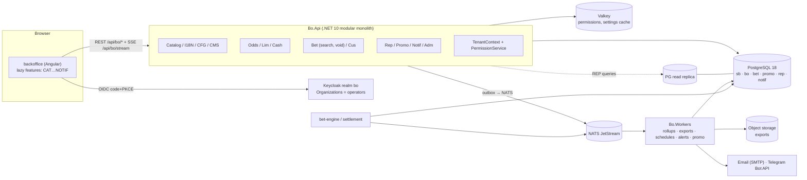
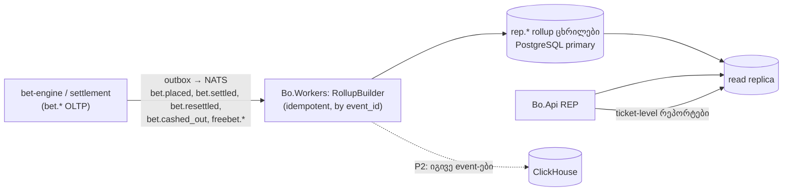
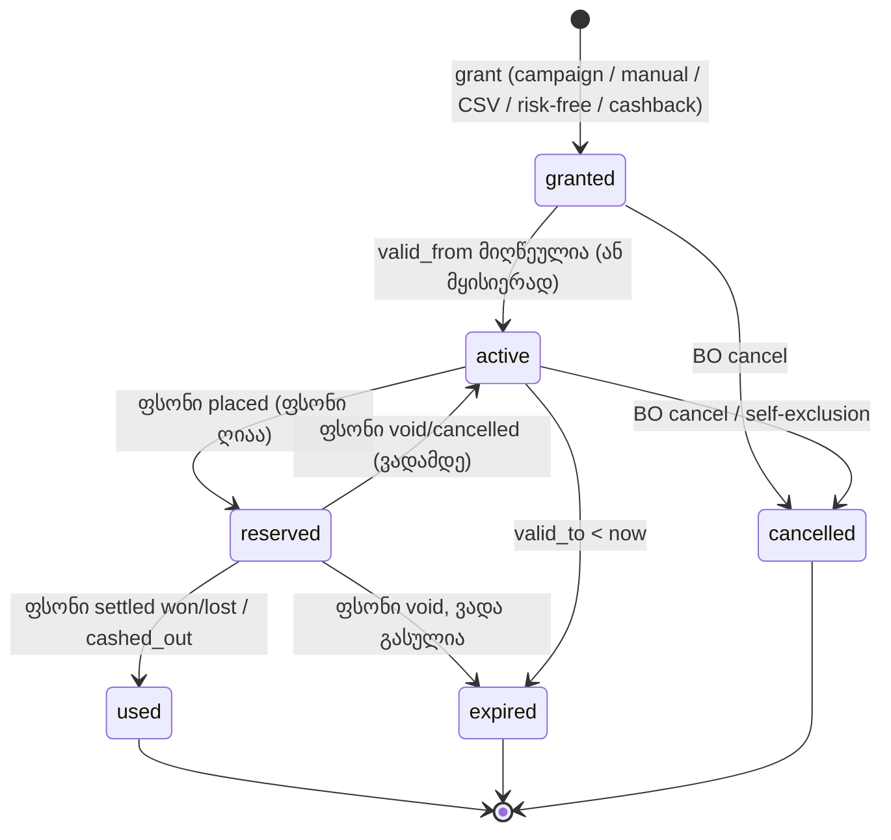

# 08 — ოპერატორის Back Office: არქიტექტურა, ADM, REP, PROMO, NOTIF

> ⚠ შეთანხმებული გადაწყვეტილებები 05–08 დოკუმენტებს შორის: [docs/09 §2](09-backoffice-plan.md#2-სავალდებულო-გადაწყვეტილებები-0508-ის-შეთანხმება). კონფლიქტის შემთხვევაში docs/09 სავალდებულოა.

> **სტატუსი:** draft v0.1 · **თარიღი:** 2026-10-04
> **სფერო:** ოპერატორის sportsbook back office-ის (BO) საერთო არქიტექტურა (frontend, backend, multi-tenancy, UI კონვენციები, სრული sitemap) და მოდულები **ADM** (admin users, RBAC, audit), **REP** (რეპორტები და სტატისტიკა), **PROMO** (კამპანიები, freebet-ები, ბონუსები), **NOTIF** (alert-ები BO მომხმარებლებისთვის).
> **დაკავშირებული:** [04 — პლატფორმის არქიტექტურა](04-platform-architecture.md), [ADR-001](adr/ADR-001-dotnet-stack.md), [ADR-002](adr/ADR-002-admin-frontend.md), [`admin/admin-web`](../admin/admin-web/README.md), Keycloak realm-ის ნიმუში [`feedops-realm.json`](../platform/deploy/keycloak/feedops-realm.json). დანარჩენი მოდულები (CAT, I18N, ODDS, CFG, CMS, BET, LIM, CASH, CUS, INT) — BO სერიის სხვა დოკუმენტებში; აქ მათზე მხოლოდ module code-ით და setting key-ით ვაკეთებთ მითითებას.
>
> ⚠ ნიშნავს გადასამოწმებელს (იურიდიული, კონტრაქტის ან პროდუქტის გადაწყვეტილება). **P0** = საჭიროა პირველი ოპერატორის pilot-ისთვის, **P1** = მალე pilot-ის შემდეგ, **P2** = მოგვიანებით.

---

## 0. მოკლედ — ძირითადი გადაწყვეტილებები

| საკითხი | გადაწყვეტილება | რატომ |
|---|---|---|
| Frontend სტრუქტურა | **ერთი Angular აპი `backoffice`** არსებულ `admin/admin-web` workspace-ში, **lazy-loaded feature route-ები თითო module code-ზე**; საერთო ბიბლიოთეკები `@admin/ui` (კომპონენტები) + ახალი `@admin/bo-core` (auth, tenant context, API client, permissions) | ერთი გუნდი, ერთი release ციკლი; micro-frontend-ები ამატებენ ვერსიების/shared state-ის სირთულეს სარგებლის გარეშე |
| Backend | **`Bo.Api` — .NET 10 modular monolith** (ერთი deployable, module-ები ცალკე project-ებად მკაცრი საზღვრებით) + ცალკე worker-ები (`Bo.Workers`: reports, exports, notifications, promo jobs). **Bet placement/settlement BO-ში არ არის** — ისინი `bet-engine` / `settlement-service`-ია | BO-ს traffic დაბალია, ტრანზაქციები cross-module (მაგ. bet void + audit + freebet restore); მოდულის გამოყოფა მოგვიანებით კოდის ცვლილების გარეშე |
| Multi-tenancy | `operator_id` **token claim-იდან** (Keycloak Organization) → request context → **EF Core global query filter (პირველადი) + PostgreSQL RLS (defense in depth)** ყველა tenant ცხრილზე | app filter-ის ერთი გამორჩენილი `WHERE` = სხვა ოპერატორის მოთამაშეების მონაცემების გაჟონვა; RLS ამას DB დონეზე ბლოკავს |
| Keycloak | **ერთი realm `bo` + Keycloak 26 Organizations** (ორგანიზაცია = ოპერატორი); realm per operator — არა | ასობით realm მძიმეა ოპერაციულად და წარმადობით; Organizations იძლევა per-operator IdP federation-ს, domain-ს, membership-ს |
| Permissions | Keycloak = authN + MFA + organization membership; **fine-grained permission-ები (`bet.void`, `odds.override` …) ჩვენს DB-ში** (`bo.role`, `bo.role_permission`), Valkey-ში cache | ოპერატორებს სჭირდებათ საკუთარი role-ები; token-ში 150 permission-ის ჩადება არ გვინდა |
| Four-eyes | `bo.approval_request` — საშიში ქმედებები (resettle, დიდი void, ლიმიტის მნიშვნელოვანი აწევა, დიდი freebet grant, admin role-ის მინიჭება) per-operator policy-ით | რეგულაციური და შიდა თაღლითობის რისკი |
| Analytics store | **MVP: PostgreSQL rollup ცხრილები (`rep` schema) outbox-driven worker-ით + read replica**; ClickHouse — P2, კონკრეტული ზღვრებით (§4.6) | ერთი DB ნაკლები ოპერაციული ტვირთია pilot-ზე; rollup-ები ClickHouse-ზე გადატანადია |
| დრო | შენახვა UTC; რეპორტის „დღე“ — **ოპერატორის timezone-ით** (`bo.operator.timezone`, default `Asia/Tbilisi`), rollup-ები საათობრივ UTC bucket-ებში | Tbilisi UTC+4 DST-ის გარეშე; სხვა ბაზრებს DST აქვთ |
| Freebet ledger | **ჩვენი** (`promo` schema); მოგება PAM-ში ჩაირიცხება როგორც real money (ან ოპერატორის არჩევით bonus fund-ად, P2) | freebet sportsbook-სპეციფიკურია (stake not returned, eligibility, settlement); PAM-ის bonus engine ამას არ იცნობს |
| Alerts | `notif` schema: rule → alert → delivery; არხები in-app (SSE), email, Telegram | ერთი მექანიზმი ბიზნეს (big bet, liability) და ტექნიკური (feed) alert-ებისთვის |

---

## 1. BO აპლიკაციის არქიტექტურა

### 1.1 კომპონენტები



- `Bo.Api` ცალკეა არსებული `Admin.Api`-სგან (Feed Ops, ჩვენი შიდა გუნდისთვის, realm `feedops`). Feed Ops რჩება ცალკე აპად; ოპერატორებს მასზე წვდომა არ აქვთ.
- `Bo.Api` წერს `bo`, `promo`, `rep`(მხოლოდ config), `notif` schema-ებში და `bet`-ში მხოლოდ BO ოპერაციებს (void, manual resettle request) — `bet-engine`-ის საჯარო command API-ით ან shared transactional procedure-ით ⚠ (BET დოკუმენტის გადაწყვეტილება).
- ყოველი write: ერთ ტრანზაქციაში domain ცვლილება + `bo.audit_log` + `bo.outbox` (transactional outbox) → NATS subject `bo.<module>.<event>` (მაგ. `bo.cfg.setting_changed`, რომ bet-engine-მა cache გაასუფთავოს).

### 1.2 Frontend: ერთი აპი, lazy feature-ები (არა micro-frontends)

რეკომენდაცია: **`projects/backoffice`** — ერთი Angular აპი; თითო module code = ერთი lazy route (`loadChildren` → standalone `Routes`).

```
admin/admin-web/projects/
├── ui/                 # @admin/ui — data-table, filter-bar, kpi-card, status-tag, confirm-reason-dialog, money/odds pipes
├── bo-core/            # @admin/bo-core — auth (angular-auth-oidc-client), TenantService, PermissionService,
│                       #   *hasPermission directive, permissionGuard, ApiClient (OpenAPI-დან გენერირებული), SseService, i18n
├── feed-ops/           # არსებული — უცვლელი
└── backoffice/
    └── src/app/
        ├── shell/      # layout, nav, operator switcher, notification bell, user menu
        └── features/
            ├── cat/ i18n/ odds/ cfg/ cms/ bet/ lim/ cash/ cus/
            └── rep/ adm/ promo/ notif/      # თითოეული: routes.ts, pages/, components/, data-access/
```

- **საზღვრები:** feature-ს შეუძლია import მხოლოდ `@admin/ui`, `@admin/bo-core` და საკუთარი ფოლდერიდან; cross-feature ნავიგაცია მხოლოდ route-ით (მაგ. bet ticket → `/cus/customers/:id`). ESLint `no-restricted-imports` (ან Nx-ზე გადასვლისას module boundaries).
- **რატომ არა micro-frontends (Module Federation / Native Federation):** ერთი გუნდი, ერთი backend, ერთი release; MF-ის ფასი — shared dependency ვერსიები, runtime შეცდომები, რთული ლოკალური dev. ოპერატორის white-label/custom ეკრანი თუ დაგვჭირდება — P2-ში ცალკე remote, არა ახლა.
- **Feature flags per operator:** `bo.operator_module(operator_id, module_code, enabled)` — nav და route guard მალავს გამორთულ მოდულს (მაგ. ოპერატორს PROMO არ უყიდია).
- **BO UI-ის ენა:** `ka` / `en` (P0), runtime ჩატვირთვით (`@jsverse/transloco`, MIT) — Angular-ის build-time i18n ერთ build-ს ვერ მოგვცემს (ADR-002 §5).

### 1.3 Backend: modular monolith

```
platform/src/
├── Bo.Api/                       # host: auth, tenant middleware, ProblemDetails, OpenAPI, SSE
├── Bo.SharedKernel/              # TenantContext, Money, Odds, AuditWriter, Outbox, Permission attribute
├── Bo.Modules.Catalog/  Bo.Modules.I18n/  Bo.Modules.Config/  Bo.Modules.Cms/
├── Bo.Modules.Odds/  Bo.Modules.Limits/  Bo.Modules.Cashout/
├── Bo.Modules.Bets/  Bo.Modules.Customers/
├── Bo.Modules.Reports/  Bo.Modules.Promo/  Bo.Modules.Notifications/  Bo.Modules.Admin/
└── Bo.Workers/                   # hosted services: rollup builder, export, scheduler, alert evaluator, promo expiry
```

წესები:
1. თითო module = საკუთარი `DbContext` (საკუთარი schema/ცხრილები) + `IModule` (endpoint-ების რეგისტრაცია) + საჯარო `Contracts` (interfaces/DTO). სხვა module-ის ცხრილებზე პირდაპირი query **აკრძალულია** — მხოლოდ Contracts ან read-only view (REP-ს გამონაკლისი აქვს: კითხულობს ყველაფერს replica-დან).
2. საზღვრების ტესტი: `NetArchTest` CI-ში.
3. გამოყოფის კრიტერიუმი: module ცალკე container-ად გადის, როცა (ა) დამოუკიდებელი მასშტაბირება სჭირდება (REP query-ები → უკვე replica-ზე), ან (ბ) ცალკე გუნდი/release. მანამდე — ერთი პროცესი.
4. Hot path (ფსონის მიღება, odds distribution) BO-ზე **არ არის დამოკიდებული**: bet-engine კითხულობს settings/limits-ს Valkey/PG-დან, BO ცვლილებებს `bo.*` outbox event-ით იგებს.

### 1.4 Multi-tenancy

**მოდელი:** shared database, shared schema, `operator_id bigint NOT NULL` ყველა tenant ცხრილში (platform-wide ცხრილებში — `NULL` = platform, როგორც `bo.translation`).

```sql
CREATE TABLE bo.operator (
  id            bigint GENERATED ALWAYS AS IDENTITY PRIMARY KEY,
  code          text NOT NULL UNIQUE,              -- 'acmebet'
  name          text NOT NULL,
  kc_org_id     uuid NOT NULL UNIQUE,              -- Keycloak Organization id
  status        text NOT NULL DEFAULT 'active' CHECK (status IN ('onboarding','active','suspended','terminated')),
  timezone      text NOT NULL DEFAULT 'Asia/Tbilisi',
  base_currency char(3) NOT NULL DEFAULT 'GEL',
  gaming_day_cutoff time NOT NULL DEFAULT '00:00', -- რეპორტის "დღის" დასაწყისი ლოკალურ დროში
  jurisdiction  text NOT NULL DEFAULT 'GE',
  created_at    timestamptz NOT NULL DEFAULT now()
);
CREATE TABLE bo.operator_module (operator_id bigint REFERENCES bo.operator, module_code text, enabled boolean NOT NULL,
  PRIMARY KEY (operator_id, module_code));
```

**აღსრულება — ორივე ფენა (რეკომენდაცია):**

| ფენა | როგორ | რას იჭერს |
|---|---|---|
| 1. Request context | middleware: JWT `organization` claim → `bo.operator.kc_org_id` → `TenantContext.OperatorId`. Platform staff — `X-Operator-Id` header, მოწმდება მის `allowed_operators`-ზე | ყალბი/გამოტოვებული tenant |
| 2. App filter | EF Core `HasQueryFilter(e => e.OperatorId == tenant.OperatorId)` ყველა `ITenantEntity`-ზე; insert-ზე `OperatorId` ავტომატურად | ჩვეულებრივი query-ები |
| 3. PostgreSQL RLS | ყოველ ტრანზაქციაში `SELECT set_config('app.operator_id', @id, true)` (= `SET LOCAL`, connection pool-ისთვის უსაფრთხო); policy `USING (operator_id = current_setting('app.operator_id')::bigint)` | raw SQL, Dapper, დავიწყებული filter, REP query-ები |

```sql
ALTER TABLE bet.bet ENABLE ROW LEVEL SECURITY;
ALTER TABLE bet.bet FORCE ROW LEVEL SECURITY;
CREATE POLICY tenant_isolation ON bet.bet
  USING (operator_id = nullif(current_setting('app.operator_id', true), '')::bigint)
  WITH CHECK (operator_id = nullif(current_setting('app.operator_id', true), '')::bigint);
-- setting-ის გარეშე current_setting → NULL → 0 სტრიქონი (fail closed)
```

- DB role-ები: `bo_app` (RLS-ს ემორჩილება), `bo_platform_report` (cross-operator platform რეპორტებისთვის: ცალკე policy `USING (true)`, მხოლოდ replica-ზე, მხოლოდ platform permission-ით), `bet_engine` (საკუთარი), migrations owner — `BYPASSRLS` მხოლოდ მას.
- RLS ხარჯი: `operator_id` ყველა index-ის პირველი სვეტია (`(operator_id, placed_at)` და ა.შ.) — planner-ისთვის policy უფასო predicate-ია.
- ტესტი (P0): integration test, რომელიც ყველა `/api/bo` GET-ს ორი ოპერატორით უშვებს და ამოწმებს, რომ A-ს token B-ს id-ს ვერ ხედავს (404, არა 403 — არსებობის გაჟონვის თავიდან ასაცილებლად).

### 1.5 Operator switcher (platform staff)

- Platform user (ჩვენი support/ops) organization-ის წევრი არ არის; აქვს `bo.admin_user.allowed_operators` (ან `*`) და platform role-ები (§3.3).
- Shell-ის header-ში dropdown „ოპერატორი: AcmeBet ▾“; არჩევანი ინახება `sessionStorage`-ში და იგზავნება `X-Operator-Id` header-ით. tenant-ის შეცვლისას ყველა feature state და SSE subscription თავიდან იტვირთება.
- ხილული მარკერი: platform user-ისთვის header ფერადია და ჩანს „Platform staff acting as AcmeBet“ — შეცდომით სხვა ოპერატორზე ქმედების თავიდან ასაცილებლად.
- Audit-ში ორივე ჩანს: `actor_id` (ჩვენი თანამშრომელი) და `operator_id` (ვისი მონაცემი შეიცვალა). Write ქმედებები platform staff-ისთვის ოპერატორის მონაცემებზე default-ად **read-only**; write მოითხოვს `platform.impersonate_write` permission-ს + reason-ს (P1).
- „All operators“ რეჟიმი მხოლოდ REP-ის platform რეპორტებში და NOTIF-ის platform alert-ებში.

### 1.6 UI კონვენციები (ყველა მოდულისთვის სავალდებულო)

| თემა | კონვენცია |
|---|---|
| ცხრილები | `@admin/ui` `<bo-data-table>`: **server-side** paging/sort/filter; დიდ ცხრილებზე (bets, audit, transactions) — **keyset pagination** (`?cursor=`), პატარაზე — offset; column chooser; sticky header; density; row → detail side panel ან გვერდი |
| ფილტრები | filter bar ზემოთ; ფილტრის state **URL query param-ებში** (გაზიარებადი ბმული); თარიღის ფილტრი ოპერატორის timezone-ში, ტოლტიპით UTC |
| Saved views | `bo.saved_view(user_id, operator_id, page_key, name, filters jsonb, columns jsonb, shared boolean)`; „ჩემი“ და „გუნდის“ view-ები; default view per page |
| Bulk actions | მონიშვნა გვერდზე ან „ყველა ფილტრის მიხედვით (N)“; ქმედებამდე preview: რამდენ ჩანაწერს შეეხება; >1000 — ასინქრონული job progress-ით |
| რისკიანი ქმედებები | `<bo-confirm-reason-dialog>`: reason **სავალდებულოა** (min 5 სიმბოლო, ან reason code dropdown + თავისუფალი ტექსტი); ძალიან რისკიანზე (mass void, resettle) — typed confirmation („VOID 37“); four-eyes საჭიროებისას ღილაკი ხდება „Request approval“ |
| Concurrency | ყოველ რედაქტირებად ჩანაწერს `version int` → `If-Match` / ETag; კონფლიქტზე 409 + „ჩანაწერი სხვამ შეცვალა, განაახლე“ |
| Live updates | SSE `GET /api/bo/stream?topics=bets.big,liability,alerts,events.<id>` (fetch-based, Authorization header — ADR-002); server-ზე NATS → per-tenant fan-out; ცხრილში ახალი სტრიქონები „↑ 5 ახალი“ ღილაკით, არა ავტომატური გადახტომით |
| ფული/odds | ყოველთვის currency კოდით; odds ფორმატი user preference (decimal default); დიდი რიცხვები locale-ით (`ka-GE`) |
| შეცდომები | RFC 9457 ProblemDetails, `code` ველით (`LIMIT_VERSION_CONFLICT`), UI-ში ქართული ტექსტი code-ით |
| Permissions UI-ში | `*boHasPermission="'bet.void'"` — ღილაკი იმალება; route guard; **აღსრულება ყოველთვის API-ზეა**, UI მხოლოდ კომფორტია |
| ხელმისაწვდომობა | კლავიატურით ნავიგაცია ცხრილებში, Material 3 dark mode |

### 1.7 API კონვენციები

- Prefix `/api/bo/<module>/...` (მაგ. `/api/bo/rep/kpi`); OpenAPI → TS client გენერაცია (`@admin/bo-core`).
- Endpoint-ზე `[RequirePermission("bet.void")]`; permission-ის გარეშე → 403 ProblemDetails.
- List: `?filter[...]=&sort=-placed_at&limit=50&cursor=`; პასუხი `{items, next_cursor, total?}` (`total` მხოლოდ მოთხოვნით — დიდ ცხრილზე count ძვირია).
- Risk action body: `{ ..., "reason": "...", "reason_code": "PALPABLE_ERROR" }`; four-eyes-ზე პასუხი `202 {approval_request_id}`.
- Idempotency: write POST-ებზე `Idempotency-Key` header (bulk grant, mass void).

---

## 2. სრული sitemap / ნავიგაცია

მარცხენა nav ჯგუფებად; ჩანს მხოლოდ ის, რაზეც user-ს `*.view` permission აქვს და რაც ოპერატორს ჩართული აქვს.

```
/                                   Dashboard (REP KPI-ები + ღია alert-ები + ჩემი approval-ები)
── Trading ─────────────────────────────────────────────
/cat/sports                         CAT  სპორტები (რიგი, ხილვადობა, აიკონი)
/cat/categories                     CAT  ქვეყნები/კატეგორიები
/cat/tournaments[/:id]              CAT  ლიგები/ტურნირები
/cat/events[/:id]                   CAT  ივენთები (feed + manual), ივენთის დეტალი: მარკეტები, override-ები
/cat/events/new                     CAT  manual ივენთი
/cat/competitors[/:id]              CAT  მონაწილეები (ლოგო, თარგმანები)
/cat/market-types                   CAT  მარკეტის ტიპები (ხილვადობა, რიგი, ჯგუფები)
/odds/live                          ODDS live trading ეკრანი (suspend/resume, price override)
/odds/margins                       ODDS margin პროფილები (sport → … → market_type)
/odds/overrides                     ODDS აქტიური ფასის override-ები
/lim/limits                         LIM  ლიმიტები scope-ებზე (event/market/market_type …)
/lim/liability                      LIM  liability monitor (event/market, live)
/lim/risk-groups                    LIM  მომხმარებლის რისკ-ჯგუფები
/cash/rules                         CASH cash-out ჩართვა/გამორთვა scope-ებზე, margin
/cash/monitor                       CASH cash-out მოთხოვნები/უარყოფები
── Bets & Customers ───────────────────────────────────
/bet/tickets[/:id]                  BET  ბილეთების ძებნა, ბილეთის დეტალი (selections, settlement history, audit)
/bet/pending-review                 BET  ხელით დასადასტურებელი ფსონები (თუ referral ჩართულია)
/bet/settlement                     BET  manual settlement / resettlement მოთხოვნები
/cus/customers[/:id]                CUS  მომხმარებლები; დეტალი: ტაბები Profile · Bets · Limits & restrictions · Freebets · P&L · Notes · Audit
/cus/segments                       CUS  (PROMO-სთან საერთო) სეგმენტები
── Marketing ──────────────────────────────────────────
/promo/campaigns[/:id]              PROMO კამპანიები (builder wizard)
/promo/freebets                     PROMO გაცემული freebet-ები (ძებნა, გაუქმება)
/promo/grants/new                   PROMO manual grant (ერთი მომხმარებელი / CSV ატვირთვა)
/promo/boosts                       PROMO odds/price boost-ები
/promo/promo-codes                  PROMO promo code-ები
── Content ────────────────────────────────────────────
/i18n/translations                  I18N თარგმანები (entity/field/lang grid, missing filter)
/i18n/languages                     I18N ოპერატორის ენები
/cms/messages                       CMS  შეცდომის/სისტემური შეტყობინებები (bet reject reasons …)
/cms/banners                        CMS  (P2) ბანერები/ტექსტური ბლოკები
── Reports ────────────────────────────────────────────
/rep/dashboard                      REP  KPI დაშბორდი
/rep/reports                        REP  რეპორტების კატალოგი
/rep/reports/:code                  REP  რეპორტის გაშვება (ფილტრები, ცხრილი, export)
/rep/exports                        REP  ჩემი export-ები (ჩამოტვირთვა)
/rep/schedules                      REP  scheduled რეპორტები
── Settings ───────────────────────────────────────────
/cfg/settings                       CFG  scope tree (platform→operator→sport→…→market) + setting editor
/cfg/operator                       CFG  ოპერატორის პროფილი (timezone, ვალუტები, ენები, PAM endpoint-ები — INT)
/int/pam                            INT  PAM ინტეგრაციის სტატუსი, error log, test console
/notif/rules                        NOTIF alert წესები
/notif/alerts                       NOTIF alert-ების ისტორია (ack/assign)
/notif/channels                     NOTIF email/Telegram არხები
/adm/users[/:id]                    ADM  BO მომხმარებლები
/adm/roles[/:id]                    ADM  როლები და permission matrix
/adm/approvals                      ADM  four-eyes მოთხოვნები (inbox / ჩემი)
/adm/audit                          ADM  audit log viewer
/adm/security                       ADM  IP allow-list, session policy, 2FA policy
── Platform (მხოლოდ platform staff) ───────────────────
/platform/operators[/:id]           ოპერატორების onboarding, მოდულების ჩართვა, Keycloak org
/platform/settings                  platform scope settings (CFG platform level)
/platform/reports                   cross-operator რეპორტები (billing/revenue share — ⚠ კომერციული მოდელი)
/platform/feed                      ბმული Feed Ops აპზე (ცალკე realm)
/me                                 პროფილი, 2FA, ენა, odds ფორმატი, notification preferences
```

---

## 3. ADM — admin users, RBAC, audit

### 3.1 მიზანი

ოპერატორის და ჩვენი პერსონალის ავტორიზაცია/ავტენტიკაცია, permission-ები module.action დონეზე, 2FA, IP შეზღუდვა, session policy, four-eyes, სრული audit.

### 3.2 Keycloak realm დიზაინი — **ერთი realm `bo` + Organizations**

| ვარიანტი | + | − | ვერდიქტი |
|---|---|---|---|
| Realm per operator | სრული იზოლაცია, თითოს საკუთარი თემა/policy | N realm-ის provisioning/upgrade, Keycloak წარმადობა ასობით realm-ზე ცუდდება, platform staff-ს N ანგარიში, N client config | ❌ |
| ერთი realm + groups | მარტივი | tenant მხოლოდ კონვენციით, per-tenant IdP არ არის | ❌ |
| **ერთი realm + Organizations (KC 26)** | org = ოპერატორი; membership; per-org identity provider (ოპერატორის Azure AD/Google Workspace), email domain-ით routing; `organization` claim token-ში | Organizations შედარებით ახალია ⚠ (feature-ის სიმწიფე upgrade-ებზე შევამოწმოთ) | ✅ |

- Client: `bo-web` (public, PKCE), audience mapper → `bo-api` (როგორც `feedops-realm.json`-ში `admin-api`). Organization scope `organization` client scope-ად → claim `organization: {"acmebet": {"id": "..."}}`.
- ერთ user-ს მხოლოდ **ერთი** ოპერატორის membership აქვს (თუ ერთ ადამიანს ორ ოპერატორთან სჭირდება — ორი ანგარიში; ეს ამარტივებს tenant-ის განსაზღვრას). Platform staff — org-ის გარეშე, realm role `platform-staff`.
- User provisioning: BO `/adm/users` → `Bo.Api` → Keycloak Admin REST API (service account `bo-api-admin`, მინიმალური `manage-users` + org-ის მართვა). Keycloak = identity source; `bo.admin_user` = მისი ასლი + ჩვენი ატრიბუტები.
- Realm policy: password policy (length ≥ 12, not username, history 5), brute force detection ჩართული, `sslRequired: all`, registration off, access token 5 წთ, refresh rotation.
- ⚠ ADR-002-ში ნათქვამია „ოპერატორების back-office-ისთვის ცალკე realm იქნება“ — ეს თანხვედრაშია: `bo` ცალკეა `feedops`-ისგან, მაგრამ ერთია ყველა ოპერატორისთვის.

### 3.3 Permission მოდელი

ფორმატი `module.action` (lowercase); `*.view` წაკითხვისთვის. Catalog კოდშია (`Permissions.cs`) და migration-ით ივსება `bo.permission`-ში.

| Module | Permissions |
|---|---|
| CAT | `cat.view`, `cat.edit` (visibility, ordering, override), `cat.event.create_manual`, `cat.market.add_manual`, `cat.media.upload` |
| I18N | `i18n.view`, `i18n.edit`, `i18n.import` |
| ODDS | `odds.view`, `odds.suspend`, `odds.override`, `odds.margin.edit` |
| CFG | `cfg.view`, `cfg.edit`, `cfg.operator.edit` |
| CMS | `cms.view`, `cms.edit` |
| BET | `bet.view`, `bet.view_pii`, `bet.void`, `bet.settle_manual`, `bet.resettle`, `bet.referral.decide` |
| LIM | `limit.view`, `limit.edit`, `limit.customer.edit`, `liability.view` |
| CASH | `cashout.view`, `cashout.edit` |
| CUS | `customer.view`, `customer.view_pii`, `customer.edit`, `customer.restrict`, `customer.note` |
| REP | `report.view`, `report.financial`, `report.export`, `report.schedule`, `report.regulatory` |
| PROMO | `promo.view`, `promo.campaign.edit`, `promo.campaign.activate`, `promo.freebet.grant`, `promo.freebet.cancel` |
| NOTIF | `notif.view`, `notif.rule.edit`, `notif.channel.edit` |
| ADM | `adm.user.view`, `adm.user.edit`, `adm.role.edit`, `adm.audit.view`, `adm.security.edit`, `adm.approval.decide` |
| Platform | `platform.operator.manage`, `platform.settings.edit`, `platform.impersonate_read`, `platform.impersonate_write`, `platform.report.cross_operator` |

**წინასწარ განსაზღვრული role-ები** (system role-ები, `operator_id NULL`; ოპერატორს შეუძლია მათი clone და custom role-ის შექმნა მხოლოდ იმ permission-ებით, რაც თვითონ აქვს):

| Role | ძირითადი permission-ები |
|---|---|
| `operator_admin` | ყველა operator permission (გარდა platform.*); users/roles მართვა |
| `trader` | cat.*, odds.*, cashout.*, limit.view/edit, liability.view, bet.view, report.view |
| `risk_manager` | limit.*, liability.view, customer.view/restrict, bet.view/void/referral.decide, notif.rule.edit, report.view/financial |
| `customer_support` | customer.view(+pii), customer.note, bet.view, promo.view, promo.freebet.grant (cap-ით) |
| `marketing` | promo.*, customer.view (PII-ის გარეშე), report.view (promo რეპორტები) |
| `finance` | report.*, bet.view, promo.view |
| `content_manager` | cat.view/edit/media.upload, i18n.*, cms.* |
| `auditor` | ყველა `*.view` + `adm.audit.view`, არცერთი write |
| `platform_superadmin` / `platform_support` / `platform_trader` / `platform_readonly` | ჩვენი პერსონალი; support = impersonate_read; superadmin = operator.manage |

**Permission შეზღუდვები (ABAC დამატება):** ზოგ permission-ს აქვს რაოდენობრივი ლიმიტი role-ზე: `bo.role_permission.constraints jsonb`, მაგ. `promo.freebet.grant {max_amount: 20}`, `bet.void {max_stake: 500}`. ლიმიტს ზემოთ → four-eyes.

### 3.4 DDL sketch

```sql
CREATE TABLE bo.admin_user (
  id              uuid PRIMARY KEY,                 -- = Keycloak user id
  operator_id     bigint REFERENCES bo.operator,    -- NULL = platform staff
  username        text NOT NULL, email text NOT NULL, display_name text,
  status          text NOT NULL DEFAULT 'active' CHECK (status IN ('invited','active','disabled')),
  allowed_operators bigint[],                       -- platform staff: NULL = ყველა
  ui_prefs        jsonb NOT NULL DEFAULT '{}',      -- ენა, odds ფორმატი, timezone override
  last_login_at   timestamptz, created_at timestamptz NOT NULL DEFAULT now(), version int NOT NULL DEFAULT 1,
  UNIQUE (operator_id, username)
);
CREATE TABLE bo.permission (code text PRIMARY KEY, module_code text NOT NULL, description text NOT NULL,
  risk_level text NOT NULL DEFAULT 'normal' CHECK (risk_level IN ('normal','sensitive','critical')), platform_only boolean NOT NULL DEFAULT false);
CREATE TABLE bo.role (
  id bigint GENERATED ALWAYS AS IDENTITY PRIMARY KEY,
  operator_id bigint REFERENCES bo.operator,        -- NULL = system role
  code text NOT NULL, name text NOT NULL, is_system boolean NOT NULL DEFAULT false, version int NOT NULL DEFAULT 1,
  UNIQUE NULLS NOT DISTINCT (operator_id, code)
);
CREATE TABLE bo.role_permission (role_id bigint REFERENCES bo.role ON DELETE CASCADE, permission_code text REFERENCES bo.permission,
  constraints jsonb, PRIMARY KEY (role_id, permission_code));
CREATE TABLE bo.user_role (user_id uuid REFERENCES bo.admin_user, role_id bigint REFERENCES bo.role,
  granted_by uuid, granted_at timestamptz NOT NULL DEFAULT now(), expires_at timestamptz,   -- დროებითი წვდომა
  PRIMARY KEY (user_id, role_id));

CREATE TABLE bo.security_policy (
  operator_id bigint PRIMARY KEY REFERENCES bo.operator,
  ip_allowlist cidr[] ,                              -- NULL/ცარიელი = არ მოქმედებს
  require_2fa boolean NOT NULL DEFAULT true,
  idle_timeout_min int NOT NULL DEFAULT 30, max_session_hours int NOT NULL DEFAULT 10,
  four_eyes jsonb NOT NULL DEFAULT '{}'              -- {"bet.resettle": {"always": true}, "bet.void": {"stake_gt": 1000}, ...}
);

CREATE TABLE bo.approval_request (
  id uuid PRIMARY KEY, operator_id bigint NOT NULL REFERENCES bo.operator,
  action text NOT NULL,                              -- permission code, მაგ. 'bet.resettle'
  payload jsonb NOT NULL,                            -- ზუსტი command, რომელიც დამტკიცებისას შესრულდება
  summary text NOT NULL, reason text NOT NULL,
  status text NOT NULL DEFAULT 'pending' CHECK (status IN ('pending','approved','rejected','executed','failed','expired','cancelled')),
  requested_by uuid NOT NULL, requested_at timestamptz NOT NULL DEFAULT now(),
  decided_by uuid, decided_at timestamptz, decision_comment text,
  executed_at timestamptz, result jsonb, expires_at timestamptz NOT NULL,
  CHECK (decided_by IS NULL OR decided_by <> requested_by)
);

CREATE TABLE bo.audit_log (
  id bigint GENERATED ALWAYS AS IDENTITY, ts timestamptz NOT NULL DEFAULT now(),
  operator_id bigint,                                -- NULL = platform ქმედება
  actor_id uuid, actor_type text NOT NULL,           -- 'bo_user' | 'platform_user' | 'system' | 'api_client'
  actor_ip inet, action text NOT NULL,               -- 'bet.void', 'adm.user.role_granted', 'auth.login'
  entity_type text NOT NULL, entity_id text NOT NULL,
  before jsonb, after jsonb, reason text, approval_request_id uuid,
  request_id text, trace_id text, prev_hash bytea, hash bytea,
  PRIMARY KEY (ts, id)
) PARTITION BY RANGE (ts);                           -- თვიური partition-ები; REVOKE UPDATE, DELETE
CREATE INDEX ON bo.audit_log (operator_id, entity_type, entity_id, ts DESC);
CREATE INDEX ON bo.audit_log (operator_id, actor_id, ts DESC);
```

### 3.5 ეკრანები

- **`/adm/users`** — ცხრილი (სახელი, email, role-ები, status, 2FA ჩართულია?, ბოლო login); ქმედებები: invite (Keycloak-ი email-ით აგზავნის required actions: password + OTP), disable, role grant/revoke (დროებითიც), force logout (Keycloak session revoke), reset 2FA.
- **`/adm/roles/:id`** — permission matrix: სტრიქონები = module-ები, სვეტები = action-ები, checkbox + constraints (მაგ. max amount). System role read-only, „Clone“.
- **`/adm/approvals`** — ტაბები „ჩემი დასამტკიცებელი“ / „ჩემი მოთხოვნები“; დეტალში human-readable summary + diff (payload) + reason; Approve/Reject comment-ით.
- **`/adm/audit`** — ფილტრები: დრო, actor, action (module-ით), entity type/id, მხოლოდ critical; სტრიქონი → before/after JSON diff. Entity-ს ყველა გვერდზე „History“ ტაბი იყენებს იგივე API-ს. Export CSV (`report.export`).
- **`/adm/security`** — IP allow-list (CIDR, ტესტი „ჩემი IP ახლა: x.x.x.x“), 2FA policy, session timeouts, four-eyes policy (action → პირობა).

### 3.6 API

```
GET    /api/bo/adm/me                         → user, operator, permissions[], constraints, ui_prefs
GET    /api/bo/adm/users?status=&role=        POST /api/bo/adm/users (invite)
PATCH  /api/bo/adm/users/{id}                 POST /api/bo/adm/users/{id}/disable | /logout | /reset-2fa
PUT    /api/bo/adm/users/{id}/roles           {roles:[{role_id, expires_at}], reason}
GET    /api/bo/adm/roles  POST/PUT/DELETE /api/bo/adm/roles/{id}
GET    /api/bo/adm/permissions
GET    /api/bo/adm/approvals?box=inbox|mine&status=
POST   /api/bo/adm/approvals/{id}/approve | /reject | /cancel
GET    /api/bo/adm/audit?from=&to=&actor=&action=&entity_type=&entity_id=&cursor=
GET    /api/bo/adm/security-policy            PUT /api/bo/adm/security-policy
```

### 3.7 წესები

- **2FA:** TOTP სავალდებულო ყველასთვის (Keycloak required action `CONFIGURE_TOTP`, conditional OTP flow); WebAuthn/passkey — P1, platform staff-ისთვის P1-ში სავალდებულო. 2FA-ს გარეშე token-ზე (`acr`/`amr` შემოწმება) API აბრუნებს 403.
- **IP allow-list:** API-ზე აღსრულება (`X-Forwarded-For` მხოლოდ სანდო proxy-დან), ოპერატორის policy ვრცელდება მის user-ებზე; platform staff — ჩვენი VPN/Zero Trust (docs/04 §8.1). Keycloak-ის login-ზეც (P1, custom authenticator ან reverse proxy rule ⚠).
- **Sessions:** access token 5 წთ, SSO idle 30 წთ, max 10 სთ (policy-დან); ერთდროული სესიების ლიმიტი (P1); role ცვლილება → Valkey permission cache invalidation მომენტალურად (token-ში permission-ები არ არის, ამიტომ revocation მყისიერია).
- **Step-up re-auth** (P1): critical permission-ზე (`bet.resettle`, `adm.role.edit`) თუ login > 15 წთ — `max_age`-ით ხელახალი OTP.
- **Four-eyes:** command არ სრულდება მოთხოვნისას; ინახება `payload`; დამტკიცებისას სრულდება **დამმტკიცებლის** სესიაში ორიგინალი requester-ის სახელით audit-ში (ორივე ჩანს). Approver-ს თავად უნდა ჰქონდეს `adm.approval.decide` **და** თვითონ action-ის permission. ვადა default 24 სთ. მდგომარეობა შეიცვალა მოთხოვნიდან დამტკიცებამდე (მაგ. bet უკვე settle-დება) → `failed` ახსნით.
- Default four-eyes სია (ოპერატორს შეუძლია გამკაცრება, შესუსტება — მხოლოდ `operator_admin`-ს და აუდიტით): `bet.resettle` (ყოველთვის), `bet.void` stake > X, mass void > 10 ბილეთი, `limit.edit` აწევა > 2×, `promo.freebet.grant` > Y ან bulk, `promo.campaign.activate` budget > Z, `adm.role.edit` / `operator_admin`-ის მინიჭება, `odds.margin.edit` margin < floor.
- **Audit:** append-only (REVOKE + trigger), hash chain per operator (`hash = sha256(prev_hash || row)`), ღამის job ამოწმებს ჯაჭვს და WORM storage-ში ექსპორტს აკეთებს (docs/04 §8.2). PII audit-ში მინიმალური; `bet.view_pii`/`customer.view_pii` წვდომაც ლოგირდება (P1: PII-ის ნახვის audit).
- Last admin protection: ოპერატორის ბოლო აქტიურ `operator_admin`-ს ვერ გამორთავ.

### 3.8 Roles & P

ADM-ს მართავს `operator_admin`, platform staff; audit — `auditor`. **P0:** realm `bo` + Organizations, invite/disable, system role-ები, permission catalog, `/adm/me`, TOTP, audit log write + viewer, tenant isolation tests. **P1:** custom role-ები, four-eyes, IP allow-list, step-up, temp role-ები, force logout. **P2:** per-operator IdP federation, WebAuthn mandatory, PII access audit report, SCIM.

⚠ four-eyes-ის P1-ში გადატანა დასაშვებია მხოლოდ თუ pilot ოპერატორი resettle-ს არ აკეთებს BO-დან; თუ აკეთებს — `bet.resettle`-ის four-eyes P0-ა.

---

## 4. REP — რეპორტები და სტატისტიკა

### 4.1 მიზანი

ოპერატორს (და ჩვენ, cross-operator) ფინანსური და ოპერაციული სურათი: KPI დაშბორდი, სტანდარტული რეპორტები, export, scheduled email, რეგულაციური მონაცემები.

### 4.2 განსაზღვრებები (ერთი ადგილი, ყველა რეპორტი ამას იყენებს)

| მეტრიკა | განსაზღვრება |
|---|---|
| Turnover (handle) | ფსონების **cash stake**-ის ჯამი; ორი ხედვა: *placement date* (ოპერატიული) და *settlement date* (ფინანსური, default ფინანსურ რეპორტებში) |
| Freebet turnover | freebet stake ცალკე სვეტად; cash turnover-ში არ შედის |
| Payout | ანგარიშსწორებული მოგებები + void/refund stake-ები + cash-out გადახდები |
| **GGR** | settled cash stake − cash payout (settlement date-ით); cash-out-ირებული ბილეთი = stake − cashout amount |
| Bonus cost | freebet-ის მოგებები (stake-ის გარეშე) + odds boost-ის დამატებითი გადახდა + ACCA bonus + cashback + risk-free refund |
| **NGR** | GGR − bonus cost (− გადასახადები, ⚠ ოპერატორის/იურისდიქციის მიხედვით, P2) |
| Margin (hold %) | GGR / settled cash turnover |
| Bet count / ticket count | ბილეთები (single/multi = 1 ბილეთი); selection count ცალკე |
| Active customers | უნიკალური customer-ები ≥1 ფსონით პერიოდში (`count(distinct)` — rollup-ში HLL არა, ზუსტი daily set-ი, იხ. §4.5) |
| Live vs prematch | selection-ის `is_live` placement მომენტში; multi-ში live თუ ≥1 selection live (ცალკე სვეტი „mixed“) |
| Resettlement effect | resettle-ის Δ payout ცალკე სტრიქონად იმ დღეში, როცა resettle მოხდა (წარსული დახურული დღე არ იცვლება) |

> მულტი-ფსონის stake sport/league/market-ზე **არ ნაწილდება** პროპორციულად by default — sport-ის ჭრილში multi ცალკე bucket-ია „Multi (mixed)“; ⚠ ზოგ ოპერატორს stake-ის პროპორციული გადანაწილება სურს (P1 option `rep.multi_attribution = split|bucket`).

### 4.3 KPI დაშბორდი (`/rep/dashboard`, `/`)

- ზედა რიგი KPI cards (`@admin/ui` kpi-card): Turnover, GGR, Margin %, NGR, Bets, Active customers, Avg stake, Open liability — არჩეულ პერიოდზე + Δ წინა პერიოდთან.
- პერიოდი: Today / Yesterday / 7d / 30d / MTD / custom; timezone = ოპერატორის.
- გრაფიკები: turnover & GGR საათობრივად/დღიურად (line); live vs prematch (stacked bar); top 10 sport/league/market type GGR-ით (bar + ცხრილი drill-down-ით sport → category → tournament → event); bet status breakdown.
- Live ნაწილი (SSE, 30 წმ): დღევანდელი turnover/GGR (settled), open bets, top liability events → `/lim/liability`.
- Drill-down ბმულები ყოველთვის გადადის შესაბამის რეპორტზე იგივე ფილტრებით.

### 4.4 სტანდარტული რეპორტები (`/rep/reports`)

| Code | რეპორტი | ჭრილები / ფილტრები | Permission | P |
|---|---|---|---|---|
| `REP-01` | Turnover & GGR by period | საათი/დღე/კვირა/თვე, currency, channel, live/prematch | `report.financial` | P0 |
| `REP-02` | Turnover & GGR by sport/category/tournament | tree drill-down, პერიოდი | `report.financial` | P0 |
| `REP-03` | By market type | market_type, sport | `report.financial` | P1 |
| `REP-04` | Event P&L | event-ის ყველა მარკეტი: stake, payout, GGR, bet count | `report.view` | P0 |
| `REP-05` | Customer P&L | customer, პერიოდი, sort by GGR (top winners/losers), risk group | `report.financial` + `customer.view` | P0 |
| `REP-06` | Bets by status | open/won/lost/void/cashed_out/half_won…, ტიპი (single/multi/system) | `report.view` | P0 |
| `REP-07` | Cash-out report | მოთხოვნები, მიღებული/უარყოფილი, cashout amount vs potential payout, cash-out GGR effect | `report.financial` | P1 |
| `REP-08` | Freebet/bonus cost | კამპანია, freebet type, granted/used/expired, cost, ROI | `report.financial` | P1 (P0 თუ PROMO P0-შია) |
| `REP-09` | Liability snapshot | ღია ფსონების potential payout event/market/outcome-ზე, worst case | `liability.view` | P0 |
| `REP-10` | Settlement & resettlement | settlement-ები, rollback-ები, resettle-ები, Δ payout, მიზეზი/source (feed vs manual) | `report.view` | P0 |
| `REP-11` | Manual actions / audit report | void-ები, manual settlement, limit/odds override-ები user-ების მიხედვით | `adm.audit.view` | P1 |
| `REP-12` | Daily summary (gaming day close) | დღის დახურვა: turnover, payout, GGR, bonus cost, open bets დღის ბოლოს | `report.financial` | P0 |
| `REP-13` | Rejected bets | reject reason-ებით (limit, odds changed, suspended, PAM error) | `report.view` | P1 |
| `REP-14` | Customer activity / retention | ახალი/აქტიური/დაბრუნებული, cohort | `report.view` | P2 |
| `REP-15` | Odds override / margin report | override-ების რაოდენობა, effective margin vs target | `report.view` | P2 |
| `REP-GE-*` | საქართველოს რეგულაციური | ⚠ ქვემოთ | `report.regulatory` | P0/P1 ⚠ |
| `REP-PL-*` | Platform: cross-operator turnover/GGR, billing base | ოპერატორი, თვე | `platform.report.cross_operator` | P1 |

**საქართველო (⚠ იურიდიული):** შემოსავლების სამსახურთან ანგარიშგება და ონლაინ აზარტული თამაშების მონიტორინგის მოთხოვნები ძირითადად **ლიცენზიატზე (ოპერატორზე)** ვრცელდება, რომელსაც PAM და გადახდები აქვს. ჩვენი ვალდებულება სავარაუდოდ: (1) **ფსონების სრული რეესტრი** (ticket-level export: ticket id, customer external id, placed/settled ts, stake, odds, payout, status, selections) ფორმატით, რომელსაც ოპერატორი/რეგულატორი მოითხოვს; (2) მონაცემების შენახვა რეგულაციურ ვადაზე; (3) შესაძლოა რეგულატორის მონიტორინგის სისტემასთან real-time მიწოდება. ზუსტი ფორმატი, სიხშირე და ვინ აგზავნის — **იურისტთან/pilot ოპერატორთან დასადგენი**. MVP-ში: `REP-GE-01 Bet register` (CSV/XLSX, დღიური) + `REP-GE-02 Daily financial summary`; კონფიგურირებადი column mapping.

### 4.5 მონაცემთა არქიტექტურა



**MVP რეკომენდაცია: PostgreSQL rollup ცხრილები**, არა ClickHouse:
- pilot-ზე მოცულობა: ათეულ ათასობით ბილეთი დღეში — PG rollup + replica უპრობლემოდ წვდება; ClickHouse = ახალი სისტემა backup/monitoring/on-call-ით.
- Rollup-ები ივსება **event-driven** (outbox → NATS → worker), არა `REFRESH MATERIALIZED VIEW`-ით: ინკრემენტული, idempotent (`rep.processed_event(event_id)`), late event-ები (resettle) სწორ bucket-ში ემატება.
- Ticket-level რეპორტები (customer P&L, bet register) — პირდაპირ `bet.*`-დან replica-ზე, `(operator_id, settled_at)` index-ებით და partitioning-ით (თვიური).
- ღამის reconciliation job: rollup-ის ჯამები vs `bet.*` წყარო წინა დღისთვის; სხვაობაზე NOTIF alert + ავტომატური rebuild იმ დღის.

```sql
CREATE SCHEMA rep;
CREATE TABLE rep.fact_hourly (                      -- ძირითადი rollup
  operator_id bigint NOT NULL, bucket_utc timestamptz NOT NULL,      -- საათის დასაწყისი UTC
  basis text NOT NULL CHECK (basis IN ('placed','settled')),
  currency char(3) NOT NULL, sport_id bigint, category_id bigint, tournament_id bigint,   -- multi: NULL + is_multi
  market_type_id bigint, is_live boolean NOT NULL, bet_type text NOT NULL,              -- single|multi|system
  channel text NOT NULL DEFAULT 'web',
  bet_count int NOT NULL DEFAULT 0, selection_count int NOT NULL DEFAULT 0,
  stake_cash numeric(18,2) NOT NULL DEFAULT 0, stake_freebet numeric(18,2) NOT NULL DEFAULT 0,
  payout_cash numeric(18,2) NOT NULL DEFAULT 0, refund_cash numeric(18,2) NOT NULL DEFAULT 0,
  cashout_paid numeric(18,2) NOT NULL DEFAULT 0, bonus_cost numeric(18,2) NOT NULL DEFAULT 0,
  resettle_delta numeric(18,2) NOT NULL DEFAULT 0,
  UNIQUE NULLS NOT DISTINCT (operator_id, bucket_utc, basis, currency, sport_id, category_id, tournament_id,
                             market_type_id, is_live, bet_type, channel)
) PARTITION BY RANGE (bucket_utc);
CREATE TABLE rep.event_pnl (operator_id bigint, event_id bigint, currency char(3), bet_count int, stake_cash numeric(18,2),
  payout_cash numeric(18,2), open_liability numeric(18,2), updated_at timestamptz, PRIMARY KEY (operator_id, event_id, currency));
CREATE TABLE rep.customer_daily (operator_id bigint, local_date date, customer_id bigint, currency char(3),
  bet_count int, stake_cash numeric(18,2), stake_freebet numeric(18,2), payout_cash numeric(18,2), bonus_cost numeric(18,2),
  PRIMARY KEY (operator_id, local_date, customer_id, currency));                   -- active customers = count(*) ამ ცხრილიდან
CREATE TABLE rep.processed_event (event_id uuid PRIMARY KEY, processed_at timestamptz NOT NULL DEFAULT now());

CREATE TABLE rep.report_def (code text PRIMARY KEY, name_key text NOT NULL, permission text NOT NULL,
  params_schema jsonb NOT NULL, max_range_days int NOT NULL DEFAULT 93, async_threshold_rows int NOT NULL DEFAULT 50000);
CREATE TABLE rep.export_job (id uuid PRIMARY KEY, operator_id bigint NOT NULL, requested_by uuid NOT NULL, report_code text NOT NULL,
  params jsonb NOT NULL, format text NOT NULL CHECK (format IN ('csv','xlsx')), status text NOT NULL DEFAULT 'queued',
  row_count bigint, file_key text, expires_at timestamptz, error text, created_at timestamptz NOT NULL DEFAULT now(), finished_at timestamptz);
CREATE TABLE rep.report_schedule (id uuid PRIMARY KEY, operator_id bigint NOT NULL, owner_id uuid NOT NULL, report_code text NOT NULL,
  params jsonb NOT NULL,                              -- relative periods: {"period":"yesterday"}
  cron text NOT NULL, timezone text NOT NULL, format text NOT NULL, recipients uuid[] NOT NULL,   -- მხოლოდ BO user-ები
  enabled boolean NOT NULL DEFAULT true, last_run_at timestamptz, last_status text);
```

**Timezone handling:**
- ყველაფერი UTC-ში ინახება; rollup — საათობრივ UTC bucket-ებში; „დღე“ = `[local_date + cutoff, +1 day)` ოპერატორის timezone-ით, გამოითვლება query-ში: `bucket_utc >= (d + cutoff) AT TIME ZONE tz`. `Asia/Tbilisi` = UTC+4 მუდმივად (DST არ არის), DST-იანი ზონებისთვისაც სწორია, რადგან საათობრივი bucket-ები გვაქვს.
- ⚠ ნახევარსაათიანი offset-ის ზონები (მაგ. `Asia/Kolkata`) — საათობრივი bucket არ ემთხვევა; საჭიროებისას bucket → 15 წთ (P2).
- `rep.customer_daily.local_date` იწერება ოპერატორის timezone-ით ჩაწერის დროს (timezone-ის შეცვლა = rebuild).
- UI ყოველთვის აჩვენებს timezone-ს (`Asia/Tbilisi, UTC+4`), export ფაილში header-ში.

### 4.6 ClickHouse-ზე გადასვლის კრიტერიუმები (P2)

ერთი მათგანიც: >2M ბილეთი/დღე მთლიანად პლატფორმაზე; ad-hoc ანალიტიკის საჭიროება (BI ინსტრუმენტი ოპერატორებისთვის); odds history-ს ანალიტიკა (docs/04 §8.3 უკვე გეგმავს ClickHouse-ს Phase 2-ში); REP query p95 > 3 წმ replica-ზე. გადასვლა: იგივე NATS event-ები → ClickHouse `ReplacingMergeTree`; `rep.*` API-ის კონტრაქტი არ იცვლება.

### 4.7 Export და scheduled რეპორტები

- Sync: ≤ 50k სტრიქონი — streaming CSV პირდაპირ response-ში. მეტი ან XLSX → `rep.export_job` → worker → object storage → `/rep/exports` + in-app notification; ბმული — presigned, 24 სთ, ჩამოტვირთვა ლოგირდება audit-ში.
- XLSX: `MiniExcel` (Apache-2.0, streaming, დაბალი მეხსიერება) ⚠ ლიცენზია გადავამოწმოთ; ClosedXML (MIT) — პატარა, ფორმატირებულ ფაილებზე. XLSX ლიმიტი 1,048,576 სტრიქონი → მეტზე მხოლოდ CSV.
- CSV: UTF-8 BOM (Excel-ში ქართული სწორად ჩანს), `;`/`,` user preference; formula injection დაცვა (`=`, `+`, `-`, `@`-ით დაწყებული უჯრა → `'` prefix).
- Scheduled: cron ოპერატორის timezone-ში; მიმღებები მხოლოდ **აქტიური BO user-ები** permission-ით (გარე email-ები — არა, PII/ფინანსური მონაცემების გაჟონვის რისკი); email-ში ფაილი ≤ 10 MB attachment-ად, მეტი — ბმული login-ით. Run-ის ჩავარდნა → NOTIF.

### 4.8 API

```
GET  /api/bo/rep/kpi?from=&to=&compare=prev&live=
GET  /api/bo/rep/timeseries?metric=turnover,ggr&granularity=hour|day&from=&to=
GET  /api/bo/rep/breakdown?dim=sport|category|tournament|market_type&parent=&from=&to=
GET  /api/bo/rep/reports                          → კატალოგი (permission-ით გაფილტრული)
POST /api/bo/rep/reports/{code}/run               {params} → {columns, rows, next_cursor} ან 202 {export_job_id}
POST /api/bo/rep/reports/{code}/export            {params, format}
GET  /api/bo/rep/exports   GET /api/bo/rep/exports/{id}/download
GET/POST/PUT/DELETE /api/bo/rep/schedules[/{id}]
```

### 4.9 წესები და როლები

- Range ლიმიტი per report (`max_range_days`), ticket-level query-ზე timeout 30 წმ → შემოთავაზება async export-ზე.
- **PII:** customer-ის სახელი/ტელეფონი რეპორტში მხოლოდ `customer.view_pii`-ით; სხვა შემთხვევაში external id + mask.
- Multi-currency: ყველა თანხა თავის currency-ში; „converted to base currency“ — P1, დღიური კურსით (`bo.fx_rate(date, from, to, rate)`) ⚠ კურსის წყარო.
- დახურული დღეები immutable: resettle/late settlement → მიმდინარე დღის `resettle_delta`; REP-12 შენახული snapshot-ით (`rep.daily_close`) P1.
- როლები: finance, operator_admin — ყველაფერი; trader/risk — operational (REP-04/06/09/10); marketing — REP-08 + KPI-ები ფინანსური დეტალის გარეშე ⚠; auditor — read + export (export ლოგირდება).
- **P0:** KPI დაშბორდი, REP-01/02/04/05/06/09/10/12, CSV export, rollup worker + reconciliation, REP-GE-01 (⚠ ფორმატი). **P1:** XLSX, async export, schedules, REP-03/07/08/11/13, platform რეპორტები, base currency. **P2:** ClickHouse, cohort/retention, BI წვდომა, custom report builder.

---

## 5. PROMO — კამპანიები, freebet-ები, ბონუსები

### 5.1 მიზანი და PAM-თან გამიჯვნა (რეკომენდაცია)

**Sportsbook ბონუსები (freebet, risk-free, odds boost, ACCA boost, cashback) — ჩვენი ledger (`promo` schema).** PAM-ის „bonus money“ (wagering requirement-იანი ბონუს ბალანსი) — PAM-ის პასუხისმგებლობაა; ჩვენ მას ვერ ვაკონტროლებთ.

| ასპექტი | გადაწყვეტილება |
|---|---|
| Freebet-ის ღირებულება | ჩვენთან; PAM-ში ბალანსი **არ** იცვლება grant-ზე |
| Freebet-ით ფსონი | PAM debit **არ ხდება** (ან ოპერატორის არჩევით 0-თანხიანი `reserve` informational-ად, ⚠ INT კონტრაქტი) |
| Freebet-ის მოგება | `payout − stake` → PAM `credit` ტიპით `freebet_win` (idempotency key = bet id); default real money; `promo.winnings_wallet = 'cash' | 'bonus'` per operator (bonus = PAM bonus fund, P2, PAM უნდა უჭერდეს მხარს) |
| Cashback / risk-free refund | გაიცემა **freebet-ად** (default) ან PAM credit `bonus_cash`-ად (P1 option) |
| Odds boost / ACCA boost | დამატებითი მოგება ემატება ჩვეულებრივ payout-ს ერთ PAM credit-ში, მაგრამ ჩვენთან ცალკე ხაზად (`bonus_component`) — REP bonus cost-ისთვის |
| PAM-ის საკუთარი ბონუს ბალანსით ფსონი | P2: debit-ში `fund_type = 'bonus'`; PAM წყვეტს wagering-ს; ჩვენ მხოლოდ ვინახავთ `fund_type` ბილეთზე |
| Eligibility (KYC, age 25+, self-exclusion) | PAM-იდან player status-ი (INT) — self-excluded / შეზღუდულ მოთამაშეს grant არ ხდება, აქტიური freebet იყინება |

### 5.2 ბონუსის ტიპები

| Type | აღწერა | ანგარიშსწორება | P |
|---|---|---|---|
| `freebet` (SNR) | ფიქსირებული stake, stake not returned | won: credit `odds×stake − stake`; lost: 0; void: freebet აღდგება (თუ ვადა არ გასვლია, სხვაგვარად `expired`) | P0 |
| `risk_free` (bet insurance) | ჩვეულებრივი cash ფსონი; წაგების შემთხვევაში stake ბრუნდება freebet-ად (cap-ით) | lost → ახალი `freebet` grant (amount = min(stake, cap)); qualifying bet-ი კამპანიის opt-in-ით ან პირველი ფსონი | P1 |
| `odds_boost` (price boost) | კონკრეტულ outcome-ზე გაზრდილი ფასი (`boosted_odds`), max stake | won: `stake × boosted_odds`; bonus cost = `stake × (boosted − original)`; ფასი ODDS-ის margin-ს გარეთ, live ცვლილებაზე boost suspend | P1 |
| `acca_boost` | multi-ზე მოგების % selection-ების რაოდენობით (მაგ. 3→5%, 5→10%, 10+→50%), min odds per leg | ყველა leg won → bonus = (payout − stake) × pct, cap-ით; void leg → ხელახლა ითვლება დარჩენილ leg-ებზე | P1 |
| `cashback` | პერიოდის net loss-ის % (scope: sport/league), min loss, cap | პერიოდის დახურვის job → grant (freebet ან cash) | P2 |
| `profit_boost` token | customer-ის მიერ არჩეულ ფსონზე მოგების +X% | ACCA boost-ის მსგავსად ერთ ბილეთზე | P2 |

### 5.3 Freebet lifecycle



- **Partial use:** MVP-ში freebet **განუყოფელია** (მთლიანი თანხა ერთ ფსონზე, `allow_partial = false`). P2: `remaining_amount` და მრავალჯერადი გამოყენება.
- Resettlement: used freebet-ის ბილეთის resettle won→lost → PAM rollback/debit `freebet_win`-ზე (INT-ის rollback სემანტიკა) + promo ledger-ში უკუ-ჩანაწერი.
- Cash-out freebet ფსონზე: default **გამორთული** (`promo.freebet.cashout_allowed = false` CFG setting); თუ ჩართულია — cash-out თანხა = fair value − stake ექვივალენტი ⚠ ფორმულა CASH-თან შესათანხმებელი.

### 5.4 Campaign builder (`/promo/campaigns/:id`, wizard)

1. **Basics:** სახელი (თარგმანებით — I18N `promo_campaign.title/terms`), type, T&C ტექსტი, status (`draft → scheduled → active → paused → ended`).
2. **Target segment:** წესების ხე (AND/OR) `bo.customer` ატრიბუტებზე: registration date, country, language, risk group, tags (VIP…), lifetime/period turnover, last bet date, first deposit? (PAM-იდან, თუ მოდის ⚠), has_bet_on sport; ან **static list** (CSV customer external id-ებით); preview: „≈ 4,312 მომხმარებელი“.
3. **Trigger:** `manual` (bulk grant segment-ზე), `opt_in` (მოთამაშე აჭერს frontend-ზე), `promo_code`, `event` (P1: first bet, registration webhook PAM-იდან, ფსონი ≥ X კონკრეტულ ლიგაზე).
4. **Reward:** type-ის პარამეტრები (freebet amount per currency, boost %, cap-ები), validity (`valid_days` grant-იდან ან ფიქსირებული `valid_to`).
5. **Eligibility (გამოყენების პირობები):** sport/category/tournament/event/market_type include/exclude სიები (CAT id-ები), min odds (ბილეთზე და/ან leg-ზე), min/max selections, bet types (single/multi), live/prematch, min/max stake (qualifying bet-ისთვის), max winnings cap.
6. **Limits:** campaign budget (ნომინალი და/ან ფაქტობრივი cost), max grants total, per-customer max (default 1), per-customer per-period.
7. **Schedule:** start/end (ოპერატორის timezone), დღის/კვირის ფანჯრები (P2).
8. **Review & activate:** summary, budget-ის შეფასება; activate → four-eyes თუ budget > ზღვარი.

### 5.5 DDL sketch

```sql
CREATE SCHEMA promo;
CREATE TABLE promo.campaign (
  id bigint GENERATED ALWAYS AS IDENTITY PRIMARY KEY, operator_id bigint NOT NULL REFERENCES bo.operator,
  code text NOT NULL, name text NOT NULL,
  bonus_type text NOT NULL CHECK (bonus_type IN ('freebet','risk_free','odds_boost','acca_boost','cashback','profit_boost')),
  trigger_type text NOT NULL CHECK (trigger_type IN ('manual','opt_in','promo_code','event')),
  trigger_params jsonb NOT NULL DEFAULT '{}',
  segment_id bigint,                                   -- bo.segment (CUS/PROMO საერთო) ან NULL = ყველა
  reward jsonb NOT NULL,                               -- {"amount":{"GEL":10,"USD":4},"valid_days":7,"boost_pct":10,"cap":{"GEL":100}}
  eligibility jsonb NOT NULL DEFAULT '{}',             -- {"include":{"sport":[1]},"exclude":{"market_type":[..]},"min_odds":1.5,"min_legs":1,"live":"any"}
  budget_amount numeric(18,2), budget_currency char(3),
  budget_used numeric(18,2) NOT NULL DEFAULT 0,        -- ნომინალი გაცემული (reservation)
  max_grants int, per_customer_max int NOT NULL DEFAULT 1,
  starts_at timestamptz, ends_at timestamptz,
  status text NOT NULL DEFAULT 'draft' CHECK (status IN ('draft','scheduled','active','paused','ended','cancelled')),
  created_by uuid NOT NULL, version int NOT NULL DEFAULT 1, created_at timestamptz NOT NULL DEFAULT now(),
  UNIQUE (operator_id, code)
);
CREATE TABLE promo.promo_code (operator_id bigint NOT NULL, code citext NOT NULL, campaign_id bigint NOT NULL REFERENCES promo.campaign,
  max_redemptions int, redeemed int NOT NULL DEFAULT 0, PRIMARY KEY (operator_id, code));

CREATE TABLE promo.freebet (
  id bigint GENERATED ALWAYS AS IDENTITY PRIMARY KEY, operator_id bigint NOT NULL,
  customer_id bigint NOT NULL,                         -- bo.customer.id
  campaign_id bigint REFERENCES promo.campaign,        -- NULL = ad-hoc manual grant
  kind text NOT NULL DEFAULT 'freebet' CHECK (kind IN ('freebet','profit_boost_token')),
  amount numeric(18,2) NOT NULL, currency char(3) NOT NULL,
  eligibility jsonb NOT NULL,                          -- snapshot კამპანიიდან grant-ის მომენტში (კამპანიის შეცვლა არ მოქმედებს)
  status text NOT NULL CHECK (status IN ('granted','active','reserved','used','expired','cancelled')),
  valid_from timestamptz NOT NULL, valid_to timestamptz NOT NULL,
  bet_id bigint,                                       -- bet.bet.id როცა reserved/used
  source text NOT NULL CHECK (source IN ('campaign','manual','csv','risk_free','cashback','promo_code')),
  grant_batch_id uuid, granted_by uuid, grant_reason text,
  cancelled_by uuid, cancel_reason text,
  win_amount numeric(18,2),                            -- payout − stake (cost)
  version int NOT NULL DEFAULT 1, created_at timestamptz NOT NULL DEFAULT now(), updated_at timestamptz NOT NULL DEFAULT now()
);
CREATE INDEX ON promo.freebet (operator_id, customer_id, status, valid_to);
CREATE UNIQUE INDEX ON promo.freebet (bet_id) WHERE bet_id IS NOT NULL;

CREATE TABLE promo.ledger (                            -- append-only ყველა ფულადი ეფექტი (REP bonus cost-ის წყარო)
  id bigint GENERATED ALWAYS AS IDENTITY PRIMARY KEY, operator_id bigint NOT NULL, customer_id bigint NOT NULL,
  campaign_id bigint, freebet_id bigint, bet_id bigint,
  entry_type text NOT NULL,                            -- grant|reserve|release|use|win_cost|boost_cost|acca_cost|cashback|expire|cancel|resettle_adj
  amount numeric(18,2) NOT NULL, currency char(3) NOT NULL,
  pam_tx_id text,                                      -- PAM credit-ის id (თუ იყო)
  idempotency_key text NOT NULL UNIQUE, ts timestamptz NOT NULL DEFAULT now()
);
CREATE TABLE promo.grant_batch (id uuid PRIMARY KEY, operator_id bigint NOT NULL, campaign_id bigint, file_name text,
  total_rows int, ok_rows int, failed_rows int, errors jsonb, status text NOT NULL, created_by uuid NOT NULL, created_at timestamptz NOT NULL DEFAULT now());
CREATE TABLE promo.odds_boost (id bigint GENERATED ALWAYS AS IDENTITY PRIMARY KEY, operator_id bigint NOT NULL, campaign_id bigint,
  outcome_ref jsonb NOT NULL,                          -- {event_id, market_id, outcome_id}
  original_odds numeric(10,3) NOT NULL, boosted_odds numeric(10,3) NOT NULL, max_stake numeric(18,2) NOT NULL,
  total_stake_cap numeric(18,2), starts_at timestamptz, ends_at timestamptz, status text NOT NULL);
CREATE TABLE promo.customer_campaign (operator_id bigint, campaign_id bigint, customer_id bigint, opted_in_at timestamptz,
  grants int NOT NULL DEFAULT 0, PRIMARY KEY (operator_id, campaign_id, customer_id));
```

### 5.6 Freebet ფსონის placement და settlement-ში

1. Frontend → bet-engine: `place(bet, freebet_id)`.
2. bet-engine ერთ ტრანზაქციაში: `SELECT … FROM promo.freebet WHERE id=$1 AND customer_id=$2 AND status='active' AND now() < valid_to FOR UPDATE`; eligibility snapshot-ის შემოწმება ბილეთზე (sport/market include/exclude, min odds, legs, bet type); stake = freebet.amount (ზუსტად); status → `reserved`, `bet_id`; ledger `reserve`; ბილეთზე `bet.bet.funding = 'freebet'`, `freebet_id`.
3. PAM: debit **არ** იგზავნება (⚠ ან 0-თანხიანი reserve, თუ ოპერატორის PAM-ს სჭირდება ფსონის რეგისტრაცია რეგულაციურად).
4. Limits (LIM): freebet stake ითვლება liability-ში (potential payout − stake), მაგრამ customer-ის cash stake ლიმიტებში — არა (CFG `limit.count_freebet_stake`, default false).
5. Settlement: won → payout = `stake × odds − stake` (stake not returned) → PAM credit `freebet_win`, ledger `win_cost`; lost → 0, ledger `use`; void → `release` (ან expire); half-won/half-lost (Asian) → ნახევარზე იგივე წესი (won half: `stake/2 × odds − stake/2`, void half: freebet არ ბრუნდება ნაწილობრივ MVP-ში ⚠ — ნაწილობრივი void-ის ღირებულება იკარგება; ალტერნატივა: ახალი freebet void ნაწილისთვის).
6. ყველა ნაბიჯი idempotent bet/settlement event id-ით (settlement-ის retry ორმაგ credit-ს არ გამოიწვევს).

### 5.7 Manual grant

- `/promo/grants/new`: (ა) ერთი მომხმარებელი — customer search (CUS) → კამპანია (ან ad-hoc: amount, validity, eligibility preset) → reason → grant; customer detail-ის „Freebets“ ტაბიდანაც. (ბ) **CSV ატვირთვა**: `customer_external_id,amount,currency[,valid_days]`; dry-run validation (უცნობი id, self-excluded, cap გადაჭარბება, currency mismatch) → preview → confirm → `promo.grant_batch` async → შედეგის ფაილი შეცდომებით.
- `customer_support`-ს cap per grant (role constraint) და per-day; bulk → ყოველთვის four-eyes.

### 5.8 Abuse prevention

- Per-customer cap, per-campaign max grants, budget hard stop (budget ამოიწურა → კამპანია `paused` + NOTIF).
- Eligibility: min odds (ტიპურად ≥ 1.50 leg-ზე), excluded market-ები (ორმხრივი hedge-ისთვის მოსახერხებელი: მაგ. ორივე მხარის მარკეტი სხვადასხვა ანგარიშით), max winnings cap freebet-ზე.
- Multi-account: PAM-იდან device/IP/payment fingerprint, თუ მოდის (⚠ INT კონტრაქტი); ჩვენთან — ერთი IP/device-დან რამდენიმე customer-ის ერთი კამპანიის freebet-ით ერთსა და იმავე event-ზე → NOTIF `suspicious_customer` alert.
- Risk group exclusion: `bonus_abuser` tag/risk group → segment-დან ავტომატურად გამორიცხვა (CUS/LIM).
- Promo code: rate limit, brute force დაცვა, case-insensitive, ერთჯერადი/მრავალჯერადი.
- Self-excluded / limited player (PAM status): grant ბლოკირდება, აქტიური freebet-ები `cancelled` (reason `self_exclusion`).
- ⚠ **საქართველოს კანონი:** აზარტული თამაშების რეკლამის შეზღუდვები (2022-დან) შეიძლება ზღუდავდეს ბონუსების/freebet-ების **შეთავაზების და კომუნიკაციის** ფორმებს; ასაკი 25+ — eligibility-ის ნაწილი (PAM-ის ვერიფიკაციით). კამპანიის ტიპების ჩართვა per jurisdiction CFG setting-ით (`promo.allowed_bonus_types`). იურისტის დასკვნა pilot-მდე.

### 5.9 API

```
GET/POST        /api/bo/promo/campaigns           GET/PUT /api/bo/promo/campaigns/{id}
POST            /api/bo/promo/campaigns/{id}/activate | /pause | /end      {reason}
POST            /api/bo/promo/campaigns/{id}/segment-preview               → {count, sample[]}
POST            /api/bo/promo/campaigns/{id}/grant                         {segment|customer_ids, reason} (bulk → job)
GET             /api/bo/promo/freebets?customer_id=&status=&campaign_id=&cursor=
POST            /api/bo/promo/freebets                                     {customer_id, amount, currency, valid_days, eligibility|campaign_id, reason}
POST            /api/bo/promo/freebets/{id}/cancel                         {reason}
POST            /api/bo/promo/grant-batches  (multipart CSV, ?dry_run=true)  GET /api/bo/promo/grant-batches/{id}
GET/POST/PUT    /api/bo/promo/boosts[/{id}]       GET/POST /api/bo/promo/promo-codes
# frontend-facing (operator-gateway, არა BO):  GET /api/player/freebets, POST /api/player/promo-code, POST /api/player/campaigns/{id}/opt-in
```

### 5.10 რეპორტები, როლები, P

- რეპორტები: REP-08 (per campaign: granted count/amount, used, expired, cost, turnover generated by recipients, ROI ⚠ განსაზღვრება), freebet register (customer-ის ყველა freebet), boost performance (stake on boosted outcome, cost).
- როლები: `marketing` — კამპანიები, grant (budget-ის ფარგლებში); `customer_support` — მცირე manual grant, view; `finance` — view + რეპორტები; `risk_manager` — cancel, abuse alert-ები.
- **P0:** freebet (SNR) type, manual grant (ერთი + CSV), lifecycle + expiry job, bet-engine-ში placement/settlement, ledger, customer detail-ის Freebets ტაბი, budget/per-customer cap, REP-08 მარტივი. ⚠ P0 მხოლოდ თუ pilot ოპერატორი freebet-ს მოითხოვს გაშვებისას — სხვაგვარად მთელი PROMO P1.
- **P1:** campaign builder segment-ებით, opt-in, promo code, risk-free, odds boost, ACCA boost, four-eyes activate, abuse alert-ები.
- **P2:** cashback, profit boost token, event trigger-ები, partial freebet, PAM bonus fund, A/B.

---

## 6. NOTIF — alert-ები და შეტყობინებები BO მომხმარებლებისთვის

### 6.1 მიზანი

მნიშვნელოვანი მოვლენების დროული მიწოდება სწორ ადამიანებთან: ბიზნეს რისკი (big bet, liability), ფროდი, ოპერაციული (feed/PAM/settlement), სისტემური (export მზადაა, approval მოთხოვნა). **ეს არ არის მოთამაშის მარკეტინგული შეტყობინებები** (ის ოპერატორის CRM-ია).

### 6.2 Alert ტიპები

| Type | წყარო | პარამეტრები (rule) | Default არხი | P |
|---|---|---|---|---|
| `big_bet` | `bet.placed` | stake ≥ X ან potential win ≥ Y (per currency), scope (sport/live) | in-app + Telegram | P0 |
| `big_win` | `bet.settled` | payout ≥ X | in-app | P1 |
| `liability_threshold` | LIM liability update | event/market/outcome liability ≥ X ან ≥ % ლიმიტის | in-app + Telegram | P0 |
| `suspicious_customer` | bet-engine / LIM / PROMO წესები | late bets (bet-stop-თან ახლოს მიღებული live ფსონი), ერთი IP-დან ბევრი ანგარიში, სწრაფი odds-ზე ფსონები, freebet abuse pattern, win rate | in-app + email | P1 |
| `feed_issue` | platform: producer down/up, recovery long, market suspend storm (Feed Ops-ის მონაცემებიდან) | — (platform-wide, ოპერატორს ეგზავნება ინფორმაციულად) | in-app + Telegram | P0 |
| `settlement_delay` | ღია ბილეთები დასრულებულ event-ზე > N წთ | N | in-app + email | P1 |
| `pam_errors` | INT: PAM call error rate / timeout | rate ≥ X% 5 წთ-ში | in-app + Telegram | P0 |
| `bet_referral` | ფსონი ელოდება ხელით დადასტურებას | — | in-app (ხმით) | P1 |
| `approval_requested` / `approval_decided` | ADM | — | in-app + email | P1 |
| `report_ready` / `schedule_failed` | REP | — | in-app | P1 |
| `promo_budget` | PROMO budget ≥ 80% / ამოიწურა | % | in-app + email | P1 |

Alert-ები მიდის NATS-ით (`notif.signal.<type>`) — წყარო მოდული მხოლოდ signal-ს აქვეყნებს; rule evaluation და მიწოდება NOTIF worker-შია (წყაროებს არხები არ აინტერესებთ).

### 6.3 DDL sketch

```sql
CREATE SCHEMA notif;
CREATE TABLE notif.alert_rule (
  id bigint GENERATED ALWAYS AS IDENTITY PRIMARY KEY, operator_id bigint,          -- NULL = platform rule
  alert_type text NOT NULL, name text NOT NULL, enabled boolean NOT NULL DEFAULT true,
  params jsonb NOT NULL,                              -- {"min_stake":{"GEL":5000},"live_only":false,"sport_ids":[1]}
  severity text NOT NULL CHECK (severity IN ('info','warning','critical')),
  channels text[] NOT NULL,                           -- {'in_app','email','telegram'}
  recipient_roles text[], recipient_users uuid[],
  throttle_seconds int NOT NULL DEFAULT 300,          -- იგივე dedup_key-ზე
  quiet_hours jsonb,                                  -- email/telegram-ისთვის; critical ყოველთვის გადის
  version int NOT NULL DEFAULT 1, created_by uuid
);
CREATE TABLE notif.alert (
  id bigint GENERATED ALWAYS AS IDENTITY, ts timestamptz NOT NULL DEFAULT now(), operator_id bigint,
  rule_id bigint, alert_type text NOT NULL, severity text NOT NULL,
  dedup_key text NOT NULL,                            -- მაგ. 'liability:event:123:outcome:9'
  title text NOT NULL, body text NOT NULL, payload jsonb NOT NULL, link text,     -- '/bet/tickets/987'
  status text NOT NULL DEFAULT 'open' CHECK (status IN ('open','acknowledged','resolved','auto_resolved')),
  occurrences int NOT NULL DEFAULT 1, last_seen_at timestamptz NOT NULL DEFAULT now(),
  assigned_to uuid, ack_by uuid, ack_at timestamptz, resolved_by uuid, resolved_at timestamptz, note text,
  PRIMARY KEY (ts, id)
) PARTITION BY RANGE (ts);
CREATE INDEX ON notif.alert (operator_id, status, ts DESC);
CREATE TABLE notif.delivery (alert_id bigint, alert_ts timestamptz, channel text, target text, status text NOT NULL,  -- queued|sent|failed
  attempts int NOT NULL DEFAULT 0, last_error text, sent_at timestamptz, PRIMARY KEY (alert_id, channel, target));
CREATE TABLE notif.channel (id bigint GENERATED ALWAYS AS IDENTITY PRIMARY KEY, operator_id bigint, kind text NOT NULL CHECK (kind IN ('email','telegram','webhook')),
  name text NOT NULL, config jsonb NOT NULL,          -- telegram: {"chat_id":"-100…"}; bot token — secret store-ში, არა აქ
  verified_at timestamptz, enabled boolean NOT NULL DEFAULT true);
CREATE TABLE notif.user_pref (user_id uuid, alert_type text, channels text[] NOT NULL, muted_until timestamptz, PRIMARY KEY (user_id, alert_type));
CREATE TABLE notif.inbox (user_id uuid, alert_id bigint, alert_ts timestamptz, read_at timestamptz, PRIMARY KEY (user_id, alert_id));
```

### 6.4 არხები

- **In-app** (P0): header-ის ზარი unread count-ით, SSE topic `alerts`, toast severity-ით (critical — ხმა + დარჩება ack-მდე); `/notif/alerts` ცხრილი ფილტრებით, ack/assign/resolve, ბმული entity-ზე.
- **Email** (P0 ტექნიკურად SMTP — ოპერატორის ან ჩვენი transactional provider ⚠): მხოლოდ BO user-ების verified email-ებზე; digest რეჟიმი (P1) — info alert-ები საათში ერთხელ.
- **Telegram** (P0): ჩვენი ერთი bot (platform), ოპერატორი ამატებს ჯგუფში და აკავშირებს one-time code-ით (`/start <code>` → `chat_id` ინახება, `verified_at`); per-operator საკუთარი bot — P2. Payload-ში **PII არა** (customer external id masked, თანხა და event — კი); დეტალისთვის ბმული BO-ზე login-ით. Bot API rate limit (~30 msg/s გლობალურად, ~20/min ჯგუფში ⚠) → queue + aggregation.
- Webhook/Slack/MS Teams — P2.
- Platform-ის საკუთარი ინფრასტრუქტურული alert-ები რჩება Alertmanager → Telegram/Email-ზე (docs/04 §5.3); NOTIF-ის `feed_issue` მხოლოდ ოპერატორისთვის საინტერესო ბიზნეს-ეფექტია (მაგ. „live producer down — live მარკეტები suspended“).

### 6.5 წესები

- Dedup: იგივე `dedup_key` ღია alert-ზე → `occurrences++`, `last_seen_at`; ხელახალი მიწოდება მხოლოდ `throttle_seconds`-ის შემდეგ ან severity-ის ზრდაზე.
- Auto-resolve: liability ზღვარს ქვემოთ ჩამოვიდა / producer up → `auto_resolved` + (არჩევით) შეტყობინება.
- Escalation (P2): critical alert ack-ის გარეშე N წთ → შემდეგი role/არხი.
- Rule-ები tenant-ზე; platform rule (`operator_id NULL`) ყველა ოპერატორს ეხება (feed_issue) და ოპერატორს მისი გამორთვა არ შეუძლია, მხოლოდ არხის არჩევა.
- Delivery retry exponential backoff 5 მცდელობამდე; ჩავარდნა არ ბლოკავს სხვა არხებს.
- Retention: alert-ები 13 თვე, delivery 90 დღე.

### 6.6 API, როლები, P

```
GET  /api/bo/notif/alerts?status=&type=&severity=&cursor=     POST /api/bo/notif/alerts/{id}/ack | /assign | /resolve
GET  /api/bo/notif/inbox?unread=true                          POST /api/bo/notif/inbox/read  {alert_ids|all}
GET/POST/PUT/DELETE /api/bo/notif/rules[/{id}]                POST /api/bo/notif/rules/{id}/test
GET/POST/DELETE /api/bo/notif/channels[/{id}]                 POST /api/bo/notif/channels/{id}/verify
GET/PUT /api/bo/notif/preferences
SSE  /api/bo/stream?topics=alerts
```

- როლები: ყველა user იღებს alert-ებს თავისი role-ების მიხედვით (`notif.view`); rule-ები — `risk_manager`, `operator_admin` (`notif.rule.edit`); არხები — `operator_admin`.
- **P0:** big_bet, liability_threshold, feed_issue, pam_errors; in-app + Telegram + email; rule editor (მარტივი ფორმა per type); ack. **P1:** suspicious_customer, settlement_delay, approvals, promo_budget, digest, preferences, quiet hours. **P2:** escalation, webhooks/Slack, per-operator bot.

---

## 7. ის, რაც მოთხოვნაში არ იყო, მაგრამ რეკომენდებულია (ამ დოკუმენტის სფეროში)

| # | რა | რატომ | P |
|---|---|---|---|
| 1 | Tenant isolation test suite + RLS | ერთი leak = B2B ბიზნესის დასასრული | P0 |
| 2 | Gaming day close (REP-12 snapshot) + rollup reconciliation | ფინანსური ციფრები არ უნდა „მოძრაობდეს“; ოპერატორის ბუღალტერია ამას ითხოვს | P0/P1 |
| 3 | Global search (header): ticket id, customer id/username, event id/სახელი | support-ის 80% ძებნაა | P0 |
| 4 | Entity „History“ ტაბი ყველგან (audit-იდან) | დავების გადაწყვეტა | P0 |
| 5 | Temporary role grants + break-glass ანგარიში (sealed, audited) | incident-ის დროს წვდომა არ უნდა იყოს ბლოკერი | P1 |
| 6 | PII access logging + masking by default | GDPR / საქართველოს PDP კანონი | P1 |
| 7 | Platform billing რეპორტი (revenue share / per-bet fee base) | ჩვენი შემოსავლის საფუძველი ⚠ კომერციული მოდელი | P1 |
| 8 | Operator onboarding wizard (`/platform/operators/new`): KC org, default roles, settings copy from template, PAM credentials | ახალი ოპერატორი დღეებში, არა კვირებში | P1 |
| 9 | BO usage analytics (რომელი ეკრანები გამოიყენება) | product prioritization | P2 |

---

## 8. P0 შეჯამება (ამ დოკუმენტის მოდულები, pilot-ისთვის)

- **Architecture:** `backoffice` Angular აპი (shell, nav, operator switcher, `@admin/bo-core`, `<bo-data-table>`, confirm-reason dialog, SSE); `Bo.Api` modular monolith skeleton + `Bo.Workers`; `bo.operator`; tenant middleware + EF filter + RLS + isolation tests; outbox → NATS.
- **ADM:** Keycloak realm `bo` + Organizations; invite/disable user; system role-ები; permission catalog და აღსრულება; TOTP სავალდებულო; audit log (write + viewer + History ტაბი).
- **REP:** KPI დაშბორდი; REP-01/02/04/05/06/09/10/12; CSV export; rollup worker + reconciliation; REP-GE-01 bet register (⚠ ფორმატი).
- **PROMO:** (⚠ თუ pilot მოითხოვს) SNR freebet, manual + CSV grant, lifecycle/expiry, bet-engine ინტეგრაცია, ledger, cap-ები.
- **NOTIF:** big_bet, liability_threshold, feed_issue, pam_errors; in-app + Telegram + email.

---

## დანართი A — ღია საკითხები

1. ⚠ **საქართველოს რეგულაციური ანგარიშგება:** რა ფორმატით/სიხშირით, ვინ აგზავნის (ოპერატორი vs ჩვენ), real-time მონიტორინგის სისტემასთან ინტეგრაცია საჭიროა თუ არა; data retention ვადა — იურისტი + pilot ოპერატორი.
2. ⚠ **ბონუსების რეკლამის/შეთავაზების შეზღუდვები საქართველოში** — რომელი PROMO ტიპები დასაშვებია და როგორ შეიძლება კომუნიკაცია.
3. ⚠ **PAM კონტრაქტი (INT):** freebet ფსონზე 0-თანხიანი reserve საჭიროა? `freebet_win` credit-ის ტიპი; bonus fund-ის მხარდაჭერა; device/IP fingerprint-ის მიწოდება abuse-ისთვის; registration/deposit event webhook-ები კამპანიის trigger-ებისთვის.
4. ⚠ GGR/turnover-ის განსაზღვრება (settlement vs placement date, multi-ს attribution) pilot ოპერატორის ფინანსურ გუნდთან შესათანხმებელი.
5. ⚠ Keycloak Organizations-ის სიმწიფე (KC 26.x) — per-org IdP, org-ის admin delegation; fallback: groups + custom `operator_id` user attribute mapper.
6. ⚠ BO-დან bet void/resettle — `bet-engine` command API თუ shared DB transaction (BET დოკუმენტის გადაწყვეტილება).
7. ⚠ Platform staff-ის write წვდომა ოპერატორის მონაცემებზე — სახელშეკრულებო საკითხი (DPA), default read-only.
8. ⚠ Multi-currency base conversion — კურსის წყარო (NBG ოფიციალური კურსი GEL-ისთვის?).
9. ⚠ Email provider (ჩვენი transactional vs ოპერატორის SMTP) და Telegram-ის გამოყენების დასაშვებობა ოპერატორის security policy-ით.
10. ⚠ ჩვენი კომერციული მოდელი (revenue share / fixed / per-bet) — განსაზღვრავს platform billing რეპორტს.
