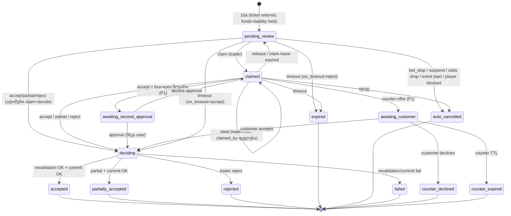
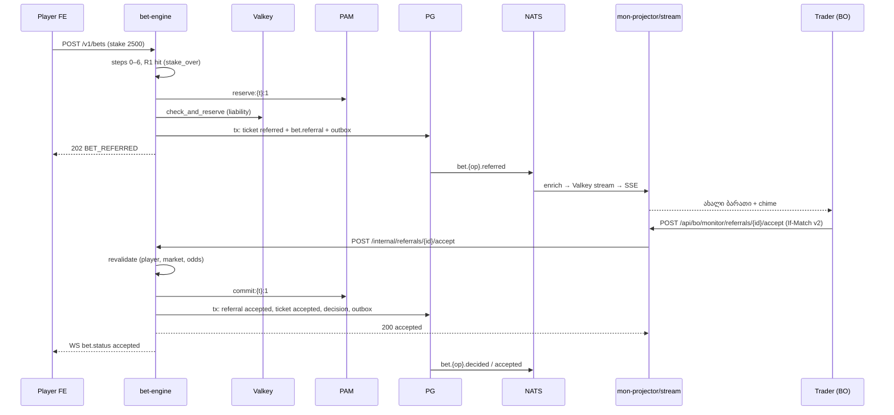
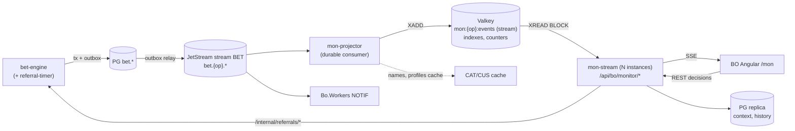

# 10 — Back office: ფსონების მონიტორინგი და ხელით დადასტურება (MON — referral / trader desk)

> ⚠ შეთანხმებული გადაწყვეტილებები: [docs/09 §2](09-backoffice-plan.md#2-სავალდებულო-გადაწყვეტილებები-0508-ის-შეთანხმება). ეს დოკუმენტი ცვლის 07-ის referral-ის ნაწილებს (09 §2 პუნქტი 15).

> ⚠ შეთანხმებული გადაწყვეტილებები 05–08 დოკუმენტებს შორის: [docs/09 §2](09-backoffice-plan.md#2-სავალდებულო-გადაწყვეტილებები-0508-ის-შეთანხმება). კონფლიქტის შემთხვევაში docs/09 სავალდებულოა. ეს დოკუმენტი **ცვლის** 07 §2.7-ს (referral queue) და 07 §8-ის `bet.referral` sketch-ს; რა უნდა შეიცვალოს 06/07/08/09-ში, ჩამოწერილია §12-ში.

> **სტატუსი:** design draft v0.1 · **თარიღი:** 2026-10-04
> **მოდული:** **MON** — ფსონების real-time მონიტორინგი (ticker, big bets, watchlist, rejected/cash-out ნაკადები, event drill-down) და **referral** (ფსონის ხელით დადასტურება ტრეიდერის მიერ). **P0** — pilot-ისთვის.
> **დაკავშირებული:** [07](07-backoffice-trading-risk-customers.md) (§1 სერვისები, §2.3 pipeline, §4 LIM/liability, §6 CUS, §7 PAM, §10 reason code-ები, §11 როლები) · [08](08-backoffice-platform-reporting-promo.md) (§1 არქიტექტურა, §1.6 UI კონვენციები, SSE, §3 ADM, §6 NOTIF) · [06](06-backoffice-catalog-odds-config.md) (§5 CFG, §6 CMS) · [05](05-backoffice-market-research.md) (OpenBet Global Ticker, OddsMatrix manual acceptance, Sportradar MTS counter-offer).
> **მომხმარებლის მოთხოვნა:** „საჭიროა მონიტორინგის ხელსაწყო: ერთი ან რამდენიმე დაშბორდი, სადაც დადებული ბილეთები სხვადასხვა ფილტრით ჩანს; აქვე მოწმდება და ხელით დასტურდება მონიტორინგზე გაგზავნილი ბილეთები.“
> ⚠ = გადასაწყვეტი/გადასამოწმებელი.

---

## სარჩევი

0. [მოკლედ — ძირითადი გადაწყვეტილებები](#0-მოკლედ--ძირითადი-გადაწყვეტილებები)
1. [მიზანი, მომხმარებლები, საზღვრები](#1-მიზანი-მომხმარებლები-საზღვრები)
2. [დაშბორდები (Angular)](#2-დაშბორდები-angular)
3. [Referral წესები და ადგილი bet pipeline-ში](#3-referral-წესები-და-ადგილი-bet-pipeline-ში)
4. [Referral-ის lifecycle, ფული, მოთამაშის მხარე](#4-referral-ის-lifecycle-ფული-მოთამაშის-მხარე)
5. [ტრეიდერის decision card](#5-ტრეიდერის-decision-card)
6. [Real-time არქიტექტურა](#6-real-time-არქიტექტურა)
7. [DDL sketch და reason code-ები](#7-ddl-sketch-და-reason-code-ები)
8. [API, permission-ები, როლები](#8-api-permission-ები-როლები)
9. [მეტრიკები, alert-ები, supervisor დაშბორდი](#9-მეტრიკები-alert-ები-supervisor-დაშბორდი)
10. [P0 / P1 / P2](#10-p0--p1--p2)
11. [Edge case-ები](#11-edge-case-ები)
12. [საჭირო ცვლილებები 06/07/08/09-ში](#12-საჭირო-ცვლილებები-06070809-ში)
13. [ღია საკითხები](#13-ღია-საკითხები)

---

## 0. მოკლედ — ძირითადი გადაწყვეტილებები

| საკითხი | გადაწყვეტილება | რატომ |
|---|---|---|
| MON-ის პრიორიტეტი | **P0** (09-ში ticker და approval queue P1 იყო; მომხმარებელმა პირდაპირ მოითხოვა) | ტრეიდერის „მთავარი ეკრანი“ (OpenBet, 05 §2.8); pilot-ზე ერთადერთი გზაა, რომ ოპერატორმა დიდ ფსონებს თვალი ადევნოს და ხელით მართოს |
| MON vs BET search vs REP | MON = **ბოლო 2 საათი, streaming, ოპერაციული ქმედებები**; უფრო ძველი → BET ticket search (იგივე ფილტრის ფორმატით); აგრეგატები/ფინანსები → REP | სამივე სხვადასხვა storage-ს და SLA-ს ითხოვს; ერთ ეკრანში გაერთიანება ყველას აფუჭებს |
| Referral-ის მფლობელი | **bet-engine** (`bet.referral` = source of truth, ტაიმერები, wallet, liability). BO მხოლოდ ბრძანებას აგზავნის: `POST /internal/referrals/{id}/accept` … | 09 §2.7: wallet-ის მოძრაობა და idempotency ერთ ადგილას რჩება |
| ადგილი pipeline-ში | ორ ეტაპად: **R1** (იაფი წესები) ნაბიჯი 6-ის შემდეგ, **R2** (liability-ზე დამოკიდებული წესები) ნაბიჯი 10-ის **Lua reserve-ის შემდეგ**. Referred ფსონი liability-ს და თანხას **ინარჩუნებს** გადაწყვეტილებამდე | ტრეიდერი ხედავს ზუსტ „liability after“-ს; პარალელური ფსონები ამ რისკს უკვე ითვალისწინებენ |
| Live delay referred ფსონზე | R1-ზე მოხვედრილ ფსონზე live delay **აღარ სრულდება**: ტრეიდერის განხილვა (≥ delay) მას ცვლის. bet_stop pending-ის დროს ⇒ auto-cancel, accept-ზე ⇒ ნაბიჯები 4–5 ხელახლა | ორმაგი ლოდინი მოთამაშეს არაფერს აძლევს, დაცვა კი იგივე რჩება |
| ფული | PAM `reserve` → `commit`/`cancel`; capability-ის გარეშე **fallback: `debit` referral-ში შესვლისას → `rollback`/ნაწილობრივი `credit`** (07 §7) | pilot-ის PAM-ის შესაძლებლობები უცნობია (09 §6.2); ორივე გზა P0-ია |
| Rule engine | **ფიქსირებული წესების ნაკრები CFG key-ებით** (`referral.*`), არა DSL | კონფიგურაცია CFG-ის trace-ით აიხსნება; DSL P2-ია, როცა რეალური მოთხოვნები დაგროვდება |
| Lock | **claim** (lease 30 წმ, heartbeat) ერთ ტრეიდერზე; supervisor-ს შეუძლია **steal**. Accept/reject claim-ის გარეშეც შეიძლება (ატომური claim+decide) | ორი ტრეიდერი ერთ ფსონზე არ იმუშავებს; ერთი კლავიშით გადაწყვეტა სწრაფია |
| Partial accept | **მხოლოდ counter-offer-ით** (`referral.partial_mode = counter_offer`); `direct` რეჟიმი გამორთულია (მომხმარებლის გადაწყვეტილება 2026-10-04: საქართველოში მოთამაშის თანხმობის გარეშე ნაწილობრივი მიღება არ გამოიყენება) | მოთამაშე თავად ადასტურებს ახალ თანხას |
| Counter-offer | **P0** (დაბალი stake და/ან odds, მოთამაშე ადასტურებს `referral.counter_offer_timeout_seconds`-ში) | მომხმარებლის გადაწყვეტილება 2026-10-04. Player API და white-label frontend ორივე ჩვენია (docs/11) |
| Four-eyes | P0: **role constraint** (`referral.decide {max_stake_base}`); ზღვარს ზემოთ საჭიროა `referral.decide_over_limit`. **რიგის შიგნით მეორე დამადასტურებელი** (`awaiting_second_approval`) — P1 | ADM-ის `bo.approval_request` (24 სთ ვადა) წამებში მომუშავე რიგს არ ერგება |
| ტაიმერები | **მხოლოდ server-side** (bet-engine `referral-timer`, PG `SKIP LOCKED`); კლიენტი countdown-ს `expires_at`-იდან ითვლის server time offset-ით | ბრაუზერის დახურვა ან მოთამაშის ხელახალი მცდელობა SLA-ს ვერ შეცვლის |
| Streaming | outbox → NATS JetStream `bet.{op}.*` → **`mon-projector`** (enrichment) → **Valkey Stream per operator** → `mon-stream` (SSE, server-side ფილტრი, `Last-Event-ID` = Valkey stream id) | stateless SSE instance-ები, ბუნებრივი backpressure (pull), resume reconnect-ზე |
| Watchlist | **ახალი ცხრილი არ არის**: CUS-ის flags + risk group + „ახალი customer“ (`monitor.new_customer_days`) | ერთი წყარო; ტრეიდერი flag-ს CUS-ში სვამს, MON მაშინვე იყენებს |
| Saved views | 08-ის `bo.saved_view` (`page_key = 'mon.*'`) + ახალი `bo.monitor_workspace` (მრავალი ფანჯარა/პანელი, ხმები) | 08 §1.6 კონვენცია; layout ფილტრისგან განსხვავებული ერთეულია |

---

## 1. მიზანი, მომხმარებლები, საზღვრები

### 1.1 მიზანი

1. **ხედვა real-time-ში:** ყველა შემოსული ფსონი (მიღებული, უარყოფილი, განხილვაზე), ≤ 1 წმ დაყოვნებით, ფილტრებით და ფერებით, რომ ტრეიდერმა რისკი ფსონის დადებისთანავე დაინახოს და არა მეორე დღეს რეპორტში.
2. **ხელით კონტროლი:** წესებით მონიშნული ფსონები (დიდი stake, sharp customer, liability ზღვართან) ჩერდება და ელოდება ტრეიდერის გადაწყვეტილებას: accept / partial / reject (P1: counter-offer).
3. **სწრაფი რეაქცია:** ticker-იდან ერთი დაწკაპუნებით: market suspend (ODDS), ლიმიტის შეცვლა (CFG), customer-ის risk group/flag (CUS), ticket detail (BET).

### 1.2 მომხმარებლები

| ვინ | რას აკეთებს MON-ში | ტიპური setup |
|---|---|---|
| **Trader** (`trader`) | უყურებს ticker-ს თავის სპორტებზე, იღებს გადაწყვეტილებას referral-ზე თავისი ლიმიტის ფარგლებში | 2–3 მონიტორი: ticker · referral queue · live event/liability |
| **Head trader / supervisor** (`head_trader`, ახალი როლი §8.3) | ზედამხედველობს რიგს, ართმევს (steal) „გაჭედილ“ ბარათს, ადასტურებს ლიმიტზე მაღალ ფსონს, ხედავს ტრეიდერების მეტრიკებს | queue + supervisor დაშბორდი |
| **Risk manager** (`risk_manager`) | watchlist, rejected stream (ლიმიტების პრობლემები), referral წესების კონფიგურაცია, customer-ის flag-ები | watchlist · rejected · CFG |
| Auditor / compliance | read-only: ვინ რა გადაწყვიტა და რატომ | referral history |
| Platform staff (ჩვენი) | support-ისას ოპერატორის ხედვა (impersonate_read); P1 — cross-operator ticker (`monitor.view_all_operators`) | — |

### 1.3 საზღვრები სხვა მოდულებთან

| | **MON** | **BET** ticket search (07 §3) | **REP** (08 §4) | **LIM** liability (07 §4.5) |
|---|---|---|---|---|
| დრო | ახლა … −2 სთ | ნებისმიერი (≤ 92 დღის ფანჯარა) | დღეები/თვეები | ღია ფსონები |
| მონაცემი | streaming event-ები (Valkey) | PG read replica | `rep` rollup-ები | Valkey liability |
| განახლება | push, < 1 წმ | ხელით refresh | საათობრივი/დღიური | SSE 2 წმ |
| ქმედება | referral decision, სწრაფი ბმულები | void/cancel/resettle | export | suspend, limit edit |

- MON ticket-ს არ ცვლის, გარდა referral-ის გადაწყვეტილებისა (ისიც bet-engine-ის command API-ით). void/cancel → BET-ის ticket detail.
- MON-ის event drill-down **იყენებს LIM-ის liability კომპონენტს და API-ს** (`/api/bo/risk/liability/events/{id}`) და ამატებს ფსონების ნაკადს outcome-ზე. ცალკე liability გამოთვლა არ არსებობს.
- MON-ის ფილტრის ფორმატი BET search-ის URL param-ებს ემთხვევა: „გახსენი ticket search-ში“ ღილაკი იგივე ფილტრს გადასცემს უფრო დიდი დროის ფანჯრით.

---

## 2. დაშბორდები (Angular)

Feature: `projects/backoffice/src/app/features/mon/` (lazy route, 08 §1.2). ყოველი დაშბორდი შედგება **პანელებისგან** (standalone component-ები), რომლებიც ცალკე გვერდზეც იხსნება და workspace-ის grid-შიც ჯდება.

### 2.1 Route-ები

| Route | პანელი | P |
|---|---|---|
| `/mon/ticker` | Live bet ticker — ყველა ფსონი | P0 |
| `/mon/referrals` | Referral queue + decision card (08-ის `/bet/pending-review`-ს ცვლის) | P0 |
| `/mon/big-bets` | დიდი ფსონები (ticker preset + top ცხრილი) | P0 |
| `/mon/events[/:id]` | ივენთის/მარკეტის drill-down live liability-თ + ფსონები outcome-ზე | P0 |
| `/mon/watchlist` | flagged customer-ების ფსონები და აქტივობა | P0 |
| `/mon/rejected` | უარყოფილი ფსონების ნაკადი + reason code-ების აგრეგაცია | P0 |
| `/mon/cashouts` | cash-out ნაკადი (08-ის `/cash/monitor` ამ პანელს იყენებს) | P1 |
| `/mon/settlement` | settlement მონიტორი: დიდი payout-ები, certainty-ს მოლოდინი, payout pending | P2 |
| `/mon/supervisor` | რიგის და ტრეიდერების მეტრიკები (§9.3) | P1 (P0: Grafana) |
| `/mon/w/:workspaceId` | workspace: რამდენიმე პანელი grid-ში; `?window=2` — მეორე ფანჯრის layout | P0 (ერთი ფანჯარა), P1 (multi-window restore) |
| `/mon/panel/:type?view=&chrome=0` | ცალკე პანელი shell-ის გარეშე (pop-out მეორე მონიტორზე) | P0 |

### 2.2 Live bet ticker (`/mon/ticker`)

**Layout:** ზემოთ filter bar (§2.9) + view selector + „⏸ Pause“ + counters (ბოლო 1 წთ: ფსონები, turnover base-ში, reject %); ქვემოთ ვირტუალური ცხრილი (`cdk-virtual-scroll-viewport`), ახალი სტრიქონი ზემოდან ემატება; მარჯვნივ გასაშლელი side panel (ticket detail BET-ის კომპონენტით + customer quick summary).

**სვეტები** (column chooser, default რიგით):

| სვეტი | შინაარსი |
|---|---|
| დრო | `HH:mm:ss.SSS` ოპერატორის timezone-ში (tooltip: UTC) |
| Status | chip: `pending` ნაცრისფერი, `referred` ქარვისფერი, `accepted` მწვანე, `rejected` წითელი, `cashed_out` ლურჯი, `void/cancelled` გადახაზული |
| Live | `LIVE 67'` წითელი chip + ანგარიში placement-ისას (`score_at_placement`); prematch — ცარიელი |
| Customer | username (ბმული CUS-ზე) + risk group chip (`bo.risk_group.color`) + flag-ების Material icon-ები (sharp `bolt`, arbitrage `swap_horiz`, bonus_abuser `redeem`, syndicate `groups`, new `fiber_new`) |
| Brand / channel | brand-ის მოკლე კოდი, channel icon (web/mobile/app/api) |
| Type | `S`, `ACC 4`, `SYS 2/3` |
| Selection | single: `Event — Market — Outcome`; multi: პირველი leg + „+3“ (hover: ყველა leg) |
| Odds | accepted (ან requested, თუ ჯერ pending-ია); odds-ის შეცვლისას ↑/↓ |
| Stake | ორიგინალ ვალუტაში + base ვალუტა (ნაცრისფრად), თუ განსხვავდება |
| Pot. win | base ვალუტაში |
| Liab. after | ყველაზე დატვირთული leg-ის outcome-ის utilization % ამ ფსონის შემდეგ (bar) |
| Reason | reject code (rejected) ან referral rule hit (referred) |
| Delay | live delay ms |
| Flags | freebet, boost, cash-out available, MTS (P1) |

**ფერები (სტრიქონი):** stake ≥ `alert.big_bet_stake` → მუქი ყვითელი ფონი + bold; potential win ≥ `alert.big_win` → ნარინჯისფერი მარცხენა ზოლი; watchlist customer → იასამნისფერი მარცხენა ზოლი; referred → ქარვისფერი ფონი, სანამ არ გადაწყდება. ფერი არასდროს არის ერთადერთი ნიშანი: ყველგან icon/ტექსტიც არის (Material 3, dark mode).

**ქცევა:**
- **Pause** (`Space`): სტრიქონები აღარ ემატება, ზემოთ „↑ 312 ახალი“ (08 §1.6). buffer ≤ 5 000 event; მეტზე „ძალიან ბევრია — გადატვირთე“.
- **Rendering:** event-ები ჯგუფდება ყოველ 250 ms-ში (signals, zoneless); DOM-ში მხოლოდ ხილული სტრიქონები, მეხსიერებაში ≤ 2 000 (უფრო ძველი → „ჩატვირთე მეტი“ REST snapshot-იდან).
- **Status-ის განახლება:** იგივე ticket-ის შემდგომი event (accepted, settled, cashed_out) არსებულ სტრიქონს ცვლის (ticket_id-ით), ახალ სტრიქონს არ ამატებს.
- სტრიქონის context menu: Open ticket · Open customer · Filter by this customer/event/market · Suspend market (`odds.suspend`) · Effective limits (`/api/bo/limits/effective`) · Flag customer (`customer.edit`).

### 2.3 Referral queue (`/mon/referrals`)

**Layout:** მარცხნივ ბარათების სია (სორტი `expires_at` ზრდადობით — ყველაზე სასწრაფო ზემოთ), მარჯვნივ არჩეული ბარათის **decision card** (§5). ზემოთ: რიგის სიგრძე, უძველესის ასაკი, ჩემი claimed ბარათები, online ტრეიდერები.

**ბარათი სიაში:** countdown bar (მწვანე > 50%, ქარვისფერი 20–50%, წითელი < 20%, < 5 წმ ციმციმებს), live/prematch, stake + pot. win (base), customer + risk group chip, rule hit-ები (`stake_over`, `sharp`), claimed-by avatar (ან „თავისუფალი“), state badge (`claimed`, `awaiting_customer` P1, `awaiting_second_approval` P1), იმავე customer-ის სხვა pending ფსონების რაოდენობა.

**ხმები** (Web Audio; ბრაუზერის autoplay policy-ის გამო ცვლის დაწყებისას user-მა უნდა დააჭიროს „▶ Start shift“-ს):

| მოვლენა | ხმა | გამეორება |
|---|---|---|
| ახალი referral | მოკლე chime | ყოველ 5 წმ-ში, სანამ ვინმე არ აიღებს (claim), მაქს. 60 წმ |
| დრო < 10 წმ claimed ბარათზე, რომელიც ჩემია | ორმაგი beep | ერთხელ |
| big bet (ticker) | bell | ერთხელ, throttle 3 წმ |
| watchlist customer-ის ფსონი | click | ერთხელ |
| four-eyes მოთხოვნა ჩემთვის (P1) | chime + ტონი | 5 წმ-ში ერთხელ |
| SSE კავშირი გაწყდა > 5 წმ | დაბალი ტონი | ერთხელ + წითელი banner |

ხმები per-user ირთვება და ითიშება, ხმის სიმაღლე ინახება `bo.monitor_workspace.sound_prefs`-ში. ხმას რამდენიმე ფანჯრიდან მხოლოდ ერთი უკრავს: „audio leader“ ირჩევა Web Locks API-ით (§2.10).

### 2.4 Big bets (`/mon/big-bets`)

- ზემოთ ticker, preset ფილტრით `stake_base ≥ alert.big_bet_stake OR potential_win_base ≥ alert.big_win` (07 §9-ის key-ები, ცალკე monitor key არ შემოგვაქვს).
- ქვემოთ ორი ცხრილი: **დღის top 20 ღია ფსონი potential win-ით** (REST, 30 წმ refresh) და **ღია დიდი ფსონები ივენთებზე, რომლებიც მომდევნო 2 სთ-ში იწყება** (pre-match რისკი).
- KPI tile-ები: ღია დიდი ფსონების Σ potential win, მათი რაოდენობა, დღეს settled დიდი მოგებები.

### 2.5 Event / market drill-down (`/mon/events/:id`)

- ზედა ნაწილი: LIM-ის event drill-down კომპონენტი (market → outcome: stake, potential payout, `L_o`, utilization bar, მიმდინარე odds), SSE `/api/bo/risk/liability/stream?event_id=`.
- outcome-ზე დაწკაპუნებით ქვემოთ ჩანს ამ outcome-ის **ფსონების ნაკადი** (ticker ფილტრით `market_id+outcome_code`), customer-ების მიხედვით დაჯგუფებული Σ stake-ით: ასე ჩანს, ვინ „ტვირთავს“ outcome-ს.
- ქმედებები LIM-ის მსგავსია: suspend market, `limit.max_liability_*` inline რედაქტირება, odds shading (ODDS).
- `/mon/events` (id-ის გარეშე): live + მომდევნო 6 სთ-ის ივენთები, სორტი utilization-ით ან ბოლო 5 წთ-ის turnover-ით („ცხელი“ ივენთები).

### 2.6 Customer watchlist (`/mon/watchlist`)

- **ვინ შედის** (ოპერატორის CFG `monitor.watchlist_flags`, `monitor.watchlist_risk_groups`): flags `sharp`, `arbitrage`, `bonus_abuser`, `syndicate`, `palps_hunter`, `vip` + risk group `watch`/`sharp`/`arbitrage` + **ახალი customer** (`registration < monitor.new_customer_days`, default 7).
- ზედა ცხრილი, ერთი სტრიქონი customer-ზე: username, flags, risk group, ბოლო ფსონი, დღევანდელი #bets/turnover/GGR, ღია liability, pinned note (CUS). სორტი ბოლო აქტივობით.
- ქვედა ნაწილი: ticker, გაფილტრული ამ customer-ებზე.
- watchlist-ში დამატება/ამოღება = CUS-ში flag-ის ან risk group-ის შეცვლა (`PATCH /api/bo/customers/{id}/profile`, reason სავალდებულოა). ⚠ flag-ს ვადა არ აქვს (CUS 6.2); დროებითი „watch 7 დღით“ — P1.

### 2.7 Rejected bets stream (`/mon/rejected`)

მიზანი: ლიმიტების, feed-ისა და PAM-ის პრობლემების სწრაფი აღმოჩენა.
- **აგრეგაცია** (ფანჯრები 5/15/60 წთ): bar chart reject code-ების მიხედვით (`STAKE_TOO_HIGH`, `LIABILITY_EXCEEDED`, `ODDS_CHANGED`, `MARKET_SUSPENDED`, `WALLET_UNAVAILABLE` …) + reject rate % მთლიან ფსონებთან.
- **Top scope-ები:** event/market/tournament, სადაც ყველაზე მეტი `STAKE_TOO_HIGH`/`LIABILITY_EXCEEDED`-ია. სტრიქონს აქვს ბმული „Effective limits“-ზე (CFG trace) და CFG editor-ზე, რომ ლიმიტი სწრაფად აიწიოს (`cfg.edit` + change set).
- **ნიშნები:** `ODDS_CHANGED`-ის ტალღა ⇒ feed latency ან ძალიან მცირე tolerance; `WALLET_UNAVAILABLE` ⇒ PAM-ის პრობლემა (NOTIF `pam_errors`); `PRODUCER_DOWN` ⇒ feed.
- ქვემოთ ticker `status = rejected` ფილტრით; სვეტი `max_allowed_stake` (რა შესთავაზა სისტემამ) + იყო თუ არა შემდეგ იგივე customer-ის ფსონი შემცირებული stake-ით (კონვერსია).

### 2.8 Cash-out stream (`/mon/cashouts`, P1) და settlement monitor (P2)

- Cash-out: accepted cash-out-ები (offered vs paid, fair value, margin, ticket-ის potential win), უარყოფები (`CASHOUT_PRICE_CHANGED`, `CASHOUT_OFFER_EXPIRED`), KPI: cash-out P&L დღეს (paid − fair value), top customer-ები cash-out-ის სიხშირით (ხშირი cash-out sharp-ის ნიშანია).
- Settlement (P2): settlement event-ები, დიდი payout-ები, რომლებიც ელოდება `certainty=2`-ს (07 §2.5), wallet credit `unknown`/`failed`, feed conflict (`settlement.feed_conflict`).

### 2.9 ფილტრები

ფილტრი ერთი JSON ობიექტია (`MonFilter`): ის ინახება view-ში, URL-ში იგზავნება base64url-ით და server-ზე compiled predicate-ად იქცევა (§6.4).

```json
{
  "brand_ids": [3],
  "sport_ids": [1], "category_ids": [], "tournament_ids": [17], "event_ids": [], "market_type_ids": [1, 18],
  "legs_match": "any",
  "live": "live",
  "stake_base": {"min": 200}, "potential_win_base": {"min": 2000}, "odds": {"min": 1.5, "max": 50}, "total_odds": {},
  "risk_groups": ["sharp", "vip"], "flags": ["arbitrage"], "tags": [], "new_customer": false, "customer_ids": [],
  "bet_types": ["single", "accumulator"], "channels": ["mobile", "app"],
  "statuses": ["accepted", "referred", "rejected"], "reject_codes": [],
  "currencies": ["GEL", "EUR"],
  "window": "15m"
}
```

- **ოპერატორი/brand:** ოპერატორი ყოველთვის token-იდან მოდის (08 §1.4) და ფილტრი არ არის. `brand_ids` — 09 §2.1. Platform staff — `X-Operator-Id`; P1-ში `operator_ids[]` (`monitor.view_all_operators`).
- **Multi-ის semantics:** `legs_match = any` (default) — ticket ჩანს, თუ ერთი leg მაინც ემთხვევა sport/event/market ფილტრს; `all` — ყველა leg უნდა ემთხვეოდეს.
- **ვალუტა:** ყველა range ფილტრი **base ვალუტაშია** (`stake_base`, `fx_rate` placement-ის მომენტისა, 09 §2.11). `currencies` ფილტრავს ფსონის ორიგინალ ვალუტას.
- **დროის ფანჯარა:** `live` (snapshot-ის გარეშე, მხოლოდ ახალი) | `15m` | `1h` | `2h` (max) | `today` (≤ 2 სთ MON-ში, დანარჩენი — „გახსენი BET search-ში“).
- **Customer:** autocomplete (external id/username), risk group, flags, tags (CUS), `new_customer`.
- **Status / reject code:** multi-select.

### 2.10 Saved views, workspace-ები, მრავალი მონიტორი, hotkey-ები

**Saved views** (08 `bo.saved_view`, `page_key ∈ mon.ticker | mon.referrals | mon.big_bets | mon.watchlist | mon.rejected | mon.cashouts`): პირადი და გაზიარებული (`shared=true`, ქმნის `monitor.view.share` permission-ის მქონე user), default view per page. ოპერატორს seed-ად ვაძლევთ: „Live football > 200 GEL“, „Sharp & arbitrage“, „ახალი customer-ები“, „ყველა უარყოფა“.

**Workspace** (`bo.monitor_workspace`): layout = ფანჯრების სია, თითოში CSS grid preset (1 · 2 ვერტიკალური · 2×2 · 1+2) და პანელები `{type, view_id}`. „Open workspace“ ხსნის მთავარ ფანჯარას და `window.open`-ით დანარჩენებს (`/mon/w/:id?window=N`; ბრაუზერმა popup-ების ნებართვა ერთხელ უნდა მისცეს). P0: ერთფანჯრიანი workspace + pop-out პანელები; P1: მრავალფანჯრიანი workspace-ის აღდგენა ერთი ღილაკით.

**ფანჯრებს შორის კავშირი:** `BroadcastChannel('mon')`: ticker-ში ფსონის არჩევა მეორე მონიტორზე ხსნის detail-ს ან decision card-ს („linked panels“). ფილტრის ცვლილება იგზავნება „linked“ ჯგუფში. Audio leader და ერთი notification toast ირჩევა Web Locks API-ით, რომ 3 ფანჯარამ ერთი ხმა სამჯერ არ დაუკრას. თითო ფანჯარას საკუთარი SSE კავშირი აქვს (HTTP/2 multiplexing). P2: SharedWorker-ით ერთი კავშირი.

**Hotkey-ები** (`?` აჩვენებს სიას; არ მუშაობს, როცა focus input-შია):

| კლავიში | ქმედება | სად |
|---|---|---|
| `Space` | pause/resume stream | ticker-ები |
| `/` | ფილტრის ძებნის ველი | ყველგან |
| `J` / `K` | შემდეგი/წინა სტრიქონი ან ბარათი | ყველგან |
| `Enter` | detail / decision card | ყველგან |
| `C` | claim | referrals |
| `A` | accept (თუ confirm საჭიროა — `A` მეორედ) | referrals |
| `P` | partial: focus stake ველზე, `Enter` = submit | referrals |
| `R` → `1`…`9` | reject: reason code-ის არჩევა ნომრით, `Enter` | referrals |
| `O` | counter-offer (P1) | referrals |
| `Esc` | release claim / dialog-ის დახურვა | referrals |
| `Shift+S` | suspend market (არჩეული ფსონის) | ticker |
| `Shift+U` | customer-ის გახსნა | ticker |

Accept ერთი კლავიშით სრულდება, თუ stake < user-ის `confirm_over` (`ui_prefs`, default `alert.big_bet_stake`); სხვა შემთხვევაში საჭიროა ორი დაჭერა (`A`, `A`). Reject და partial **ყოველთვის** ითხოვს reason code-ს.

---

## 3. Referral წესები და ადგილი bet pipeline-ში

### 3.1 CFG key-ები (`bo.setting_def`-ში დასამატებელი, 06 §5.8-ის ნოტაციით)

Scopes: O operator, b brand, s sport, c category, t tournament, e event, +MT market_type qualifier (09 §2.2). Customer ღერძი: `bo.customer_setting` (subject = risk_group ან customer, 06 §5.2).

| Key | ტიპი | combine / cust | scopes | default | აზრი |
|---|---|---|---|---|---|
| `referral.enabled` | bool | all_path / none | O b s c t e | false | მთავარი ჩამრთველი; ოპერატორის `false` ყველაფერს თიშავს |
| `referral.stake_over` | money | override / **min** | O b s c t e +MT | — (off) | stake (ticket) > X ⇒ referral |
| `referral.potential_win_over` | money | override / min | O b s c t e +MT | — | `payout − stake` > X |
| `referral.total_odds_over` | decimal | override / min | O s t | — | long-shot დიდი ფსონები (multi) |
| `referral.liability_pct_over` | decimal 0–1 | override / min | O s c t e +MT | — (რეკომ. 0.9) | ფსონის შემდეგ outcome/market/event-ის utilization ≥ X (R2) |
| `referral.customer_event_stake_over` | money | override / min | O s t e | — | customer-ის cumulative stake event-ზე (ამ ფსონის ჩათვლით) > X (stake-ის დაყოფის წინააღმდეგ, R2) |
| `referral.customer_flags` | string[] | override / none | O s | `[]` | ამ flag-ის მქონე customer-ის ყველა ფსონი (მაგ. `["sharp","arbitrage","syndicate"]`) |
| `referral.risk_groups` | string[] | override / none | O s | `[]` | ამ risk group-ების ყველა ფსონი (ცვლის `bo.risk_group.refer_all_bets`-ს, §12) |
| `referral.new_customer_stake_over` | money | override / none | O s | — | ახალი customer-ის (`monitor.new_customer_days`) ფსონი > X |
| `referral.live_timeout_seconds` | int 5–120 | override / min | O s t e | 30 | SLA live ფსონზე |
| `referral.prematch_timeout_seconds` | int 10–900 | override / min | O s t e | 180 | SLA prematch-ზე; ⚠ ყოველთვის `min(timeout, event.start_time − now)` |
| `referral.on_timeout` | enum reject/accept | override / none | O s | reject | ვადის გასვლისას. `accept`-ზეც სრულდება accept-ის revalidation (§4.3) |
| `referral.odds_drop_pct` | decimal | override / none | O s | 0.05 | მიმდინარე odds < placed × (1 − X) ⇒ auto-cancel (და accept შეუძლებელია) |
| `referral.on_market_suspend` | json `{live, prematch}` cancel/hold | override / none | O s | `{"live":"cancel","prematch":"cancel"}` | მომხმარებლის გადაწყვეტილება: მარკეტის დახურვისას ბილეთი ავტომატურად უქმდება. `hold` მხოლოდ ოპერატორის ცალკე მოთხოვნით |
| `referral.partial_mode` | enum counter_offer | override / none | O | counter_offer | `direct` არ გამოიყენება |
| `referral.partial_min_pct` | decimal | override / none | O | 0.10 | partial stake ≥ X × requested და ≥ `limit.min_stake` |
| `referral.counter_offer_enabled` / `referral.counter_offer_timeout_seconds` | bool / int | override | O s | true / 30 | P0; მომხმარებლის გადაწყვეტილება: 30 წმ, ითვლება ცალკე, referral-ის 30/180 წმ-იანი ვადის შემდეგ |
| `referral.four_eyes_stake_over` / `referral.four_eyes_win_over` | money | override / none | O s | — | P1: მეორე დამადასტურებელი |
| `referral.claim_ttl_seconds` | int | override | O | 30 | claim lease (heartbeat ახანგრძლივებს) |
| `referral.max_pending` | int | override | O | 200 | რიგის გადავსებისას ახალ referral-ზე მაშინვე სრულდება `on_timeout` (overload protection) + alert |
| `referral.on_limit_breach` | enum reject/refer | override / none | O s t | reject | P1: `STAKE_TOO_HIGH`/`LIABILITY_EXCEEDED`-ის ნაცვლად referral (VIP-ებისთვის) |
| `referral.when_no_trader` | enum queue/apply_timeout_policy | override | O | queue | P1: თუ `referral.decide`-ის მქონე არცერთი user არ არის online |
| `monitor.new_customer_days` | int | override | O | 7 | „ახალი customer“ watchlist-სა და წესებში |
| `monitor.watchlist_flags` / `monitor.watchlist_risk_groups` | string[] | override | O | იხ. §2.6 | watchlist-ის შემადგენლობა |
| `monitor.ticker_retention_minutes` | int | override | P | 120 | Valkey stream-ის სიღრმე (`is_operator_editable=false`) |

- თანხის key-ები per currency-ა (`{"GEL":2000,"EUR":700}`, 06 §5.2). ვალუტა map-ში თუ არ არის, გამოიყენება base-ის მნიშვნელობა `fx_rate`-ით.
- **Multi:** თითო leg-ზე მისი scope-ით ხდება resolve. ticket-ის ზღვარი = `min` იმ leg-ების მნიშვნელობებიდან, სადაც `referral.enabled = true`. ticket referred-ია, თუ ერთ leg-ზე მაინც მოხდა hit. Timeout live-ია, თუ ერთი leg მაინც live-ია.
- Customer-level „ყველა ფსონი referral-ში“ — CUS restriction `refer_all_bets` (07 §6.3, `valid_to`-ით), რომელიც ახლა P0-ია.
- ყოველი hit იწერება `bet.referral.rule_hits` jsonb-ში (`{rule, threshold, value, scope}`), ბარათი აჩვენებს: „stake 2 500 GEL > 2 000 (football / Premier League)“.

### 3.2 ადგილი pipeline-ში (07 §2.3-ის ცვლილება)

| # | ნაბიჯი (07) | MON-ის ცვლილება |
|---|---|---|
| 0–6 | idempotency, session, slip, restrictions, market state, odds, stake limits | უცვლელი |
| **7** | **R1 — referral pre-check** (იაფი წესები: `enabled`, `stake_over`, `potential_win_over`, `total_odds_over`, `customer_flags`, `risk_groups`, `new_customer_stake_over`, restriction `refer_all_bets`) | ითვლის `refer_candidate` + `rule_hits`. სტატუსი ჯერ არ იცვლება |
| 8 | wallet reserve (capability-ით) | უცვლელი. capability-ის გარეშე და `refer_candidate`-ზე — **debit აქ** (fallback, §4.2) |
| 9 | live delay + 4–5 ხელახლა | **`refer_candidate`-ზე გამოტოვებულია** (§0) |
| 10 | Lua liability check-and-reserve | Lua აბრუნებს post-bet utilization-ს და customer-ის cumulative stake-ს ⇒ **R2** (`liability_pct_over`, `customer_event_stake_over`) |
| **10a** | **R1 ∨ R2 hit ⇒ referral** | ticket `referred` + `bet.referral` INSERT + outbox `bet.{op}.referred` (ერთ PG ტრანზაქციაში); მოთამაშეს 202 `BET_REFERRED`. pipeline ჩერდება; **liability და თანხა დაკავებულია** |
| 11–12 | commit/debit → accepted | accept-ის გადაწყვეტილების შემდეგ (§4.3) |

- R2-ის hit **ნაბიჯი 9-ის შემდეგ** შეიძლება მოხდეს: delay უკვე შესრულდა, ეს ნორმალურია.
- `max_pending` გადავსებულია ⇒ 10a-ს ნაცვლად მაშინვე სრულდება `on_timeout` პოლიტიკა (reject ⇒ `REFERRAL_UNAVAILABLE`), რომ რიგი უსასრულოდ არ გაიზარდოს.
- MTS mode (09 §2.14, P1): referral **MTS-ის accept-ის შემდეგ** სრულდება. MTS-ის counter-offer არის MTS-ის პასუხი და არა ჩვენი referral ⚠.
- P1 `on_limit_breach = refer`: ნაბიჯ 6/10-ზე უარის ნაცვლად ხდება referral `rule_hits = [{rule: "limit_breach", key: "limit.max_stake", …}]`. ასეთ ფსონზე liability-ის reserve ლიმიტს ზემოთ კეთდება (Lua `force` flag), accept კი მოითხოვს `referral.decide_over_limit`.

---

## 4. Referral-ის lifecycle, ფული, მოთამაშის მხარე

### 4.1 State machine (`bet.referral.state`)



- **ღია state-ები:** `pending_review`, `claimed`, `awaiting_second_approval`, `awaiting_customer`, `deciding`. ტაიმერი (`expires_at`) ყველა ღია state-ში მოქმედებს, `deciding`-ის გარდა (ბრძანება უკვე სრულდება). `awaiting_customer`-ს საკუთარი `counter_expires_at` აქვს.
- **Claim** SLA-ს არ აჩერებს და არ ახანგრძლივებს. `claim_expires_at = now + referral.claim_ttl_seconds`; decision card-ი ღიაა ⇒ heartbeat ყოველ 10 წმ-ში. ბრაუზერი დაიხურა ⇒ lease იწურება და ბარათი რიგში ბრუნდება.
- **Steal:** `referral.steal` permission, reason სავალდებულოა; წინა მფლობელი SSE-ით იღებს „ბარათი აიღო X-მა“.
- **ტიკეტის status:** `referred` რჩება ყველა ღია state-ში. ტერმინალურ state-ში ხდება `accepted` (`accepted`, `partially_accepted`) ან `rejected` (`reject_code` = §7.3).
- **Auto-cancel ტრიგერები** (bet-engine-ს მეხსიერებაში აქვს `market_id → open referral ids` index, NATS `canon.betstop`/`canon.odds`/market status-ზე):
  - live: `bet_stop`, market `suspended`, producer down ⇒ cancel (`REFERRAL_MARKET_CHANGED`); prematch: `on_market_suspend.prematch = hold` ⇒ ბარათზე ჩნდება „SUSPENDED“ და accept დაბლოკილია;
  - მიმდინარე odds < placed × (1 − `referral.odds_drop_pct`) ⇒ `REFERRAL_ODDS_CHANGED`;
  - prematch ფსონის ივენთი დაიწყო (`event.status = live` ან `start_time` გავიდა) ⇒ `REFERRAL_EVENT_STARTED`;
  - PAM webhook `player.status_changed`/`self_excluded`/`regulatory_block` ⇒ `PLAYER_BLOCKED`/`PLAYER_SELF_EXCLUDED` (05 GE-2);
  - market settled/cancelled ⇒ `REFERRAL_MARKET_CHANGED`. settlement-service referred ticket-ებს არ ეხება, რადგან ისინი `accepted` არ არიან.

### 4.2 ფულისა და liability-ის მოძრაობა თითო გადასვლაზე

Idempotency key-ები deterministic-ია (07 §7.1): `{type}:{ticket_id}:{n}`.

| გადასვლა | PAM reserve capability-ით | Fallback (reserve-ის გარეშე) | Liability (Valkey Lua) | ticket |
|---|---|---|---|---|
| → `pending_review` (10a) | reserve უკვე გაკეთებულია ნაბიჯ 8-ზე (`reserve:{t}:1`) | `debit:{t}:1` sync (≤ `wallet.sync_timeout_ms`); fail ⇒ ticket `rejected` (`INSUFFICIENT_FUNDS`/`WALLET_UNAVAILABLE`), liability release | სრული potential-ით უკვე დაკავებულია (ნაბიჯი 10) | `referred` |
| accept | `commit:{t}:1` (amount = stake) | — (უკვე ჩამოჭრილია) | უცვლელი | `accepted` |
| partial (stake S′ < S) | `commit:{t}:1` amount = S′ (თუ PAM-ს აქვს partial commit), სხვა შემთხვევაში commit S + `credit refund:{t}:1` (S − S′) ⚠ | `credit refund:{t}:1` (S − S′), `reason = referral_partial` | release სხვაობა (proportional delta) | `accepted`, `stake_total = S′`, `stake_requested = S` |
| reject / expire / auto_cancel / failed | `cancel:{t}:1` | `rollback:{t}:1` (original = `debit:{t}:1`) | release ყველაფერი | `rejected` + reason code |
| counter-offer გაცემა (P1) | reserve რჩება | debit რჩება | რჩება სრული, სანამ customer არ გადაწყვეტს | `referred` |
| counter მიღებულია (P1) | commit (counter stake) / + refund | `credit refund` სხვაობა | გადაითვლება counter odds/stake-ით (Lua delta, შეიძლება უარყოფითი) | `accepted`, selection-ის `odds_accepted` = counter odds |
| counter declined / expired (P1) | `cancel:{t}:1` | `rollback:{t}:1` | release | `rejected` (`COUNTER_OFFER_DECLINED`/`_EXPIRED`) |

- **Commit-ის ჩავარდნა accept-ის შემდეგ** (PAM timeout/5xx): ticket `rejected` (`WALLET_UNAVAILABLE`), referral `failed`, compensating `cancel` (ან fallback-ში `rollback`) outbox-ით (07 §7.4). ტრეიდერი ბარათზე ხედავს „Execution failed: WALLET_UNAVAILABLE“.
- **PAM reserve-ის TTL** უნდა იყოს ≥ `max(referral.*_timeout_seconds) + 60 წმ`. ეს PAM კონტრაქტის მოთხოვნაა (§12) ⚠.
- **Freebet ფსონი:** PAM-ში ფული არ მოძრაობს. PROMO ledger-ში freebet `held`-ია, reject ⇒ freebet აღდგება (`restored`), partial-ზე freebet იყოფა თუ არა — ⚠ PROMO-ს წესი (რეკომენდაცია: freebet ფსონზე partial აკრძალულია).
- Wallet tx-ები ჩვეულებრივ `bet.wallet_tx` outbox-ში იწერება, reconciliation-იც ჩვეულებრივად სრულდება.

### 4.3 გადაწყვეტილების შესრულება bet-engine-ში (accept / partial / timeout-accept)

1. `UPDATE bet.referral SET state='deciding', version=version+1 … WHERE id=$id AND version=$expected AND state IN ('pending_review','claimed','awaiting_second_approval') AND (claimed_by IS NULL OR claimed_by=$actor)` — 0 სტრიქონი ⇒ 409 (`REFERRAL_VERSION_CONFLICT` / `REFERRAL_CLAIMED_BY_OTHER` / `REFERRAL_ALREADY_DECIDED`).
2. Permission constraints (BO-მ უკვე შეამოწმა, engine ამოწმებს მეორედ actor claims-ით): `stake_base ≤ max_stake_base` ან `decide_over_limit`.
3. **Revalidation:** player status (session cache ან PAM status), customer restrictions, თითო leg — ნაბიჯი 4 (market open), odds: `current ≥ placed × (1 − referral.odds_drop_pct)`. ფსონი იღება **placement-ის odds-ით** (`odds_accepted` = placed, ან უფრო მაღალი, თუ policy `higher`-ია და ახლა მაღალია — 07 §2.4).
4. Partial ⇒ Lua delta (release), `stake_total`, `potential_payout` გადაითვლება. ⚠ system ფსონზე `S′` უნდა იყოფოდეს ხაზების რაოდენობაზე 0.01-ის სიზუსტით.
5. Commit/debit (§4.2) → ticket `accepted` + `bet.referral_decision` + `bet.ticket_event` + outbox `bet.{op}.decided` და `bet.{op}.accepted` — ერთ PG ტრანზაქციაში, PAM-ის პასუხის შემდეგ.
6. BO-ს პასუხი: sync ≤ `wallet.sync_timeout_ms`, თუ PAM ამ დროში არ უპასუხა ⇒ `202 {state:"deciding"}` და საბოლოო შედეგი SSE-ით მოვა.

Reject: ნაბიჯი 1 → cancel/rollback + liability release → ticket `rejected` `REFERRAL_REJECTED`. შიდა reason code (`bo.reason_code`, §7.3) customer-ს არ ეჩვენება.

### 4.4 რას ხედავს მოთამაშე (operator frontend, 07 §2.8-ის დამატება)

- `POST /v1/bets` ⇒ `202 {status:"referred", ticket_id, code:"BET_REFERRED", message, review_expires_at}`. CMS-ის ტექსტი: „ფსონი განხილვაზეა, პასუხს მიიღებთ უახლოეს წამებში“. ზუსტი countdown-ის ჩვენებას **არ** ვურჩევთ (ტრეიდერი უფრო ადრეც წყვეტს), მხოლოდ მაქსიმალურ დროს.
- ბალანსი: reserve/debit უკვე მოხდა ⇒ PAM-ის ბალანსი შემცირებულია. Frontend ფსონს ღია ბილეთებში აჩვენებს „განხილვაზე“ სტატუსით. მოთამაშეს შეუძლია სხვა ფსონების დადება.
- Push: operator-gateway WebSocket `bet.status`: `referred` → `accepted {stake, odds}` | `partially_accepted {accepted_stake, refunded_amount, code:"REFERRAL_PARTIALLY_ACCEPTED"}` | `rejected {code, message}` | P1 `counter_offer {stake?, odds?, expires_at}`. WebSocket-ის გარეშე — polling `GET /v1/bets/{id}` (1–2 წმ).
- P0 counter-offer: `POST /v1/bets/{id}/counter-offer/accept` | `/decline` (Idempotency-Key). UX: modal, რომელშიც ჩანს ძველი და ახალი stake/odds და countdown (აქ countdown აუცილებელია).
- მოთამაშეს **არ შეუძლია** განხილვაზე მყოფი ფსონის გაუქმება (მომხმარებლის გადაწყვეტილება 2026-10-04); `withdraw` endpoint არ არსებობს.
- Operator webhook-ები (`bet.referred`, `bet.decided`) ოპერატორის CRM/PAM-ისთვის — ⚠ სჭირდება თუ არა ოპერატორს.

### 4.5 Sequence: referral → accept (reserve capability-ით)



---

## 5. ტრეიდერის decision card

### 5.1 შინაარსი (ერთ ეკრანზე, scroll-ის გარეშე 1920×1080-ზე)

| ბლოკი | შინაარსი | წყარო |
|---|---|---|
| **Header** | countdown (დიდი), state, rule hit-ები ტექსტით, claimed-by, live/prematch, brand, channel, IP-ის ქვეყანა | `bet.referral` |
| **ფსონი** | type, stake (ორიგ. + base), requested/accepted odds, potential win, freebet/boost; თითო leg: event (live score + წუთი), market, outcome, **placed odds → მიმდინარე odds** (Δ%, ფერით), **feed odds-ის მოძრაობის mini-chart ბოლო 10 წთ** (`odds_feed`, ODDS-ის Valkey ისტორიიდან), market status | ticket + Valkey hot state |
| **Liability** | ყველაზე დატვირთული leg-ის outcome/market/event: before → after (ფსონი უკვე ითვლება), limit, utilization bar; partial-ის slider-ზე „after“ ცოცხლად გადაითვლება | LIM API |
| **Customer** | username, risk group, flags, tags, pinned notes; lifetime / 30d: #bets, turnover, GGR, hold %, avg stake, avg odds, win rate, live share; **CLV** (P1, თუ `clv_n ≥ 50`); ღია ფსონები და liability; ანგარიშის ასაკი; ბოლო referral-ების შედეგები (accepted 5 / rejected 2) | CUS + `bet.customer_stats_daily` (REP) + live counters |
| **იმავე customer-ის ბოლო ფსონები** | ბოლო 2 სთ (ticker-ის კომპონენტი), იგივე ივენთზე მონიშნული; Σ stake ამ ივენთზე | Valkey projection |
| **დაკავშირებული ფსონები** | იგივე `market+outcome`-ზე ბოლო 30 წთ-ში სხვა customer-ების ფსონები (რაოდენობა, Σ stake, flagged-ების წილი); **იგივე IP/device** სხვა ანგარიშებიდან (P1) ⇒ „შესაძლო სინდიკატი“ badge | `mon:{op}:oc:*`, `mon:{op}:ip:*` (§6.3) |
| **Effective limits trace** | `limit.max_stake`, `max_win`, liability limits: scope → value × factor → override → final (ჩაკეცილი) | `/api/bo/limits/effective` |

### 5.2 ქმედებები

| ღილაკი | Hotkey | მოთხოვნები |
|---|---|---|
| **Accept** | `A` | `referral.decide`; stake ≤ role constraint `max_stake_base`, სხვა შემთხვევაში `referral.decide_over_limit` (ან P1: „Request 2nd approval“) |
| **Partial** | `P` | stake input + სწრაფი ღილაკები (25/50/`max_allowed_stake`) + reason code (სავალდებულო) |
| **Reject** | `R`+`1…9` | reason code სავალდებულო (§7.3) + არჩევითი note |
| **Counter-offer** (P1) | `O` | stake და/ან odds (odds ≤ placed), reason |
| Claim / Release | `C` / `Esc` | — |
| Steal | — | `referral.steal` + reason |
| სწრაფი ბმულები | — | suspend market, customer-ის გახსნა, flag customer (CUS reason dialog) |

- თუ market `hold`-შია (suspended prematch) ან odds-მა `odds_drop_pct`-ს გადააჭარბა, Accept disabled-ია და ჩანს მიზეზი.
- „Reject all from this customer“ (bulk, იგივე reason): pending ბარათებზე (≥ 2) — P0.
- ყოველი გადაწყვეტილება ⇒ `bet.referral_decision` (engine) + `bo.audit_log` (`action = 'referral.accept'` …, before/after, reason). Reject/partial-ის note ავტომატურად ხდება CUS note (`category = risk`), თუ ტრეიდერი მონიშნავს „note to customer profile“-ს.

---

## 6. Real-time არქიტექტურა

### 6.1 კომპონენტები



- **`mon-projector`** — `Bo.Workers`-ის hosted service (ან ცალკე deployable, ⚠ load test). JetStream durable consumer (`mon-projector`, queue group: ერთ მესიჯს ერთი instance იღებს). ის: (1) ამდიდრებს event-ს (sport/tournament/event/market/outcome-ის სახელები `ka`/`en`-ზე, customer-ის username/risk group/flags, liability utilization-ის snapshot) და (2) წერს `XADD mon:{op}:events MINID ~ <now−120m>`-ში, (3) ანახლებს index-ებს და counter-ებს (§6.3).
- **`mon-stream`** — `Bo.Modules.Monitor` (08 §1.3), ცალკე host-ში გაშვებული (იგივე codebase, იგივე auth/tenant middleware), რომ ბევრმა გრძელმა SSE კავშირმა `Bo.Api` არ დატვირთოს. ingress `/api/bo/monitor/*` → `mon-stream`. Stateless-ია: ყველა instance ყველა ოპერატორს ემსახურება.
- **Source of truth:** referral-ები `bet.referral`-შია (PG). Valkey stream მხოლოდ ხედვის projection-ია და დაკარგვის შემთხვევაში JetStream-იდან აღდგება (replay `DeliverByStartTime = now − 120m`).

### 6.2 Event-ები (JetStream stream `BET`, subjects `bet.{op}.{type}`, retention 24 სთ)

| subject | როდის | payload-ის ძირითადი ველები |
|---|---|---|
| `bet.{op}.placed` | ticket PG-ში ჩაიწერა (`pending`) | ticket header + legs (ids, odds, is_live), customer_id, stake/stake_base, channel, brand, ip-hash |
| `bet.{op}.accepted` | `accepted` | + odds_accepted, potential_payout, delay_ms, liability snapshot (outcome/market/event utilization) |
| `bet.{op}.rejected` | `rejected` | + reject_code, params (`max_allowed_stake`), pipeline step |
| `bet.{op}.referred` | 10a | + referral_id, rule_hits, expires_at, liability before/after |
| `bet.{op}.referral_updated` | claim/release/steal/second approval/counter | referral_id, state, version, claimed_by |
| `bet.{op}.decided` | ტერმინალური state | referral_id, decision, actor, stake_final, reason_code, decision_ms |
| `bet.{op}.settled` / `resettled` / `cashed_out` / `voided` | 07 §2.5, §5 | status, payout, delta |

- **Subject-ში ოპერატორი** ⇒ tenant-ის ფილტრი NATS-ის დონეზე (07-ის `bet.accepted` ამ ფორმატზე გადადის, §12). `Nats-Msg-Id` = `{ticket_id}:{event}:{version}` (JetStream-ის dedup window 2 წთ).
- Outbox relay-ის დაყოვნება ≤ 100 ms (`LISTEN/NOTIFY` + 100 ms poll fallback). 1 წმ-იანი poll-ით latency-ის მიზანი ვერ შესრულდება.
- Rejected ფსონებიც outbox-ით მიდის (07: rejected ticket-ებიც PG-ში იწერება). ODDS_CHANGED-ის ტალღისას ეს მოცულობას ზრდის — მიღებულია, §6.5.

### 6.3 Valkey სტრუქტურა

```
mon:{op}:events                 STREAM  ყველა event (enriched), MINID trim 120 წთ; id = Valkey auto id (SSE Last-Event-ID)
mon:{op}:t:{ticket_id}          HASH    ticket-ის ბოლო მდგომარეობა (snapshot-ის აგებისთვის), TTL 3 სთ
mon:{op}:oc:{market}:{outcome}  ZSET    ticket_id → ts, TTL 2 სთ (დაკავშირებული ფსონები)
mon:{op}:cust:{customer_id}     ZSET    ticket_id → ts, TTL 2 სთ
mon:{op}:ip:{ip_hash}           ZSET    customer_id → ts, TTL 24 სთ (P1, სინდიკატი)
mon:{op}:rej:{yyyyMMddHHmm}     HASH    reject_code → count; scope → count; TTL 2 სთ
mon:{op}:presence               ZSET    user_id → last heartbeat (online ტრეიდერები)
```

- ყველა key-ში `{op}` hash tag-ია ⇒ ოპერატორის მონაცემი ერთ slot-ზეა. ⚠ ძალიან დიდი ოპერატორისთვის stream-ის sharding-ი შეიძლება საჭირო გახდეს (P2).
- მეხსიერების შეფასება: 200 ფსონი/წმ × ~3 event × 600 B × 7 200 წმ ≈ 2.6 GB პიკზე, მთელი 2 სთ პიკის ტვირთით. რეალურად საშუალო ტვირთი 10–20× ნაკლებია; ⚠ პირველ ოპერატორზე `monitor.ticker_retention_minutes` შეიძლება 60-მდე შემცირდეს.

### 6.4 SSE: subscription, server-side ფილტრი, resume

- `GET /api/bo/monitor/stream?panel=ticker&view_id=…` ან `&filter=<base64url MonFilter>` (fetch-based SSE, `Authorization` header, ADR-002 / 08 §1.6).
- სერვერი ფილტრს **compiled predicate**-ად აქცევს (ids → `HashSet`, range-ები, flags bitmask) და მას თითო event-ზე უშვებს. RLS-ის ეკვივალენტი: stream-ის key ყოველთვის token-ის `operator_id`-დან იგება და კლიენტის ფილტრიდან არასდროს.
- **Snapshot + stream:** კავშირისას სერვერი აგზავნის `event: snapshot` (ფანჯრის მიხედვით ბოლო ≤ 500 შესაბამისი ticket, `XREVRANGE` + ფილტრი), შემდეგ `XREAD BLOCK` snapshot-ის ბოლო id-იდან. Referral panel-ზე snapshot = ყველა ღია referral PG-იდან (primary-დან და არა replica-დან) + `server_time` (clock skew-სთვის).
- **Batching:** სერვერი event-ებს 200 ms-ში ერთხელ აგზავნის, ერთ SSE მესიჯში (`data: [...]`, `id: <ბოლო stream id>`). heartbeat comment ყოველ 15 წმ-ში.
- **Resume:** reconnect-ისას `Last-Event-ID` ⇒ `XREAD`, როცა ეს id-ი ჯერ კიდევ stream-შია. თუ trim-ით უკვე წაშლილია ⇒ `event: reset`, კლიენტი თავიდან იღებს snapshot-ს. Referral panel reconnect-ზე ყოველთვის სრულ snapshot-ს იღებს (ცოტაა და კრიტიკულია).
- **Backpressure:** pull მოდელია: თითო კავშირი stream-ს თავისი სიჩქარით კითხულობს. თუ კავშირი > 5 000 event-ით ან > 30 წმ-ით ჩამორჩება ⇒ `event: lagging {skipped}`, სერვერი გადადის ბოლოზე (`$`), UI კი აჩვენებს „გამოტოვებულია N ფსონი — შეავიწროვე ფილტრი“. ერთი ნელი კლიენტი სხვებზე არ მოქმედებს.
- **Auth-ის სიცოცხლე:** access token 5 წთ-ია (08 §3.2). სერვერი კავშირს ხურავს `exp + 30 წმ`-ზე, კლიენტი ახალი token-ით და `Last-Event-ID`-ით უწყვეტად ერთდება. role ან permission შეიცვალა (`bo.adm.permission_changed`) ⇒ user-ის stream-ები მაშინვე იხურება.
- **Presence:** referral panel-ის SSE კავშირი ყოველ 15 წმ-ში წერს `mon:{op}:presence`-ში ⇒ „online ტრეიდერები“ და `referral_no_trader_online` alert.

### 6.5 მიზნები (SLO)

| მეტრიკა | მიზანი |
|---|---|
| Throughput | 200 ფსონი/წმ პიკი ერთ ოპერატორზე (≈ 600 event/წმ რეჯექტების და სტატუსების ჩათვლით); პლატფორმაზე ჯამში 3 000 event/წმ |
| Latency: ticket PG commit → ბრაუზერში | p95 < 1 წმ, p99 < 2 წმ (outbox ≤ 100 ms, projector ≤ 50 ms, XREAD+batch ≤ 250 ms, client batch 250 ms) |
| SSE კავშირები | ≤ 50 ერთ ოპერატორზე, 1 000 პლატფორმაზე (2 `mon-stream` instance + autoscale) |
| Referral command | accept-ის p95 < 500 ms PAM-ის გარეშე; PAM-ით ≤ `wallet.sync_timeout_ms` |
| ტაიმერის სიზუსტე | expiry ≤ 1 წმ-ით გვიან (`referral-timer` poll 500 ms) |

### 6.6 Decision ბრძანებები და ტაიმერები

- BO → `mon-stream` (`/api/bo/monitor/referrals/{id}/…`, permission + constraints + audit) → bet-engine `POST /internal/referrals/{id}/{claim|release|steal|accept|partial|reject|approve|counter}` (mTLS service token, `X-Actor` = Keycloak sub, `Idempotency-Key`, `If-Match: <version>`).
- **Optimistic locking:** `bet.referral.version` (§4.3 ნაბიჯი 1). კლიენტი ყოველთვის აგზავნის მის მიერ ნანახ ვერსიას. ასე, თუ ბარათი სხვამ უკვე შეცვალა ან timeout მოხდა, „ძველ“ ბარათზე გადაწყვეტილება ვერ შესრულდება.
- **Idempotency:** `(referral_id, idempotency_key)` unique `bet.referral_decision`-ში. retry აბრუნებს თავდაპირველ შედეგს.
- **Timer:** bet-engine-ის `referral-timer`: ყოველ 500 ms-ში `SELECT … FROM bet.referral WHERE state IN (open) AND expires_at <= now() FOR UPDATE SKIP LOCKED LIMIT 100` ⇒ `on_timeout`. ასევე `claim_expires_at`-ის გასვლა ⇒ `pending_review`. რამდენიმე engine instance-ზე lock-ები SKIP LOCKED-ით ნაწილდება და leader საჭირო არ არის. engine-ის restart-ზე state PG-შია და `market → referral` index open referral-ებიდან თავიდან იგება.

---

## 7. DDL sketch და reason code-ები

### 7.1 `bet` schema (bet-engine ფლობს; 07 §8-ის `bet.referral`-ს ცვლის)

```sql
CREATE TYPE bet.referral_state AS ENUM (
  'pending_review', 'claimed', 'awaiting_second_approval', 'awaiting_customer', 'deciding',
  'accepted', 'partially_accepted', 'rejected', 'expired', 'auto_cancelled', 'failed',
  'counter_declined', 'counter_expired');

CREATE TABLE bet.referral (
  id                   uuid        PRIMARY KEY DEFAULT uuidv7(),
  operator_id          bigint      NOT NULL,
  brand_id             bigint,
  ticket_id            uuid        NOT NULL UNIQUE,
  placed_at            timestamptz NOT NULL,                  -- ticket partition key
  customer_id          bigint      NOT NULL,
  state                bet.referral_state NOT NULL DEFAULT 'pending_review',
  is_live              boolean     NOT NULL,
  rule_hits            jsonb       NOT NULL,                  -- [{rule, key, threshold, value, scope}]
  currency             char(3)     NOT NULL,
  stake_requested      numeric(18,2) NOT NULL,
  stake_base           numeric(18,2) NOT NULL,
  potential_win_base   numeric(18,2) NOT NULL,
  odds_snapshot        jsonb       NOT NULL,                  -- legs: odds_requested, odds_at_referral, odds_feed
  liability_snapshot   jsonb       NOT NULL,                  -- before/after per outcome/market/event + Lua deltas (release-ისთვის)
  wallet_mode          text        NOT NULL CHECK (wallet_mode IN ('reserve', 'debit', 'freebet')),
  timeout_policy       text        NOT NULL CHECK (timeout_policy IN ('reject', 'accept')),
  expires_at           timestamptz NOT NULL,
  claimed_by           uuid,                                  -- Keycloak sub
  claimed_at           timestamptz,
  claim_expires_at     timestamptz,
  requires_second_approval boolean NOT NULL DEFAULT false,    -- P1
  first_approver       uuid,                                  -- P1
  counter_stake        numeric(18,2),                         -- P1
  counter_odds         jsonb,                                 -- P1: per leg
  counter_expires_at   timestamptz,                           -- P1
  stake_final          numeric(18,2),
  decision             text,                                  -- accept | partial | reject | timeout | auto_cancel | counter
  decision_reason_code text,                                  -- bo.reason_code (შიდა)
  customer_reason_code text,                                  -- §7.3 (ticket.reject_code)
  decided_by           uuid,                                  -- NULL = system (timeout/auto)
  decided_at           timestamptz,
  created_at           timestamptz NOT NULL DEFAULT now(),
  version              integer     NOT NULL DEFAULT 1,
  CHECK (stake_final IS NULL OR (stake_final > 0 AND stake_final <= stake_requested)),
  CHECK (decided_by IS NULL OR first_approver IS NULL OR decided_by <> first_approver)
);
CREATE INDEX referral_open ON bet.referral (operator_id, expires_at)
  WHERE state IN ('pending_review', 'claimed', 'awaiting_second_approval', 'awaiting_customer', 'deciding');
CREATE INDEX referral_claim_due ON bet.referral (claim_expires_at) WHERE state = 'claimed';
CREATE INDEX ON bet.referral (operator_id, created_at DESC);
CREATE INDEX ON bet.referral (operator_id, decided_by, decided_at DESC);      -- supervisor stats
CREATE INDEX ON bet.referral (operator_id, customer_id, created_at DESC);

-- ყოველი ქმედება (append-only; REVOKE UPDATE, DELETE)
CREATE TABLE bet.referral_decision (
  id                   bigint GENERATED ALWAYS AS IDENTITY PRIMARY KEY,
  referral_id          uuid        NOT NULL REFERENCES bet.referral(id),
  operator_id          bigint      NOT NULL,
  action               text        NOT NULL,   -- claim|release|steal|accept|partial|reject|counter|approve_2nd|decline_2nd|
                                               -- customer_accept|customer_decline|timeout|auto_cancel|execute_ok|execute_failed
  actor                text        NOT NULL,   -- 'bo:{sub}' | 'engine' | 'player'
  from_state           bet.referral_state NOT NULL,
  to_state             bet.referral_state NOT NULL,
  stake                numeric(18,2),
  odds                 jsonb,
  reason_code          text,
  note                 text,
  idempotency_key      text,
  since_created_ms     integer     NOT NULL,   -- decision time მეტრიკებისთვის
  data                 jsonb,                  -- revalidation-ის შედეგი, wallet tx ids, error
  created_at           timestamptz NOT NULL DEFAULT now(),
  UNIQUE (referral_id, idempotency_key)
);
CREATE INDEX ON bet.referral_decision (referral_id);
CREATE INDEX ON bet.referral_decision (operator_id, created_at DESC);

-- bet.ticket-ზე დასამატებელი (07 §8): stake_requested numeric(18,2) NULL  -- partial/counter-ის შემთხვევაში ≠ stake_total
```

- RLS ორივე ცხრილზე (09 §2.5). `bet_engine` DB role წერს, `bo_app` მხოლოდ კითხულობს (ისტორია, supervisor stats replica-დან).
- Retention: `bet.referral*` ინახება ticket-ის retention-ით (07 §13.5 ⚠), რადგან ის დავის მტკიცებულებაა.

### 7.2 `bo` schema

```sql
-- saved views: 08-ის bo.saved_view (page_key 'mon.*'); დასამატებელი სვეტები:
--   is_default boolean NOT NULL DEFAULT false, version int NOT NULL DEFAULT 1, shared_role_codes text[] NULL

CREATE TABLE bo.monitor_workspace (
  id                   uuid        PRIMARY KEY DEFAULT uuidv7(),
  operator_id          bigint      NOT NULL REFERENCES bo.operator,
  owner_id             uuid        NOT NULL REFERENCES bo.admin_user,
  name                 text        NOT NULL,
  shared               boolean     NOT NULL DEFAULT false,
  layout               jsonb       NOT NULL,   -- {"windows":[{"grid":"2x2","panels":[{"type":"ticker","view_id":"…","linked":"A"}]}]}
  sound_prefs          jsonb       NOT NULL DEFAULT '{}',  -- {"new_referral":{"on":true,"volume":0.8}, ...}
  highlight_rules      jsonb       NOT NULL DEFAULT '[]',  -- P1: პირადი ფერის წესები (stake>X → ფერი)
  is_default           boolean     NOT NULL DEFAULT false,
  version              integer     NOT NULL DEFAULT 1,
  created_at           timestamptz NOT NULL DEFAULT now(),
  updated_at           timestamptz NOT NULL DEFAULT now(),
  UNIQUE (operator_id, owner_id, name)
);
CREATE UNIQUE INDEX ON bo.monitor_workspace (operator_id, owner_id) WHERE is_default;
```

- **Watchlist:** ცალკე ცხრილი არ არის (§0): `bo.customer_profile.flags`, `risk_group_id`, `bo.customer.registered_at` + CFG `monitor.watchlist_*`. index `bo.customer_profile USING gin (flags)` (CUS).
- Reject reason-ები: `bo.reason_code`-ში ახალი კატეგორია `referral_reject` (§7.3).

### 7.3 Reason code-ები

**Customer-facing (07 §10-ის დამატება; CMS key `bet.reject.{code}` / `message_def.category = bet_reject`):**

| კოდი | HTTP / push | ნიშნავს |
|---|---|---|
| `BET_REFERRED` | 202 | არსებობს (07) — განხილვაზეა |
| `REFERRAL_REJECTED` | push `rejected` | არსებობს — ტრეიდერმა უარყო (ტექსტი ნეიტრალურია) |
| `REFERRAL_TIMEOUT` | push `rejected` | არსებობს — ვადა გავიდა (`on_timeout=reject`). დავალების `REFERRAL_EXPIRED`-ის ნაცვლად 07-ის სახელს ვტოვებთ |
| `REFERRAL_PARTIALLY_ACCEPTED` | push `accepted` (info) | params `{accepted_stake, refunded, currency}` |
| `REFERRAL_ODDS_CHANGED` | push `rejected` | odds-მა `odds_drop_pct`-ს გადააჭარბა |
| `REFERRAL_MARKET_CHANGED` | push `rejected` | bet_stop / suspend / market settled განხილვისას |
| `REFERRAL_EVENT_STARTED` | push `rejected` | prematch ფსონის ივენთი დაიწყო |
| `REFERRAL_UNAVAILABLE` | 409 | რიგი გადავსებულია (`max_pending`) |
| `COUNTER_OFFER` | push (P1) | params `{stake, odds, expires_at}` |
| `COUNTER_OFFER_DECLINED` / `COUNTER_OFFER_EXPIRED` | push `rejected` (P1) | |
| `REFERRAL_WITHDRAWN` | 200 (P1) | მოთამაშემ გააუქმა |

**BO-ს შიდა reject reason-ები** (`bo.reason_code`, category `referral_reject`, მოთამაშეს არ ეჩვენება — მას `REFERRAL_REJECTED` უჩანს): `RISK_TOO_HIGH`, `LIABILITY`, `SUSPECTED_ARBITRAGE`, `SUSPECTED_SYNDICATE`, `SHARP_PROFILE`, `LATE_BET`, `PRICE_ERROR`, `BONUS_ABUSE`, `CUSTOMER_LIMIT`, `OTHER` (note სავალდებულოა). Hotkey `1…9` ამ რიგით.

**BO API შეცდომები** (ProblemDetails `code`): `REFERRAL_VERSION_CONFLICT`, `REFERRAL_CLAIMED_BY_OTHER`, `REFERRAL_ALREADY_DECIDED`, `REFERRAL_NOT_ACCEPTABLE` (market hold / odds drop), `REFERRAL_OVER_USER_LIMIT`, `REFERRAL_STAKE_INVALID`, `REFERRAL_SAME_APPROVER`.

---

## 8. API, permission-ები, როლები

### 8.1 BO API (`mon-stream` host, `/api/bo/monitor`)

```
# streams (SSE, Last-Event-ID)
GET  /api/bo/monitor/stream?panel=ticker|big_bets|watchlist|rejected|cashouts&view_id=|filter=
GET  /api/bo/monitor/stream?panel=referrals                         ღია რიგის snapshot + განახლებები

# snapshots / REST
GET  /api/bo/monitor/ticker?filter=&window=15m&before_id=&limit=500   ისტორია stream-იდან (≤ 2 სთ)
GET  /api/bo/monitor/big-bets/top?limit=20
GET  /api/bo/monitor/events?live=&from=&to=&sort=utilization|turnover_5m
GET  /api/bo/monitor/events/{event_id}/outcomes/{market_id}/{outcome}/bets?window=
GET  /api/bo/monitor/watchlist
GET  /api/bo/monitor/rejections/summary?window=15m&group_by=reject_code|event|market|tournament
GET  /api/bo/monitor/cashouts?window=                                P1

# referrals
GET  /api/bo/monitor/referrals?state=open|decided&from=&to=&decided_by=&cursor=
GET  /api/bo/monitor/referrals/{id}                                 + decisions history
GET  /api/bo/monitor/referrals/{id}/context                         customer summary, related bets, liability, limits trace
POST /api/bo/monitor/referrals/{id}/claim | /release | /heartbeat   If-Match
POST /api/bo/monitor/referrals/{id}/steal          {reason}
POST /api/bo/monitor/referrals/{id}/accept         {note?}                            If-Match, Idempotency-Key
POST /api/bo/monitor/referrals/{id}/partial        {stake, reason_code, note?}
POST /api/bo/monitor/referrals/{id}/reject         {reason_code, note?, add_customer_note?}
POST /api/bo/monitor/referrals/{id}/counter        {stake?, odds?:[{leg_no, odds}], reason_code}   P1
POST /api/bo/monitor/referrals/{id}/approve | /decline-approval                          P1
POST /api/bo/monitor/referrals/bulk-reject         {referral_ids[], reason_code, note}

# stats, views, workspaces
GET  /api/bo/monitor/stats/referrals?from=&to=&group_by=trader|hour|rule|sport
GET/POST/PUT/DELETE /api/bo/saved-views?page_key=mon.*             (08-ის საერთო API)
GET/POST/PUT/DELETE /api/bo/monitor/workspaces[/{id}]
```

**bet-engine internal** (09 §2.7-ის ნიმუშით): `POST /internal/referrals/{id}/{claim|release|heartbeat|steal|accept|partial|reject|counter|approve|decline-approval}` — mTLS, `X-Actor`, `X-Actor-Permissions` (constraints), `If-Match`, `Idempotency-Key`. Player-side (operator-gateway): §4.4.

### 8.2 Permission-ები (08 §3.3-ის catalog-ში დასამატებელი; `bet.referral.decide` ამით იცვლება)

| permission | აზრი | risk_level |
|---|---|---|
| `monitor.view` | MON-ის ყველა პანელი (ticker, big bets, watchlist, rejected, events, referral რიგის ნახვა) | normal |
| `monitor.view.share` | გაზიარებული view-ების/workspace-ების შექმნა და რედაქტირება | normal |
| `monitor.view_all_operators` | cross-operator ticker (P1), `platform_only = true` | sensitive |
| `referral.decide` | claim, accept, partial, reject (P1: counter). constraints `{max_stake_base, max_win_base}` | sensitive |
| `referral.decide_over_limit` | constraint-ზე მაღალი accept/partial; `on_limit_breach` ფსონის accept | critical |
| `referral.approve_2nd` | P1: მეორე დამადასტურებელი | critical |
| `referral.steal` | სხვისი claim-ის აღება | sensitive |
| `referral.config` | `referral.*` / `monitor.*` CFG key-ების წერა (CFG module permission, 06 §5.9) | sensitive |

Platform staff ოპერატორის referral-ზე გადაწყვეტილებას იღებს მხოლოდ `platform.impersonate_write` + `referral.decide`-ით (08 §1.5). audit-ში ორივე ჩანს.

### 8.3 როლები (08-ის system role-ებზე mapping)

| permission | trader | **head_trader** (ახალი) | risk_manager | operator_admin | auditor | customer_support | platform_trader | platform_support |
|---|---|---|---|---|---|---|---|---|
| `monitor.view` | ✔ | ✔ | ✔ | ✔ | ✔ | — ⚠ | ✔ | ✔ (impersonate_read) |
| `monitor.view.share` | | ✔ | ✔ | ✔ | | | | |
| `referral.decide` | ✔ (default `max_stake_base` = 5 000 ⚠) | ✔ | ✔ | | | | ✔ (⚠ managed trading) | |
| `referral.decide_over_limit` | | ✔ | ✔ | | | | | |
| `referral.approve_2nd` (P1) | | ✔ | ✔ | | | | | |
| `referral.steal` | | ✔ | ✔ | | | | | |
| `referral.config` | | ✔ | ✔ | ✔ | | | | |
| `monitor.view_all_operators` (P1) | | | | | | | ✔ | ✔ |

- **`head_trader`** = supervisor: ახალი system role (`trader` + ზემოთ ჩამოთვლილი + `limit.edit`, `customer.edit`). ის აერთიანებს 06-ის `op_head_trader`-სა და 07-ის `senior_trader`-ს (§12).
- Permission-ის scope (07 §11 ⚠, ADM): trader-ს რიგში შეიძლება მხოლოდ თავისი სპორტები უჩანდეს (`scope: {sport_ids}`). P0-ში ეს view-ის ფილტრით კეთდება, ხოლო აღსრულება API-ზე P1-ია.

---

## 9. მეტრიკები, alert-ები, supervisor დაშბორდი

### 9.1 Prometheus (OpenTelemetry → Grafana, P0)

| მეტრიკა | ტიპი | labels |
|---|---|---|
| `mon_referral_open` | gauge | operator, state, live |
| `mon_referral_oldest_age_seconds` | gauge | operator |
| `mon_referral_decision_seconds` | histogram (p50/p95) | operator, decision, live |
| `mon_referral_total` | counter | operator, outcome (accepted/partial/rejected/expired/auto_cancelled/failed), rule |
| `mon_event_lag_seconds` | histogram | stage (outbox, projector, stream) — placed → SSE |
| `mon_sse_connections` / `mon_sse_lagging_total` / `mon_sse_reset_total` | gauge / counter | operator, panel |
| `mon_projector_consumer_pending` | gauge | — (JetStream lag) |

### 9.2 NOTIF ინტეგრაცია (08 §6.2-ის დამატება)

| alert type | trigger (rule params) | default არხი | P |
|---|---|---|---|
| `bet_referral` | ახალი referral (in-app ხმით; Telegram მხოლოდ stake ≥ X) | in-app (+ Telegram) | **P0** (08-ში P1 იყო) |
| `referral_backlog` | ღია referral ≥ N (default 10) ან oldest age ≥ 70% timeout-ის | in-app + Telegram | P0 |
| `referral_sla_breach` | ≥ M expired 15 წთ-ში (default 3) ან ნებისმიერი expired, თუ stake ≥ X | in-app + Telegram | P0 |
| `referral_no_trader_online` | `referral.enabled`, მაგრამ 2 წთ-ის განმავლობაში `presence` ცარიელია | Telegram | P1 |
| `rejects_spike` | reject rate (კოდის მიხედვით) ≥ X% 5 წთ-ში, baseline-ის × 3 | in-app | P1 |
| `risk.big_bet`, `risk.flagged_customer_bet` | 07 §4.6 (არსებული) | — | P0 |

Signal-ს `mon-projector` აქვეყნებს `notif.signal.<type>`-ზე (08 §6.2), დანარჩენს NOTIF worker აკეთებს. Telegram-ის payload PII-ს არ შეიცავს (customer id masked), ბმული: `/mon/referrals?id=…`.

### 9.3 Supervisor დაშბორდი (`/mon/supervisor`, P1; P0-ში Grafana)

- **ახლა:** რიგი state-ების მიხედვით, oldest age, online ტრეიდერები და თითოს claimed ბარათები (`steal` ღილაკით), ბოლო 1 სთ-ის timeout-ები.
- **ტრეიდერების მიხედვით** (დღე/კვირა, `bet.referral_decision`-იდან replica-ზე): გადაწყვეტილებების რაოდენობა, accept/partial/reject %, decision time p50/p95, timeout-ები, როცა ბარათი მის claim-ში იყო, steal-ები (მიღებული და გაცემული).
- **ხარისხი** (settlement-ის შემდეგ): accepted referral-ების GGR და hold % ტრეიდერისა და rule-ის მიხედვით, rejected referral-ების „counterfactual“ შედეგი (რას მოიგებდა/წააგებდა ოპერატორი) — ასე ჩანს, რომელი წესი და რომელი ტრეიდერი მუშაობს კარგად. ⚠ counterfactual-ისთვის საჭიროა outcome-ის შედეგი უარყოფილ ფსონზეც (`sb.outcome.result`-იდან, ფსონის settlement-ის გარეშე).
- **წესების ეფექტი:** referral rate rule-ის მიხედვით, accept rate rule-ის მიხედვით. რომელ წესზეც accept ≥ 95%-ია, ის ზედმეტ ხმაურს ქმნის და მისი ზღვარი უნდა აიწიოს.

---

## 10. P0 / P1 / P2

| | P0 (pilot) | P1 | P2 |
|---|---|---|---|
| **Streaming** | outbox → `bet.{op}.*` → projector → Valkey stream → SSE; snapshot + resume + lagging/reset; batching; tenant isolation tests | cross-operator ticker (`monitor.view_all_operators`); SharedWorker-ის ნაცვლად ერთი კავშირი ⚠ | stream sharding დიდ ოპერატორზე; ClickHouse ისტორიისთვის |
| **Dashboards** | ticker (ყველა ფილტრი §2.9, pause, ფერები, context menu); referral queue + decision card; big bets; event drill-down (LIM კომპონენტით); watchlist; rejected stream + აგრეგაცია | cash-out stream; supervisor დაშბორდი; mobile layout (05 #11 — მფლობელი-ტრეიდერი ტელეფონიდან) | settlement monitor; პირადი highlight rules |
| **UX** | saved views (პირადი + გაზიარებული); ერთფანჯრიანი workspace + pop-out პანელები + BroadcastChannel linking; ხმები; hotkey-ები | მრავალფანჯრიანი workspace-ის აღდგენა; „watch N დღით“ | — |
| **Referral წესები** | `referral.enabled`, `stake_over`, `potential_win_over`, `total_odds_over`, `liability_pct_over`, `customer_event_stake_over`, `customer_flags`, `risk_groups`, `new_customer_stake_over`, restriction `refer_all_bets`; timeout-ები; `on_timeout`; `odds_drop_pct`; `on_market_suspend`; `max_pending` | `on_limit_breach = refer`; `when_no_trader` | rule DSL; ML risk score ბარათზე; ავტომატური decision suggestion |
| **Lifecycle** | claim/release/steal; accept; **counter-offer** (stake/odds, player API + WS); reject reason-ით; bulk reject; expire; auto-cancel (ყველა ტრიგერი); revalidation; reserve **და** debit fallback; role constraint + `decide_over_limit`; audit | four-eyes რიგში (`awaiting_second_approval`); IP/device სინდიკატის ნიშნები; CLV ბარათზე | referral schedules (ცვლის საათები); ავტომატური partial `max_allowed_stake`-ით |
| **Alerts** | `bet_referral`, `referral_backlog`, `referral_sla_breach`; Prometheus მეტრიკები + Grafana | `referral_no_trader_online`, `rejects_spike` | escalation |

**Counter-offer P0-ია** (მომხმარებლის გადაწყვეტილება 2026-10-04). Partial accept მოთამაშის თანხმობის გარეშე არ გამოიყენება. PAM-ზე საჭიროა partial commit ან, fallback-ად, commit სრულ თანხაზე და სხვაობის `credit refund`.

---

## 11. Edge case-ები

1. **Accept და timeout ერთდროულად:** ორივე ერთსა და იმავე `UPDATE … WHERE version AND state`-ს იყენებს, ამიტომ ერთი იგებს. ტრეიდერი იღებს 409 `REFERRAL_ALREADY_DECIDED`-ს და ბარათზე ხედავს რეალურ შედეგს.
2. **ორი ტრეიდერი ერთ ბარათზე:** claim-ის გარეშე ატომური claim+decide; მეორე იღებს 409 `REFERRAL_CLAIMED_BY_OTHER`-ს.
3. **ტრეიდერმა დახურა ბრაუზერი claim-ის დროს:** heartbeat ჩერდება ⇒ 30 წმ-ში ბარათი რიგში ბრუნდება. SLA ტაიმერი ამ დროს გრძელდება.
4. **PAM commit fail accept-ის შემდეგ:** `failed` + compensating cancel/rollback (§4.2). მოთამაშე იღებს `WALLET_UNAVAILABLE`-ს.
5. **PAM-მა reserve-ს ვადა თავად გაუვიდა ჩვენს timeout-მდე:** commit აბრუნებს `TX_NOT_FOUND`/expired ⇒ `failed`. კონტრაქტით reserve-ის TTL ≥ timeout + 60 წმ (§12).
6. **Fallback mode-ში ბალანსი:** მოთამაშე ხედავს, რომ თანხა ჩამოიჭრა, reject-ზე კი უბრუნდება (rollback). ეს ტექსტში უნდა ჩანდეს: „თანხა დაგიბრუნდებათ, თუ ფსონი არ მიიღება“.
7. **Self-exclusion ან PAM block განხილვისას:** auto-cancel + cancel/rollback, მაშინაც კი, თუ ბარათი claimed-ია.
8. **Multi, ერთი leg suspended (live):** მთელი ticket-ი auto-cancel-დება. leg-ის ამოღება და დანარჩენის მიღება არ ხდება.
9. **Prematch ივენთი 1 წუთში იწყება:** `expires_at = min(now + timeout, start_time)`. თუ start-მდე < 5 წმ-ია, R1/R2 hit ⇒ მაშინვე `on_timeout`.
10. **იგივე customer-ი სწრაფად დებს 5 referred ფსონს** (stake-ის დაყოფა): R2 `customer_event_stake_over` ითვლის reserved stake-საც, ბარათები ჯგუფდება, ხელმისაწვდომია „Reject all from customer“.
11. **Placement-ის retry იგივე Idempotency-Key-ით** referral-ის დროს: ნაბიჯი 0 აბრუნებს მიმდინარე `referred` სტატუსს. ახალი referral არ იქმნება.
12. **ლიმიტი შეიცვალა (შემცირდა) განხილვისას:** liability უკვე დაკავებულია; თუ ახალი utilization > 100%-ია, ბარათზე ჩანს გაფრთხილება და accept-ს `decide_over_limit` სჭირდება.
13. **Valkey liability rebuild** (07 §4.4) referred ticket-ებსაც უნდა ითვალისწინებდეს. სხვაგვარად rebuild-ი დაკავებულ რისკს „გააქრობს“ (§12).
14. **Valkey-ის (MON stream) დაკარგვა:** projector JetStream-იდან 120 წთ-ს ხელახლა წერს. SSE კლიენტები იღებენ `reset`-ს. Referral-ები ამით არ ზიანდება, რადგან ისინი PG-შია.
15. **NATS-ის შეფერხება:** referral ტრეიდერთან ვერ ჩნდება, თუმცა ტაიმერი მუშაობს. რომ ფსონები ჩუმად არ იწურებოდეს, referral panel ყოველ 10 წმ-ში REST-ით ამოწმებს რიგის სიგრძეს (`GET /referrals?state=open&count`). სხვაობის შემთხვევაში ჩნდება banner და სრული snapshot იტვირთება.
16. **Freebet ფსონზე partial:** აკრძალულია (რეკომენდაცია), ღილაკი disabled-ია ⚠ PROMO.
17. **System ფსონის partial:** S′ უნდა იყოფოდეს `C(n,k)`-ზე 0.01-ის სიზუსტით; UI ავტომატურად ამრგვალებს ქვემოთ.
18. **Odds boost (PROMO):** ბარათზე ჩანს boosted და base odds. liability boosted odds-ით ითვლება.
19. **Clock skew:** countdown `server_time` offset-ით ითვლება. თუ skew > 2 წმ-ია, banner გვთავაზობს საათის სინქრონიზაციას.
20. **Platform staff-ის შეცდომით სხვა ოპერატორზე მუშაობა:** referral-ის ღილაკები ჩანს მხოლოდ `impersonate_write`-ით. header-ის ფერადი მარკერი (08 §1.5) ამ შემთხვევაშიც მოქმედებს.
21. **ღამით ტრეიდერი არ არის:** P0-ში ოპერატორი იყენებს `on_timeout`-ს (reject). P1-ში `when_no_trader = apply_timeout_policy` მაშინვე წყვეტს ⇒ მოთამაშე 120 წმ-ს არ ელოდება.
22. **Cash-out referred ფსონზე:** მიუწვდომელია (07 §5.2). accept-ის შემდეგ ჩვეულებრივად ხელმისაწვდომი ხდება.
23. **Event-ების ტალღა (ODDS_CHANGED storm):** rejected stream იზრდება, მაგრამ pull backpressure + `lagging` ticker-ს იცავს. referral panel ცალკე, დაბალი მოცულობის ნაკადზეა.

---

## 12. საჭირო ცვლილებები 06/07/08/09-ში

| დოკ. | სად | ცვლილება |
|---|---|---|
| 09 | §1, §4, P1 სია | MON მოდულის დამატება; P0 ცხრილში ახალი სტრიქონი MON (§10 P0); P1 სიიდან „bet ticker, approval რიგი“ ამოღება (counter-offer P1-ში რჩება) |
| 07 | §2.2 | `referred → pending` ჩაანაცვლოს `referred → accepted` (revalidation + commit) / `referred → rejected` (reject, timeout, auto-cancel) |
| 07 | §2.3 | ნაბიჯი 7 = R1 pre-check; ნაბიჯი 9 გამოტოვებულია `refer_candidate`-ზე; ნაბიჯი 10-ის შემდეგ R2 + 10a (§3.2) |
| 07 | §2.7, §8 `bet.referral` | ჩანაცვლდება ამ დოკუმენტის §4 და §7.1-ით; `bet.ticket.stake_requested` სვეტის დამატება |
| 07 | §4.4 | liability rebuild-ში `status IN ('accepted','referred')` |
| 07 | §6.2, §8 `bo.risk_group` | `refer_all_bets` სვეტის ამოღება → CFG `referral.risk_groups`; restriction `refer_all_bets` P1-დან P0-ზე |
| 07 | §7.2 | PAM: reserve TTL ≥ referral timeout + 60 წმ; `commit {amount ≤ reserved}` (partial commit capability); credit reason `referral_partial` |
| 07 | §9 | `referral.threshold_stake/threshold_win/timeout_seconds` → ამ დოკუმენტის §3.1 key-ები |
| 07 | §10 | ახალი კოდები §7.3; `BET_REFERRED/REFERRAL_*` P1-დან P0-ზე |
| 07 | §11 | `bet.referral.decide` → `referral.decide` (+ §8.2); `senior_trader` → `head_trader` |
| 07 | §1 / NATS | subject-ები `bet.{op}.{type}` (`bet.accepted` → `bet.{op}.accepted`) |
| 08 | §2 sitemap | `/bet/pending-review` → `/mon/referrals`; დამატება `/mon/*`; `/cash/monitor` = MON cash-out პანელი |
| 08 | §3.3 | permission-ები `monitor.*`, `referral.*`; system role `head_trader`; `bet.referral.decide` ამოღება |
| 08 | §1.6 `bo.saved_view` | სვეტები `is_default`, `version`, `shared_role_codes` |
| 08 | §6.2 | `bet_referral` → P0; `referral_backlog`, `referral_sla_breach` (P0), `referral_no_trader_online`, `rejects_spike` (P1) |
| 06 | §5.8 | `referral.*`, `monitor.*` key-ები catalog-ში; 06 §5.9-ის `op_head_trader` = 08-ის `head_trader` |

---

## 13. ღია საკითხები

1. ✅ გადაწყდა (2026-10-04): counter-offer P0; partial მოთამაშის თანხმობის გარეშე არ გამოიყენება. ~~**Partial accept მოთამაშის თანხმობის გარეშე** (`partial_mode = direct`): დასაშვებია საქართველოს რეგულაციით და ოპერატორის T&C-ით? თუ არა, partial მხოლოდ counter-offer-ით (P1) იქნება შესაძლებელი და counter-offer P0-ში გადადის.~~
2. ⚠ **PAM:** pilot ოპერატორის PAM უჭერს მხარს `reserve`-ს, partial commit-ს და reserve-ის TTL-ს ≥ 4 წთ (180 წმ + 60 წმ)? თუ არა, P0-ში მუშაობს debit/rollback fallback (მოთამაშე ხედავს თანხის ჩამოჭრას და დაბრუნებას).
3. ✅ გადაწყდა: live **30 წმ**, prematch **180 წმ**, მარკეტის დახურვისას auto-cancel, მოთამაშე ფსონს ვერ გააუქმებს. ~~**Default ტაიმაუტები** (live 20 წმ / prematch 120 წმ) და `on_timeout = reject` — ოპერატორის trading გუნდთან შესათანხმებელი.~~
4. ⚠ **Reject-ის ტექსტი მოთამაშისთვის:** ნეიტრალური („ფსონი ვერ მიიღება“) თუ გამჭვირვალე („ტრეიდერმა უარყო“)? (07 §13.9-ის მსგავსი.)
5. ⚠ **Username ticker-ზე:** PII-ად ითვლება? (07 §13.11.) თუ კი, ticker-ზე ჩანს external id + მასკირებული username და სრული მხოლოდ `customer.view_pii`-ით.
6. ⚠ **Managed trading:** ვაპირებთ თუ არა, რომ ჩვენმა ტრეიდერებმა (`platform_trader`) ოპერატორის referral-ებზე გადაწყვეტილება მიიღონ? ეს ცვლის 24/7 staffing-ს, DPA-ს და `monitor.view_all_operators`-ის პრიორიტეტს.
7. ⚠ **Cross-operator ticker** (OpenBet Global Risk-ის მსგავსი): ოპერატორების თანხმობა და მონაცემთა გაზიარების კონტრაქტი.
8. ⚠ **MTS + referral:** თუ ოპერატორი MTS-ს იყენებს, MTS-ის counter-offer-ი ჩვენს referral UX-ში უნდა გამოჩნდეს თუ ცალკე ნაკადად წავიდეს?
9. ⚠ **Retention და რეგულატორი:** referral-ის გადაწყვეტილებები (ვინ უარყო და რატომ) Revenue Service-ის bet register-ში უნდა მოხვდეს? retention ticket-ის ტოლია?
10. ⚠ **Valkey-ის ზომა:** 120 წთ-იანი ფანჯარა პიკზე GB-ებს ითხოვს (§6.3). load test-ის შემდეგ საჭიროა გადაწყვეტა: 60 წთ ან projector-ის slim payload.
11. ⚠ **Trader-ის default `max_stake_base`** (5 000 base) და `confirm_over` — ოპერატორის risk policy.
12. ⚠ **Player withdraw** (P1): ოპერატორებს სურთ თუ არა, რომ მოთამაშემ განხილვაზე მყოფი ფსონი გააუქმოს? (რისკი: sharp-ი odds-ის მოძრაობას უყურებს და ამის მიხედვით აუქმებს.)
