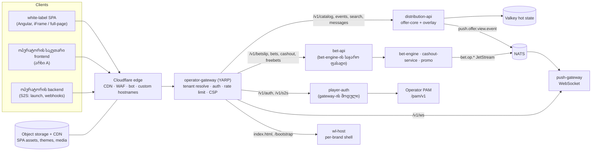

# 11 — მოთამაშის ფენა: Sportsbook Player API, real-time, white-label frontend და iFrame ინტეგრაცია

> ⚠ შეთანხმებული გადაწყვეტილებები: [docs/09 §2](09-backoffice-plan.md#2-სავალდებულო-გადაწყვეტილებები-0508-ის-შეთანხმება) (პუნქტი 16).

> ⚠ შეთანხმებული გადაწყვეტილებები: [docs/09 §2](09-backoffice-plan.md#2-სავალდებულო-გადაწყვეტილებები-0508-ის-შეთანხმება). კონფლიქტის შემთხვევაში docs/09 სავალდებულოა. ეს დოკუმენტი პასუხობს 09 §6.1-ის ღია საკითხს („მოთამაშის frontend“) და **ცვლის** 07 §2.8-ს, 07 §5.5-ის player endpoint-ებს, 08 §5.9-ის `/api/player/*`-ს, 06 §6.3-ის `/api/sb/v1/*` გზებს და 10 §4.4-ის მოთამაშის API-ს. რა უნდა შეიცვალოს სხვა დოკუმენტებში, ჩამოწერილია §12-ში.

> **სტატუსი:** design draft v0.1 · **თარიღი:** 2026-10-04
> **სფერო:** მოთამაშისთვის განკუთვნილი ფენა — საჯარო **Sportsbook Player API** (`/v1`), real-time WebSocket, **white-label frontend** (ჩვენი sportsbook UI, რომელიც ოპერატორის საიტზე iFrame-ით ჩაიდგმება), postMessage კონტრაქტი, ბრენდის theming (BO ეკრანი), უსაფრთხოება და ოპერატორის onboarding.
> **დაკავშირებული:** [04](04-platform-architecture.md) (§2 სერვისები, §9.4 operator API, §9.5 widgets) · [06](06-backoffice-catalog-odds-config.md) (§3.4 fallback, §4.2 offer-core, §5.8 CFG, §6 CMS, §7 propagation) · [07](07-backoffice-trading-risk-customers.md) (§2 bet engine, §5 cash-out, §7 PAM, §10 reason code-ები) · [08](08-backoffice-platform-reporting-promo.md) (§1 არქიტექტურა, §5.6 freebet placement) · [10](10-backoffice-bet-monitoring.md) (§3.1 `referral.*`, §4 referral lifecycle, §7.3 კოდები).
> **მომხმარებლის გადაწყვეტილებები (2026-10-04, სავალდებულო):**
> - ოპერატორს ორივე ვარიანტს ვთავაზობთ: **(A)** საჯარო Player API დიდი ოპერატორებისთვის, რომლებსაც საკუთარი frontend აქვთ, და **(B)** white-label frontend პატარა ოპერატორებისთვის. B-ს ოპერატორი მცირე კონფიგურაციით საკუთარ დიზაინზე არგებს და iFrame-ით ჩასვამს.
> - Counter-offer **P0**-ია (ნაწილობრივი მიღება მოთამაშის თანხმობის გარეშე საქართველოში არ გამოიყენება). Referral timeout: live 30 წმ, prematch 180 წმ. თუ განხილვისას მარკეტი დაიხურა, ბილეთი ავტომატურად უქმდება. მოთამაშეს განხილვაზე მყოფი ფსონის **გაუქმება არ შეუძლია**.
>
> დომენები ამ დოკუმენტში placeholder-ია: `sb.example` = ჩვენი პლატფორმის დომენი, `operator.ge` = ოპერატორის დომენი. ⚠ = გადასაწყვეტი/გადასამოწმებელი.

## სარჩევი

0. [მოკლედ — ძირითადი გადაწყვეტილებები](#0-მოკლედ--ძირითადი-გადაწყვეტილებები)
1. [არქიტექტურა](#1-არქიტექტურა)
2. [Player API (`/v1`)](#2-player-api-v1)
3. [Real-time: WebSocket პროტოკოლი](#3-real-time-websocket-პროტოკოლი)
4. [Caching და performance](#4-caching-და-performance)
5. [White-label frontend](#5-white-label-frontend)
6. [iFrame ინტეგრაციის კონტრაქტი](#6-iframe-ინტეგრაციის-კონტრაქტი)
7. [Theming და ბრენდის კონფიგურაცია](#7-theming-და-ბრენდის-კონფიგურაცია)
8. [უსაფრთხოება](#8-უსაფრთხოება)
9. [ოპერატორის onboarding](#9-ოპერატორის-onboarding)
10. [P0 / P1 / P2, ეტაპები, შეფასება](#10-p0--p1--p2-ეტაპები-შეფასება)
11. [Edge case-ები](#11-edge-case-ები)
12. [საჭირო ცვლილებები 04/06/07/08/09/10-ში](#12-საჭირო-ცვლილებები-040607080910-ში)
13. [ღია საკითხები](#13-ღია-საკითხები)

---

## 0. მოკლედ — ძირითადი გადაწყვეტილებები

| საკითხი | გადაწყვეტილება | რატომ |
|---|---|---|
| ორი არხი, ერთი API | White-label frontend არის საჯარო Player API-ის **პირველი კლიენტი** (first-party client). შიდა, „დამალული“ endpoint-ები მას არ აქვს | ერთი კონტრაქტი, ერთი ტესტების ნაკრები. API-ს ყოველდღიურად ჩვენი UI ამოწმებს, ამიტომ დიდი ოპერატორი იღებს უკვე გამოცდილ API-ს |
| API-ის ფორმა | REST/JSON, **OpenAPI 3.1 first** (`schemas/openapi/player-api.v1.yaml`), WS — AsyncAPI 3. ვერსია path-შია (`/v1`), ცვლილებები მხოლოდ additive-ია | ოპერატორები სხვადასხვა ენაზე წერენ. SDK-ები სპეციფიკაციიდან გენერირდება (TS, C#) |
| Host-ები | A: `https://api.sb.example/v1/*` (CORS, API key). B: **same-origin** `https://{brand-host}/api/v1/*`, სადაც `{brand-host}` = `{brand}.sb.example` ან ოპერატორის CNAME `sport.operator.ge` | white-label-ს CORS preflight არ სჭირდება (−1 RTT მობილურზე). ორივე ერთსა და იმავე gateway-ზე მიდის |
| Tenant routing | **API key → brand** (anonymous), **player token → operator + brand + customer**. ორივეს brand უნდა ემთხვეოდეს. White-label-ში brand-ს host განსაზღვრავს | 09 §2.1 (`operator → brand`). Brand-ის გარეშე ორი დომენის წესი ვერ შესრულდება |
| ავტორიზაცია | ოპერატორის PAM session → **ჩვენი მოკლევადიანი player token** (JWT ES256, 10 წთ) + refresh. ორი გზა: S2S `launch code` (რეკომენდებული) ან PAM token-ის გაცვლა `/pam/v1/session/validate`-ით. Anonymous browsing ნებადართულია | PAM token ჩვენს სისტემაში არ ცირკულირებს. ყოველ request-ზე PAM-ს არ ვეკითხებით |
| Real-time | **Raw WebSocket** (ASP.NET Core WebSockets + `System.IO.Pipelines`) საკუთარი JSON პროტოკოლით: snapshot + delta, per-channel `seq`, resume. **SignalR — არა** | SignalR-ის პროტოკოლი ოპერატორს ჩვენს client library-ს ახვევს თავს და sticky session-ს ან backplane-ს ითხოვს. Resume/seq მასში მაინც თავად უნდა დავწეროთ |
| Fan-out | `offer-publisher` (distribution-api-ის ნაწილი) ითვლის **view**-ს (`operator, brand`) და NATS core-ზე აქვეყნებს `push.offer.{view}.{event}`-ზე. `push-gateway` მხოლოდ იმ subject-ებს იწერს, რომლებზეც მასთან subscriber-ი არსებობს | 06 §7-ის overlay ერთხელ ითვლება view-ზე და არა ყოველ კავშირზე. NATS interest-based routing ზედმეტ ტრაფიკს თავიდან გვაცილებს |
| White-label tech | **Angular 22**: zoneless, signals, standalone, `@defer`. **CSR + prerendered app shell**, SSR — P2 (მხოლოდ full-page რეჟიმის SEO-სთვის). Angular Material **არა** — საკუთარი მსუბუქი UI kit + CDK (a11y/overlay) | გუნდი Angular-ზეა, BO-სთან საერთო libs. ბიუჯეტი ≤ 150 KB gzip initial JS. iFrame-ში SEO არ მოქმედებს, ამიტომ SSR-ის ფასი (Node runtime, per-brand cache) P0-ში არ ამართლებს |
| Token-ის გადაცემა iFrame-ში | **postMessage handover** (`sb:auth {launchCode}`), **არა** URL `?token=` | URL ლოგებში, Referer-ში, history-ში და ეკრანის ანაბეჭდებში ჟონავს. launch code ერთჯერადია, 60 წმ-იანი |
| Cookies | **არცერთი.** Token მხოლოდ მეხსიერებაშია, betslip — partitioned `sessionStorage`-ში | Safari ITP / Chrome third-party cookie შეზღუდვები iFrame-ში. ასე ეს პრობლემა საერთოდ არ წარმოიქმნება |
| iFrame src | **რეკომენდაცია: ოპერატორის CNAME** (`sport.operator.ge` → ჩვენი edge), `{brand}.sb.example` — fallback | same-site iFrame: ITP ნაკლებად ერევა, ⚠ რეგულატორს შეიძლება სჭირდებოდეს, რომ კონტენტი ლიცენზირებულ დომენზე იყოს (§1.6) |
| Fallback რეჟიმი | **Full-page** რეჟიმი იმავე CNAME-ზე (`sport.operator.ge`): ოპერატორის header/footer კონფიგურაციიდან, login → redirect ოპერატორთან | მობილური app-ების WebView, ოპერატორები, რომელთა საიტიც iFrame-ს ცუდად ატარებს |
| Theming | **Design tokens → CSS custom properties**. თემა ვერსიონირებულია (`bo.brand_theme`, draft → published), CDN-ზე immutable URL-ით. BO ეკრანი `/wl/branding` live preview-ით | ოპერატორი ფერებს/ფონტს/layout-ს თავად ცვლის deploy-ის გარეშე |
| Custom CSS | P0-ში **არა**. P1: sandboxed (scope `.sb-root`, sanitizer, ≤ 20 KB, platform review) | თავისუფალი CSS განახლებებს ამტვრევს და შეიძლება რეგულატორული ელემენტები (25+, RG ბმულები) დამალოს |
| UI ტექსტები | CMS-ის ნაწილია (`bo.message_def.category = 'ui'`), runtime-ში იტვირთება bundle-ით | ერთი მექანიზმი reason code-ებთან. ოპერატორს ნებისმიერი label-ის გადაწერა შეუძლია, build-ის გარეშე |
| Counter-offer და referral | P0. Public status `pending_review` (შიდა `referred`), push `counter_offer`. **withdraw endpoint არ არსებობს** | მომხმარებლის გადაწყვეტილება 2026-10-04 |

---

## 1. არქიტექტურა

### 1.1 კომპონენტები



| სერვისი | პასუხისმგებლობა | შენიშვნა |
|---|---|---|
| `operator-gateway` | YARP (.NET 10) reverse proxy: host/API key → brand, JWT ვალიდაცია, rate limit (Valkey token bucket), CORS, `frame-ancestors` CSP, request id, OTel | 04 §2.1-ის `operator-gateway`. Stateless, horizontal. **Business ლოგიკა მასში არ არის** |
| `player-auth` | `/v1/auth/*` და `/v1/s2s/*`: launch code, PAM token-ის გაცვლა, refresh, revoke | gateway-ის მოდული (იგივე პროცესი). Signing key-ები OpenBao-ში |
| `distribution-api` | catalog, events, event detail, search, featured, messages bundle; `offer-publisher` real-time view-ებისთვის | 06 §7-ის overlay, 09 §2.8 `offer-core`. აქამდე „შიდა/demo“ იყო, ახლა საჯარო ხდება |
| `bet-api` | betslip calculate, place, my bets, cash-out, counter-offer, freebets | bet-engine-ის თხელი ფასადი: DTO mapping, CMS ტექსტები, ProblemDetails. Pilot-ზე ერთ deployable-შია `betting-core`-თან (07 §1) |
| `push-gateway` | WebSocket: offer არხები (NATS core) და პერსონალური არხი (JetStream `bet.{op}.*` → Valkey stream) | ცალკე deployable: გრძელი კავშირები სხვა API-ს არ ტვირთავს |
| `wl-host` | white-label-ის `index.html` brand-ის bootstrap-ით (brand id, publishable key, theme URL, ენები, CSP nonce), `/.well-known/sb-brand.json` | მცირე ASP.NET Core endpoint, cache 60 წმ. SPA-ის JS/CSS CDN-იდანაა |

### 1.2 ორი არხი, ერთი API (რეკომენდაცია)

| | არხი A — საკუთარი frontend | არხი B — white-label |
|---|---|---|
| ვინ | დიდი ოპერატორი, საკუთარი dev გუნდი | პატარა/საშუალო ოპერატორი |
| რას იყენებს | `/v1` REST + `/v1/ws` + SDK (TS/C#) + webhooks | იგივე `/v1` + `/v1/ws`, ჩვენი SPA, `sb-embed.js` |
| Host | `api.sb.example` (CORS allowlist) | `{brand-host}/api/v1` (same-origin) |
| Auth | S2S launch code ან PAM token exchange | S2S launch code (postMessage-ით) |
| UI ტექსტები | საკუთარი, ან `/v1/messages` bundle | CMS bundle (`category in (bet_reject, cashout, ui)`) |
| ვერსიები | `/v1` stable, deprecation ≥ 12 თვე | SPA ყოველთვის უახლეს `/v1`-ზეა |

**წესები:**
- White-label SPA მხოლოდ OpenAPI-ში აღწერილ endpoint-ებს იძახებს. CI-ის lint (`spectral` + contract test) ამოწმებს, რომ SPA-ის SDK იგივე სპეციფიკაციიდანაა აწყობილი. თუ SPA-ს ახალი რამ სჭირდება, ჯერ API-ში ემატება.
- ერთადერთი გამონაკლისი `wl-host`-ის bootstrap-ია (`/bootstrap.json`). ეს API-ის ნაწილი არ არის, მხოლოდ SPA-ის კონფიგურაციაა.
- Feature flag-ები (`wl.modules.*`, §7.3) API-ის ქცევაზეც მოქმედებს: თუ cash-out ბრენდზე გამორთულია, `cashout` ველი პასუხებში არ ჩანს, endpoint კი აბრუნებს `CASHOUT_UNAVAILABLE`-ს.

### 1.3 Multi-tenant routing

```
request ──► host / X-Api-Key ──► brand_id ──► operator_id
                │                    │
                │                    └─ Authorization: Bearer <player token> ⇒ claims {op, brand, cus}
                │                        brand(token) ≠ brand(host/key) ⇒ 401 TOKEN_BRAND_MISMATCH
                └─ white-label: host → bo.brand_domain (Valkey cache 60 წმ); A: publishable key → bo.api_key
```

- **Publishable key** (`pk_live_…`, `pk_test_…`) brand-ს იდენტიფიცირებს და საიდუმლო არ არის (frontend-ში ჩანს). მისით მხოლოდ საჯარო read-ია შესაძლებელი. **Secret key** (`sk_live_…`) მხოლოდ S2S-სთვისაა და HMAC-ით გამოიყენება (§8.3).
- Gateway ყოველ request-ს ამატებს `X-Sb-Operator`, `X-Sb-Brand`, `X-Sb-Customer` header-ებს (კლიენტის მიერ გამოგზავნილი ამავე სახელის header-ები იშლება). Downstream სერვისები tenant-ს მხოლოდ მათგან იღებენ და PG ტრანზაქციაში `app.operator_id`-ს აყენებენ (09 §2.5, RLS).
- **Offer view** = `(operator_id, brand_id)`. თუ ბრენდს საკუთარი CFG მნიშვნელობები არ აქვს, view ოპერატორისას ემთხვევა და cache/fan-out გაზიარებულია (`view_key = op:{op}` ან `op:{op}:b:{brand}`). ამას `distribution-api` overlay-ის აგებისას ადგენს.

### 1.4 Edge: CDN, WAF, rate limiting

| ფენა | რა | კონფიგურაცია |
|---|---|---|
| Cloudflare (CDN) | SPA assets (`/assets/*`, hash-იანი, `immutable, max-age=31536000`), themes, media, anonymous catalog GET-ები (§4.2) | 04 §7 უკვე Cloudflare DNS-ს იყენებს. ⚠ Cloudflare for SaaS (custom hostnames ოპერატორის CNAME-ებისთვის) ფასიანია ~$0.10/hostname/თვე [გადასამოწმებელი] |
| WAF | managed ruleset, OWASP core, `/v1/bets*` და `/v1/auth*` მხოლოდ POST/GET, body ≤ 64 KB, geo-rules ბრენდის მიხედვით (§1.6) | Rules-as-code (Terraform `cloudflare` provider) |
| Bot protection | Turnstile **მხოლოდ** საეჭვო ქცევისას: მაგ. anonymous search > N/წთ ან auth exchange-ის ხშირი წარუმატებლობა. ფსონის დადებაზე captcha არასდროს | ფსონის UX-ზე CAPTCHA მიუღებელია. ბოტისგან placement-ს token + rate limit + LIM იცავს |
| Rate limit (edge) | IP-ზე უხეში ლიმიტი: 300 req/10 წმ, WS upgrade 20/წთ | DDoS/scraping |
| Rate limit (gateway) | Valkey token bucket ზუსტი გასაღებებით (§8.4): per player, per IP, per API key | ბიზნეს ლიმიტები. `429` + `Retry-After` |
| Origin | Hetzner (04 §7), origin მხოლოდ Cloudflare IP-ებს იღებს (firewall + authenticated origin pulls) | WAF-ის გვერდის ავლა შეუძლებელია |

### 1.5 Deploy-ის დაჯგუფება pilot-ზე

| Deployable | შიგნით |
|---|---|
| `sb-gateway` | operator-gateway + player-auth + wl-host |
| `distribution-api` | REST + offer-publisher |
| `betting-core` | bet-engine + bet-api + cashout-service (07 §1) |
| `push-gateway` | WebSocket (ცალკე — კავშირების რაოდენობით მასშტაბირდება) |

### 1.6 Geo და რეგულაცია

- **ორი დომენის წესი (05 §5, 09 §2.1):** ერთი ოპერატორი = ორი brand (`GE-domestic`, `GE-international`), თითოს საკუთარი host-ები, API key-ები, თემა და CFG. Player token-ის brand PAM-ის მონაცემით მოწმდება: `player.country`/`citizenship` brand-ის `jurisdiction_profile`-ის წესს უნდა აკმაყოფილებდეს (მაგ. international brand-ზე საქართველოს მოქალაქე ⇒ `BRAND_NOT_ALLOWED_FOR_PLAYER`). ⚠ ზუსტი კრიტერიუმი (მოქალაქეობა თუ რეზიდენტობა) იურისტმა უნდა დაადასტუროს.
- **ასაკი 25+, self-exclusion, რეესტრი:** placement-ზე მოწმდება (09 §2.10). Token exchange-ზეც ვამოწმებთ: თუ PAM-ის status `blocked` ან `self_excluded` არის, token გაიცემა `scope=browse`-ით. მოთამაშე offer-ს ხედავს, ფსონს ვერ დებს და UI აჩვენებს CMS ტექსტს `PLAYER_SELF_EXCLUDED`.
- **Geo-blocking:** `bo.brand.geo_policy` (`allow_countries` / `deny_countries`) edge-ზე `CF-IPCountry`-ით მოწმდება და მხოლოდ placement/auth endpoint-ებზე მოქმედებს, browsing-ზე არა ⚠. VPN-ის აღმოჩენა P2-ია.
- **რეკლამის შეზღუდვები:** promo ბლოკები/ბანერები (CMS content, P2) მხოლოდ ავტორიზებულ მოთამაშეს უჩანს, თუ `brand.jurisdiction_profile = GE-domestic` ⚠ (06 §6.5).
- **⚠ ლიცენზირებული დომენი:** შეიძლება რეგულატორი მოითხოვდეს, რომ ფსონის მიღების ინტერფეისი ოპერატორის ლიცენზირებულ დომენზე იყოს. ამიტომ iFrame-ის src-ად ოპერატორის CNAME-ს ვურჩევთ (`sport.operator.ge`). ჩვენი `{brand}.sb.example` მხოლოდ sandbox-სა და დროებით fallback-ს ემსახურება.
- **მონაცემების ადგილმდებარეობა:** 09 §6.5-ის იურიდიული საკითხი. Edge cache-ში PII არ ინახება (personal პასუხები `no-store`-ია).

---

## 2. Player API (`/v1`)

### 2.1 კონვენციები

| საკითხი | წესი |
|---|---|
| Base URL | A: `https://api.sb.example/v1` · B: `https://{brand-host}/api/v1` · sandbox: `https://api.sandbox.sb.example/v1` |
| Header-ები | `X-Api-Key: pk_…` (anonymous; B-ში host-იდან მოდის და არასავალდებულოა) · `Authorization: Bearer <player token>` · `Accept-Language: ka` (ან `?lang=`) · `X-Request-Id` · `Idempotency-Key` (ყველა write POST) |
| ფორმატი | JSON, `camelCase`, დრო ISO 8601 UTC (`2026-10-04T18:00:00Z`), **თანხა და odds string-ად** (`"10.00"`, `"2.06"`), ვალუტა ISO 4217 |
| ID-ები | ჩვენი canonical id-ები (`ev_…`, `mk_…`, outcome = `{marketId}:{outcomeCode}`). Sportradar URN-ები ცალკე ველშია (`providerRefs.sr`, widget-ებისთვის) |
| Pagination | cursor: `?limit=50&cursor=…` → `{items, nextCursor}` (08 §1.7) |
| Odds format | API ყოველთვის **decimal**-ს აბრუნებს. fractional/american ფორმატირება კლიენტის საქმეა (SDK-ს აქვს `formatOdds()`) |
| ენა | სახელები უკვე თარგმნილია (06 §3.4 fallback chain). `Content-Language` header-ი პასუხში საბოლოო ენას აჩვენებს |
| ვერსიონირება | `/v1` ფარგლებში ცვლილება მხოლოდ additive-ია: ახალი ველები და ახალი enum მნიშვნელობები. კლიენტი უცნობ enum-ს `unknown`-ად უნდა ამუშავებდეს (SDK ამას აკეთებს). Breaking ცვლილება ⇒ `/v2`, `/v1` კი ≥ 12 თვე მუშაობს `Deprecation` და `Sunset` header-ებით |
| Rate limit | `RateLimit-Limit`, `RateLimit-Remaining`, `RateLimit-Reset` (IETF draft) |

### 2.2 ავტორიზაციის მოდელი

**Player token** (JWT, ES256, `kid` rotation, TTL **10 წთ**):
```json
{ "iss":"https://auth.sb.example", "aud":"sb-player", "sub":"cus_01J9…", "op":12, "brand":31,
  "cur":"GEL", "lang":"ka", "scope":"bet", "sid":"ps_01J9…", "pamSub":"<hash>", "exp":1790000600 }
```
- `sub` არის ჩვენი `bo.customer.id` (PAM player id-ის mirror, 07 §6). PAM-ის token-ი და player id JWT-ში ღიად არ იწერება, მხოლოდ hash-ის სახით.
- `scope`: `browse` (ავტორიზებულია, მაგრამ ფსონი არ შეუძლია — blocked, self-excluded, 25-ზე ნაკლები) ან `bet`.
- **Refresh token**: opaque, 1 სთ sliding, მაქსიმუმ PAM session-ის `session_expires_at`-მდე. მიბმულია `sid`-ზე და ერთჯერადია (rotation, reuse detection ⇒ მთელი `sid`-ის revoke). ინახება Valkey-ში `rt:{hash}`.
- Revoke: PAM webhook `player.status_changed` ან `self_excluded` (07 §7.3) ⇒ `sid` შავ სიაში (Valkey, TTL = token TTL) და push-gateway ამ მოთამაშის კავშირებს ხურავს `session.revoked`-ით.

**ორი გზა token-ის მისაღებად:**

| | 1. S2S launch code (**რეკომენდებული**) | 2. PAM token exchange |
|---|---|---|
| ნაკადი | ოპერატორის backend → `POST /v1/s2s/launch-codes` (HMAC, secret key) `{pamPlayerId, pamSessionRef, lang, currency, brand}` → `{launchCode, expiresAt}` (60 წმ, ერთჯერადი) → frontend → `POST /v1/auth/exchange {launchCode}` | frontend → `POST /v1/auth/exchange {pamToken}` → ჩვენ ვიძახებთ `/pam/v1/session/validate` (07 §7.2) |
| PAM-ის დამოკიდებულება | PAM validate-ის გარეშეც მუშაობს (ოპერატორის backend-მა მოთამაშე უკვე იცის). Refresh-ზე ვიძახებთ validate-ს, თუ PAM-ს აქვს. თუ არა, ოპერატორი ახალ launch code-ს გასცემს | სჭირდება validate endpoint |
| უსაფრთხოება | PAM token ჩვენთან საერთოდ არ მოდის | PAM token ბრაუზერიდან ჩვენთან მოდის (TLS, არ ილოგება) |
| ვისთვის | iFrame (B), დიდი ოპერატორებიც | ოპერატორები, რომლებსაც S2S ინტეგრაცია არ სურთ |

**Anonymous:** მხოლოდ publishable key-ით (ან brand host-ით) ხელმისაწვდომია catalog, events, search, messages, `betslip/calculate` (პერსონალური ლიმიტებისა და freebet-ების გარეშე) და WS offer არხები. Placement, my bets, cash-out და freebets token-ს ითხოვს (`401 PLAYER_SESSION_INVALID` + `loginRequired: true`).

```
POST /v1/auth/exchange     {launchCode} | {pamToken}  → {accessToken, expiresIn, refreshToken, player:{id, currency, lang, scope, displayName?}}
POST /v1/auth/refresh      {refreshToken}             → იგივე (rotation)
POST /v1/auth/logout       {refreshToken}             → 204 (sid revoke, WS close)
POST /v1/s2s/launch-codes  (HMAC, sk_)                → {launchCode, expiresAt}
POST /v1/s2s/sessions/{pamSessionRef}/revoke (HMAC)   → 204   (ოპერატორის logout/blocked)
```

### 2.3 Endpoint-ების კატალოგი

| Method · path | Auth | აღწერა | P |
|---|---|---|---|
| `GET /v1/catalog/tree?live=&lang=` | anon | sport → category → tournament ხე, მრიცხველებით (`eventCount`, `liveCount`), custom groups, top leagues | P0 |
| `GET /v1/events?sport=&category=&tournament=&status=prematch\|live&from=&to=&market=main&limit=&cursor=` | anon | ივენთების სია მთავარი მარკეტით | P0 |
| `GET /v1/events/{eventId}?marketGroup=&lang=` | anon | ივენთი + ყველა მარკეტი (ჯგუფებით) + score/clock | P0 |
| `GET /v1/events/{eventId}/markets?group=` | anon | მხოლოდ მარკეტები (ტაბის lazy load) | P0 |
| `GET /v1/search?q=&limit=` | anon | ივენთები, გუნდები, ლიგები (prefix + fuzzy, ka/en/ru transliteration) | P0 |
| `GET /v1/featured?placement=home` | anon | featured ივენთები, top leagues, „დღის მატჩები“ (CAT top/featured) | P0 |
| `GET /v1/live/overview?sport=` | anon | live centre: ყველა live ივენთი score-ით და მთავარი მარკეტით | P0 |
| `POST /v1/betslip/calculate` | anon / token | odds, combinability, min/max stake, potential win, ხელმისაწვდომი freebet-ები | P0 |
| `POST /v1/bets` | token `bet` | ფსონის დადება (Idempotency-Key სავალდებულოა) | P0 |
| `GET /v1/bets/{ticketId}` | token | ბილეთის სტატუსი (WS-ის fallback polling) | P0 |
| `GET /v1/bets?status=open\|settled&from=&to=&cursor=` | token | ჩემი ფსონები | P0 |
| `POST /v1/bets/{ticketId}/counter-offer/accept` · `/decline` | token | counter-offer-ზე პასუხი | **P0** |
| `POST /v1/bets/{ticketId}/cashout/quote` | token | cash-out შეთავაზება | P0 |
| `POST /v1/bets/{ticketId}/cashout` | token | cash-out შესრულება | P0 |
| `GET /v1/cashout/offers?ticketIds=` | token | batch quote-ები My bets-ისთვის | P1 (P0-ში WS) |
| `GET /v1/freebets?status=active` | token | მოთამაშის freebet-ები | P0 (თუ PROMO P0-შია, 09 §4) |
| `POST /v1/promo-codes/redeem` · `POST /v1/campaigns/{id}/opt-in` | token | promo (08 §5.9) | P1 |
| `GET /v1/messages?lang=&categories=` | anon | CMS bundle (reason code-ები + UI ტექსტები) | P0 |
| `GET /v1/me` | token | profile view: currency, lang, scope, odds policy preference | P0 |
| `PUT /v1/me/preferences` | token | `oddsPolicy`, `oddsFormat`, `quickStakes` | P1 |
| `GET /v1/me/balance` | token | PAM balance proxy (cache 2 წმ) — მხოლოდ full-page რეჟიმისთვის | P1 |
| `GET /v1/server-time` | anon | `{now}` countdown-ების clock skew-სთვის (ასევე ყველა WS მესიჯში) | P0 |

**Withdraw endpoint ჯერჯერობით არ არსებობს** (მომხმარებლის გადაწყვეტილება). 10 §4.4-ის `POST /v1/bets/{id}/withdraw` ამოღებულია.

### 2.4 Request/response sketch-ები

**Catalog tree**
```json
GET /v1/catalog/tree?lang=ka
{ "version":"o12b31:v8841:f99231",
  "sports":[{ "id":"sp_1","name":"ფეხბურთი","icon":"https://cdn.sb.example/m/sp_1.svg","eventCount":812,"liveCount":34,"order":1,
    "categories":[{ "id":"ct_1","name":"საქართველო","flag":"GE","order":1,
      "tournaments":[{ "id":"tr_88","name":"ეროვნული ლიგა","eventCount":5,"liveCount":1,"isTop":true }]}]}],
  "groups":[{ "id":"cg_7","name":"ქართული ფეხბურთი","items":["tr_88","tr_89"] }] }
```

**Events list**
```json
GET /v1/events?sport=sp_1&status=live&market=main&limit=50
{ "items":[{
    "id":"ev_01J9…","sport":"sp_1","tournament":{"id":"tr_88","name":"ეროვნული ლიგა"},
    "competitors":[{"id":"cp_1","name":"დინამო თბილისი","logo":"…"},{"id":"cp_2","name":"ტორპედო ქუთაისი","logo":"…"}],
    "startTime":"2026-10-04T16:00:00Z","status":"live",
    "score":{"home":1,"away":0,"period":"2H","clock":{"running":true,"minute":63,"ts":"2026-10-04T17:08:11Z"}},
    "marketCount":148,"flags":{"cashout":true,"stream":false},
    "mainMarket":{"id":"mk_…","typeId":1,"name":"1X2","status":"active",
      "outcomes":[{"code":"1","name":"1","odds":"1.62"},{"code":"2","name":"X","odds":"3.70"},{"code":"3","name":"2","odds":"5.40"}]},
    "seq":18834 }],
  "nextCursor":"eyJ…" }
```
- `status` (public): `prematch | live | suspended | ended | cancelled`. Market `status`: `active | suspended`. hidden/deactivated მარკეტები პასუხში საერთოდ არ ჩანს (06 §4.4 precedence).
- `seq` არის ივენთის offer seq (06 §7.3), რომლითაც კლიენტი REST snapshot-სა და WS delta-ს ერთმანეთს უთანხმებს (§3.3).

**Event detail**
```json
GET /v1/events/ev_01J9…?marketGroup=main
{ "event":{ …როგორც სიაში…, "venue":"დინამო არენა", "providerRefs":{"sr":"sr:match:5012345"} },
  "marketGroups":[{"code":"main","name":"მთავარი"},{"code":"goals","name":"გოლები"},{"code":"halves","name":"ტაიმები"}],
  "markets":[{
    "id":"mk_…","typeId":18,"name":"ტოტალი 2.5","specifiers":{"total":"2.5"},"group":"goals","status":"active",
    "cashout":true,"combinable":true,"order":20,
    "outcomes":[{"code":"12","name":"მეტი 2.5","odds":"1.85","prevOdds":"1.80"},{"code":"13","name":"ნაკლები 2.5","odds":"1.95"}] }],
  "seq":18834 }
```
- სახელები `offer-core`-ში I18N template-ებით იქმნება (06 §3.5): `{!periodnr}`, `{+hcp}`, `{$competitor1}` → ბრენდის ენაზე და fallback chain-ით. კლიენტი template-ებს არასდროს იღებს.
- `prevOdds` მხოლოდ მაშინ ჩანს, როცა ბოლო 10 წმ-ში ფასი შეიცვალა (ისრის ჩვენებისთვის).

**Search** — `GET /v1/search?q=dinamo` → `{events:[…მოკლე…], competitors:[…], tournaments:[…]}`. Index-ი `distribution-api`-ის მეხსიერებაშია, view-ზე და ენაზე: n-gram + ka↔lat transliteration („დინამო“ = „dinamo“), ≤ 30 ms. ElasticSearch P0-ში არ გვჭირდება.

**Betslip calculate**
```json
POST /v1/betslip/calculate
{ "currency":"GEL", "oddsPolicy":"higher",
  "selections":[{"outcomeId":"mk_a:1","odds":"1.62"},{"outcomeId":"mk_b:12","odds":"1.85"}],
  "bets":[{"type":"single","stakes":{"mk_a:1":"10.00"}},{"type":"accumulator","stake":"5.00"},{"type":"system","k":2,"stake":"6.00"}],
  "freebetId":null }
→ 200
{ "selections":[
    {"outcomeId":"mk_a:1","status":"active","odds":"1.62","changed":false,"name":"დინამო თბილისი — 1X2: 1","eventId":"ev_…","live":true},
    {"outcomeId":"mk_b:12","status":"active","odds":"1.90","changed":true,"direction":"up"}],
  "combinability":{"accumulator":true,"system":[2],"conflicts":[]},
  "bets":[
    {"type":"single","outcomeId":"mk_a:1","stake":"10.00","minStake":"1.00","maxStake":"850.00","potentialWin":"16.20"},
    {"type":"accumulator","totalOdds":"3.078","stake":"5.00","minStake":"1.00","maxStake":"420.00","potentialWin":"15.39"},
    {"type":"system","k":2,"lines":1,"stakePerLine":"6.00","potentialWin":"18.47"}],
  "freebets":[{"id":"fb_…","amount":"5.00","currency":"GEL","validTo":"2026-10-10T20:00:00Z","eligible":true}],
  "liveDelaySec":5, "quoteTtlSec":10 }
```
- `maxStake` = effective limit (07 §4.2: scope × customer, `min()`). Anonymous-ზე customer ღერძი არ მონაწილეობს, ამიტომ ეს მნიშვნელობა მხოლოდ საორიენტაციოა. ⚠ ზუსტი liability-ზე დაფუძნებული max (Lua) calculate-ზე **არ** ითვლება: ის placement-ზე ბრუნდება `max_allowed_stake`-ით. მიზეზი: calculate ბევრად ხშირია, Lua კი წერის ოპერაციაა.
- `conflicts`: `SELECTIONS_NOT_COMBINABLE` (იგივე ივენთი, `bet.combo.allow_same_event=false`) — ორივე selection-ის id-ით.
- Calculate არაფერს ინახავს და არაფერს აკავებს (pure read, `offer-core`-ის იგივე config version).

**Place bet**
```json
POST /v1/bets
Idempotency-Key: 7f6b0c1e-…            (კლიენტი ქმნის slip-ის ყოველ „Place“ დაჭერაზე; retry — იგივე key)
{ "currency":"GEL", "oddsPolicy":"higher", "channel":"web_mobile",
  "selections":[{"outcomeId":"mk_a:1","odds":"1.62"},{"outcomeId":"mk_b:12","odds":"1.90"}],
  "bets":[{"type":"accumulator","stake":"500.00"}], "freebetId":null }
```
| შედეგი | HTTP | body (მოკლედ) | შემდეგ |
|---|---|---|---|
| მიღებულია | `201` | `{placementId, tickets:[{id, publicCode, status:"accepted", stake, totalOdds, potentialWin, oddsAccepted[]}]}` | — |
| live delay | `202` | `{tickets:[{id, status:"pending", delayMs:5000}]}` | WS `bet.status` ან polling `GET /v1/bets/{id}` |
| განხილვაზე (referral) | `202` | `{tickets:[{id, status:"pending_review", code:"BET_REFERRED", message, reviewExpiresAt}]}` | WS: `accepted` / `counter_offer` / `rejected` |
| უარყოფილი | `409`/`422`/`402`/`403` | ProblemDetails (§2.5) | UI სთავაზობს `max_allowed_stake`-ს / ახალ odds-ს |
| idempotent retry | `200`/`201`/`202` | იგივე შედეგი, header `Idempotent-Replayed: true` | — |
| key collision სხვა body-ით | `409` | `IDEMPOTENCY_CONFLICT` | — |

- რამდენიმე single ერთ slip-ში ერთ placement-ს ქმნის, რომელშიც რამდენიმე ticket-ია (07 §0). შედეგი ticket-ების მიხედვით ბრუნდება: ნაწილი შეიძლება მიღებული იყოს, ნაწილი უარყოფილი (`207`-ს არ ვიყენებთ — `201`, თითო ticket-ს თავისი status აქვს, ხოლო `errors[]` უარყოფილებს ჩამოთვლის).
- `oddsPolicy` (`none | higher | any`, 07 §2.4): მოთამაშის არჩევანია betslip-ში. Default = CFG `bet.odds_change_policy`.
- Freebet: `freebetId` ⇒ stake = freebet-ის თანხა (08 §5.6). ⚠ Freebet ფსონზე counter-offer-ით stake-ის შემცირება აკრძალულია (10 §4.2-ის რეკომენდაცია). Counter-offer მხოლოდ odds-ს ცვლის.

**Bet status / my bets**
```json
GET /v1/bets?status=open
{ "items":[{ "id":"tk_…","publicCode":"7K2M9QX4PA","placedAt":"…","type":"accumulator","status":"pending_review",
   "stake":"500.00","currency":"GEL","totalOdds":"3.078","potentialWin":"1539.00","funding":"cash",
   "selections":[{"eventId":"ev_…","eventName":"დინამო თბ. — ტორპედო","market":"1X2","outcome":"1","odds":"1.62",
                  "status":"open","live":true,"score":"1:0"}],
   "review":{"expiresAt":"…"}, "counterOffer":null,
   "cashout":{"available":true,"amount":"612.40","offerId":"co_…","expiresAt":"…"} }], "nextCursor":null }
```
Public ticket status: `pending | pending_review | counter_offer | accepted | rejected | won | lost | void | half_won | half_lost | cashed_out | cancelled` (+ `resettled: true` flag, როცა `settlement_version > 1`). Mapping შიდა მდგომარეობიდან: `referred` + `bet.referral.state ∈ {pending_review, claimed, awaiting_second_approval, deciding}` ⇒ `pending_review`; `awaiting_customer` ⇒ `counter_offer`. ტრეიდერის claim მოთამაშეს არ უჩანს.

**Counter-offer**
```json
WS personal: {"t":"evt","ch":"player","type":"bet.counter_offer","data":{
   "ticketId":"tk_…","original":{"stake":"500.00","totalOdds":"3.078"},
   "offer":{"stake":"200.00","totalOdds":"3.078","potentialWin":"615.60"},
   "expiresAt":"2026-10-04T17:09:01Z","serverTime":"2026-10-04T17:08:41Z","version":3}}

POST /v1/bets/tk_…/counter-offer/accept   Idempotency-Key: …   {"version":3}
→ 200 {"status":"accepted","stake":"200.00","refunded":"300.00"}
  | 409 COUNTER_OFFER_EXPIRED | 409 REFERRAL_ALREADY_DECIDED | 409 REFERRAL_MARKET_CHANGED
POST /v1/bets/tk_…/counter-offer/decline  {"version":3}  → 200 {"status":"rejected","code":"COUNTER_OFFER_DECLINED"}
```
- Counter-ის TTL = `referral.counter_offer_timeout_seconds` (default 20, 10 §3.1). countdown UI-ში ჩანს (10 §4.4). ვადის გასვლისას ⇒ `rejected COUNTER_OFFER_EXPIRED`, თანხა სრულად ბრუნდება (cancel/rollback, 10 §4.2).
- `version` სავალდებულოა: ტრეიდერმა შეიძლება counter-offer შეცვალოს (P1). ძველ ვერსიაზე accept ⇒ `409 COUNTER_OFFER_CHANGED` + ახალი offer.
- Accept-ზე bet-engine ხელახლა ამოწმებს market status-ს და odds-ს (10 §4.3). თუ მარკეტი დაიხურა ⇒ auto-cancel (`REFERRAL_MARKET_CHANGED`) — მომხმარებლის წესი.

**Cash-out**
```json
POST /v1/bets/tk_…/cashout/quote   {"fraction":null}
→ {"offerId":"co_…","amount":"612.40","currency":"GEL","expiresAt":"…(+5 წმ)","partial":{"enabled":false}}
POST /v1/bets/tk_…/cashout         Idempotency-Key: …  {"offerId":"co_…","amount":"612.40","acceptChanges":"within_tolerance"}
→ 202 {"status":"pending","delayMs":3000}  → WS bet.cashout {status:"cashed_out", amount:"610.90"}
  | 409 CASHOUT_PRICE_CHANGED {newOffer:{…}} | 409 CASHOUT_UNAVAILABLE | 409 CASHOUT_TICKET_SETTLED
```
07 §5.3 უცვლელია. `acceptChanges` = `none | within_tolerance` (`cashout.tolerance_pct`).

**Freebets** — `GET /v1/freebets?status=active` → `{items:[{id, amount, currency, validTo, eligibility:{sports, minOdds, minLegs, betTypes}, campaign:{name}}]}`. Eligibility იგივე snapshot-ია, რასაც bet-engine ამოწმებს (08 §5.6). Calculate ამის მიხედვით აბრუნებს `eligible`-ს.

**CMS bundle**
```json
GET /v1/messages?lang=ka&categories=bet_reject,cashout,ui
ETag: "cms:12:31:ka:v204"   Cache-Control: public, max-age=300
{ "version":204, "lang":"ka",
  "messages":{ "LIM_MAX_STAKE_EXCEEDED":{"title":"ფსონი ვერ მიიღება","text":"მაქსიმალური ფსონი არის {maxStake, number} {currency}"},
               "ui.betslip.place":{"text":"ფსონის დადება"} } }
```
06 §6.3-ის bundle ახლა **P0** ხდება (white-label-ს სჭირდება). Brand-level override-ებს (`bo.translation` ბრენდის scope-ით) ⚠ I18N-ში brand ღერძი სჭირდება (§12).

### 2.5 შეცდომების მოდელი

RFC 9457 **ProblemDetails**, `application/problem+json`:
```json
{ "type":"https://docs.sb.example/errors/STAKE_TOO_HIGH", "title":"ფსონი ვერ მიიღება", "status":422,
  "code":"STAKE_TOO_HIGH", "message":"მაქსიმალური ფსონი ამ არჩევანზე არის 150.00 GEL",
  "params":{"maxAllowedStake":"150.00","currency":"GEL"},
  "errors":[{"code":"STAKE_TOO_HIGH","ticketIndex":0,"selectionRef":"mk_a:1","params":{"maxAllowedStake":"150.00"}}],
  "traceId":"00-4bf9…-01" }
```
- `code` და `params` სტაბილური კონტრაქტია. `message` CMS-იდან მოდის (06 §6.3, ბრენდის ენაზე, `bo.message_override.map_to_code`-ის გათვალისწინებით). ოპერატორის frontend-ს შეუძლია საკუთარი ტექსტი გამოიყენოს.
- HTTP mapping = 07 §10 + 10 §7.3. დამატებითი API კოდები: `API_KEY_INVALID` (401), `TOKEN_BRAND_MISMATCH` (401), `BRAND_NOT_ALLOWED_FOR_PLAYER` (403), `SCOPE_BET_REQUIRED` (403), `IDEMPOTENCY_KEY_REQUIRED` (400), `IDEMPOTENCY_CONFLICT` (409), `RATE_LIMITED` (429), `COUNTER_OFFER_CHANGED` (409), `VALIDATION_FAILED` (400, `errors[].field`), `GEO_BLOCKED` (451).
- `ODDS_CHANGED`-ზე `params.currentOdds[]` ბრუნდება. SPA ამ ფასებს slip-ში აჩვენებს და მოთამაშეს ხელახალ დადასტურებას სთხოვს. ავტომატური ხელახალი მცდელობა არ ხდება (rate limit-ს და UX-ს უფრთხილდება).
- შიდა დეტალები (liability, risk group, rule hits) პასუხში არასდროს ჩანს (06 §6.5).

### 2.6 OpenAPI-first და SDK

- Source: `schemas/openapi/player-api.v1.yaml` (ხელით იწერება და ის არის მთავარი). ASP.NET Core კონტროლერები ამ სპეციფიკაციას უნდა ემთხვეოდეს: CI-ში ორივე მიმართულებით მოწმდება — `Microsoft.AspNetCore.OpenApi`-ის მიერ გენერირებული document vs spec, `oasdiff` breaking-change gate.
- WS: `schemas/asyncapi/player-ws.v1.yaml`, მესიჯების JSON Schema-ები.
- **TypeScript SDK** `@sb/player-sdk`: `openapi-typescript` (ტიპები) + `openapi-fetch` (~6 KB) + ხელით დაწერილი `SbSocket` (WS client: resume, seq, backoff) + `formatOdds`, `formatMoney`. მას white-label-იც იყენებს.
- **C# SDK** `Sb.Player.Client` (NuGet): NSwag-ით გენერირებული client + `HmacSigningHandler` S2S-სთვის + webhook signature verifier. მიზნობრივი აუდიტორია ოპერატორის backend-ია (launch codes, webhooks).
- Docs portal (§9.2): spec-იდან Scalar/Redoc + guides + changelog.
- Contract tests: Schemathesis sandbox-ზე nightly; SDK-ის ტესტები სიმულატორის მატჩზე (§9.1).

---

## 3. Real-time: WebSocket პროტოკოლი

### 3.1 ტექნოლოგიის არჩევანი

| | **Raw WebSocket (ASP.NET Core)** — არჩეული | SignalR | SSE |
|---|---|---|---|
| გარე ოპერატორის კლიენტი | ნებისმიერი ენა, სტანდარტული WS | საჭიროა SignalR client (JS/.NET/Java), negotiate, ჰაბის პროტოკოლი | მარტივია, მაგრამ მხოლოდ server → client მიმართულებით |
| Subscribe/unsubscribe in-band | ✔ | ✔ (hub method) | ✘ (ახალი კავშირი ან REST) |
| Resume/seq | თავად ვწერთ (ისედაც საჭიროა) | ასევე თავად (stateful reconnect მცირე ბუფერია და seq-ს არ ცვლის) | `Last-Event-ID` |
| Scale-out | stateless, NATS უკვე გვაქვს | Redis backplane ან sticky session | stateless |
| Compression | permessage-deflate (`WebSocketAcceptContext.DangerousEnableCompression`) | იგივე, ან MessagePack | HTTP gzip |

**გადაწყვეტილება:** raw WS, `Kestrel` + `System.Threading.Channels` თითო კავშირზე. JSON (`System.Text.Json` source generator) + permessage-deflate. Binary/MessagePack — P2, თუ egress პრობლემა გახდება. SSE-ს მხოლოდ BO-სთვის ვიყენებთ (10 §6.4), მოთამაშეს ერთი არხი ექნება. Fallback: REST polling (`GET /v1/events/{id}` ყოველ 3 წმ-ში და `GET /v1/bets/{id}` ყოველ 1–2 წმ-ში) — SDK ავტომატურად გადადის polling-ზე, თუ WS 3-ჯერ ზედიზედ ვერ დაუკავშირდა.

### 3.2 კავშირი და ავტორიზაცია

```
wss://api.sb.example/v1/ws?key=pk_live_…&v=1         (B: wss://{brand-host}/api/v1/ws?v=1)
→ server: {"t":"hello","sid":"ws_…","serverTime":"…","heartbeatSec":20,"maxSubs":50}
→ client: {"t":"auth","token":"<player token>"}        (არასავალდებულო; token URL-ში არასდროს იგზავნება)
← server: {"t":"auth.ok","player":"cus_…","exp":"…"} → player არხი ავტომატურად ირთვება
```
- Token-ის ვადა: `exp − 60 წმ`-ზე სერვერი აგზავნის `{"t":"auth.expiring"}`. კლიენტი refresh-ს აკეთებს და ახალ `auth`-ს იმავე კავშირში აგზავნის. თუ ვადა გავიდა, player არხი ჩერდება (`auth.expired`), offer არხები კი აგრძელებს მუშაობას.
- `logout` / revoke ⇒ `{"t":"session.revoked"}` და player არხი იხურება.

### 3.3 არხები, snapshot + delta, sequence

| არხი | შინაარსი | წყარო |
|---|---|---|
| `event:{eventId}` (+ `opts.groups:["main","goals"]` ან `"all"`) | market status, odds, ახალი/წაშლილი მარკეტები, score, clock, event status | `push.offer.{view}.{eventId}` |
| `list:{sportId}:{live\|today}` | live centre / სია: ივენთის status, score, **მხოლოდ მთავარი მარკეტი** | `push.offer.{view}.list.{sport}` (offer-publisher ცალკე ითვლის) |
| `tree` | მრიცხველები (live count), ახალი/დამალული ივენთები | `push.offer.{view}.tree` (1 წმ coalesce) |
| `player` | `bet.status`, `bet.counter_offer`, `bet.settled`, `bet.cashout` (offer-ის ცვლილება, შედეგი), `freebet.granted`, `session.*` | JetStream `bet.{op}.*` → `pl:{op}:{cus}` |

```json
→ {"t":"sub","id":7,"ch":"event:ev_01J9","opts":{"groups":["main"]},"fromSeq":18834}
← {"t":"snap","id":7,"ch":"event:ev_01J9","seq":18840,"data":{ …event detail ფორმატით… }}   // fromSeq ძალიან ძველია ან არ არის
← {"t":"d","ch":"event:ev_01J9","seq":18841,"ops":[
     {"op":"odds","m":"mk_…","o":{"1":"1.60","2":"3.80"}},
     {"op":"mst","m":"mk_…","s":"suspended"},
     {"op":"score","home":2,"away":0,"clock":{"running":true,"minute":64,"ts":"…"}},
     {"op":"madd","m":{…სრული მარკეტი…}}, {"op":"mdel","m":"mk_…"},
     {"op":"names","inv":true}]}                                   // სახელი შეიცვალა (BO) → კლიენტი REST-ით refetch-ს აკეთებს
→ {"t":"unsub","ch":"event:ev_01J9"}
```
- **seq** არის ივენთის offer seq (06 §7.3: feed და BO ცვლილება ერთ seq-ს ზრდის) და view-ზე ერთნაირია. ამიტომ REST snapshot-ის `seq` და WS-ის `seq` თავსებადია: კლიენტი REST-ით აჩვენებს გვერდს და WS-ზე `fromSeq`-ით ერთდება, ზედმეტი snapshot-ის გარეშე.
- **Gap:** `d.seq ≠ last+1` ⇒ კლიენტი აგზავნის `{"t":"resync","ch":…}` და სერვერი `snap`-ს აბრუნებს. სერვერი თითო არხზე ინახავს ბოლო **60 წმ**-ის delta-ებს (in-memory ring buffer instance-ში, `offer-publisher`-ის ასლი NATS-იდან). თუ `fromSeq` ბუფერშია, ბრუნდება delta-ები, თუ არა — `snap`.
- Delta-ებში სახელები **ენაზე დამოკიდებული არ არის** (მხოლოდ id, odds, status). ამიტომ ერთი NATS მესიჯი ყველა ენის კლიენტს ემსახურება. ახალი მარკეტის (`madd`) სახელები push-gateway-ში ივსება კავშირის ენაზე (offer-core-ის rendered cache, §4.1).
- **Player არხი:** Valkey stream `pl:{op}:{cus}` (MAXLEN 200, TTL 24 სთ), resume `fromId`-ით. დაკარგული მესიჯები REST-ით (`GET /v1/bets?status=open`) აღდგება. კრიტიკული მოვლენები (counter-offer) ყოველთვის REST-ითაც ხელმისაწვდომია: `GET /v1/bets/{id}`-ში ჩანს `counterOffer`.
- **Coalescing:** offer delta-ები თითო კავშირზე **250 ms**-იან batch-ებად იგზავნება (live list-ზე 500 ms). ერთი outcome-ის რამდენიმე ცვლილებიდან ბოლო მნიშვნელობა იგზავნება, seq კი ბოლოსი. ⚠ suspend (`mst`) არასდროს იკარგება coalescing-ში და batch-ის დასაწყისში მიდის.

### 3.4 Heartbeat, reconnect, compression

- სერვერი ყოველ 20 წმ-ში აგზავნის `{"t":"ping","ts"}`, კლიენტი პასუხობს `pong`-ით. 60 წმ სიჩუმე ⇒ close `4000 idle`. WS ping frame-ზე არ ვენდობით (ბრაუზერის API ვერ ხედავს და proxy-ები ჭრიან).
- Reconnect: exponential backoff + jitter (0.5, 1, 2, 4, 8, max 30 წმ). `document.visibilitychange = hidden` 60 წმ-ზე მეტხანს ⇒ კლიენტი კავშირს თავად ხურავს (მობილურის ბატარეა) და დაბრუნებისას resume-ს აკეთებს.
- Close კოდები: `4001 auth_failed`, `4003 forbidden`, `4008 too_slow` (backpressure), `4009 too_many_subs`, `4029 rate_limited`, `4100 server_restart` (კლიენტი მაშინვე ერთდება).
- Compression: permessage-deflate, `server_no_context_takeover` გამორთული (უკეთესი ratio, ~64 KB მეხსიერება კავშირზე). ⚠ 50k კავშირზე ეს ~3 GB-ია, ამიტომ load test-ის შემდეგ შეიძლება მხოლოდ snapshot-ების შეკუმშვა დავტოვოთ.

### 3.5 Fan-out და მასშტაბი

```
canon.odds/event/betstop (JetStream) + bo.changed.* ─► offer-publisher (distribution-api, partitioned by event hash)
     ─► offer-core(view) ─► NATS core push.offer.{view}.{event}  (მხოლოდ view-ებზე, რომლებსაც აქტიური subscriber ჰყავთ)
push-gateway instance: per-subject local subscriber registry → per-connection Channel<Frame>(bounded 256)
```
- `offer-publisher` ყოველ view-ზე ინახავს interest-ის სიას (push-gateway-ები ყოველ 5 წმ-ში აქვეყნებენ `push.interest.{view}`-ს: რომელ event/list-ზე ჰყავთ subscriber). ივენთი, რომელსაც არავინ უყურებს, push-ისთვის არ ითვლება. REST-ისთვის ის მაინც lazy ითვლება.
- **სამიზნე ციფრები:**

| მაჩვენებელი | Pilot (1 ოპერატორი, 2 brand) | Design target (10 ოპერატორი) |
|---|---|---|
| ერთდროული WS კავშირი | 5 000 (პიკი, დიდი მატჩი) | 50 000 ოპერატორზე, 200 000 პლატფორმაზე |
| კავშირი push-gateway instance-ზე (4 vCPU / 8 GB) | — | ≤ 25 000 |
| feed update-ები (canon.odds) | 1–3 k msg/s პიკი | 10 k msg/s |
| offer-core გამოთვლა | ≤ 3 k × 2 view | ≤ 10 k × 20 view = 200 k market-recalc/s ⇒ partitioned `offer-publisher` × 4 |
| egress frame/s ერთ instance-ზე | — | ≤ 150 k (coalescing-ის შემდეგ) |
| delta latency (feed → ბრაუზერი) | p95 < 500 ms (coalescing-ის ჩათვლით) | იგივე |

- **Backpressure:** თითო კავშირს bounded channel აქვს. თუ ის სავსეა, offer delta-ები იყრება და არხი `stale`-ად ინიშნება: როცა channel დაიცლება, ამ არხზე `snap` იგზავნება. თუ კავშირი 30 წმ-ზე მეტხანს `stale`-ია ⇒ close `4008`. Player არხის მესიჯები არასდროს იყრება: ის ცალკე პრიორიტეტული რიგია.
- **ლიმიტები:** ≤ 50 subscription კავშირზე, ≤ 5 კავშირი ერთ player token-ზე (რამდენიმე tab), ≤ 50 კავშირი anonymous IP-ზე.
- **Deploy:** rolling restart-ისას `4100` + `Retry-After` jitter-ით, რომ ერთდროული reconnect-ების ტალღა (thundering herd) არ წარმოიქმნას. Graceful drain 30 წმ.

---

## 4. Caching და performance

### 4.1 Overlay read-time-ზე (06 §7)

- `distribution-api` თითო view-ზე ინახავს overlay-ს მეხსიერებაში (06 §7.2) და hot state-ს Valkey-დან (local L1 cache, invalidation NATS-ით).
- **Rendered cache** (06 §7.1): გასაღები `(view, lang, endpoint, query, feed_seq_max, overlay_version)`, TTL 1–2 წმ, local LRU (≤ 512 MB instance-ზე). ერთი და იგივე list request 1 წმ-ში მხოლოდ ერთხელ ითვლება (request coalescing, `single-flight`).
- Catalog tree და featured overlay-სა და მრიცხველებზეა დამოკიდებული: cache 5 წმ.

### 4.2 HTTP caching

| Endpoint | Anonymous | Token-ით |
|---|---|---|
| `catalog/tree`, `featured` | `public, max-age=10, stale-while-revalidate=30`, ETag | იგივე (პასუხი პერსონალური არ არის; gateway CDN-ისთვის `Authorization`-ს არ აგზავნის ⇒ cache hit) |
| `events?status=prematch` | `public, max-age=5, swr=10`, ETag | იგივე |
| `events?status=live`, `events/{id}` (live) | `public, max-age=1`, ETag (პრაქტიკულად WS) | იგივე |
| `search` | `public, max-age=30` | იგივე |
| `messages` | `public, max-age=300`, ETag = CMS version | იგივე |
| `betslip/calculate` | `no-store` | `private, no-store` |
| `bets*`, `me*`, `freebets`, `auth*` | — | `private, no-store` |
| SPA assets, theme `/t/{brand}/{ver}.*` | `public, max-age=31536000, immutable` | — |

- **Offer პასუხები პერსონალური არ არის** (customer-ის restriction-ები და ლიმიტები მხოლოდ calculate/place-ზე მოქმედებს). ეს პრინციპი CDN-ის ეფექტურობას განსაზღვრავს. გამონაკლისი: `CUSTOMER_LIVE_BLOCKED` მქონე მოთამაშეს live ფსონები UI-ში დაბლოკილი უჩანს `GET /v1/me` → `restrictions.live=false`-ის მიხედვით, offer კი იგივე რჩება.
- CDN cache key: `host + path + query (ნორმალიზებული, დალაგებული) + lang`. `Vary: Accept-Language` არ ვიყენებთ — ენა query-შია (`?lang=`), რადგან `Vary` CDN-ის hit rate-ს აფუჭებს.
- ETag = `W/"{view}:{overlay_version}:{feed_seq_max}:{lang}"`. `If-None-Match` ⇒ `304` გამოთვლის გარეშე.

### 4.3 Latency budget-ები (server-side, gateway-ში შესვლიდან პასუხამდე)

| ოპერაცია | p95 | p99 | შენიშვნა |
|---|---|---|---|
| `catalog/tree`, `featured` (cache miss) | < 100 ms | < 200 ms | cache hit < 10 ms; CDN hit ~20–40 ms ბრაუზერამდე (საქართველოდან, Cloudflare TBS PoP ⚠) |
| `events` list (50) | < 100 ms | < 200 ms | |
| `events/{id}` (all markets) | < 120 ms | < 250 ms | დიდ მატჩზე 300+ მარკეტია: `marketGroup`-ით lazy load |
| `search` | < 50 ms | < 100 ms | in-memory index |
| `betslip/calculate` | < 80 ms | < 150 ms | Lua-ს გარეშე |
| `POST /v1/bets` (live delay-ის გარეშე) | **< 300 ms** | < 600 ms | budget: gateway+auth 5 · pipeline 0–7 25 · Valkey Lua 3 · **PAM debit ≤ 200** · PG commit 15 · CMS/response 5 |
| cash-out quote | < 100 ms | < 200 ms | |
| auth exchange | < 250 ms | < 500 ms | PAM validate-ის ჩათვლით |
| WS delta (feed message → frame) | < 500 ms | < 1 s | coalescing 250 ms-ის ჩათვლით |

⚠ Placement-ის budget PAM-ის SLO-ზეა დამოკიდებული: ოპერატორთან კონტრაქტში უნდა ჩაიწეროს `debit p95 ≤ 150 ms` (§9.4). ამას PAM სიმულატორით ვზომავთ.

### 4.4 ტვირთის შეფასება

| | Pilot | Design target |
|---|---|---|
| DAU / პიკური online | 20 k / 3–5 k | 300 k / 60 k |
| REST rps (ჯამი) | 500–1 500 | 15 k (≥ 80% CDN-ზე, origin ≤ 3 k) |
| placement/s (პიკი) | 20–50 | 300 (10 §6.5: 200/წმ ოპერატორზე) |
| calculate/s | 100–300 | 3 k (betslip-ის ყოველ ცვლილებაზე, debounce 300 ms) |
| cash-out quote/s | 20 | 1 k (WS push ამცირებს) |

Load test (P0): k6 + UOF სიმულატორის „დიდი მატჩის“ სცენარი (03): 5 000 WS, 50 placement/s, 1 500 rps. ეს უნდა გავიდეს pilot-ის staging-ზე.

---

## 5. White-label frontend

### 5.1 ტექნოლოგიის არჩევანი

| კრიტერიუმი | **Angular 22 (zoneless, signals)** | SvelteKit / SolidStart | Preact + Vite |
|---|---|---|---|
| Initial JS (gzip, router + http + app shell) | ~85–110 KB | ~30–50 KB | ~25–40 KB |
| გუნდის ცოდნა, BO-სთან საერთო libs (SDK, i18n, ui tokens) | ✔ | ✘ (ახალი stack, ორი ეკოსისტემა) | ნაწილობრივ |
| მაღალი სიხშირის odds update-ები | signals + OnPush ⇒ წერტილოვანი განახლება | ძალიან კარგი | კარგი (signals addon) |
| Lazy loading / `@defer` | ✔ ჩაშენებული | ✔ | ხელით |
| SSR / hydration | ✔ incremental hydration (საჭიროების შემთხვევაში) | ✔ | ხელით |
| გრძელვადიანი მხარდაჭერა | Google, LTS ციკლი | community/Vercel | community |

**გადაწყვეტილება: Angular 22**, ასეთი წესებით:
- zoneless (`provideZonelessChangeDetection`), ყველა კომპონენტი standalone + OnPush, state მხოლოდ signals-ით. RxJS მხოლოდ WS/HTTP-ის კიდეებზე.
- **Angular Material არ გამოიყენება** (ზომა და Material-ის ვიზუალი ბრენდირებას ეწინააღმდეგება). საკუთარი `@sb/ui-kit` CSS custom properties-ზე (§7) + `@angular/cdk` მხოლოდ `a11y`, `overlay`, `scrolling` (virtual scroll) მოდულებით.
- **CSR + prerendered app shell** (build-time prerender: ცარიელი layout skeleton-ით, brand-agnostic). `wl-host` index.html-ში ამატებს theme CSS-ს `<link>`-ით და bootstrap JSON-ს inline-ად ⇒ FOUC არ ხდება და პირველი paint ბრენდის ფერებითაა.
- **SSR P0-ში არ არის:** iFrame-ში SEO ოპერატორის გვერდს ეკუთვნის. SSR მოითხოვს Node runtime-ს, per-brand/per-lang cache-ს და odds-ის hydration mismatch-ის მართვას. P2: SSR (incremental hydration) მხოლოდ full-page რეჟიმის event/league გვერდებზე, თუ ოპერატორს SEO სჭირდება ⚠.
- **ბიუჯეტები** (`angular.json` budgets, CI-ში ვარდება): initial JS ≤ **150 KB gzip**, initial CSS ≤ 25 KB, თითო lazy route ≤ 60 KB, ფონტი ≤ 2 ფაილი woff2 subset (ქართული + ლათინური + კირილიცა).
- **Core Web Vitals** (mid-range Android, 4G, Lighthouse CI + RUM `web-vitals` → ჩვენი analytics endpoint): LCP < 2.5 წმ, INP < 200 ms, CLS < 0.1. Odds-ის ცვლილება layout-ს არ წევს (fixed-width odds ღილაკები, `font-variant-numeric: tabular-nums`).
- რისკი: Angular-ის bundle ~50 KB-ით მეტია, ვიდრე Svelte-ს. ეს მისაღებია: შედარებით გუნდის ერთი stack და საერთო libs უფრო ძვირფასია. iFrame-ში SPA-ის assets CDN-დან მოდის და ოპერატორის გვერდთან ერთად (lazy) იტვირთება.

### 5.2 State და real-time რენდერი

- `OfferStore`: `Map<outcomeKey, WritableSignal<{odds, status, dir}>>` + `Map<marketId, signal>`. WS delta-ები `requestAnimationFrame`-ში ერთ batch-ად ვრცელდება ⇒ ერთი odds ღილაკი ერთ signal-ს კითხულობს და მხოლოდ ის ხელახლა ირენდერება.
- ფასის ცვლილება: CSS class `up`/`down` 2 წმ-ით (ფერი და ისარი), `prefers-reduced-motion`-ზე ანიმაციის გარეშე.
- `BetslipStore`: selections, stakes, odds policy; persist partitioned `sessionStorage`-ში (`sb:{brand}:slip`). Calculate debounce 300 ms. ODDS_CHANGED ⇒ ცვლილება slip-ში ჩანს და „მიიღე ცვლილებები“ ღილაკი ჩნდება.
- `PlayerStore`: token მეხსიერებაში, scope, balance (parent-ისგან `balance.changed`-ით ან full-page-ში `/v1/me/balance`-ით).

### 5.3 აპლიკაციის სტრუქტურა

| Route | გვერდი | ძირითადი |
|---|---|---|
| `/` | Home | featured, top leagues, live now (main market), „დღეს“ |
| `/sport/:sportSlug` | სპორტი | ქვეყნები/ლიგები, prematch სია თარიღით, მარკეტის ტიპის სელექტორი (1X2/ტოტალი/ფორა) |
| `/sport/:sportSlug/:categorySlug/:tournamentSlug` | ლიგა | ივენთები, outrights ტაბი |
| `/event/:eventId/:slug?` | ივენთი | header (score, clock, stats ⚠ widget P1), market group ტაბები, მარკეტები (accordion), suspended overlay |
| `/live` · `/live/:sportSlug` | Live centre | ყველა live ივენთი სპორტის მიხედვით, score-ით, main market-ით, virtual scroll |
| `/search?q=` | ძებნა | ბოლო ძებნები (local), შედეგები ჯგუფებად |
| `/my-bets` · `/my-bets/:ticketId` | ჩემი ფსონები | open/settled ტაბები, pending_review/counter_offer badge, cash-out ღილაკი, ბილეთის კოდი |
| betslip (route არ აქვს, overlay) | Betslip | single/multi/system ტაბები, quick stakes, odds policy, freebet არჩევა, max stake hint, დადასტურება |
| `/rules`, `/help` | წესები | CMS-იდან (P1) |

- **Counter-offer modal** გლობალურია (ნებისმიერ route-ზე ჩნდება player არხიდან): ძველი და ახალი stake/odds, countdown (`expiresAt − serverTime offset`), „ვეთანხმები“ / „უარი“. ⚠ Modal აუცილებლად ფოკუსს იჭერს და აცხადებს `aria-live="assertive"`-ით. iFrame-ში parent-ს ეგზავნება `scroll.into_view`, რომ modal ხილულ ზონაში მოხვდეს.
- **Pending review** ბილეთზე: „ფსონი განხილვაზეა“, maximum დრო (10 §4.4: countdown არ ჩანს), **გაუქმების ღილაკი არ არის**.
- Mobile-first: < 600 px — ქვედა navigation bar (Home/Live/Search/My bets) + betslip bar („2 არჩევანი · 3.08“), რომელიც bottom sheet-ად იხსნება. ≥ 1024 px — მარცხენა მენიუ (ან ზედა ტაბები, თემის `layout.nav`), betslip მარჯვენა სვეტშია.
- Repo: `frontend/sportsbook-web/` (Angular workspace): `projects/app`, `projects/ui-kit`, `projects/player-sdk` (გენერირებული + ws), `projects/embed` (`sb-embed.js`, vanilla TS, ≤ 6 KB), `projects/bridge` (postMessage პროტოკოლის ტიპები, საერთო embed-თან).

### 5.4 i18n

- ენები: `ka`, `en`, `ru`, `tr` (+ ბრენდის `i18n.required_langs`). ენის გადართვა runtime-ში ხდება build-ის გარეშე. ამიტომ **`@angular/localize` (build-time) არ გამოიყენება**: ტექსტები CMS bundle-იდან მოდის (`ui.*` key-ები), საკუთარი signal-based `t()` pipe-ით და ICU-ით (`intl-messageformat`, ~10 KB lazy).
- Default UI ტექსტები (ka/en/ru/tr) ჩვენ ვწერთ და `message_def` migration-ით ვამატებთ (06 §6.5). ოპერატორს შეუძლია ნებისმიერის გადაწერა (`/cms/messages`, category `ui`).
- რიცხვები და თარიღები: `Intl.NumberFormat` / `Intl.DateTimeFormat`, დროის სარტყელი — მოთამაშის ბრაუზერის, ან ბრენდის `display.timezone`-ის. ⚠ ქართულ ლოკალში ათწილადის გამყოფი მძიმეა, odds-ისთვის კი ბაზარი წერტილს იყენებს ⇒ ბრენდის `wl.odds_decimal_separator` (default `.`).
- RTL P2-შია (არაბული ბაზრებისთვის). CSS-ში logical properties-ს (`margin-inline-start`) თავიდანვე ვიყენებთ.

### 5.5 ხელმისაწვდომობა (a11y)

- WCAG 2.2 AA: კლავიატურით ნავიგაცია, ხილული focus, betslip/modal focus trap (CDK), odds ღილაკებს აქვს `aria-pressed` და `aria-label` („დინამო თბილისი, 1X2, 1, კოეფიციენტი 1.62“).
- Odds-ის ცვლილება `aria-live`-ით **არ** ცხადდება (ხმაური იქნებოდა), მხოლოდ betslip-ის selection-ებზე, throttle-ით (≤ 1 შეტყობინება 3 წმ-ში).
- ფერის კონტრასტი თემის publish-ზე ავტომატურად მოწმდება (§7.4): ≥ 4.5:1 ტექსტზე, ≥ 3:1 UI ელემენტებზე, წინააღმდეგ შემთხვევაში publish ბლოკდება. Up/down ფასის ცვლილება ფერის გარდა ისრითაც ჩანს.
- ⚠ EU-ს ბაზრებზე European Accessibility Act (2025) ელექტრონულ კომერციაზე ვრცელდება. ეს ერთ-ერთი მიზეზია, რომ a11y P0-ში იყოს.

---

## 6. iFrame ინტეგრაციის კონტრაქტი

### 6.1 ჩასმა და launch

```html
<div id="sportsbook"></div>
<script src="https://cdn.sb.example/embed/v1/sb-embed.js" integrity="sha384-…" crossorigin="anonymous"></script>
<script>
  const sb = SbEmbed.mount('#sportsbook', {
    src: 'https://sport.operator.ge',            // ოპერატორის CNAME (ან https://acme-ge.sb.example)
    lang: 'ka', path: location.searchParams.get('sb') || '/',
    heightMode: 'auto',                          // 'auto' (რეკომ.) | 'fixed'
    urlSync: { mode: 'query', param: 'sb' },     // 'query' | 'path' | 'hash' | 'none'
    getLaunchCode: async () => (await fetch('/api/sportsbook/launch', {method:'POST'})).json().then(r => r.launchCode),
    onLoginRequired: ({returnPath}) => openLoginModal(),
    onDepositRequested: ({amount, currency}) => openCashier(amount),
    onBetPlaced: (bet) => refreshBalance(),
    onAnalytics: (e) => dataLayer.push(e),
  });
  // მოთამაშე შევიდა/გავიდა ოპერატორის საიტზე:
  sb.login();   // embed ითხოვს ახალ launch code-ს getLaunchCode()-ით და აგზავნის sb:auth-ს
  sb.logout();
  sb.setBalance({amount:'125.40', currency:'GEL'});
</script>
```
- iFrame-ის URL: `https://{brand-host}/?lang=ka&path=/event/ev_01J9&embed=1&v=1`. **Token URL-ში არ არის.**
- `sb-embed.js` ქმნის `<iframe allow="clipboard-write; fullscreen" referrerpolicy="strict-origin" title="Sportsbook">`. `sandbox` ატრიბუტს არ ვაყენებთ: ის popups/storage-ს ზღუდავს და კონტენტი ისედაც ჩვენია. ოპერატორს აზრის შეცვლა შეუძლია `sandbox="allow-scripts allow-same-origin allow-popups allow-forms"`-ით.
- **Token handover (რეკომენდებული):** iFrame → `sb:ready`. Parent embed იძახებს `getLaunchCode()`-ს (ოპერატორის backend → ჩვენი `/v1/s2s/launch-codes`) და აგზავნის `sb:auth {launchCode}`. iFrame `/api/v1/auth/exchange`-ით იღებს token-ს მეხსიერებაში. ოპერატორს, რომელსაც S2S არ აქვს: `sb:auth {pamToken}` (§2.2 გზა 2).
- Refresh ჩვენივე refresh token-ით ხდება iFrame-ის შიგნით. თუ refresh ჩავარდა (PAM session დასრულდა) ⇒ `sb:session.expired` → embed ცდის `getLaunchCode()`-ს. თუ ისიც ჩავარდა ⇒ `onLoginRequired`.

### 6.2 postMessage პროტოკოლი (v1)

Envelope (ორივე მიმართულებით):
```json
{ "ns":"sb", "v":1, "type":"bet.placed", "id":"m_42", "replyTo":null, "payload":{ … } }
```
- `v` არის პროტოკოლის major ვერსია. უცნობი `type` იგნორირდება (forward compatibility). `sb:ready`-ში iFrame აცხადებს, რომელ ვერსიებს უჭერს მხარს (`supported:[1]`).
- Request/response: `id` + `replyTo` (მაგ. `auth` → `auth.result`), timeout 10 წმ.

**iFrame → parent**

| type | payload | როდის |
|---|---|---|
| `ready` | `{supported:[1], brand, lang, path}` | SPA ჩაიტვირთა (ასევე iFrame-ის reload-ის შემდეგ) |
| `auth.result` | `{ok, scope?, code?}` | `auth`-ის პასუხი |
| `resize` | `{height}` | ResizeObserver, debounce 50 ms (`heightMode=auto`) |
| `route.changed` | `{path, title, replace}` | SPA-ის ნავიგაცია ⇒ parent URL sync |
| `scroll.to` | `{top, behavior}` | route-ის შეცვლა (scroll top), counter-offer modal |
| `scroll.lock` | `{locked}` | bottom sheet/modal ღიაა (parent body scroll-ს ბლოკავს) |
| `login.required` | `{reason:"place_bet"\|"my_bets"\|"session_expired", returnPath}` | ავტორიზაციის გარეშე მოქმედება |
| `deposit.open` | `{amount?, currency, reason:"insufficient_funds"}` | `INSUFFICIENT_FUNDS` |
| `session.expired` | `{}` | refresh ჩავარდა |
| `bet.placed` | `{placementId, tickets:[{id, publicCode, status, stake, currency, type, totalOdds}]}` | 201/202. Parent ბალანსს ანახლებს. **PII არ შეიცავს** |
| `bet.updated` | `{ticketId, status}` | accepted/rejected/counter_offer/settled (ოპერატორის UI-სთვის, P1) |
| `balance.refresh` | `{}` | ფსონის/cash-out-ის შემდეგ (თუ parent-მა `setBalance` არ გამოგზავნა) |
| `analytics` | `{name, params}` | `page_view`, `add_to_betslip`, `bet_placed`, `search` — ოპერატორი თავის GTM-ში გადასცემს. **ჩვენ iFrame-ში third-party analytics-ს არ ვტვირთავთ** |
| `error` | `{code, message}` | fatal (მაგ. brand disabled) |

**Parent → iFrame**

| type | payload | ეფექტი |
|---|---|---|
| `auth` | `{launchCode}` \| `{pamToken}` \| `{anonymous:true}` | token-ის მიღება/გაუქმება |
| `logout` | `{}` | token-ის წაშლა, `/v1/auth/logout`, WS player არხის დახურვა, betslip რჩება |
| `navigate` | `{path, replace?}` | deep link / parent-ის back-forward |
| `balance.changed` | `{amount, currency}` | header-ის/betslip-ის ბალანსი (insufficient funds-ის წინასწარი hint) |
| `lang.changed` | `{lang}` | ენის შეცვლა reload-ის გარეშე |
| `theme.mode` | `{mode:"light"\|"dark"}` | parent-ის dark mode-ის სინქრონიზაცია |
| `viewport` | `{scrollTop, viewportHeight, iframeTop, safeAreaBottom}` | `heightMode=auto`-ზე sticky ელემენტების პოზიციონირება (§6.5) |
| `visibility` | `{hidden}` | parent-ის ტაბი/ჩანართი დაიმალა ⇒ WS pause |

### 6.3 Origin-ის შემოწმება და clickjacking

- **iFrame-ის მხარე:** დაშვებული parent origin-ები `bootstrap.json`-დან მოდის (`bo.brand_embed.allowed_origins`, მაგ. `https://www.operator.ge`, `https://m.operator.ge`). ყოველი შემომავალი მესიჯი მოწმდება: `event.origin ∈ allowed` **და** `event.source === window.parent` **და** `data.ns === 'sb'`. სხვა შემთხვევაში იგნორირდება და ილოგება (sampled).
- გამავალი მესიჯი: `parent.postMessage(msg, parentOrigin)`, სადაც `parentOrigin` = `location.ancestorOrigins[0]` (Chromium/Safari), ან (Firefox-ზე) `document.referrer`-ის origin, თუ ის allowlist-შია. **`'*'` არასდროს.** თუ parent ვერ დადგინდა ⇒ iFrame არაფერს აგზავნის და „ჩასმა დაუშვებელია“ გვერდს აჩვენებს.
- **Parent-ის მხარე (`sb-embed.js`):** `event.origin === new URL(src).origin` და `event.source === iframe.contentWindow`.
- **CSP `frame-ancestors`** brand host-ზე: `wl-host` ამატებს header-ს `Content-Security-Policy: frame-ancestors https://www.operator.ge https://m.operator.ge`. Full-page-only ბრენდზე `'none'`. ეს ერთადერთი clickjacking დაცვაა (`X-Frame-Options` მრავალ origin-ს ვერ ასახავს). Sandbox-ში დამატებით `http://localhost:*` (მხოლოდ `pk_test_` ბრენდებზე).
- დანარჩენი CSP: `default-src 'self'; script-src 'self' https://cdn.sb.example 'nonce-…'; connect-src 'self' wss://{brand-host}; img-src 'self' https://cdn.sb.example data:; style-src 'self' https://cdn.sb.example 'unsafe-inline'` (⚠ `unsafe-inline` სტილებზე CSS variables-ის inline bootstrap-ის გამო, P1-ში nonce-ზე გადავდივართ).

### 6.4 Storage, cookies, ITP

- Cookie-ებს **არ ვიყენებთ** (არც auth-ისთვის, არც analytics-ისთვის). ამიტომ Safari ITP, Firefox TCP და Chrome-ის third-party cookie პოლიტიკა ავტორიზაციას ვერ არღვევს.
- Access token და refresh token **მხოლოდ მეხსიერებაშია**. iFrame-ის reload-ზე ⇒ `ready` ⇒ parent ხელახლა აგზავნის `auth`-ს (ახალი launch code). ეს ~300 ms-ია და მოთამაშე მას ვერ ამჩნევს.
- `sessionStorage` (partitioned top-level site-ით): მხოლოდ betslip და UI preference-ები. `localStorage`: ოდნავ გრძელვადიანი preference-ები (odds format, ბოლო ძებნები), try/catch-ით. თუ storage დაბლოკილია, ყველაფერი მეხსიერებაში რჩება.
- CNAME-ის შემთხვევაში (`sport.operator.ge` iFrame `www.operator.ge`-ში) კავშირი same-site-ია და შეზღუდვები კიდევ უფრო მცირდება. ეს CNAME-ის რეკომენდაციის ერთ-ერთი მიზეზია.

### 6.5 სიმაღლე, scroll და მობილური

- **`heightMode: 'auto'` (რეკომენდებული მობილურზე):** iFrame-ს შიდა scroll არ აქვს, მის სიმაღლეს `resize` მესიჯი ცვლის და parent-ის გვერდი ერთიანად სქროლდება. ეს iOS-ზე „scroll inside scroll“ პრობლემას გამორიცხავს.
  - ამ რეჟიმში `position: fixed` iFrame-ის შიგნით viewport-ს აღარ ეკუთვნის. ამიტომ sticky ელემენტები (betslip bar, bottom sheet, modal) parent-ის `viewport` მესიჯით პოზიციონირდება: `top = scrollTop − iframeTop + viewportHeight − barHeight`, `requestAnimationFrame`-ით. `sb-embed.js` `viewport`-ს აგზავნის scroll/resize-ზე (passive listener, throttle 16 ms).
  - Modal/bottom sheet: iFrame აგზავნის `scroll.lock {locked:true}`, parent body-ს `overflow:hidden`-ს უკეთებს, ხოლო modal iFrame-ში ხილული ზონის მიხედვით (`viewport`) ლაგდება.
  - ⚠ ეს ყველაზე რთული ნაწილია. P0-ში აუცილებელია ტესტ-მატრიცა: iOS Safari 17+, Android Chrome, Samsung Internet, ოპერატორის WebView.
- **`heightMode: 'fixed'`:** iFrame-ს ფიქსირებული სიმაღლე აქვს (მაგ. `calc(100vh - header)`) და საკუთარი scroll. ეს მარტივია და desktop-ზე კარგად მუშაობს. Mobile-ზე ნაკლებად კარგია, მაგრამ sticky ელემენტები ბუნებრივად მუშაობს.
- ნავიგაციისას iFrame აგზავნის `scroll.to {top: 0}` (iFrame-ის ზედა კიდესთან).

### 6.6 Deep linking და URL sync

- iFrame-ის შიგნით router-ის ყველა ნავიგაცია **`replaceUrl: true`**-ით ხდება (embed რეჟიმში). მიზეზი: iFrame-ის history entry-ები parent-ის საერთო session history-ს ერევა და back ღილაკს ურევს. ისტორიას parent მართავს:
  1. iFrame → `route.changed {path:"/event/ev_01J9/dinamo-torpedo"}`;
  2. embed → `history.pushState(null, '', '?sb=/event/ev_01J9/dinamo-torpedo')` (`urlSync.mode`);
  3. parent `popstate` → embed → `navigate {path, replace:true}`.
- Deep link ოპერატორის საიტიდან (მაგ. promo ბანერი): `https://www.operator.ge/sport?sb=/event/ev_01J9` ⇒ embed `path`-ით mount-დება.
- Path-ები სტაბილურია და ენაზე დამოკიდებული არ არის (slug მხოლოდ დეკორატიულია: `/event/{id}/{slug?}`, არასწორი slug ⇒ canonical redirect).
- Share/copy link: iFrame-ის „გაზიარება“ ღილაკი parent-ის URL-ს აკოპირებს (`bootstrap.shareUrlTemplate`, მაგ. `https://www.operator.ge/sport?sb={path}`).

### 6.7 Full-page რეჟიმი (fallback, რეკომენდებული როგორც მეორე ვარიანტი)

- Host: ოპერატორის CNAME `sport.operator.ge` → Cloudflare custom hostname → ჩვენი edge (TLS ავტომატურად, Cloudflare for SaaS). ჩვენი subdomain `{brand}.sb.example` მხოლოდ sandbox-სა და დროებით ვარიანტს ემსახურება.
- Header/footer: ბრენდის კონფიგურაციიდან (`layout.header`: ლოგო, ოპერატორის მთავარი ბმულები, login/register/deposit ღილაკები, რომლებიც ოპერატორის URL-ებზე გადადის, RG footer + 25+ ნიშანი).
- Login: `login.required` ⇒ redirect `brand.login_url?return=https://sport.operator.ge/...`. ოპერატორი უკან აბრუნებს `https://sport.operator.ge/auth#lc=<launchCode>`-ით. **Fragment** სერვერზე არ იგზავნება, SPA მას მაშინვე კითხულობს და `history.replaceState`-ით შლის. Launch code ერთჯერადია და 60 წმ მოქმედებს.
- ბალანსი: `GET /v1/me/balance` (PAM proxy, P1). P0-ში ბალანსი header-ში არ ჩანს, ან ჩანს ოპერატორის ბმულის სახით.
- Native app WebView: იგივე full-page რეჟიმი + არასავალდებულო JS bridge (`window.SbHost.postMessage`, იგივე პროტოკოლი) — P1.

---

## 7. Theming და ბრენდის კონფიგურაცია

### 7.1 რა არის კონფიგურირებადი

| ჯგუფი | ელემენტები | სად ინახება |
|---|---|---|
| **Design tokens** | `color.primary`, `color.onPrimary`, `color.bg`, `color.surface`, `color.surfaceAlt`, `color.text`, `color.textMuted`, `color.border`, `color.oddsBg`, `color.oddsSelected`, `color.oddsUp`, `color.oddsDown`, `color.live`, `color.success/warning/danger`; `font.family` (ჩვენი სიიდან ან ატვირთული woff2), `font.scale`; `radius.sm/md/lg`; `spacing.density` (`compact`/`comfortable`); `shadow.level`; **light და dark ნაკრები** + `mode.default` (`light`/`dark`/`system`) | `bo.brand_theme.tokens` |
| **ბრენდი** | ლოგო (light/dark, SVG/PNG), favicon, sport icon set (`default`/`outline`), loading spinner-ის ფერი | `bo.brand_asset` + tokens |
| **Layout** | `nav: left \| top`, `home.sections` (რიგი: featured, live, top_leagues, upcoming), `eventList.density`, `betslip.position: right \| bottom` (desktop), `header/footer` (full-page) | `bo.brand_theme.layout` |
| **ფორმატები** | `oddsFormat.default: decimal \| fractional \| american`, `oddsFormat.allowSwitch`, `defaultSport`, `timeFormat 24h/12h` | `bo.brand_theme.layout` |
| **მოდულები (ქცევა)** | live, cash-out UI, search, freebets, my bets settled-ის ისტორია (დღეები), bet builder (P2), stats widget (P1) | CFG `wl.*` (§7.3) |

**Presentation vs business:** ვიზუალი და layout `bo.brand_theme`-შია (ვერსიონირებული, preview-ით). ქცევა CFG-შია (`wl.*`, 09 §2.3: CFG ერთადერთი კონფიგურაციის მექანიზმია). მაგალითად, cash-out-ის ხელმისაწვდომობას CFG `cashout.enabled` წყვეტს, `wl.modules.cashout` კი UI-ს მხოლოდ მალავს.

### 7.2 Custom CSS

- **P0: არა.** P1: `bo.brand_theme.custom_css` (≤ 20 KB). Publish-ის წინ:
  1. იპარსება (`csstree`) და ყველა selector ავტომატურად `.sb-root`-ის ქვეშ ექცევა (`:where(.sb-root) …`);
  2. აკრძალულია `@import`, `@font-face` (ფონტი მხოლოდ asset-ით), `url()` (გარდა `cdn.sb.example/b/{brand}/`-ისა), `expression`, `behavior`, `position: fixed` რეგულატორულ ელემენტებზე, და `display:none`/`visibility`/`opacity:0` `.sb-reg-*` კლასებზე (25+ ნიშანი, RG ბმულები, T&C);
  3. platform-ის review (permission `wl.css.approve`, ჩვენი staff): custom CSS-ს ჩვენი DOM-ის სტაბილურობა არ ეხება, ამიტომ ოპერატორი აცნობიერებს, რომ განახლებამ ის შეიძლება გატეხოს (`data-sb-*` ატრიბუტები სტაბილური hook-ებია, class-ები არა).

### 7.3 CFG key-ები (06 §5.8-ის ნოტაციით; scopes: P, O, b brand)

| Key | ტიპი | scopes | default | აზრი |
|---|---|---|---|---|
| `wl.enabled` | bool | P O b | false | white-label ბრენდისთვის ჩართულია |
| `wl.modules.live` / `.cashout` / `.search` / `.freebets` | bool | O b | true | UI მოდულები |
| `wl.betslip.quick_stakes` | money[] per currency | O b | `{"GEL":[5,10,20,50]}` | სწრაფი თანხები |
| `wl.betslip.default_odds_policy` | enum none/higher/any | O b | = `bet.odds_change_policy` | betslip-ის default |
| `wl.mybets.history_days` | int | O b | 90 | settled ისტორია |
| `wl.odds_decimal_separator` | enum `.`/`,` | O b | `.` | §5.4 |
| `api.allowed_cors_origins` | string[] | O b | `[]` | არხი A (§8.2) |
| `api.rate_limit_profile` | enum standard/high | P O | standard | §8.4 |
| `api.webhooks.enabled` | bool | O | false | `bet.*` webhook-ები ოპერატორისთვის (P1) |

### 7.4 BO ეკრანი „White-label / Branding“

| Route | ეკრანი | ძირითადი |
|---|---|---|
| `/wl/branding` | **Theme editor** | მარცხნივ: tokens (color picker, ფონტი, radius, density), ლოგოები, layout, odds format; მარჯვნივ: **live preview** — ნამდვილი SPA `https://{brand-host}/?preview=<draftToken>` iFrame-ში (draft თემით, ნამდვილი offer-ით read-only, mobile/tablet/desktop ჩარჩოები, light/dark), გვერდების გადამრთველი (home, event, betslip with sample selections, my bets mock). ავტომატური შემოწმებები: კონტრასტი (WCAG), ლოგოს ზომა, ფონტის ლიცენზიის checkbox |
| `/wl/branding/versions` | ვერსიები | draft/published/archived სია, diff (tokens JSON), **publish**, **rollback** (ძველი ვერსიის ხელახლა გამოქვეყნება), დაგეგმილი publish (`publish_at`) |
| `/wl/embed` | ჩასმა და დომენები | brand host-ები, CNAME-ის სტატუსი (DNS/TLS verification), allowed parent origins (`frame-ancestors`), login/deposit/register URL-ები, `sb-embed.js` snippet copy, sandbox/live გადამრთველი |
| `/wl/integration` | API და გასაღებები | publishable/secret key-ები (შექმნა, rotation 2 აქტიური key-ით, revoke), IP allowlist S2S-სთვის, webhook URL-ები და secret, CORS origins (A) |

- Permission-ები (08 §3.3-ის catalog-ში დასამატებელი): `wl.theme.view`, `wl.theme.edit`, `wl.theme.publish`, `wl.embed.manage`, `int.api_keys.manage` (secret key-ის ნახვა მხოლოდ შექმნისას, ერთხელ), `wl.css.approve` (platform).
- როლები: `op_admin` — ყველაფერი; `op_marketing` (ახალი, ⚠ 08-ის როლებში) — theme edit, publish-ის გარეშე; `op_content` — view.
- Publish → audit (`bo.audit_log`, before/after tokens) + outbox `bo.changed.{op}.wl_theme`.

### 7.5 მონაცემთა მოდელი (DDL sketch)

```sql
-- bo.brand განსაზღვრულია 09 §2.1-ით; აქ ემატება white-label/API-სთვის საჭირო სვეტები
ALTER TABLE bo.brand ADD COLUMN jurisdiction_profile text NOT NULL DEFAULT 'GE-domestic'
                       CHECK (jurisdiction_profile IN ('GE-domestic','GE-international','other')),
                     ADD COLUMN default_lang text NOT NULL DEFAULT 'ka',
                     ADD COLUMN geo_policy jsonb NOT NULL DEFAULT '{}'::jsonb,       -- {"allow":["GE"],"deny":[]}
                     ADD COLUMN login_url text, ADD COLUMN register_url text, ADD COLUMN deposit_url text,
                     ADD COLUMN share_url_template text,                              -- 'https://www.operator.ge/sport?sb={path}'
                     ADD COLUMN wl_mode text NOT NULL DEFAULT 'none'
                       CHECK (wl_mode IN ('none','iframe','fullpage','both'));

CREATE TABLE bo.brand_domain (
  id           bigint GENERATED ALWAYS AS IDENTITY PRIMARY KEY,
  operator_id  bigint NOT NULL REFERENCES bo.operator,
  brand_id     bigint NOT NULL REFERENCES bo.brand,
  host         text   NOT NULL UNIQUE,                       -- 'sport.operator.ge' | 'acme-ge.sb.example'
  kind         text   NOT NULL CHECK (kind IN ('platform_subdomain','operator_cname')),
  env          text   NOT NULL CHECK (env IN ('sandbox','live')),
  status       text   NOT NULL DEFAULT 'pending' CHECK (status IN ('pending','dns_ok','tls_ok','active','disabled')),
  cf_hostname_id text,                                       -- Cloudflare custom hostname id
  verified_at  timestamptz, created_at timestamptz NOT NULL DEFAULT now()
);

CREATE TABLE bo.brand_embed_origin (                         -- frame-ancestors + postMessage allowlist
  operator_id bigint NOT NULL, brand_id bigint NOT NULL REFERENCES bo.brand,
  origin      text   NOT NULL CHECK (origin ~ '^https://[a-z0-9.-]+(:[0-9]+)?$' OR origin ~ '^http://localhost(:[0-9]+)?$'),
  env         text   NOT NULL CHECK (env IN ('sandbox','live')),
  PRIMARY KEY (brand_id, origin)
);

CREATE TABLE bo.brand_theme (
  id           bigint GENERATED ALWAYS AS IDENTITY PRIMARY KEY,
  operator_id  bigint NOT NULL REFERENCES bo.operator,
  brand_id     bigint NOT NULL REFERENCES bo.brand,
  version      int    NOT NULL,                              -- 1,2,3… brand-ის შიგნით
  status       text   NOT NULL DEFAULT 'draft' CHECK (status IN ('draft','scheduled','published','archived')),
  schema_ver   int    NOT NULL DEFAULT 1,                    -- tokens JSON-ის სქემის ვერსია (SPA-ის თავსებადობა)
  tokens       jsonb  NOT NULL,                              -- {"light":{"color.primary":"#0A7C3E",…},"dark":{…},"font":{…},"radius":{…}}
  layout       jsonb  NOT NULL DEFAULT '{}'::jsonb,          -- {"nav":"top","oddsFormat":{"default":"decimal"},"home":{"sections":[…]}}
  custom_css   text,                                         -- P1, sanitized
  css_review   text   CHECK (css_review IN ('pending','approved','rejected')),
  checks       jsonb,                                        -- contrast/asset შემოწმებების შედეგი publish-ისას
  compiled_url text,                                         -- https://cdn.sb.example/t/{brand}/{version}-{hash}.css
  publish_at   timestamptz,
  published_at timestamptz, published_by uuid,               -- Keycloak sub
  created_at   timestamptz NOT NULL DEFAULT now(), created_by uuid NOT NULL,
  UNIQUE (brand_id, version)
);
CREATE UNIQUE INDEX brand_theme_one_published ON bo.brand_theme (brand_id) WHERE status = 'published';
CREATE UNIQUE INDEX brand_theme_one_draft     ON bo.brand_theme (brand_id) WHERE status = 'draft';

CREATE TABLE bo.brand_asset (
  id          bigint GENERATED ALWAYS AS IDENTITY PRIMARY KEY,
  operator_id bigint NOT NULL, brand_id bigint NOT NULL REFERENCES bo.brand,
  kind        text   NOT NULL CHECK (kind IN ('logo_light','logo_dark','favicon','font','image')),
  content_type text  NOT NULL, bytes int NOT NULL, sha256 bytea NOT NULL,
  url         text   NOT NULL,                               -- immutable: cdn.sb.example/b/{brand}/{sha256}.{ext}
  meta        jsonb,                                         -- {"width":…, "fontLicenseConfirmed":true}
  created_at  timestamptz NOT NULL DEFAULT now(), created_by uuid NOT NULL
);

CREATE TABLE bo.api_key (
  id           bigint GENERATED ALWAYS AS IDENTITY PRIMARY KEY,
  operator_id  bigint NOT NULL REFERENCES bo.operator, brand_id bigint REFERENCES bo.brand,
  kind         text   NOT NULL CHECK (kind IN ('publishable','secret')),
  env          text   NOT NULL CHECK (env IN ('sandbox','live')),
  key_prefix   text   NOT NULL UNIQUE,                       -- 'sk_live_3fa9' (ჩვენებისთვის)
  secret_hash  bytea,                                        -- secret: argon2id; publishable: NULL (საჯაროა)
  hmac_secret_ref text,                                      -- OpenBao path (HMAC-ისთვის საჭიროა ღია secret)
  ip_allowlist cidr[],
  status       text   NOT NULL DEFAULT 'active' CHECK (status IN ('active','rotating','revoked')),
  last_used_at timestamptz, expires_at timestamptz,
  created_at   timestamptz NOT NULL DEFAULT now(), created_by uuid NOT NULL
);
-- ყველა ცხრილზე: RLS policy tenant_isolation (09 §2.5); gateway-ის resolve იყენებს ცალკე role-ს `sb_gateway` (read-only, cross-tenant lookup host/key-ით)
```

### 7.6 Runtime: როგორ იტვირთება თემა

1. **Publish** (Bo.Workers job): tokens → CSS (`:root{--sb-color-primary:#0A7C3E;…} [data-sb-mode=dark]{…}`) + `theme.json` → object storage `t/{brand}/{version}-{hash}.css|json` (immutable) → `bo.brand_theme.compiled_url` → outbox `bo.changed.{op}.wl_theme` → `wl-host` ასუფთავებს თავის cache-ს.
2. **Load:** `GET https://sport.operator.ge/` → `wl-host` აბრუნებს index.html-ს (cache 60 წმ, brand host-ის მიხედვით): `<link rel="stylesheet" href="{compiled_url}">`, `<script nonce>window.__SB_BOOT__={brandId, pk, apiBase, langs, themeVersion, allowedOrigins, layout…}</script>`, `<link rel="preload">` ფონტებზე და SPA-ის `main.js`.
3. SPA layout-ს (`nav`, sections) `__SB_BOOT__.layout`-იდან კითხულობს. ფერებს კომპონენტები CSS variable-ებით იღებენ, ამიტომ JS-ში თემის ლოგიკა არ არის.
4. **ღია სესიები:** ახალი თემა ჩანს შემდეგ load-ზე. P1: WS `tree` არხზე `brand.theme_updated` ⇒ SPA ახალ CSS-ს ცვლის reload-ის გარეშე.
5. **Preview:** `?preview=<draftToken>` (BO-ს გასცემს, 30 წთ, `wl.theme.view`) ⇒ `wl-host` draft-ის compiled CSS-ს ჩასვამს (`/t/{brand}/draft-{hash}.css`, `no-store`).
6. **Assets:** BO upload → `POST /api/bo/wl/assets` (multipart, ≤ 512 KB სურათი, ≤ 300 KB ფონტი) → ვალიდაცია: SVG-ის sanitize (DOMPurify-ის ეკვივალენტი server-side, `<script>`, `on*`, `foreignObject`, გარე `href`-ის ამოღება), raster → WebP/PNG resize-ით (`ImageSharp`), ფონტი — მხოლოდ woff2 და ლიცენზიის დადასტურება → sha256 სახელით CDN-ზე. ⚠ CAT media-ს (06 §2) იგივე pipeline/სერვისი გამოიყენება.

```
GET/PUT  /api/bo/wl/brands/{brandId}/theme/draft        {tokens, layout, customCss?}  (If-Match)
POST     /api/bo/wl/brands/{brandId}/theme/draft/preview-token  → {url, expiresAt}
POST     /api/bo/wl/brands/{brandId}/theme/publish      {version, publishAt?, reason}
POST     /api/bo/wl/brands/{brandId}/theme/rollback     {toVersion, reason}
GET      /api/bo/wl/brands/{brandId}/theme/versions
POST     /api/bo/wl/assets                              (multipart)
GET/POST/DELETE /api/bo/wl/brands/{brandId}/domains[/{id}]   · POST …/domains/{id}/verify
GET/PUT  /api/bo/wl/brands/{brandId}/embed-origins
GET/POST /api/bo/int/api-keys  · POST /api/bo/int/api-keys/{id}/rotate | /revoke
```

---

## 8. უსაფრთხოება

### 8.1 Token-ების დამუშავება
- Player token: ES256, `kid`-ით. Signing key-ები OpenBao-ში ინახება, rotation 90 დღეში, JWKS `https://auth.sb.example/.well-known/jwks.json` (არხი A-ს backend-ს token-ის შემოწმება შეუძლია). TTL 10 წთ, refresh rotation + reuse detection (§2.2).
- Token-ი ბრაუზერში **მხოლოდ მეხსიერებაშია** (არც localStorage, არც cookie). XSS-ის რისკს მკაცრი CSP (nonce, third-party script-ების გარეშე) და Angular-ის sanitization ამცირებს.
- Launch code: 128-bit random, Valkey-ში `lc:{hash}` TTL 60 წმ, `GETDEL` (ერთჯერადი), მიბმულია brand-ზე. თუ exchange სხვა brand host-იდან მოხდა ⇒ უარყოფა.
- ლოგებში token-ები, launch code-ები და PAM token-ები ავტომატურად იფარება (`libs/observability` redaction, 04).

### 8.2 CORS
- არხი B: same-origin, CORS არ სჭირდება. გარე origin-იდან მოსულ მოთამაშის request-ებს ვბლოკავთ.
- არხი A: `Access-Control-Allow-Origin` მხოლოდ `api.allowed_cors_origins`-დან (brand-ზე), ზუსტი შედარებით. Wildcard არ გამოიყენება. `Allow-Credentials: false` (cookie-ები არ გვაქვს), `Max-Age: 600`.

### 8.3 Server-to-server (ოპერატორის backend)
- `sk_live_…` + **HMAC-SHA256**, იგივე სქემით, რაც PAM-ში (07 §7.1): `X-Sb-Key: sk_live_3fa9…`, `X-Sb-Timestamp`, `X-Sb-Signature = hex(HMAC(secret, ts + "\n" + method + "\n" + path + "\n" + sha256(body)))`, replay window ±5 წთ, nonce (`X-Sb-Nonce`, Valkey 10 წთ).
- IP allowlist (არასავალდებულო, რეკომენდებული), mTLS — P1.
- Webhook-ები ჩვენგან ოპერატორისკენ (`bet.placed`, `bet.settled`, `bet.decided`; P1, 10 §4.4 ⚠) იგივე HMAC-ით, `event_id`-ით idempotent, retry 24 სთ.

### 8.4 Rate limit-ები (gateway, Valkey token bucket)

| გასაღები | ლიმიტი (standard) | endpoint-ები |
|---|---|---|
| IP (anonymous) | 30 rps, burst 60 | offer GET |
| publishable key | 3 000 rps (ბრენდზე, CDN-ის მიღმა) | offer GET |
| player | 10 rps ზოგადი; `POST /v1/bets` 2/წმ, 30/წთ; `calculate` 5/წმ; cash-out quote 2/წმ | personal |
| player + ODDS_CHANGED | 10 ზედიზედ უარის შემდეგ 10 წმ cooldown | `POST /v1/bets` |
| `auth/exchange` | 10/წთ IP-ზე, 5 წარუმატებელი ⇒ Turnstile challenge | auth |
| secret key | 200 rps | s2s |

ლიმიტები პროფილით კონფიგურირდება (`api.rate_limit_profile`). Scraping-ის მთავარი მიზანი ოპერატორის margin-იანი live ფასებია (arbitrage-ისთვის). ამის წინააღმდეგ მოქმედებს anonymous WS-ის ლიმიტი (50/IP) და `list:*` არხების coalescing (500 ms) ⚠.

### 8.5 ბოტები და თაღლითობა
- Placement ყოველთვის მოითხოვს token-ს + rate limit-ს + LIM-ს. ავტომატიზებული ფსონების (arbitrage bots) აღმოჩენა MON/CUS-ის საქმეა (10). API ამისთვის აწვდის `channel`-ს, `ip_hash`-ს, `ua_hash`-ს და `device_id`-ს (SPA-ის მიერ გენერირებული, sessionStorage) `bet.{op}.placed` event-ში.
- Turnstile მხოლოდ ანომალიაზე ირთვება (§1.4).

### 8.6 Clickjacking
`frame-ancestors` per brand (§6.3). Full-page-only ბრენდზე `'none'`. ფსონის დადასტურების ღილაკს (betslip) iFrame-ში დამატებით „double-intent“ დაცვა აქვს: პირველი click slip-ს ხსნის, მეორე ადასტურებს, ხოლო `visibilitychange`-ის შემდეგ 300 ms ღილაკი inactive-ია. ⚠ ეს ერთი click-ით ფსონის ფუნქციას (P1) ზღუდავს.

### 8.7 PII-ის მინიმიზაცია
- Player API-ში PII არ არის: სახელი/ელფოსტა/დაბადების თარიღი არ ბრუნდება. `displayName` არასავალდებულოა და მხოლოდ მაშინ ბრუნდება, თუ ოპერატორი launch code-ში გადმოსცემს.
- postMessage-ის `bet.placed`/`analytics` მესიჯებში მხოლოდ ticket-ის მონაცემებია, მოთამაშის id არ იგზავნება (parent-მა ისედაც იცის).
- IP მხოლოდ hash-ის სახით ინახება (`ip_hash = HMAC(op_salt, ip)`), გარდა `bet.ticket`-ის რეგულატორული snapshot-ისა, თუ ის რეგულატორს სჭირდება ⚠ (09 §2.10).
- CDN/edge ლოგებში `Authorization` header არ ილოგება, query-ში token-ები არ გვაქვს.

---

## 9. ოპერატორის onboarding

### 9.1 Sandbox გარემო
- `https://api.sandbox.sb.example`, `*.sandbox.sb.example`: იგივე code, ცალკე deploy (04 §7.1 staging-ის მსგავსად). Feed — **UOF სიმულატორი** (03): მუდმივი „სცენარების კალენდარი“ (ყოველ 15 წთ-ში ახალი ფეხბურთის მატჩი, ყოველ საათში ტენისი, bet_stop-ები, rollback/resettle სცენარები).
- **PAM სიმულატორი** (09 §5 BO-2): sandbox-ში ორი რეჟიმი აქვს: (1) ჩვენი სიმულირებული PAM test player-ებით (ოპერატორს საკუთარი PAM-ის გარეშე შეუძლია frontend-ის აწყობა); (2) ოპერატორის PAM sandbox-ის მიერთება (`/pam/v1` კონტრაქტის შემოწმება).
- **Test players** (PAM სიმულატორში): `ok_rich` (100 000 GEL), `ok_poor` (5 GEL → `INSUFFICIENT_FUNDS`), `self_excluded`, `blocked`, `under25`, `foreign` (international brand), `slow_wallet` (debit 2.5 წმ), `flaky_wallet` (30% timeout → reconciliation), `vip_referral` (ყოველი ფსონი referral-ზე; sandbox-ის „bot trader“ ავტომატურად აგზავნის accept/reject/counter-offer-ს სცენარის მიხედვით).
- **Sandbox control API:** `POST /v1/sandbox/events` (კონკრეტული სცენარის გაშვება: „live goal → bet_stop → odds change“), `POST /v1/sandbox/tickets/{id}/settle`, `POST /v1/sandbox/players/{id}/balance`. ეს endpoint-ები მხოლოდ `pk_test_`/`sk_test_` key-ებით მუშაობს.

### 9.2 Docs portal
- `https://docs.sb.example`: სტატიკური საიტი (Astro/Starlight ⚠ ან Docusaurus), OpenAPI reference (Scalar), AsyncAPI reference, guides: „Quickstart: iFrame 15 წუთში“, „საკუთარი frontend: auth, offer, betslip, real-time“, „PAM კონტრაქტი“, „Webhooks“, „Errors & reason codes“ (CMS-იდან გენერირებული ცხრილი), „Certification checklist“, changelog + deprecations.
- ენები: en (P0), ka (P1).
- BO-ში `/wl/integration` გვერდი key-ების მართვასა და sandbox-ის სტატუსს აჩვენებს. ცალკე developer portal login P2-ია (P0-ში docs საჯაროა, key-ებს კი BO გასცემს).

### 9.3 Onboarding-ის ნაბიჯები

| # | ნაბიჯი | ვინ | არხი |
|---|---|---|---|
| 1 | `bo.operator`, `bo.brand` (×2 საქართველოში), Keycloak Organization, BO admin-ის მოწვევა | ჩვენ | A, B |
| 2 | Sandbox key-ები (`pk_test`, `sk_test`), sandbox brand host | ოპერატორი BO-ში | A, B |
| 3 | PAM: სიმულატორი → ოპერატორის PAM sandbox (`/pam/v1` contract test suite, §9.4) | ოპერატორი + ჩვენ | A, B |
| 4a | iFrame: `sb-embed.js`, launch code endpoint ოპერატორის backend-ზე, allowed origins, theme | ოპერატორი | B |
| 4b | საკუთარი frontend: SDK, auth exchange, offer, WS, betslip, my bets, cash-out, counter-offer | ოპერატორი | A |
| 5 | Certification (§9.4) sandbox-ზე | ჩვენ ვამოწმებთ | A, B |
| 6 | Live: CNAME + TLS, live key-ები, `frame-ancestors`, CFG/limits/margin, Sportradar-ის production token | ერთად | A, B |
| 7 | Soft launch (test players live-ზე, მცირე ლიმიტები), შემდეგ ღია გაშვება | ერთად | A, B |

### 9.4 Certification checklist (P0)

**ორივე არხისთვის (PAM):**
- [ ] `/pam/v1` contract test suite მწვანეა (debit/credit/rollback idempotency, `DUPLICATE`, `IDEMPOTENCY_CONFLICT`, `TX_NOT_FOUND`, reserve/commit/cancel თუ capability გამოცხადებულია);
- [ ] PAM latency: debit p95 ≤ 150 ms 20 rps-ზე (ჩვენი load script);
- [ ] webhooks: `player.self_excluded` ⇒ ≤ 5 წმ-ში ფსონი იბლოკება (ტესტი);
- [ ] reconciliation ფაილი/endpoint მუშაობს.

**არხი B (iFrame):**
- [ ] launch code-ის გაცემა მხოლოდ ავტორიზებული მოთამაშისთვის (ოპერატორის backend), secret key ბრაუზერში არ ჩანს;
- [ ] login/logout/session expiry ნაკადები; deposit ღილაკი ხსნის cashier-ს;
- [ ] deep link და back ღილაკი; URL sync;
- [ ] მობილური: iOS Safari + Android Chrome, auto-height, betslip bar, counter-offer modal ხილულია;
- [ ] RG ელემენტები (25+, RG ბმულები) ჩანს;
- [ ] CSP: ოპერატორის გვერდის CSP `frame-src`-ში ჩვენი host-ია.

**არხი A (საკუთარი frontend):**
- [ ] `Idempotency-Key` ყოველ placement-ზე, retry იგივე key-ით (ტესტი: ქსელის გაწყვეტა response-მდე);
- [ ] ყველა public status-ის დამუშავება: `pending` (live delay), `pending_review`, `counter_offer` (modal + countdown + accept/decline), `rejected` CMS ტექსტით;
- [ ] `ODDS_CHANGED`, `STAKE_TOO_HIGH` + `maxAllowedStake` UX;
- [ ] WS: seq gap ⇒ resync; reconnect + resume; suspended მარკეტზე ფსონის ღილაკი იბლოკება ≤ 1 წმ-ში;
- [ ] უცნობი enum მნიშვნელობები არ ამტვრევს კლიენტს (ჩვენ sandbox-ში ვაგზავნით `status:"x_test_unknown"`-ს);
- [ ] cash-out: quote TTL, `CASHOUT_PRICE_CHANGED`;
- [ ] rate limit-ის `429` სწორად მუშავდება;
- [ ] reason code-ის ტექსტში შიდა დეტალები არ ჩანს; ფსონის დადებამდე 25+ / eligibility შემოწმება არ არის ოპერატორის UI-ის პასუხისმგებლობა (ჩვენ ვამოწმებთ), მაგრამ UI `scope=browse`-ს სწორად უნდა ამუშავებდეს.

---

## 10. P0 / P1 / P2, ეტაპები, შეფასება

### 10.1 პრიორიტეტები

| | P0 (pilot) | P1 | P2 |
|---|---|---|---|
| API | `/v1` catalog/events/event/search/featured/live, calculate, place (idempotency, odds policy), bet status, my bets, **counter-offer accept/decline**, cash-out quote/execute, freebets (თუ PROMO P0-ია), messages bundle, `/me`, ProblemDetails, OpenAPI + TS SDK | C# SDK, `PUT /me/preferences`, `/me/balance`, batch cash-out offers, promo-codes/opt-in, webhooks ოპერატორისთვის, mTLS | GraphQL/BFF აგრეგაცია ⚠, bet builder API, partial cash-out UI, auto cash-out |
| Auth | launch code (S2S HMAC), PAM token exchange, refresh rotation, revoke | — | OIDC federation ოპერატორის IdP-თან |
| Real-time | raw WS: `event`, `list`, `tree`, `player`; snapshot/delta/seq/resume; heartbeat; backpressure; polling fallback | `brand.theme_updated`, MessagePack ⚠ | binary delta-ები, edge WS (Cloudflare Durable Objects) ⚠ |
| White-label | Angular SPA: home, sport, league, event, live centre, search, betslip (single/multi/system, freebet), my bets, cash-out, pending review, counter-offer modal; ka/en/ru; a11y AA; CWV budgets | tr და სხვა ენები, stats/LMT widget, „rules“ გვერდები, one-click betting, odds format switch მოთამაშის მიერ | SSR full-page SEO-სთვის, RTL, bet builder UI, streaming player |
| iFrame | `sb-embed.js`, postMessage v1 (ყველა §6.2 type), origin checks, CSP frame-ancestors, auto/fixed height, URL sync, full-page რეჟიმი CNAME-ზე | native WebView bridge, `bet.updated` | — |
| Theming | tokens light/dark, logo/favicon/font upload, layout (`nav`, home sections, odds format), versions + publish/rollback, live preview, contrast check | custom CSS (sandboxed + review), დაგეგმილი publish, live theme swap | per-page layout builder |
| უსაფრთხოება | HMAC S2S, CORS allowlist, rate limits, CSP, PII minimisation, Turnstile ანომალიაზე | mTLS, device fingerprint (PII-ის გარეშე) | VPN detection |
| Onboarding | sandbox (UOF + PAM სიმულატორი), test players, sandbox control API, docs portal (en), certification checklist, PAM contract test suite | docs ka, onboarding wizard BO-ში | developer portal self-service |

### 10.2 ადგილი 09 §5-ის ეტაპებში

ცალკე ეტაპის დამატების ნაცვლად, ეს სამუშაო **პარალელურ ნაკადად (SB)** ვრცელდება BO ეტაპებზე, რადგან მისი თითო ნაწილი შესაბამის backend ბლოკზეა დამოკიდებული:

| SB ნაკადი | პარალელურად | შინაარსი | დემო ბოლოს | ~დევ-კვირა |
|---|---|---|---|---|
| **SB-0** | BO-0 | OpenAPI/AsyncAPI ჩონჩხი, `sb-gateway` (YARP, tenant resolve, `bo.brand_domain`, `bo.api_key`), Angular workspace + ui-kit + bundle budgets, CI (spectral, oasdiff, Lighthouse CI) | ცარიელი SPA brand host-ზე ბრენდის ფერებით | 3 |
| **SB-1** | BO-1 | catalog/events/event/search/featured REST, `offer-publisher` + `push-gateway` (offer არხები), SPA: home/sport/league/event/live/search, CMS bundle + `ui.*` | ოპერატორი BO-ში margin-ს ცვლის და ის white-label-ში ≤ 1 წმ-ში ჩანს (09 BO-1-ის დემო, ახლა ნამდვილი UI-ით) | 10–12 |
| **SB-2** | BO-2 | auth (launch code, exchange, refresh), calculate, place, my bets, player არხი, betslip UI, `sb-embed.js` + postMessage, iFrame ტესტ-მატრიცა, sandbox + test players | სიმულატორის მატჩზე ფსონი iFrame-იდან ოპერატორის test გვერდზე (iOS/Android) | 10–12 |
| **SB-3** | BO-3 | pending review + counter-offer (API + modal), cash-out (API + UI), WS backpressure/load test 5 000 WS | ტრეიდერი counter-offer-ს აგზავნის, მოთამაშე iFrame-ში იღებს; live cash-out | 5–6 |
| **SB-4** | BO-4 | theming BO ეკრანი + preview + publish, full-page რეჟიმი + CNAME (Cloudflare for SaaS), docs portal, certification, a11y audit, pen-test | ოპერატორი თემას თავად აწყობს და აქვეყნებს; გარე pen-test-ის ანგარიში | 6–7 |

**ჯამი ≈ 34–40 დევ-კვირა** (frontend ~20, backend ~12, BO/devops/docs ~6).

**გავლენა 09-ის timeline-ზე:** 09 §5-ის „~6 თვე pilot-მდე“ 3–4 დეველოპერიან გუნდზე player-ის ფენას არ ითვალისწინებდა (09 §6.1 ღია იყო). თუ იგივე გუნდი დარჩა, pilot **~8–9 თვემდე** გადაიწევს. **რეკომენდაცია: +2 frontend დეველოპერი** (Angular, მობილური გამოცდილებით) და +0.5 backend (gateway/push). ასე pilot ≈ **6.5–7 თვე** რჩება. თუ pilot ოპერატორი არხ A-ს ირჩევს (საკუთარი frontend), white-label-ის ნაწილი (SB-1/2-ის UI, SB-4-ის theming) pilot-ის კრიტიკულ გზას ტოვებს და დაახლოებით 15 დევ-კვირა გამოთავისუფლდება.

---

## 11. Edge case-ები

| შემთხვევა | ქცევა |
|---|---|
| Calculate-სა და place-ს შორის odds შეიცვალა | placement-ის policy (07 §2.4). `ODDS_CHANGED` + `currentOdds` ⇒ slip-ში ცვლილება ჩანს და საჭიროა ხელახალი დადასტურება |
| ქსელი გაწყდა `POST /v1/bets`-ის შემდეგ, პასუხამდე | კლიენტი retry-ს **იგივე** `Idempotency-Key`-ით აკეთებს ⇒ იგივე ticket(-ები). SDK key-ს ინახავს slip-ის „Place“-ის სესიაში, სანამ საბოლოო პასუხს არ მიიღებს |
| Token-ს ვადა live delay-ის ან referral-ის დროს გაუვიდა | ფსონი გრძელდება (ავტორიზაცია ნაბიჯ 1-ზე მოხდა). შედეგი player არხზე refresh-ის შემდეგ, ან my bets-ში ჩანს |
| Counter-offer მოვიდა, როცა iFrame დამალულია ან მოთამაშე სხვა ტაბზეა | Player არხი მესიჯს ინახავს (Valkey stream). დაბრუნებისას (`visibility`) resume ⇒ modal, თუ TTL ჯერ არ გასულა. სხვა შემთხვევაში ჩანს „counter-offer-ის ვადა გავიდა“ და თანხა დაბრუნებულია. ⚠ 20 წმ მობილურზე მოკლეა (§13) |
| WS მიუწვდომელია (კორპორატიული proxy) | SDK polling-ზე გადადის. Counter-offer `GET /v1/bets/{id}`-ში `counterOffer`-ით ჩანს. Polling 2 წმ, სანამ ღია referral არსებობს |
| მარკეტი განხილვისას დაიხურა | auto-cancel (10 §4.1, `referral.on_market_suspend = cancel`) ⇒ push `rejected REFERRAL_MARKET_CHANGED`, თანხა ბრუნდება |
| მოთამაშე „გაუქმებას“ ცდილობს განხილვაზე მყოფ ფსონზე | UI-ში ღილაკი არ არის. API-ში endpoint არ არსებობს (`404`) |
| ორ tab-ში ერთი მოთამაშე | ორი WS კავშირი (≤ 5). Player მესიჯები ორივეს მიუვა. Counter-offer-ის accept ერთში ⇒ მეორეში modal `bet.status`-ით იხურება |
| Parent-ში logout, ფსონი pending-ია | ფსონი გრძელდება. iFrame token-ს შლის და player არხს ხურავს. შედეგი შემდეგ login-ზე my bets-ში ჩანს. ⚠ counter-offer logout-ის შემდეგ ⇒ expire |
| ოპერატორის საიტზე სხვა ენაა, ვიდრე ბრენდზე ჩართული | `lang.changed` უცნობ ენაზე ⇒ fallback `i18n.fallback_langs` (06 §3.4) და parent-ს ეგზავნება `error {code:"LANG_NOT_ENABLED"}` |
| International brand-ზე ქართველი მოთამაშე | exchange ⇒ `403 BRAND_NOT_ALLOWED_FOR_PLAYER` ⇒ `login.required {reason:"brand_not_allowed"}`. ოპერატორი ამისამებრ ამისამართებს ⚠ |
| Theme publish ღია სესიების დროს | ძველი CSS immutable URL-ზე რჩება, ახალი ჩანს შემდეგ load-ზე. Rollback = ძველი ვერსიის ხელახლა publish (CDN ფაილები არ იშლება 90 დღე) |
| Clock skew (მოთამაშის მოწყობილობის საათი არასწორია) | countdown = `expiresAt − (serverTime + elapsed)`. `serverTime` ყველა WS მესიჯსა და 202 პასუხშია |
| BO-მ ივენთი დამალა, მოთამაშის slip-ში მისი selection-ია | WS `mdel`/event `hidden` ⇒ slip-ში „აღარ არის ხელმისაწვდომი“. Calculate ⇒ `status:"unavailable"`. Place ⇒ `EVENT_NOT_OPEN` |
| Live delay-ის დროს bet_stop | `rejected BET_STOP_DURING_DELAY` push-ით (07 §2.3) |
| iFrame იტვირთება, მაგრამ parent origin allowlist-ში არ არის | „ჩასმა დაუშვებელია“ გვერდი, postMessage არ იგზავნება, NOTIF-ში alert `wl.embed_origin_denied` (sampled), რომ არასწორი კონფიგურაცია ჩანდეს |
| `INSUFFICIENT_FUNDS` | `deposit.open {amount: stake − balance?}` parent-ს. ბალანსი ზუსტად არ ვიცით, ამიტომ `amount` მხოლოდ `balance.changed`-ის მიღების შემთხვევაში იგზავნება |
| Freebet ფსონი referral-ზე | counter-offer მხოლოდ odds-ზე (stake ფიქსირებულია). Reject ⇒ freebet `restored` (10 §4.2) |
| ოპერატორი ჩვენს API-ს საკუთარ მხარეს cache-ავს | ETag/`max-age` პატივისცემა კონტრაქტში წერია. Live odds-ის 2 წმ-ზე მეტით cache-ვა აკრძალულია (ToS): placement-ზე ისე ან ისე `ODDS_CHANGED` დაბრუნდება |
| დიდი მატჩი (5 000 WS ერთ ივენთზე) | ერთი NATS subject → instance-ის local fan-out. Coalescing 250 ms. Snapshot-ები rendered cache-იდან (ერთი გამოთვლა ენაზე) |

---

## 12. საჭირო ცვლილებები 04/06/07/08/09/10-ში

| დოკ. | ცვლილება |
|---|---|
| 09 §6.1 | დახურულია: ორივე არხი (A + B), დეტალები docs/11-ში. §5-ს ემატება SB ნაკადი (§10.2) და განახლებული timeline. §1-ის ცხრილს ემატება მოდული **WL** (white-label, theming) და **API** (Player API) |
| 09 §2 | შესაძლო ახალი პუნქტი 16: „Player API = ერთადერთი მოთამაშის კონტრაქტი. white-label მისი first-party კლიენტია. მოთამაშეს ფსონის გაუქმება არ შეუძლია. public status `pending_review`/`counter_offer`“ |
| 10 §4.4 | `202 {status:"referred"}` → public `pending_review`. Counter-offer push → `bet.counter_offer` + `version`. `POST /v1/bets/{id}/withdraw` და `REFERRAL_WITHDRAWN` ამოღებულია (მომხმარებლის გადაწყვეტილება) |
| 07 §2.8, §5.5 | player endpoint-ები ამ დოკუმენტის §2.3-ით იცვლება (`/v1/players/{id}/bets` → `/v1/bets`, მოთამაშე token-იდან განისაზღვრება, id URL-ში არ გადაეცემა) |
| 07 §10 | ემატება API კოდები §2.5-დან. HTTP mapping უცვლელია |
| 06 §6.3 | `/api/sb/v1/messages` → `/v1/messages`, **P0**. CMS-ს ემატება category `ui`. `bo.message_override`/თარგმანებს სჭირდება brand ღერძი (`brand_id NULL = operator`) ⚠ I18N-ის DDL-ის ცვლილება |
| 06 §5.8 | CFG catalog-ს ემატება `wl.*` და `api.*` key-ები (§7.3) და scope `b` (brand), 09 §2.1-ის შესაბამისად |
| 06 §7 | overlay ითვლება **view**-ზე `(operator, brand)`. `offer-publisher` + interest-based push (§3.5) |
| 08 §2 sitemap, §3.3 | ახალი სექცია `/wl/*` (branding, versions, embed) და `/int/api-keys`. Permission-ები §7.4-დან. ახალი როლი `op_marketing` ⚠ |
| 08 §5.9 | `/api/player/freebets` → `/v1/freebets`. promo-code/opt-in → `/v1/promo-codes/redeem`, `/v1/campaigns/{id}/opt-in` |
| 04 §2.1, §9.4–9.5 | `operator-gateway` = YARP (.NET). ემატება `push-gateway` და `wl-host`. Widgets (Lit) P2-ად რჩება white-label-ისგან ცალკე. Repo-ს სტრუქტურას ემატება `frontend/sportsbook-web` და `schemas/openapi/player-api.v1.yaml` |

---

## 13. ღია საკითხები

1. **⚠ Pilot ოპერატორის არხი:** A თუ B? ეს წყვეტს, white-label pilot-ის კრიტიკულ გზაზეა თუ არა (§10.2: ~15 დევ-კვირა).
2. **⚠ რეგულატორი და iFrame:** სავალდებულოა თუ არა, რომ ფსონის UI ლიცენზირებულ დომენზე იყოს? თუ კი, CNAME (`sport.operator.ge`) სავალდებულო ხდება და `{brand}.sb.example` მხოლოდ sandbox-ში დარჩება.
3. **⚠ Counter-offer TTL:** default 20 წმ (10 §3.1) მობილურზე და iFrame-ში შეიძლება მოკლე იყოს. ითვლება თუ არა counter-ის დრო referral-ის 30/180 წმ-ში, თუ ცალკეა? რეკომენდაცია: ცალკე, 30 წმ live-ზეც და prematch-ზეც.
4. **⚠ PAM:** აქვს თუ არა pilot ოპერატორს S2S შესაძლებლობა (launch code endpoint მის backend-ში)? თუ არა, გზა 2 (PAM token exchange) სჭირდება `/pam/v1/session/validate`-ს.
5. **⚠ ორი დომენის კრიტერიუმი:** მოქალაქეობა, რეზიდენტობა თუ IP? ვინ ამოწმებს — PAM რეგისტრაციისას თუ ჩვენ token exchange-ზე?
6. **⚠ რეკლამის კანონი:** შეიძლება თუ არა featured/promo ბლოკების ჩვენება anonymous მოთამაშისთვის GE-domestic ბრენდზე?
7. **⚠ SEO:** სჭირდება თუ არა ოპერატორს sportsbook გვერდების ინდექსაცია (full-page რეჟიმი)? თუ კი, SSR P2-დან P1-ში გადადის (+4–6 დევ-კვირა).
8. **⚠ Cloudflare for SaaS:** custom hostname-ების ფასი და ხელშეკრულება, ან ალტერნატივა (Caddy on-demand TLS ჩვენს edge-ზე, WAF-ის გარეშე).
9. **⚠ Odds ფორმატი და ათწილადის გამყოფი** ქართულ ბაზარზე: მხოლოდ decimal და წერტილი?
10. **⚠ Stats/Live Match Tracker widget:** Sportradar-ის ლიცენზია ოპერატორისაა. ჩავსვამთ თუ არა white-label-ში (P1), და ვისი key-ით?
11. **⚠ Webhook-ები ოპერატორისთვის** (`bet.placed/settled/decided`): სჭირდება თუ არა pilot-ს CRM-ისთვის (10 §4.4)?
12. **⚠ Ერთ-click betting** და double-intent დაცვა (§8.6): ერთმანეთს ეწინააღმდეგება. რომელი უფრო მნიშვნელოვანია pilot-ისთვის?
13. **⚠ ოპერატორის ToS** ჩვენი API-ის გამოყენებაზე: odds-ის cache-ის ზღვარი, scraping-ის აკრძალვა, SLA (99.9%?), rate limit-ის პროფილები კომერციულ პაკეტებში.
